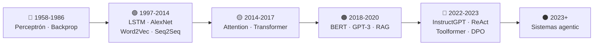
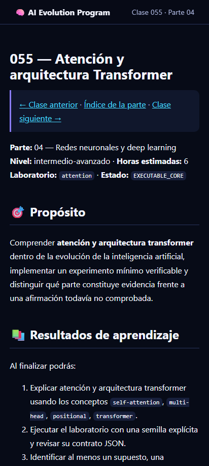
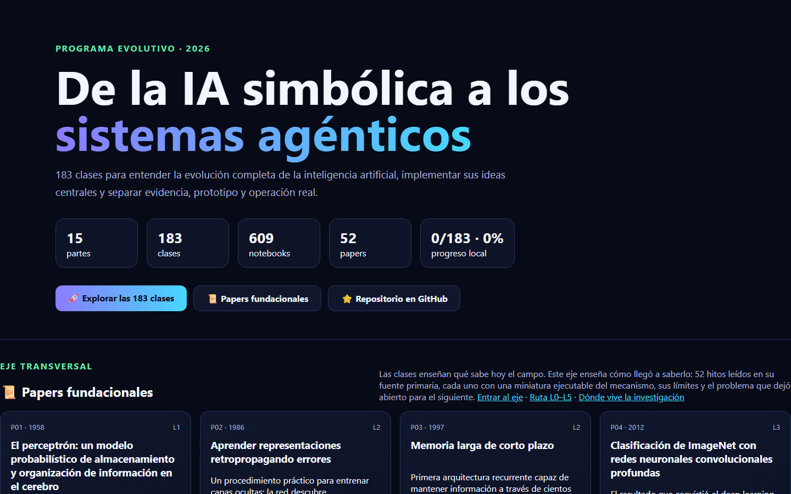
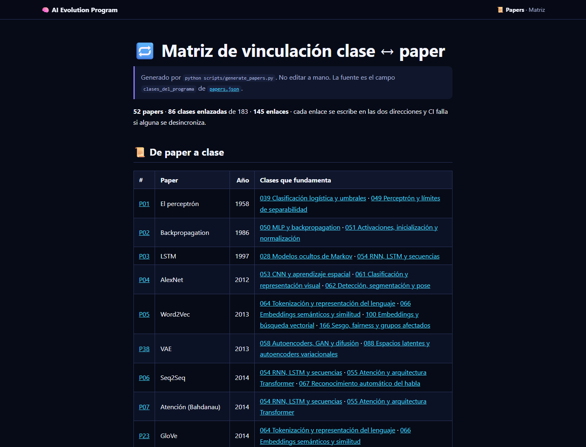

<div align="center">

# 🧠 Artificial Intelligence Evolution Program

## **15 partes · 183 clases · 148 papers fundacionales · de la IA simbólica a los sistemas agénticos**

**Programa evolutivo y verificable para comprender e implementar la historia completa
de la inteligencia artificial: lógica, búsqueda, sistemas expertos, probabilidad,
machine learning, redes neuronales, modelos fundacionales, IA generativa, RAG,
agentes, multiagentes, robótica, MLOps, seguridad y frontera.**

[](https://github.com/vladimiracunadev-create/artificial-intelligence-evolution-program/actions/workflows/ci.yml)
[](https://github.com/vladimiracunadev-create/artificial-intelligence-evolution-program/actions/workflows/security.yml)
[](https://github.com/vladimiracunadev-create/artificial-intelligence-evolution-program/actions/workflows/pages.yml)

[](CHANGELOG.md)
[](classes/)
[](papers/README.md)
<!-- sources-badge:inicio -->
[](sources/BIBLIOGRAFIA.md)
<!-- sources-badge:fin -->
[](classes/)
[](docs/LEARNING_PATH.md)
[](classes/)
[](LICENSE)

[](pyproject.toml)
[](classes/)
[](compose.yaml)
[](https://vladimiracunadev-create.github.io/artificial-intelligence-evolution-program/)

[🌐 **Sitio de estudio (vivo)**](https://vladimiracunadev-create.github.io/artificial-intelligence-evolution-program/) ·
[📜 Papers fundacionales](papers/README.md) ·
[🧭 Ruta](docs/LEARNING_PATH.md) ·
[🤖 Especialización en agentes](docs/AGENTIC_SYSTEMS_TRACK.md) ·
[📖 Glosario](docs/GLOSSARY.md) ·
[📕 PDFs](docs/pdf/) ·
[🏗️ Arquitectura](docs/ARCHITECTURE.md) ·
[🗺️ Roadmap](ROADMAP.md) ·
[🤝 Contribuir](CONTRIBUTING.md) ·
[🔐 Seguridad](SECURITY.md)

<br>

| 📘 Clases | 📓 Notebooks | 🧪 Laboratorios | 🧩 Partes | 📜 Papers | 🧰 Motores didácticos | 📕 PDFs |
|:---:|:---:|:---:|:---:|:---:|:---:|:---:|
| **183** | **549 + 46** | **183** | **15** | **38** | **20 + 52** | **17 + 38** |

</div>

---

> [!IMPORTANT]
> Este repositorio **no reemplaza** los programas especializados. Es el mapa maestro
> de la evolución de la IA. `python-data-science-program`,
> `neural-network-training-labs`, `langgraph-realworld` y
> `claude-skills-toolkit` aparecen como rutas oficiales de profundización, sin copiar
> ni falsear su contenido.

## ✅ Estado verificable

| Superficie | Estado |
|---|---|
| Currículo | ✅ 183/183 clases documentadas |
| Papers | ✅ 148 fichas de 18 secciones + 156 notebooks + 148 motores + 5 anexos + un PDF por paper + enlaces de vuelta en 171 clases |
| Notebooks | ✅ 183 recorridos + 183 estudiantes + 183 soluciones |
| Laboratorios | ✅ 183 entrypoints que reutilizan 20 motores didácticos ejecutables |
| Datasets | ✅ catálogo de fuentes públicas reales; sin fallback sintético silencioso |
| Bibliografía | ✅ cada clase declara su bibliografía de apoyo —libro, edición y localizador— desde [`sources/bibliography.json`](sources/bibliography.json); lo que no resuelve queda marcado con motivo |
| CLI | ✅ `ai-evolution catalog`, `run`, `validate`, `frontier`, `progress`, `papers`, `paper`, `paper-lab` |
| Sitio | ✅ PWA estática, búsqueda, filtros, progreso local y 163 páginas del eje de papers |
| Escritorio | ✅ visor Tkinter; se publica en 4 formatos (instalador, MSI, portable, exe único) |
| Android | ✅ APK con el sitio embebido, funciona sin conexión |
| CI | ✅ estructura, notebooks, tests, compilación y seguridad básica |
| GPU / APIs pagadas | ⚪ extensiones opcionales; no se finge ejecución en CI |

## 🌟 Qué hace diferente a este programa

- Presenta los agentes como una etapa de la evolución de la IA, no como el inicio.
- Mantiene un **núcleo estable** y una **frontera revisable** con fecha y fuente.
- Cada clase incluye teoría, laboratorio, evaluación, errores comunes, FAQ y referencias.
- Diferencia claramente modelo, prompt, resource, tool, skill, workflow y agente.
- Usa código local y determinista para enseñar contratos antes de depender de APIs.
- No declara “producción” sin evidencia operativa, métricas y revisión humana.

## 🧬 El mapa evolutivo

```mermaid
flowchart LR
    A["📜 00 Fundamentos<br/>e historia"] --> B["♟️ 01 IA simbólica<br/>y búsqueda"]
    B --> C["🎲 02 Probabilística<br/>y evolutiva"]
    C --> D["📊 03 ML<br/>clásico"]
    D --> E["🧠 04 Deep<br/>learning"]
    E --> F["👁️ 05 Lenguaje, visión<br/>y multimodal"]
    F --> G["⚙️ 06 Modelos<br/>fundacionales"]
    G --> H["🎨 07 IA<br/>generativa"]
    G --> I["🔎 08 RAG, memoria<br/>y conocimiento"]
    H --> J["🤖 09 Agentes"]
    I --> J
    J --> K["🕸️ 10 Multiagentes<br/>e interop"]
    K --> L["🦾 11 Robótica y<br/>computer use"]
    K --> M["🛠️ 12 MLOps, LLMOps<br/>y AgentOps"]
    L --> N["🛡️ 13 Evaluación, seguridad<br/>y gobernanza"]
    M --> N
    N --> O["🔭 14 Frontera<br/>y capstones"]
```



## 🗂️ Las 15 partes, en 6 etapas evolutivas

Cada parte tiene su **propio README** con la secuencia de sus clases —12 en
todas, salvo la parte 06 que tiene 15. Las etapas siguen la evolución histórica
del campo: lo que cada una enseña es el prerrequisito real de la siguiente.

### 🟢 Etapa 1 — Fundamentos e IA clásica

La base que el resto del programa asume: método científico, búsqueda, lógica e
incertidumbre. **Salida: leer el campo con criterio, no con hype.**

| # | Parte | Clases | Nivel | Duración |
|---:|---|---:|---|---|
| 00 | [📜 Fundamentos, historia y método científico](classes/part-00-foundations-history-and-scientific-method/README.md) | 12 | fundamentos | 3–4 |
| 01 | [♟️ IA simbólica, búsqueda, lógica y planificación](classes/part-01-symbolic-ai-search-logic-and-planning/README.md) | 12 | fundamentos | 4–5 |
| 02 | [🎲 IA probabilística, evolutiva y de decisión](classes/part-02-probabilistic-evolutionary-and-decision-ai/README.md) | 12 | intermedio | 4–5 |

### 🔵 Etapa 2 — Aprendizaje automático y percepción

De las reglas escritas a los patrones aprendidos, y de los vectores a los
sentidos. **Salida: entrenar, diagnosticar y evaluar modelos con evidencia.**

| # | Parte | Clases | Nivel | Duración |
|---:|---|---:|---|---|
| 03 | [📊 Machine learning clásico](classes/part-03-classical-machine-learning/README.md) | 12 | intermedio | 5–6 |
| 04 | [🧠 Redes neuronales y deep learning](classes/part-04-neural-networks-and-deep-learning/README.md) | 12 | intermedio-avanzado | 6–8 |
| 05 | [👁️ Lenguaje, visión, audio e IA multimodal](classes/part-05-language-vision-audio-and-multimodal-ai/README.md) | 12 | avanzado | 5–6 |

### 🟣 Etapa 3 — Modelos fundacionales, generativa y conocimiento

El giro de 2020s: modelos preentrenados adaptables, generación en todos los
medios y sistemas que citan evidencia. **Salida: dimensionar el hardware que los
sostiene y construir servicios LLM con contratos, RAG auditable y memoria.**

| # | Parte | Clases | Nivel | Duración |
|---:|---|---:|---|---|
| 06 | [⚙️ Modelos fundacionales e ingeniería de LLM](classes/part-06-foundation-models-and-llm-engineering/README.md) | 15 | avanzado | 6–7 |
| 07 | [🎨 IA generativa para texto, imagen, audio, video y 3D](classes/part-07-generative-ai-across-media/README.md) | 12 | avanzado | 5–6 |
| 08 | [🔎 Recuperación, contexto, memoria y conocimiento](classes/part-08-retrieval-context-memory-and-knowledge/README.md) | 12 | avanzado | 5–6 |

### 🟠 Etapa 4 — Agentes: del modelo que responde al sistema que actúa

El modelo se convierte en componente de decisión de un sistema con
herramientas, permisos y presupuesto. **Salida: dominar las ingenierías de
agentes (harness, loop, graph, context) y la orquestación multiagente.**

| # | Parte | Clases | Nivel | Duración |
|---:|---|---:|---|---|
| 09 | [🤖 Ingeniería de agentes de IA](classes/part-09-ai-agent-engineering/README.md) | 12 | avanzado | 6–7 |
| 10 | [🕸️ Sistemas multiagente e interoperabilidad](classes/part-10-multi-agent-systems-and-interoperability/README.md) | 12 | experto | 6–7 |
| 11 | [🦾 IA encarnada, robótica y uso de computadores](classes/part-11-embodied-ai-robotics-and-computer-use/README.md) | 12 | experto | 5–6 |

### 🔴 Etapa 5 — Operación, evaluación y gobernanza

Lo que separa la demo del sistema en producción: observabilidad, evals como
gate, seguridad y cumplimiento. **Salida: operar IA con evidencia y responder
por ella.**

| # | Parte | Clases | Nivel | Duración |
|---:|---|---:|---|---|
| 12 | [🛠️ Ingeniería de IA, MLOps, LLMOps y AgentOps](classes/part-12-ai-engineering-mlops-llmops-and-agentops/README.md) | 12 | experto | 6–7 |
| 13 | [🛡️ Evaluación, seguridad y gobernanza](classes/part-13-evaluation-safety-security-and-governance/README.md) | 12 | experto | 6–7 |

### ⚫ Etapa 6 — Frontera y capstones

Investigación abierta con fecha y fuente, y el proyecto integrador que une las
14 partes anteriores. **Salida: vigilar la frontera sin perseguir modas.**

| # | Parte | Clases | Nivel | Duración |
|---:|---|---:|---|---|
| 14 | [🔭 Frontera, investigación y proyectos integradores](classes/part-14-frontier-research-and-capstones/README.md) | 12 | frontera | 8–12 |

## 📜 Eje de papers fundacionales

Las clases enseñan **qué** sabe hoy el campo. El [eje de papers](papers/README.md) enseña
**cómo llegó a saberlo**, leyendo las fuentes primarias y ejecutando una miniatura de cada
mecanismo. No es una colección de PDFs: cada hito sigue la misma secuencia.

```text
problema histórico → propuesta → intuición → matemática mínima →
implementación → experimento → interpretación → limitaciones → siguiente hito
```

La última flecha es la clave: **cada paper existe porque el anterior dejó algo sin resolver.**



| Qué incluye | Detalle |
|---|---|
| 📄 **148 fichas** | 18 secciones obligatorias cada una: problema anterior, matemática mínima, qué observar en el paper original, límites, errores comunes, actividades Bloom y fuentes primarias con fecha de consulta |
| 📓 **156 notebooks** | 148 miniaturas + 8 que desmontan *Attention Is All You Need* pieza por pieza (Q/K/V, √d_k, máscara causal, multi-head, positional encoding, residual + layer norm, encoder–decoder) |
| 🧪 **148 motores** | Implementaciones deterministas en Python estándar: sin GPU, sin dependencias, sin APIs pagadas |
| 🧮 **5 anexos** | Toda la matemática del eje explicada una vez, con ejemplo resuelto a mano y su error común |
| 🔁 **Ida y vuelta** | Las 171 clases enlazadas llevan un bloque generado con sus papers: el circuito se cierra en ambos sentidos |
| 📚 **5 guías** | [Cómo leer un paper](papers/guides/COMO_LEER_UN_PAPER_DE_IA.md) · [método en 5 pasadas](papers/guides/METODO_DE_LECTURA_EN_5_PASADAS.md) · [dónde vive la investigación](papers/guides/FUENTES_Y_VENUES.md) · [plantilla de ficha](papers/guides/PLANTILLA_FICHA_PAPER.md) · [glosario](papers/guides/GLOSARIO_PAPERS_IA.md) |
| 🎓 **Niveles L0–L5** | De orientar sobre qué es un paper a leer la frontera con fecha y fuente |
| 👩‍🏫 **Aula completa** | [Guías docentes](instructor/papers/README.md), [fichas de estudio](student/papers/README.md) y [evaluaciones con rúbrica](assessments/papers/README.md) |

Reglas que el repositorio **verifica automáticamente**: no atribuir a un paper ideas
posteriores, no inventar autores, fechas, datasets ni métricas, registrar siempre venue y fecha
de consulta, y no redistribuir material con copyright — solo enlazar.

> [!TIP]
> La guía [dónde vive la investigación](papers/guides/FUENTES_Y_VENUES.md) explica la
> diferencia entre **dónde se publica** (arXiv, NeurIPS, ICML, ICLR, ACL Anthology) y **dónde
> se busca** (Google Scholar, Semantic Scholar), y por qué OpenReview es el sitio más
> infravalorado para aprender a leer con criterio.

## 📚 Bibliografía de apoyo

El [eje de papers](papers/README.md) dice **de dónde salió** cada idea. Esta bibliografía dice
**con qué se estudia**: además del paper, la obra que desarrolla el contenido con el espacio que
una clase no tiene —teoría completa, demostraciones y ejercicios—.

Cada una de las 183 clases lleva su propio bloque de **bibliografía de apoyo**: los libros que la
clase cita —con el capítulo, cuando la cita lo indica—, la obra de referencia de su parte y, donde
aplica, las normas oficiales. Nada de eso se escribe a mano: sale de
[`sources/bibliography.json`](sources/bibliography.json), donde cada obra tiene un **localizador
resoluble** —ISBN-13 para libros, DOI para artículos, URL del organismo para normas— y lo que no
resuelve se queda marcado `pendiente` con su motivo. Un hueco declarado es información; un hueco
rellenado a ojo es una invención con formato de bibliografía.

<!-- sources:inicio -->

| Parte | Obra que la sostiene |
|---|---|
| **00** · Fundamentos, historia y método científico | Russell, Stuart J. y Norvig, Peter — *Artificial Intelligence: A Modern Approach* — [ISBN 9780134610993](https://openlibrary.org/isbn/9780134610993) · [web de la obra](https://aima.cs.berkeley.edu/) |
| **01** · IA simbólica, búsqueda, lógica y planificación | Russell, Stuart J. y Norvig, Peter — *Artificial Intelligence: A Modern Approach* — [ISBN 9780134610993](https://openlibrary.org/isbn/9780134610993) · [web de la obra](https://aima.cs.berkeley.edu/)<br>Nilsson, N. J. — *Principles of Artificial Intelligence* — [ISBN 9780387113401](https://openlibrary.org/isbn/9780387113401) |
| **02** · IA probabilística, evolutiva y de decisión | Russell, Stuart J. y Norvig, Peter — *Artificial Intelligence: A Modern Approach* — [ISBN 9780134610993](https://openlibrary.org/isbn/9780134610993) · [web de la obra](https://aima.cs.berkeley.edu/)<br>Koller, Daphne y Friedman, Nir — *Probabilistic Graphical Models: Principles and Techniques* — [ISBN 9780262013192](https://openlibrary.org/isbn/9780262013192) · [web de la obra](https://mitpress.mit.edu/9780262013192/probabilistic-graphical-models/)<br>Pearl, J. — *Probabilistic Reasoning in Intelligent Systems* — [ISBN 9780080514895](https://openlibrary.org/isbn/9780080514895) |
| **03** · Machine learning clásico | Hastie, Trevor, Tibshirani, Robert y Friedman, Jerome — *The Elements of Statistical Learning* — [ISBN 9780387848570](https://openlibrary.org/isbn/9780387848570) · [web de la obra](https://hastie.su.domains/ElemStatLearn/)<br>James, Gareth et al. — *An Introduction to Statistical Learning* — [ISBN 9783031387470](https://openlibrary.org/isbn/9783031387470) · [web de la obra](https://www.statlearning.com/)<br>Murphy, Kevin P. — *Probabilistic Machine Learning* — [ISBN 9780262046824](https://openlibrary.org/isbn/9780262046824) · [web de la obra](https://probml.github.io/pml-book/) |
| **04** · Redes neuronales y deep learning | Goodfellow, Ian, Bengio, Yoshua y Courville, Aaron — *Deep Learning* — [ISBN 9780262035613](https://openlibrary.org/isbn/9780262035613) · [web de la obra](https://www.deeplearningbook.org/)<br>Murphy, Kevin P. — *Probabilistic Machine Learning* — [ISBN 9780262046824](https://openlibrary.org/isbn/9780262046824) · [web de la obra](https://probml.github.io/pml-book/) |
| **05** · Lenguaje, visión, audio e IA multimodal | Jurafsky, Daniel y Martin, James H. — *Speech and Language Processing* — [ISBN 9780131873216](https://openlibrary.org/isbn/9780131873216) · [web de la obra](https://web.stanford.edu/~jurafsky/slp3/) |
| **06** · Modelos fundacionales e ingeniería de LLM | Jurafsky, Daniel y Martin, James H. — *Speech and Language Processing* — [ISBN 9780131873216](https://openlibrary.org/isbn/9780131873216) · [web de la obra](https://web.stanford.edu/~jurafsky/slp3/)<br>Goodfellow, Ian, Bengio, Yoshua y Courville, Aaron — *Deep Learning* — [ISBN 9780262035613](https://openlibrary.org/isbn/9780262035613) · [web de la obra](https://www.deeplearningbook.org/) |
| **07** · IA generativa para texto, imagen, audio, video y 3D | Goodfellow, Ian, Bengio, Yoshua y Courville, Aaron — *Deep Learning* — [ISBN 9780262035613](https://openlibrary.org/isbn/9780262035613) · [web de la obra](https://www.deeplearningbook.org/) |
| **08** · Recuperación, contexto, memoria y conocimiento | Manning, Christopher D., Raghavan, Prabhakar y Schütze, Hinrich — *Introduction to Information Retrieval* — [ISBN 9780521865715](https://openlibrary.org/isbn/9780521865715) · [web de la obra](https://nlp.stanford.edu/IR-book/)<br>Jurafsky, Daniel y Martin, James H. — *Speech and Language Processing* — [ISBN 9780131873216](https://openlibrary.org/isbn/9780131873216) · [web de la obra](https://web.stanford.edu/~jurafsky/slp3/) |
| **09** · Ingeniería de agentes de IA | Russell, Stuart J. y Norvig, Peter — *Artificial Intelligence: A Modern Approach* — [ISBN 9780134610993](https://openlibrary.org/isbn/9780134610993) · [web de la obra](https://aima.cs.berkeley.edu/)<br>Michael J. Wooldridge — *An Introduction to MultiAgent Systems* — [ISBN 9780471496915](https://openlibrary.org/isbn/9780471496915) |
| **10** · Sistemas multiagente e interoperabilidad | Michael J. Wooldridge — *An Introduction to MultiAgent Systems* — [ISBN 9780471496915](https://openlibrary.org/isbn/9780471496915)<br>Russell, Stuart J. y Norvig, Peter — *Artificial Intelligence: A Modern Approach* — [ISBN 9780134610993](https://openlibrary.org/isbn/9780134610993) · [web de la obra](https://aima.cs.berkeley.edu/) |
| **11** · IA encarnada, robótica y uso de computadores | Sebastian Thrun — *Probabilistic Robotics* — [ISBN 9780262201629](https://openlibrary.org/isbn/9780262201629) · [web de la obra](https://mitpress.mit.edu/9780262201629/probabilistic-robotics/) |
| **12** · Ingeniería de IA, MLOps, LLMOps y AgentOps | Huyen, Chip — *Designing Machine Learning Systems* — [ISBN 9781098107956](https://openlibrary.org/isbn/9781098107956) · [web de la obra](https://www.oreilly.com/library/view/designing-machine-learning/9781098107956/) · _pendiente de confirmar en su catálogo_ |
| **13** · Evaluación, seguridad y gobernanza | Huyen, Chip — *Designing Machine Learning Systems* — [ISBN 9781098107956](https://openlibrary.org/isbn/9781098107956) · [web de la obra](https://www.oreilly.com/library/view/designing-machine-learning/9781098107956/) · _pendiente de confirmar en su catálogo_<br>Russell, Stuart J. y Norvig, Peter — *Artificial Intelligence: A Modern Approach* — [ISBN 9780134610993](https://openlibrary.org/isbn/9780134610993) · [web de la obra](https://aima.cs.berkeley.edu/) |
| **14** · Frontera, investigación y proyectos integradores | Russell, Stuart J. y Norvig, Peter — *Artificial Intelligence: A Modern Approach* — [ISBN 9780134610993](https://openlibrary.org/isbn/9780134610993) · [web de la obra](https://aima.cs.berkeley.edu/)<br>Goodfellow, Ian, Bengio, Yoshua y Courville, Aaron — *Deep Learning* — [ISBN 9780262035613](https://openlibrary.org/isbn/9780262035613) · [web de la obra](https://www.deeplearningbook.org/) |

<!-- sources:fin -->

[📚 **Bibliografía completa**](sources/BIBLIOGRAFIA.md) — todas las obras, normas y
especificaciones con su localizador ·
[🧾 Cómo se verifica](sources/README.md) ·
[🗺️ Mapa parte → obra](sources/support_map.json)

> Esa tabla la escribe `python scripts/verify-sources --write` desde el registro. No se edita a
> mano: si alguien la toca, CI falla.

El registro se comprueba en dos capas que no se mezclan: `scripts/verify-sources` es **offline y
determinista y bloquea CI** —esquema, dígito de control del ISBN-13, forma canónica del
localizador, cobertura de todo lo que las clases citan y coincidencia de lo publicado con el
registro—, y `scripts/refresh-sources` es la capa **en red**, manual, que resuelve ISBN contra Open
Library y DOI contra Crossref y el sistema de handles. Si la red entrara en CI, el CI se volvería
inestable y se acabaría ignorando.

## 🚀 Inicio rápido

```bash
python -m venv .venv
source .venv/bin/activate  # Windows: .venv\Scripts\activate
pip install -e .

ai-evolution catalog
ai-evolution validate
ai-evolution run 001
ai-evolution frontier

ai-evolution papers              # los 148 hitos del eje
ai-evolution paper P08           # ficha de Attention Is All You Need
ai-evolution paper-lab P08       # ejecuta su miniatura
```

Sin instalar el paquete:

```bash
python scripts/validate_repository.py
python classes/part-01-symbolic-ai-search-logic-and-planning/013-espacios-de-estados-y-formulacion-de-problemas/lab.py
```

Sitio local:

```bash
python -m http.server 8080
```

Abre `http://localhost:8080/site/`.

## 📱 Aplicaciones

El mismo programa, en tres formas. Todas llevan el contenido **dentro**: funcionan sin conexión y
sin cuenta.

<div align="center">

| 🖥️ Escritorio (Windows) | 📱 Android · 🌐 PWA |
|:---:|:---:|
|  |  |
| Visor nativo del catálogo: busca, navega las 15 partes y abre el README o el sitio de cada clase | La app Android y la PWA cargan el mismo sitio: 183 clases, 148 papers y progreso local |

</div>

### ⬇️ Descargas

Los enlaces apuntan siempre a la **última release**, así que no caducan al publicar una versión nueva:

| Descarga | Formato | Para qué |
|---|---|---|
| [**Instalador**](https://github.com/vladimiracunadev-create/artificial-intelligence-evolution-program/releases/latest) | `setup-windows-x64.exe` | Uso normal: menú de inicio y desinstalador |
| [**MSI**](https://github.com/vladimiracunadev-create/artificial-intelligence-evolution-program/releases/latest) | `windows-x64.msi` | Implantación gestionada: `msiexec /qn`, GPO, Intune |
| [**Portable**](https://github.com/vladimiracunadev-create/artificial-intelligence-evolution-program/releases/latest) | `portable-windows-x64.zip` | Sin instalar: descomprimir y ejecutar |
| [**Ejecutable único**](https://github.com/vladimiracunadev-create/artificial-intelligence-evolution-program/releases/latest) | `windows-x64.exe` | Un solo fichero; arranca algo más lento |
| [**Android**](https://github.com/vladimiracunadev-create/artificial-intelligence-evolution-program/releases/latest) | `android.apk` | Móvil y tableta |

Cada release publica además `SHA256SUMS-windows.txt` y `SHA256SUMS-android.txt` para verificar
lo que descargas:

```bash
sha256sum -c SHA256SUMS-windows.txt
```

> [!NOTE]
> El APK está firmado con una clave de **depuración**, no de publicación: se instala activando
> «orígenes desconocidos» y no procede de Google Play. Los ejecutables de Windows **no están
> firmados con certificado de código**, así que SmartScreen avisará la primera vez. Comprueba el
> `SHA256SUMS` de la release antes de ejecutarlos.

Las tres se compilan desde el mismo repositorio con
[`desktop.yml`](.github/workflows/desktop.yml) y [`android.yml`](.github/workflows/android.yml).
Las capturas se regeneran con `python scripts/generate_screenshots.py --escritorio`.

### 🌐 El sitio y el eje de papers

<div align="center">

| Portada | Matriz clase ↔ paper |
|:---:|:---:|
|  |  |

</div>

## 📕 PDFs del programa

El mismo contenido de las clases, listo para imprimir o leer offline
(generado desde la fuente markdown con `python scripts/generate_pdfs.py`):

- [📕 Programa completo (1 178 páginas)](docs/pdf/programa-completo.pdf)
- [📜 Papers fundacionales (1 230 páginas)](docs/pdf/papers-fundacionales.pdf) — las 148 fichas,
  las 5 guías, los 5 anexos matemáticos, la matriz clase ↔ paper y las 148 evaluaciones del eje
  (`python scripts/generate_pdfs.py --papers`)
- Por parte: [00](docs/pdf/parte-00.pdf) · [01](docs/pdf/parte-01.pdf) ·
  [02](docs/pdf/parte-02.pdf) · [03](docs/pdf/parte-03.pdf) ·
  [04](docs/pdf/parte-04.pdf) · [05](docs/pdf/parte-05.pdf) ·
  [06](docs/pdf/parte-06.pdf) · [07](docs/pdf/parte-07.pdf) ·
  [08](docs/pdf/parte-08.pdf) · [09](docs/pdf/parte-09.pdf) ·
  [10](docs/pdf/parte-10.pdf) · [11](docs/pdf/parte-11.pdf) ·
  [12](docs/pdf/parte-12.pdf) · [13](docs/pdf/parte-13.pdf) ·
  [14](docs/pdf/parte-14.pdf)

## 📦 Contrato de una clase

```text
classes/part-XX-slug/NNN-topic/
├── README.md        ← incluye la teoría completa de la clase
├── assessment.md
├── lesson.yaml
├── lab.py
├── notebook.ipynb
├── notebook_student.ipynb
└── notebook_solution.ipynb
```

## 📦 Contrato de un paper

```text
papers/
├── catalog/papers.json          ← fuente de verdad (16 entradas validadas)
├── catalog/sources.yaml         ← venues y repositorios primarios
├── foundational/PXX_slug/       ← ficha de 18 secciones
├── guides/                      ← cómo leer, 5 pasadas, plantilla, glosario, fuentes
└── manifest.json                ← inventario con SHA-256 (generado)

notebooks/papers/PXX_slug.ipynb  ← 17 momentos, del contexto al desafío autónomo
instructor/papers/PXX_slug.md    ← plan de sesión de 90 minutos
student/papers/PXX_slug.md       ← ruta de estudio y checklist
assessments/papers/PXX_slug.md   ← evaluación con rúbrica A/B/C
```

Regenerar y verificar el eje completo:

```bash
python scripts/generate_papers.py
python scripts/generate_papers.py --check
```

## 🔗 Especializaciones conectadas

Este programa enseña **la evolución** de la IA: de dónde salió cada idea, qué problema resolvía y
dónde falla. No pretende ser además un curso de Python, de matemática, de nube o de seguridad.
Para eso hay repositorios hermanos, y aquí está **qué aporta cada uno y qué parte de este programa
extiende**.

### 🧠 Completan el eje de IA

| Repositorio | Qué aporta | Qué extiende de aquí |
|---|---|---|
| 🧮 [Computational Mathematics Program](https://github.com/vladimiracunadev-create/computational-mathematics-program) | 18 partes · 360 clases · 1080 notebooks, con demostraciones deterministas verificadas en CI | Los [5 anexos matemáticos](papers/annexes/README.md) comprimen lo imprescindible; esto lo desarrolla entero |
| 🐍 [Python Data Science Program](https://github.com/vladimiracunadev-create/python-data-science-program) | 232 clases · Python/Polars, ML clásico, estadística, causalidad y MLOps | La **parte 03** (ML clásico) y la **12** (MLOps), que el eje de papers **no** cubre |
| 🧠 [Neural Network Training Labs](https://github.com/vladimiracunadev-create/neural-network-training-labs) | 31 rutas · 93 notebooks · PyTorch, ONNX/INT8, DDP/FSDP2, champion/challenger | La **parte 04**: aquí se lee el paper, allí se entrena y se despliega de verdad |
| 🤖 [LangGraph Realworld](https://github.com/vladimiracunadev-create/langgraph-realworld) | 25 casos empresariales con LangGraph y FastAPI, con observabilidad y 8 capas de seguridad | Las **partes 09 y 10**: del patrón de agente al sistema en producción |
| 🔒 [MCP + Ollama Local](https://github.com/vladimiracunadev-create/mcp-ollama-local) | Chat con LLM local, herramientas MCP en sandbox e historial, sin enviar datos a la nube | Las **partes 06 y 09**: ejecutar y dar herramientas a un modelo sin API de pago |
| 🎨 [ChofyAI Studio](https://github.com/vladimiracunadev-create/chofyai-studio) | Lanzador local que orquesta cinco herramientas de IA creativa (TTS, transcripción, imagen) | La **parte 07**: generativa multimedia ejecutándose en tu equipo |

### ⚙️ Operación, infraestructura y seguridad

| Repositorio | Qué aporta | Qué extiende de aquí |
|---|---|---|
| ☁️ [Multi-Cloud Engineering Program](https://github.com/vladimiracunadev-create/multi-cloud-engineering-program) | 288 clases · AWS, Azure, GCP, Kubernetes, Terraform, SRE y FinOps | La **parte 12**: dónde vive de verdad un sistema de IA en producción |
| 🛡️ [Modern Cybersecurity Program](https://github.com/vladimiracunadev-create/modern-cybersecurity-program) | 340 clases · laboratorios Docker, retos CTF y mapeo a 7 certificaciones | La **parte 13**: seguridad más allá de la superficie propia de la IA |
| 🧪 [Sandbox Labs](https://github.com/vladimiracunadev-create/sandbox-labs) | 36 casos de aislamiento en Linux, con evidencia firmada de qué controles se aplicaron | Las clases **164 y 119**: ejecutar herramientas ajenas con mínimo privilegio |
| 🐳 [Docker Labs](https://github.com/vladimiracunadev-create/docker-labs) · [WSL Labs](https://github.com/vladimiracunadev-create/wsl-labs) | Contenedores en varios stacks, y el motor nativo de WSL sin Docker Desktop | El entorno reproducible que los laboratorios dan por supuesto |
| 🔧 [Problem-Driven Systems Lab](https://github.com/vladimiracunadev-create/problem-driven-systems-lab) | 12 problemas reales resueltos en 7 stacks, con evidencia operacional | La **parte 12**: rendimiento, observabilidad y resiliencia con las manos |

### 🔬 IA aplicada a un dominio

| Repositorio | Qué aporta | Con qué conecta |
|---|---|---|
| 🧬 [Human Genome Labs](https://github.com/vladimiracunadev-create/human-genome-labs) | Plataforma reproducible de genética molecular, con contratos de resultado científico | [P47 AlphaFold](papers/foundational/P47_alphafold/README.md) y la clase **181** |
| 🤖 [Automa PC](https://github.com/vladimiracunadev-create/automa-pc) | Orquestador local de procesos con flujos declarativos, OCR y visión | La **parte 11**: uso de computador y automatización de escritorio |
| ⛓️ [Blockchain Learning Path](https://github.com/vladimiracunadev-create/blockchain-learning-path) · 🏦 [Finance & Banking](https://github.com/vladimiracunadev-create/finance-and-banking-evolution-program) | Infraestructura financiera programable y banca, con fuentes oficiales | Dominios donde la IA se aplica bajo regulación estricta |

### 🧰 Herramientas con las que se mantiene este repositorio

| Repositorio | Qué aporta |
|---|---|
| 🧰 [Claude Skills Toolkit](https://github.com/vladimiracunadev-create/claude-skills-toolkit) | 14 skills agentic sin dependencias: auditoría de seguridad, versionado, linting, coherencia |
| 🤖 [Operational AI Agents](https://github.com/vladimiracunadev-create/operational-ai-agents) | 13 agentes con contrato, control humano y 39 evaluaciones deterministas |
| 🌐 [Polyglot Programming Labs](https://github.com/vladimiracunadev-create/polyglot-programming-labs) | 176 clases y 1360 implementaciones verificadas en 10 lenguajes |

> [!NOTE]
> Las cifras son las que declara cada repositorio en su propio README. Son proyectos
> **independientes**: se enlazan porque se complementan, no porque compartan código, versión ni
> calendario. El resto del trabajo —videojuegos, empresa, liderazgo, herramientas forenses— está en
> el [perfil completo](https://github.com/vladimiracunadev-create).

### 🧭 Cómo combinarlos

- **Sin base matemática** → primero los [anexos](papers/annexes/README.md) de este eje; si algo se
  resiste, el programa de matemática computacional.
- **Quieres entrenar, no solo entender** → parte 04 aquí, y después los labs de redes neuronales.
- **Un agente a producción** → partes 09 y 10 aquí, luego LangGraph Realworld y multi-cloud.
- **Sin GPU ni API de pago** → MCP + Ollama Local y ChofyAI Studio, todo en tu equipo.

## ⚖️ Qué es y qué no es este programa

<table>
<tr>
<td valign="top" width="50%">

### ✅ Lo que sí es

- 🧬 un **mapa evolutivo completo** de la IA: 183 clases de la lógica simbólica a los sistemas agénticos, donde cada etapa explica la siguiente;
- 📜 un **eje de 148 papers fundacionales** que ancla ese mapa en sus fuentes primarias, de Pearson (1901) a DeepSeek-R1 (2025), con bloques de fundamentos, IA simbólica, machine learning clásico, representación, agentes y multiagente, con fichas verificables, miniaturas ejecutables y anexos matemáticos;
- 🧪 material **ejecutable y verificable**: 595 notebooks (549 de clase + 46 de papers), 183 laboratorios locales y 72 motores deterministas con contratos JSON que declaran `evidence` y `limitations`;
- 📖 contenido **abierto y gratuito en español**, legible en GitHub, en un sitio PWA instalable o en 69 PDFs imprimibles;
- 🗣️ un temario **alineado al vocabulario 2026** de la industria: harness, loop, graph, context engineering y compañía, con glosario propio;
- 🔍 material **honesto sobre sus límites**: cada laboratorio declara qué demuestra y qué no.

</td>
<td valign="top" width="50%">

### ❌ Lo que no es

- 🚫 una certificación: completar clases no acredita competencia clínica, financiera, legal ni de seguridad;
- 🚫 un curso de una sola API: los laboratorios base corren con Python estándar, sin claves ni servicios pagados;
- 🚫 entrenamiento a gran escala: los entrenamientos grandes, robots físicos y APIs comerciales exigen entornos externos;
- 🚫 conocimiento congelado: la carpeta `frontier/` registra lo emergente con fecha y fuente, sin presentarlo como estable;
- 🚫 un sustituto de la verificación: las licencias de datasets se revisan de nuevo al descargar cada versión concreta.

</td>
</tr>
</table>

## 💡 Idea fuerza

> El valor de este programa no está en acumular técnicas de IA, sino en
> **recorrer su evolución con evidencia**: cada clase produce un resultado
> reproducible, declara sus límites, y prepara exactamente lo que la siguiente
> etapa asume. Los agentes no son el inicio de la historia — son el capítulo
> que solo se entiende con los trece anteriores.

## 🧪 Calidad

```bash
python -m unittest discover -s tests -v
python -m compileall -q src scripts classes apps
python scripts/validate_repository.py --strict
```

## 📄 Licencia

Código y documentación original bajo [MIT](LICENSE). Datasets, papers, modelos y
servicios externos conservan sus propias licencias y términos.

---

<div align="center">

**Hecho para quien quiere entender la IA completa, no solo la última ola.**

[⬆️ Empezar por la clase 001](classes/part-00-foundations-history-and-scientific-method/001-que-es-inteligencia-artificial-y-que-no-es/README.md) ·
[🌐 Sitio de estudio](https://vladimiracunadev-create.github.io/artificial-intelligence-evolution-program/) ·
[📖 Glosario](docs/GLOSSARY.md) ·
[📕 Programa completo en PDF](docs/pdf/programa-completo.pdf) ·
[🗺️ Roadmap](ROADMAP.md)

<br>

**¿Te resulta útil? ⭐ Dale una estrella al repo.**

[](https://github.com/vladimiracunadev-create/artificial-intelligence-evolution-program/stargazers)
[](https://github.com/vladimiracunadev-create/artificial-intelligence-evolution-program/network/members)
[](https://github.com/vladimiracunadev-create)

Hecho con 🧠 y ☕ por [Vladimir Acuña](https://github.com/vladimiracunadev-create)

</div>
