<div align="center">

# 🧠 Artificial Intelligence Evolution Program

## **15 partes · 183 clases · 549 notebooks · de la IA simbólica a los sistemas agénticos**

**Programa evolutivo y verificable para comprender e implementar la historia completa
de la inteligencia artificial: lógica, búsqueda, sistemas expertos, probabilidad,
machine learning, redes neuronales, modelos fundacionales, IA generativa, RAG,
agentes, multiagentes, robótica, MLOps, seguridad y frontera.**

[](https://github.com/vladimiracunadev-create/artificial-intelligence-evolution-program/actions/workflows/ci.yml)
[](https://github.com/vladimiracunadev-create/artificial-intelligence-evolution-program/actions/workflows/security.yml)
[](https://github.com/vladimiracunadev-create/artificial-intelligence-evolution-program/actions/workflows/pages.yml)

[](CHANGELOG.md)
[](classes/)
[](classes/)
[](docs/LEARNING_PATH.md)
[](classes/)
[](LICENSE)

[](pyproject.toml)
[](classes/)
[](compose.yaml)
[](https://vladimiracunadev-create.github.io/artificial-intelligence-evolution-program/)

[🌐 **Sitio de estudio (vivo)**](https://vladimiracunadev-create.github.io/artificial-intelligence-evolution-program/) ·
[🧭 Ruta](docs/LEARNING_PATH.md) ·
[🤖 Especialización en agentes](docs/AGENTIC_SYSTEMS_TRACK.md) ·
[📖 Glosario](docs/GLOSSARY.md) ·
[📕 PDFs](docs/pdf/) ·
[🏗️ Arquitectura](docs/ARCHITECTURE.md) ·
[🗺️ Roadmap](ROADMAP.md) ·
[🤝 Contribuir](CONTRIBUTING.md) ·
[🔐 Seguridad](SECURITY.md)

<br>

| 📘 Clases | 📓 Notebooks | 🧪 Laboratorios | 🧩 Partes | 🧰 Motores didácticos | 📕 PDFs |
|:---:|:---:|:---:|:---:|:---:|:---:|
| **183** | **549** | **183** | **15** | **20** | **16** |

</div>

---

> [!IMPORTANT]
> Este repositorio **no reemplaza** los programas especializados. Es el mapa maestro
> de la evolución de la IA. `python-data-science-program`,
> `neural-network-training-labs`, `langgraph-realworld` y
> `claude-skills-toolkit` aparecen como rutas oficiales de profundización, sin copiar
> ni falsear su contenido.

## ✅ Estado verificable

| Superficie | Estado |
|---|---|
| Currículo | ✅ 183/183 clases documentadas |
| Notebooks | ✅ 183 recorridos + 183 estudiantes + 183 soluciones |
| Laboratorios | ✅ 183 entrypoints que reutilizan 20 motores didácticos ejecutables |
| Datasets | ✅ catálogo de fuentes públicas reales; sin fallback sintético silencioso |
| CLI | ✅ `ai-evolution catalog`, `run`, `validate`, `frontier`, `progress` |
| Sitio | ✅ PWA estática, búsqueda, filtros y progreso local |
| Escritorio | ✅ visor Tkinter local; workflow opcional para `.exe` |
| CI | ✅ estructura, notebooks, tests, compilación y seguridad básica |
| GPU / APIs pagadas | ⚪ extensiones opcionales; no se finge ejecución en CI |

## 🌟 Qué hace diferente a este programa

- Presenta los agentes como una etapa de la evolución de la IA, no como el inicio.
- Mantiene un **núcleo estable** y una **frontera revisable** con fecha y fuente.
- Cada clase incluye teoría, laboratorio, evaluación, errores comunes, FAQ y referencias.
- Diferencia claramente modelo, prompt, resource, tool, skill, workflow y agente.
- Usa código local y determinista para enseñar contratos antes de depender de APIs.
- No declara “producción” sin evidencia operativa, métricas y revisión humana.

## 🧬 El mapa evolutivo

```mermaid
flowchart LR
    A["📜 00 Fundamentos<br/>e historia"] --> B["♟️ 01 IA simbólica<br/>y búsqueda"]
    B --> C["🎲 02 Probabilística<br/>y evolutiva"]
    C --> D["📊 03 ML<br/>clásico"]
    D --> E["🧠 04 Deep<br/>learning"]
    E --> F["👁️ 05 Lenguaje, visión<br/>y multimodal"]
    F --> G["⚙️ 06 Modelos<br/>fundacionales"]
    G --> H["🎨 07 IA<br/>generativa"]
    G --> I["🔎 08 RAG, memoria<br/>y conocimiento"]
    H --> J["🤖 09 Agentes"]
    I --> J
    J --> K["🕸️ 10 Multiagentes<br/>e interop"]
    K --> L["🦾 11 Robótica y<br/>computer use"]
    K --> M["🛠️ 12 MLOps, LLMOps<br/>y AgentOps"]
    L --> N["🛡️ 13 Evaluación, seguridad<br/>y gobernanza"]
    M --> N
    N --> O["🔭 14 Frontera<br/>y capstones"]
```



## 🗂️ Las 15 partes, en 6 etapas evolutivas

Cada parte tiene su **propio README** con la secuencia de sus clases —12 en
todas, salvo la parte 06 que tiene 15. Las etapas siguen la evolución histórica
del campo: lo que cada una enseña es el prerrequisito real de la siguiente.

### 🟢 Etapa 1 — Fundamentos e IA clásica

La base que el resto del programa asume: método científico, búsqueda, lógica e
incertidumbre. **Salida: leer el campo con criterio, no con hype.**

| # | Parte | Clases | Nivel | Duración |
|---:|---|---:|---|---|
| 00 | [📜 Fundamentos, historia y método científico](classes/part-00-foundations-history-and-scientific-method/README.md) | 12 | fundamentos | 3–4 |
| 01 | [♟️ IA simbólica, búsqueda, lógica y planificación](classes/part-01-symbolic-ai-search-logic-and-planning/README.md) | 12 | fundamentos | 4–5 |
| 02 | [🎲 IA probabilística, evolutiva y de decisión](classes/part-02-probabilistic-evolutionary-and-decision-ai/README.md) | 12 | intermedio | 4–5 |

### 🔵 Etapa 2 — Aprendizaje automático y percepción

De las reglas escritas a los patrones aprendidos, y de los vectores a los
sentidos. **Salida: entrenar, diagnosticar y evaluar modelos con evidencia.**

| # | Parte | Clases | Nivel | Duración |
|---:|---|---:|---|---|
| 03 | [📊 Machine learning clásico](classes/part-03-classical-machine-learning/README.md) | 12 | intermedio | 5–6 |
| 04 | [🧠 Redes neuronales y deep learning](classes/part-04-neural-networks-and-deep-learning/README.md) | 12 | intermedio-avanzado | 6–8 |
| 05 | [👁️ Lenguaje, visión, audio e IA multimodal](classes/part-05-language-vision-audio-and-multimodal-ai/README.md) | 12 | avanzado | 5–6 |

### 🟣 Etapa 3 — Modelos fundacionales, generativa y conocimiento

El giro de 2020s: modelos preentrenados adaptables, generación en todos los
medios y sistemas que citan evidencia. **Salida: dimensionar el hardware que los
sostiene y construir servicios LLM con contratos, RAG auditable y memoria.**

| # | Parte | Clases | Nivel | Duración |
|---:|---|---:|---|---|
| 06 | [⚙️ Modelos fundacionales e ingeniería de LLM](classes/part-06-foundation-models-and-llm-engineering/README.md) | 15 | avanzado | 6–7 |
| 07 | [🎨 IA generativa para texto, imagen, audio, video y 3D](classes/part-07-generative-ai-across-media/README.md) | 12 | avanzado | 5–6 |
| 08 | [🔎 Recuperación, contexto, memoria y conocimiento](classes/part-08-retrieval-context-memory-and-knowledge/README.md) | 12 | avanzado | 5–6 |

### 🟠 Etapa 4 — Agentes: del modelo que responde al sistema que actúa

El modelo se convierte en componente de decisión de un sistema con
herramientas, permisos y presupuesto. **Salida: dominar las ingenierías de
agentes (harness, loop, graph, context) y la orquestación multiagente.**

| # | Parte | Clases | Nivel | Duración |
|---:|---|---:|---|---|
| 09 | [🤖 Ingeniería de agentes de IA](classes/part-09-ai-agent-engineering/README.md) | 12 | avanzado | 6–7 |
| 10 | [🕸️ Sistemas multiagente e interoperabilidad](classes/part-10-multi-agent-systems-and-interoperability/README.md) | 12 | experto | 6–7 |
| 11 | [🦾 IA encarnada, robótica y uso de computadores](classes/part-11-embodied-ai-robotics-and-computer-use/README.md) | 12 | experto | 5–6 |

### 🔴 Etapa 5 — Operación, evaluación y gobernanza

Lo que separa la demo del sistema en producción: observabilidad, evals como
gate, seguridad y cumplimiento. **Salida: operar IA con evidencia y responder
por ella.**

| # | Parte | Clases | Nivel | Duración |
|---:|---|---:|---|---|
| 12 | [🛠️ Ingeniería de IA, MLOps, LLMOps y AgentOps](classes/part-12-ai-engineering-mlops-llmops-and-agentops/README.md) | 12 | experto | 6–7 |
| 13 | [🛡️ Evaluación, seguridad y gobernanza](classes/part-13-evaluation-safety-security-and-governance/README.md) | 12 | experto | 6–7 |

### ⚫ Etapa 6 — Frontera y capstones

Investigación abierta con fecha y fuente, y el proyecto integrador que une las
14 partes anteriores. **Salida: vigilar la frontera sin perseguir modas.**

| # | Parte | Clases | Nivel | Duración |
|---:|---|---:|---|---|
| 14 | [🔭 Frontera, investigación y proyectos integradores](classes/part-14-frontier-research-and-capstones/README.md) | 12 | frontera | 8–12 |

## 🚀 Inicio rápido

```bash
python -m venv .venv
source .venv/bin/activate  # Windows: .venv\Scripts\activate
pip install -e .

ai-evolution catalog
ai-evolution validate
ai-evolution run 001
ai-evolution frontier
```

Sin instalar el paquete:

```bash
python scripts/validate_repository.py
python classes/part-01-symbolic-ai-search-logic-and-planning/013-espacios-de-estados-y-formulacion-de-problemas/lab.py
```

Sitio local:

```bash
python -m http.server 8080
```

Abre `http://localhost:8080/site/`.

## 📕 PDFs del programa

El mismo contenido de las clases, listo para imprimir o leer offline
(generado desde la fuente markdown con `python scripts/generate_pdfs.py`):

- [📕 Programa completo (~1 135 páginas)](docs/pdf/programa-completo.pdf)
- Por parte: [00](docs/pdf/parte-00.pdf) · [01](docs/pdf/parte-01.pdf) ·
  [02](docs/pdf/parte-02.pdf) · [03](docs/pdf/parte-03.pdf) ·
  [04](docs/pdf/parte-04.pdf) · [05](docs/pdf/parte-05.pdf) ·
  [06](docs/pdf/parte-06.pdf) · [07](docs/pdf/parte-07.pdf) ·
  [08](docs/pdf/parte-08.pdf) · [09](docs/pdf/parte-09.pdf) ·
  [10](docs/pdf/parte-10.pdf) · [11](docs/pdf/parte-11.pdf) ·
  [12](docs/pdf/parte-12.pdf) · [13](docs/pdf/parte-13.pdf) ·
  [14](docs/pdf/parte-14.pdf)

## 📦 Contrato de una clase

```text
classes/part-XX-slug/NNN-topic/
├── README.md        ← incluye la teoría completa de la clase
├── assessment.md
├── lesson.yaml
├── lab.py
├── notebook.ipynb
├── notebook_student.ipynb
└── notebook_solution.ipynb
```

## 🔗 Especializaciones conectadas

| Especialización | Rol |
|---|---|
| [Python Data Science Program](https://github.com/vladimiracunadev-create/python-data-science-program) | Python, ML, estadística, MLOps y datos |
| [Neural Network Training Labs](https://github.com/vladimiracunadev-create/neural-network-training-labs) | Entrenamiento y despliegue profundo de redes neuronales |
| [LangGraph Realworld](https://github.com/vladimiracunadev-create/langgraph-realworld) | Casos empresariales de orquestación |
| [Claude Skills Toolkit](https://github.com/vladimiracunadev-create/claude-skills-toolkit) | Skills operativos reutilizables |

## ⚖️ Qué es y qué no es este programa

<table>
<tr>
<td valign="top" width="50%">

### ✅ Lo que sí es

- 🧬 un **mapa evolutivo completo** de la IA: 183 clases de la lógica simbólica a los sistemas agénticos, donde cada etapa explica la siguiente;
- 🧪 material **ejecutable y verificable**: 549 notebooks, 183 laboratorios locales deterministas y contratos JSON con `evidence` y `limitations`;
- 📖 contenido **abierto y gratuito en español**, legible en GitHub, en un sitio PWA instalable o en 16 PDFs imprimibles;
- 🗣️ un temario **alineado al vocabulario 2026** de la industria: harness, loop, graph, context engineering y compañía, con glosario propio;
- 🔍 material **honesto sobre sus límites**: cada laboratorio declara qué demuestra y qué no.

</td>
<td valign="top" width="50%">

### ❌ Lo que no es

- 🚫 una certificación: completar clases no acredita competencia clínica, financiera, legal ni de seguridad;
- 🚫 un curso de una sola API: los laboratorios base corren con Python estándar, sin claves ni servicios pagados;
- 🚫 entrenamiento a gran escala: los entrenamientos grandes, robots físicos y APIs comerciales exigen entornos externos;
- 🚫 conocimiento congelado: la carpeta `frontier/` registra lo emergente con fecha y fuente, sin presentarlo como estable;
- 🚫 un sustituto de la verificación: las licencias de datasets se revisan de nuevo al descargar cada versión concreta.

</td>
</tr>
</table>

## 💡 Idea fuerza

> El valor de este programa no está en acumular técnicas de IA, sino en
> **recorrer su evolución con evidencia**: cada clase produce un resultado
> reproducible, declara sus límites, y prepara exactamente lo que la siguiente
> etapa asume. Los agentes no son el inicio de la historia — son el capítulo
> que solo se entiende con los trece anteriores.

## 🧪 Calidad

```bash
python -m unittest discover -s tests -v
python -m compileall -q src scripts classes apps
python scripts/validate_repository.py --strict
```

## 📄 Licencia

Código y documentación original bajo [MIT](LICENSE). Datasets, papers, modelos y
servicios externos conservan sus propias licencias y términos.

---

<div align="center">

**Hecho para quien quiere entender la IA completa, no solo la última ola.**

[⬆️ Empezar por la clase 001](classes/part-00-foundations-history-and-scientific-method/001-que-es-inteligencia-artificial-y-que-no-es/README.md) ·
[🌐 Sitio de estudio](https://vladimiracunadev-create.github.io/artificial-intelligence-evolution-program/) ·
[📖 Glosario](docs/GLOSSARY.md) ·
[📕 Programa completo en PDF](docs/pdf/programa-completo.pdf) ·
[🗺️ Roadmap](ROADMAP.md)

<br>

**¿Te resulta útil? ⭐ Dale una estrella al repo.**

[](https://github.com/vladimiracunadev-create/artificial-intelligence-evolution-program/stargazers)
[](https://github.com/vladimiracunadev-create/artificial-intelligence-evolution-program/network/members)
[](https://github.com/vladimiracunadev-create)

Hecho con 🧠 y ☕ por [Vladimir Acuña](https://github.com/vladimiracunadev-create)

</div>
