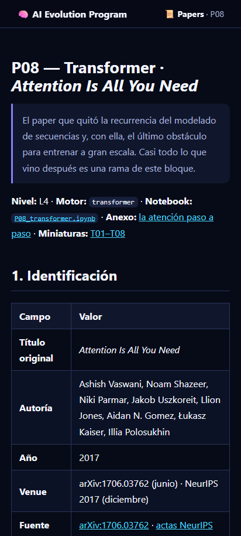

# 📱 App Android

Empaqueta el sitio completo del programa (index + 183 clases + 15 partes en HTML)
como aplicación Android con Capacitor. El contenido viaja embebido en el APK y
funciona offline; los diagramas mermaid requieren conexión (se renderizan desde CDN).

<div align="center">


</div>

> [!IMPORTANT]
> El APK se firma con la clave de **depuración** de Android, no con una de publicación: se instala
> permitiendo «orígenes desconocidos» y no procede de Google Play. Cada release publica su
> `SHA256SUMS-android.txt`.

## Build en CI (recomendado)

Ejecuta el workflow **Android build** (`workflow_dispatch`). Pasos que realiza:

1. Genera el sitio (`python scripts/generate_site.py`) → `site/` con sus 362 páginas HTML.
2. Copia `site/` a `apps/android/www/`.
3. `npm ci && npx cap add android && npx capacitor-assets generate --android`
   (icono y splash desde `resources/`).
4. `npx cap sync android && gradlew assembleDebug`.
5. **Verificación anti-APK-vacío**: descomprime el APK y exige exactamente
   195 páginas HTML en `assets/public/classes/` antes de subir el artefacto.

## Build local

Requiere Node 22+, JDK 17+, Android Studio 2025.2.1 o posterior y Android SDK 36:

Estos mínimos siguen la [configuración oficial de entorno de Capacitor 8](https://capacitorjs.com/docs/getting-started/environment-setup)
y su [guía de migración a 8.0](https://capacitorjs.com/docs/updating/8-0).

```bash
python scripts/generate_site.py
cd apps/android
mkdir -p www && cp -r ../../site/* www/
npm install
npx cap add android
npx capacitor-assets generate --android
npx cap sync android
cd android && ./gradlew assembleDebug
```

El APK queda en `android/app/build/outputs/apk/debug/app-debug.apk`
(debug, sin firmar para tienda; para release se necesita keystore propio).
