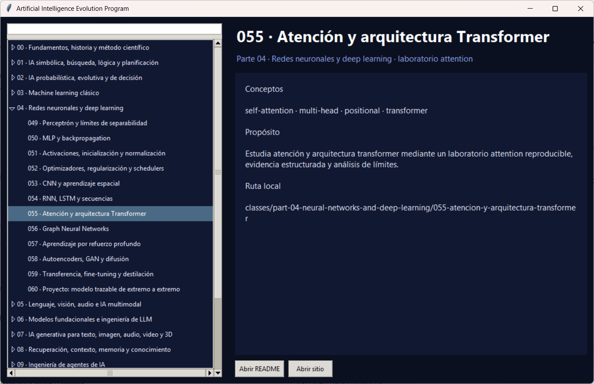

# Aplicación de escritorio

Visor local basado en Tkinter y biblioteca estándar:

```bash
python apps/desktop/main.py
```

Lee el mismo catálogo que la PWA.

<div align="center">

</div>

## Binarios

El workflow [`desktop.yml`](../../.github/workflows/desktop.yml) compila **cuatro
formatos**, todos versionados desde `pyproject.toml` y con su `SHA256SUMS`:

| Fichero | Qué es |
|---|---|
| `AI-Evolution-Program-<v>-setup-windows-x64.exe` | Instalador (Inno Setup): menú de inicio y desinstalador |
| `AI-Evolution-Program-<v>-portable-windows-x64.zip` | Carpeta portable: descomprimir y ejecutar |
| `AI-Evolution-Program-<v>-windows-x64.msi` | MSI para implantación gestionada: `msiexec /qn`, GPO, Intune |
| `AI-Evolution-Program-<v>-windows-x64.exe` | Ejecutable único: un fichero, arranque más lento |

El sitio se regenera **antes** de empaquetarlo, porque viaja dentro del ejecutable.

> [!IMPORTANT]
> Ninguno lleva **firma de código**, así que SmartScreen avisará la primera vez. Verifica el
> `SHA256SUMS-windows.txt` que acompaña a cada release.
