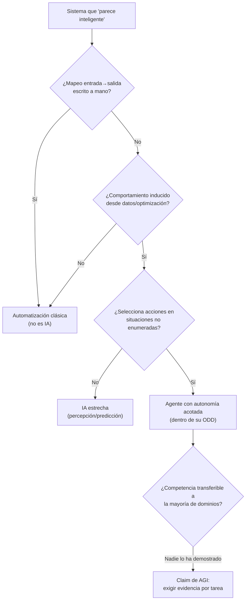

# Teoría — Qué es inteligencia artificial y qué no es

## 🗺️ Ubicación en el mapa de la IA

Esta clase es el punto cero del programa: antes de estudiar algoritmos concretos hay que
acotar el objeto de estudio. La definición operativa de IA que se adopte aquí determina cómo
se leerán los hitos históricos (clase 002), los ciclos de expectativas (clase 003) y el marco
de agentes racionales (clase 004). Sin esta demarcación, cualquier sistema con un `if` puede
venderse como "inteligente" y cualquier promesa de "IA general" puede pasar sin escrutinio.

## 📖 Fundamentos

### 🎯 Cuatro definiciones clásicas de IA

Russell y Norvig (AIMA 4e, cap. 1) organizan las definiciones históricas de IA en una matriz
de dos ejes: **pensar vs. actuar** y **como humanos vs. racionalmente**:

| | Como humanos | Racionalmente |
|---|---|---|
| **Pensar** | Ciencia cognitiva: modelar la mente humana | Leyes del pensamiento: lógica formal |
| **Actuar** | Test de Turing: conducta indistinguible | Agente racional: maximizar una medida de desempeño |

El enfoque dominante hoy es el del **agente racional**: un sistema que percibe su entorno y
actúa para maximizar el valor esperado de una medida de desempeño, dadas las percepciones
disponibles y su conocimiento previo. Esta definición es *operativa*: no exige conciencia
ni "entendimiento", exige desempeño medible.

### 🔬 IA estrecha vs. IA general

- **IA estrecha (narrow AI / weak AI):** sistemas competentes en una tarea o dominio acotado
  (clasificar imágenes, traducir, jugar Go, completar texto). Todo sistema desplegado
  comercialmente hasta hoy pertenece a esta categoría. Su competencia **no transfiere**
  automáticamente fuera de la distribución de datos para la que fue construido.
- **IA general (AGI):** sistema hipotético con competencia comparable a la humana en la
  mayoría de tareas cognitivas económicamente relevantes, incluyendo transferencia entre
  dominios y aprendizaje con pocos datos. Es un objetivo de investigación, no un artefacto
  existente; cualquier afirmación de que un sistema actual "es AGI" debe tratarse como un
  claim extraordinario que exige evidencia extraordinaria.

Un error de categoría frecuente: la fluidez lingüística de un modelo generativo se percibe
como generalidad. Fluidez ≠ generalidad: la competencia debe evaluarse por tarea, con
distribuciones de prueba distintas a las de entrenamiento.

### ⚙️ Automatización vs. autonomía

Dos conceptos que el marketing mezcla y la ingeniería debe separar:

- **Automatización:** ejecutar sin intervención humana un procedimiento *especificado de
  antemano*. Una macro, un cron job o un pipeline ETL son automatización sin IA. El
  comportamiento es trazable a reglas escritas por personas.
- **Autonomía:** capacidad de un sistema para *seleccionar sus propias acciones* ante
  situaciones no enumeradas explícitamente por el diseñador, usando percepción y algún
  criterio de decisión. La autonomía admite grados (los niveles de conducción autónoma
  SAE 0-5 son el ejemplo canónico) y siempre está acotada por el dominio de operación
  diseñado (ODD, *operational design domain*).

Una prueba práctica de demarcación en tres preguntas:

```text
1. ¿El mapeo entrada→salida fue escrito a mano?        → automatización clásica
2. ¿El mapeo se indujo desde datos u optimización?     → aprendizaje automático (IA estrecha)
3. ¿El sistema decide qué acción tomar en situaciones
   no enumeradas, bajo una medida de desempeño?        → agente con autonomía (acotada)
```

### 🚫 Qué NO es IA (hoy)

- No es magia estadística sin supuestos: todo modelo hereda los sesgos y la cobertura de sus datos.
- No es conciencia ni intencionalidad: optimizar una función de pérdida no implica "querer".
- No es infalibilidad: los sistemas de IA fallan de formas distintas (y a veces más silenciosas)
  que el software clásico, porque su especificación es implícita en los datos.
- No es un sustituto de la especificación del problema: si la medida de desempeño está mal
  elegida, el sistema optimizará lo incorrecto con gran eficacia (ley de Goodhart).

## 🧮 Ejemplo trabajado

Clasifiquemos cuatro sistemas con la prueba de demarcación:

| Sistema | ¿Reglas a mano? | ¿Inducido de datos? | ¿Decide acciones? | Veredicto |
|---|---|---|---|---|
| Termostato on/off a 22 °C | Sí (umbral fijo) | No | No | Automatización, no IA |
| Filtro de spam bayesiano | No | Sí (frecuencias de palabras) | No (solo etiqueta) | IA estrecha (clasificador) |
| Robot aspirador que mapea la casa | Parcial | Sí (SLAM, percepción) | Sí (ruta, dentro de un ODD) | Agente con autonomía acotada |
| "Asistente AGI" anunciado en una demo | ? | ? | ? | Claim sin evidencia: exigir evaluación por tarea |

Traza numérica para el filtro de spam: con un corpus de 1 000 correos (200 spam), la palabra
"gratis" aparece en 120 spam y 40 legítimos. P("gratis") = 160/1000 = 0.16 y
P("gratis"|spam)·P(spam) = (120/200)·(200/1000) = 0.12. Por Bayes,
P(spam|"gratis") = 0.12/0.16 = **0.75**. El sistema no "entiende" el correo: computa
frecuencias. Eso es IA estrecha funcionando exactamente como fue diseñada — y también su límite.

## 📊 Propiedades y comparación

| Dimensión | Automatización clásica | IA estrecha | IA general (hipotética) |
|---|---|---|---|
| Origen del comportamiento | Reglas explícitas | Inducción desde datos | Transferencia entre dominios |
| Fallo típico | Caso no previsto → excepción | Cambio de distribución → error silencioso | — (no existe artefacto) |
| Auditabilidad | Alta (código legible) | Media-baja (pesos opacos) | Desconocida |
| Evidencia exigible | Tests unitarios | Evaluación fuera de distribución, baselines | Claim extraordinario |
| Estado en 2026 | Ubicua | Ubicua | Objetivo de investigación |



## ⚠️ Errores conceptuales frecuentes

1. **"Si usa un modelo grande, es inteligente en general."** La escala mejora el desempeño
   dentro de la distribución de entrenamiento; la generalidad se demuestra con evaluaciones
   por tarea fuera de esa distribución, no con fluidez aparente.
2. **"Automatizar con reglas ya es IA."** Un árbol de `if/else` escrito a mano es software
   determinista clásico; llamarlo IA infla expectativas y confunde la auditoría.
3. **"El sistema decidió solo, nadie es responsable."** La autonomía es siempre delegada y
   acotada por diseño; la responsabilidad permanece en quien define la medida de desempeño
   y el dominio de operación.
4. **"Pasar una conversación convincente demuestra pensamiento."** El propio Turing (1950)
   propuso el juego de imitación como *sustituto operativo* de la pregunta "¿pueden pensar
   las máquinas?", que consideró demasiado ambigua — no como prueba de conciencia.
5. **"La IA elimina el sesgo humano."** Un modelo entrenado con decisiones humanas históricas
   reproduce y a veces amplifica esos sesgos, con la agravante de parecer objetivo.

## 🚀 Del aprendizaje a la operación

Entre esta taxonomía y un sistema real median: la especificación formal del dominio de
operación (qué entradas son válidas y cuáles se rechazan), la medición continua del cambio
de distribución en producción, un baseline no-IA contra el cual justificar la complejidad
añadida, y un protocolo de escalamiento a revisión humana cuando la confianza del sistema
cae. Clasificar correctamente el sistema (automatización / IA estrecha / agente) determina
qué régimen de pruebas y auditoría le corresponde.

## 🔗 Referencias

- [Turing, A. M. (1950). Computing Machinery and Intelligence. *Mind*, LIX(236)](https://doi.org/10.1093/mind/LIX.236.433)
- [McCarthy, Minsky, Rochester & Shannon (1955). A Proposal for the Dartmouth Summer Research Project on Artificial Intelligence](http://jmc.stanford.edu/articles/dartmouth/dartmouth.pdf)
- [McCarthy, J. What is Artificial Intelligence?](http://jmc.stanford.edu/artificial-intelligence/what-is-ai/index.html)
- [Russell, S. & Norvig, P. *Artificial Intelligence: A Modern Approach*, 4.ª ed., cap. 1](https://aima.cs.berkeley.edu/)
- [Nilsson, N. (2010). *The Quest for Artificial Intelligence* (PDF oficial gratuito)](https://ai.stanford.edu/~nilsson/QAI/qai.pdf)

---

> [⬅️ Volver a la clase](README.md) · [📝 Evaluación](assessment.md) · [📚 Índice de la parte](../README.md)
