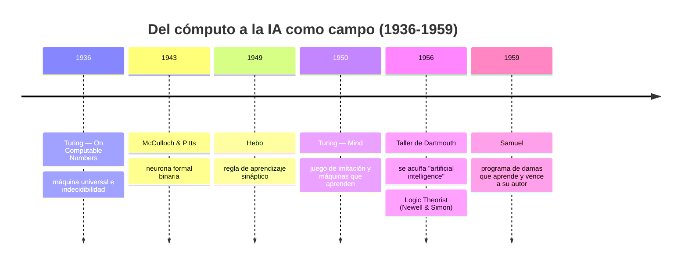

# 002 — De Turing a Dartmouth: nacimiento formal del campo

> [← Clase anterior](../../../classes/part-00-foundations-history-and-scientific-method/001-que-es-inteligencia-artificial-y-que-no-es/README.md) · [Índice de la parte](../README.md) · [Clase siguiente →](../../../classes/part-00-foundations-history-and-scientific-method/003-inviernos-resurgimientos-y-ciclos-de-expectativas/README.md)

**Parte:** 00 — Fundamentos, historia y método científico  
**Nivel:** fundamentos · **Horas estimadas:** 4  
**Laboratorio:** `frontier` · **Estado:** `EXECUTABLE_CORE`

## 🎯 Propósito

Comprender **de turing a dartmouth: nacimiento formal del campo** dentro de la evolución de la inteligencia
artificial, implementar un experimento mínimo verificable y distinguir qué parte
constituye evidencia frente a una afirmación todavía no comprobada.

## 📚 Resultados de aprendizaje

Al finalizar podrás:

1. Explicar de turing a dartmouth: nacimiento formal del campo usando los conceptos `Turing`, `Dartmouth`, `historia`, `hitos`.
2. Ejecutar el laboratorio con una semilla explícita y revisar su contrato JSON.
3. Identificar al menos un supuesto, una limitación y un riesgo de aplicación.
4. Comparar el enfoque con la etapa anterior de la ruta de aprendizaje.
5. Producir una evidencia reproducible y una conclusión que no exceda los datos.

## 🧩 Conceptos centrales

`Turing`, `Dartmouth`, `historia`, `hitos`

## 🗺️ Ubicación en el mapa de la IA

Entre 1936 y 1956 se ensamblan las piezas que convierten "máquinas que piensan" de
especulación filosófica en programa de investigación: computabilidad (Turing 1936),
neuronas formales (McCulloch y Pitts 1943), un criterio operativo de inteligencia
(Turing 1950) y un nombre con agenda propia (Dartmouth 1956). Todo lo que sigue en el
programa — desde búsqueda hasta modelos de lenguaje — desciende de decisiones tomadas
en esta ventana de veinte años.

## 📖 Fundamentos

### 🧱 1936: la máquina universal

En *On Computable Numbers* (1936), Turing formaliza qué significa "computar": una máquina
abstracta con cinta infinita, cabezal y tabla finita de estados. Dos resultados fundan el
campo: existe una **máquina universal** capaz de simular cualquier otra máquina si se le da
su descripción (el fundamento conceptual del software y del programa almacenado), y el
**Entscheidungsproblem** es indecidible: hay preguntas bien definidas que ningún algoritmo
puede responder para todos los casos. La IA nace, por tanto, dentro de límites demostrados,
no en un espacio de posibilidad infinita.

### 🧠 1943: la neurona formal

McCulloch y Pitts proponen la primera abstracción matemática de la neurona: unidades
binarias con umbral cuyas redes pueden computar cualquier función lógica proposicional.

```text
salida = 1  si  Σ (entradas excitatorias) ≥ umbral  y  ninguna entrada inhibitoria activa
salida = 0  en caso contrario
```

Es el ancestro directo del perceptrón (1958) y, con activaciones continuas y pesos
ajustables, de las redes profundas actuales. Su aporte no fue biológico sino formal:
demostró que "lo mental" podía describirse como cómputo.

### 🎭 1950: el juego de imitación

En *Computing Machinery and Intelligence* (Mind, 1950), Turing reemplaza la pregunta
"¿pueden pensar las máquinas?" — que juzga "demasiado carente de sentido para merecer
discusión" en su forma original — por un experimento operativo: un interrogador conversa
por teletipo con un humano y una máquina; si no puede distinguirlos de forma fiable, la
máquina pasa la prueba. El artículo además enumera y refuta nueve objeciones (teológica,
matemática vía Gödel, de la conciencia, de Lady Lovelace, etc.) y cierra proponiendo
**máquinas que aprenden** como camino práctico — anticipando el aprendizaje automático
por décadas.

### 🏛️ 1956: Dartmouth y el nombre del campo

La propuesta de McCarthy, Minsky, Rochester y Shannon (1955) para el taller de verano de
Dartmouth formula la **conjetura fundacional**: "cada aspecto del aprendizaje o cualquier
otra característica de la inteligencia puede, en principio, describirse con tanta precisión
que una máquina puede simularlo". El documento fija la agenda: lenguaje, redes neuronales,
abstracción, creatividad y automejora. McCarthy acuña ahí el término *artificial
intelligence*, en parte para distinguir el programa de la cibernética de Wiener. El taller
no resolvió nada por sí mismo, pero creó la comunidad: Newell y Simon presentaron el
Logic Theorist, considerado el primer programa de IA operativo.

### 📈 1949-1959: el aprendizaje entra en escena

Dos hitos completan el nacimiento del campo: la regla de Hebb (1949, "las neuronas que se
disparan juntas se conectan") da un mecanismo de aprendizaje plausible, y el programa de
damas de Samuel (1959) demuestra empíricamente que una máquina puede **superar a su
programador** aprendiendo de la experiencia — introduciendo términos como *machine
learning* y técnicas precursoras del aprendizaje por refuerzo.

## 🧮 Ejemplo trabajado

Verifiquemos que una neurona de McCulloch-Pitts computa la función AND con umbral θ = 2 y
pesos excitatorios w₁ = w₂ = 1:

| x₁ | x₂ | Σ = w₁x₁ + w₂x₂ | ¿Σ ≥ 2? | salida |
|---|---|---|---|---|
| 0 | 0 | 0 | no | 0 |
| 0 | 1 | 1 | no | 0 |
| 1 | 0 | 1 | no | 0 |
| 1 | 1 | 2 | sí | 1 |

Con θ = 1 la misma unidad computa OR; añadiendo una entrada inhibitoria se obtiene NOT.
Como {AND, OR, NOT} es funcionalmente completo, redes de estas unidades computan cualquier
función booleana — exactamente el resultado de 1943. Lo que la unidad NO puede hacer sola
es XOR (no es linealmente separable), la limitación que Minsky y Papert explotarían en 1969
contra el perceptrón.

## 📊 Propiedades y comparación

| Hito | Año | Aporte | Qué NO resolvió |
|---|---|---|---|
| Turing, máquina universal | 1936 | Define computabilidad; programa almacenado | Nada sobre inteligencia práctica |
| McCulloch & Pitts | 1943 | Neurona formal; mente como cómputo | Sin regla de aprendizaje |
| Hebb | 1949 | Mecanismo de aprendizaje sináptico | Sin formalización algorítmica |
| Turing, juego de imitación | 1950 | Criterio operativo de inteligencia | Mide indistinguibilidad, no competencia |
| Dartmouth | 1956 | Nombre, agenda y comunidad | Subestimó radicalmente la dificultad |
| Samuel, damas | 1959 | Aprendizaje que supera al programador | Dominio cerrado y minúsculo |



## ⚠️ Errores conceptuales frecuentes

1. **"El test de Turing es la definición oficial de IA."** Es un criterio operativo de 1950,
   hoy más histórico que práctico: mide indistinguibilidad conversacional, no competencia
   general, y es vulnerable a trucos de imitación superficial (chatbots tipo ELIZA).
2. **"Dartmouth fue donde se inventó la IA."** Los resultados técnicos clave (computabilidad,
   neurona formal, Logic Theorist) son anteriores o simultáneos; Dartmouth aportó el nombre,
   la agenda y la comunidad.
3. **"Turing propuso el test porque creía que las máquinas piensan como humanos."** Propuso
   *reemplazar* esa pregunta por una decidible experimentalmente; su posición sobre la
   pregunta original fue deliberadamente agnóstica.
4. **"Las redes neuronales son una idea reciente."** La neurona formal es de 1943; lo
   reciente es la combinación de datos masivos, GPU y retropropagación a escala.
5. **"La conjetura de Dartmouth quedó demostrada."** Sigue siendo una conjetura: que la
   inteligencia sea describible con precisión suficiente para simularse es la apuesta del
   campo, no un teorema.

## 🚀 Del aprendizaje a la operación

Leer las fuentes primarias inmuniza contra dos vicios profesionales: atribuir a los sistemas
actuales propiedades que nadie ha demostrado (la conjetura de Dartmouth tratada como hecho)
y descartar límites formales conocidos (indecidibilidad, separabilidad lineal) al estimar
qué puede automatizarse. En un proyecto real, este bagaje se traduce en exigir criterios
operativos de éxito — el gesto de Turing de 1950 — antes de aceptar afirmaciones sobre
"inteligencia" de un producto.

## 🧪 Laboratorio

```bash
python lab.py
```

El laboratorio llama a `ai_evolution.labs.run_lab("frontier")`. Esta
decisión evita 183 implementaciones divergentes: cada clase tiene un entrypoint
propio, pero los motores didácticos se prueban como una biblioteca común.

### 🔍 Evidencia esperada

- tipo de laboratorio y semilla;
- entradas o decisiones observables;
- resultado estructurado;
- lista `evidence` con hechos que pueden inspeccionarse;
- lista `limitations` que impide presentar la demo como producción.

## 📓 Notebooks

- [📓 `notebook.ipynb`](notebook.ipynb): recorrido guiado con la materia resumida.
- [✍️ `notebook_student.ipynb`](notebook_student.ipynb): ejercicios para resolver.
- [✅ `notebook_solution.ipynb`](notebook_solution.ipynb): solución de referencia explicada.

## 📝 Evaluación

| Criterio | Peso |
|---|---:|
| Comprensión conceptual | 25 % |
| Ejecución reproducible | 25 % |
| Interpretación basada en evidencia | 25 % |
| Riesgos, límites y mejora propuesta | 25 % |

Consulta [assessment.md](assessment.md) para preguntas y criterio de aceptación.

## ⚠️ Errores comunes

| Síntoma | Causa probable | Corrección |
|---|---|---|
| El código corre, pero no hay conclusión | Se confundió ejecución con aprendizaje | Explica qué demuestra y qué no demuestra |
| El resultado cambia sin explicación | No se registró semilla o configuración | Conserva semilla, versión y parámetros |
| Se promete uso real | Se extrapoló desde una demo educativa | Declara entorno, datos, límites y revisión humana |
| Se copia una métrica aislada | No existe baseline ni costo de error | Añade comparación y criterio de decisión |

## ❓ Preguntas frecuentes

**¿Debo usar una API comercial?**  
No. El núcleo funciona localmente. Las extensiones LIVE se documentan por separado.

**¿El laboratorio representa una implementación industrial?**  
No por sí solo. Enseña el contrato y el patrón; producción exige integración,
seguridad, observabilidad, pruebas y operación.

**¿Dónde profundizo?**  
Revisa las especializaciones enlazadas en el README raíz y la ruta siguiente.

## 🔗 Referencias

- [Turing, A. M. (1950). Computing Machinery and Intelligence. *Mind*, LIX(236), 433-460](https://doi.org/10.1093/mind/LIX.236.433) — uso: fuente primaria del mecanismo estudiado
- [Turing, A. M. (1936). On Computable Numbers, with an Application to the Entscheidungsproblem](https://doi.org/10.1112/plms/s2-42.1.230) — uso: fuente primaria del mecanismo estudiado
- [McCarthy, Minsky, Rochester & Shannon (1955). A Proposal for the Dartmouth Summer Research Project on Artificial Intelligence](http://jmc.stanford.edu/articles/dartmouth/dartmouth.pdf) — uso: referencia consultada en su fuente original
- [McCulloch, W. & Pitts, W. (1943). A Logical Calculus of the Ideas Immanent in Nervous Activity](https://doi.org/10.1007/BF02478259) — uso: fuente primaria del mecanismo estudiado
- [Samuel, A. (1959). Some Studies in Machine Learning Using the Game of Checkers. *IBM Journal*](https://doi.org/10.1147/rd.33.0210) — uso: fuente primaria del mecanismo estudiado
- [Russell, S. & Norvig, P. *AIMA*, 4.ª ed., cap. 1 (historia del campo)](https://aima.cs.berkeley.edu/) — uso: desarrollo extendido del tema

<!-- papers:inicio -->

---

## 📜 Papers que fundamentan esta clase

> Bloque generado por `python scripts/link_papers_to_classes.py`. La fuente es [`papers/catalog/papers.json`](../../../papers/catalog/papers.json).

| Paper | Año | Qué desbloqueó | Miniatura |
|---|---:|---|---|
| [P56 · Maquinaria computacional e inteligencia](../../../papers/foundational/P56_turing/README.md) | 1950 | Cambia una pregunta metafísica —¿pueden pensar las máquinas?— por un procedimiento que se puede ejecutar y discutir. | [notebook](../../../notebooks/papers/P56_turing.ipynb) |
| [P57 · Propuesta para el proyecto de investigación de verano de Dartmouth sobre inteligencia artificial](../../../papers/foundational/P57_dartmouth/README.md) | 1955 | Bautiza el campo y fija su agenda: siete temas que aún organizan buena parte de la investigación. | [notebook](../../../notebooks/papers/P57_dartmouth.ipynb) |

Cada ficha explica el problema anterior, la matemática mínima, los límites y los errores de atribución más frecuentes. Para leerlas con método: [cómo leer un paper de IA](../../../papers/guides/COMO_LEER_UN_PAPER_DE_IA.md) · [anexos matemáticos](../../../papers/annexes/README.md).
<!-- papers:fin -->
<!-- bibliografia:inicio -->

---

## 📚 Bibliografía de apoyo

> Bloque generado por `python scripts/link_sources_to_classes.py`. Cada obra lleva su localizador verificado en [`sources/bibliography.json`](../../../sources/bibliography.json).

Los papers dicen **de dónde salió** el mecanismo. Estas obras lo **desarrollan** con el espacio que una clase no tiene: teoría completa, demostraciones y ejercicios.

| Obra | Edición | Localizador | Papel en esta clase |
|---|---|---|---|
| Russell, Stuart J. y Norvig, Peter — *Artificial Intelligence: A Modern Approach* | 4.ª · 2020 | [ISBN 9780134610993](https://openlibrary.org/isbn/9780134610993) · [web de la obra](https://aima.cs.berkeley.edu/) | citada en las referencias de esta clase · cap. 1 · obra de referencia de la parte 00 |
<!-- bibliografia:fin -->

---

## ⬅️ Clase anterior

[001 — Qué es inteligencia artificial y qué no es](../../part-00-foundations-history-and-scientific-method/001-que-es-inteligencia-artificial-y-que-no-es/README.md)

## ➡️ Siguiente clase

[003 — Inviernos, resurgimientos y ciclos de expectativas](../../part-00-foundations-history-and-scientific-method/003-inviernos-resurgimientos-y-ciclos-de-expectativas/README.md)
