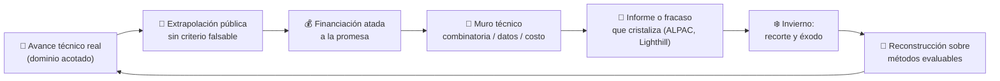

# 003 — Inviernos, resurgimientos y ciclos de expectativas

> [← Clase anterior](../../../classes/part-00-foundations-history-and-scientific-method/002-de-turing-a-dartmouth-nacimiento-formal-del-campo/README.md) · [Índice de la parte](../README.md) · [Clase siguiente →](../../../classes/part-00-foundations-history-and-scientific-method/004-agentes-racionales-entornos-y-medidas-de-desempeno/README.md)

**Parte:** 00 — Fundamentos, historia y método científico  
**Nivel:** fundamentos · **Horas estimadas:** 4  
**Laboratorio:** `evaluation` · **Estado:** `EXECUTABLE_CORE`

## 🎯 Propósito

Comprender **inviernos, resurgimientos y ciclos de expectativas** dentro de la evolución de la inteligencia
artificial, implementar un experimento mínimo verificable y distinguir qué parte
constituye evidencia frente a una afirmación todavía no comprobada.

## 📚 Resultados de aprendizaje

Al finalizar podrás:

1. Explicar inviernos, resurgimientos y ciclos de expectativas usando los conceptos `AI winters`, `expectativas`, `evidencia`, `mercado`.
2. Ejecutar el laboratorio con una semilla explícita y revisar su contrato JSON.
3. Identificar al menos un supuesto, una limitación y un riesgo de aplicación.
4. Comparar el enfoque con la etapa anterior de la ruta de aprendizaje.
5. Producir una evidencia reproducible y una conclusión que no exceda los datos.

## 🧩 Conceptos centrales

`AI winters`, `expectativas`, `evidencia`, `mercado`

## 🗺️ Ubicación en el mapa de la IA

Tras el optimismo fundacional de Dartmouth (clase 002), el campo vivió ciclos de euforia,
promesa incumplida y recorte de financiación conocidos como **inviernos de la IA**. Estudiar
estos ciclos no es arqueología: da el instrumental para evaluar los claims del presente
— incluida la ola actual de IA generativa — y conecta directamente con la lectura crítica
de papers y benchmarks (clase 010).

## 📖 Fundamentos

### 📉 Anatomía de un invierno

Un invierno de IA es un periodo de colapso de financiación y credibilidad tras expectativas
infladas. El patrón se repite con estructura reconocible:

```text
1. Avance técnico real y demostrable en un dominio acotado
2. Extrapolación pública: "en N años, inteligencia humana"
3. Financiación masiva atada a la extrapolación, no al avance
4. La dificultad real aparece (explosión combinatoria, falta de datos/cómputo)
5. Informe o fracaso visible que cristaliza la decepción
6. Recorte de fondos, éxodo de talento, cambio de etiqueta ("informática avanzada")
```

### ❄️ Primer invierno (~1974-1980)

Detonantes documentados:

- **Informe ALPAC (1966, EE. UU.):** concluyó que la traducción automática era más cara y
  peor que la humana; cortó la financiación de MT durante una década.
- **Minsky y Papert, *Perceptrons* (1969):** demostraron formalmente que el perceptrón de
  una capa no puede computar funciones no linealmente separables (XOR); el resultado, junto
  a su influencia institucional, congeló la investigación en redes neuronales.
- **Informe Lighthill (1973, Reino Unido):** encargado por el Science Research Council,
  concluyó que la IA no había cumplido sus promesas y que la **explosión combinatoria**
  hacía inviables los métodos de búsqueda general fuera de problemas de juguete. El
  parlamento británico desmanteló la financiación salvo en tres universidades.

La causa técnica de fondo: los métodos "débiles" (búsqueda general + heurísticas) escalan
exponencialmente con el tamaño del problema, y el hardware de la época agravaba el muro.

### 🏭 Auge y segundo invierno (~1980-1993)

Los **sistemas expertos** (MYCIN, XCON/R1) codificaban reglas de especialistas y produjeron
valor real: XCON ahorraba a DEC decenas de millones de dólares anuales configurando
computadores VAX. Japón lanzó el proyecto **Quinta Generación** (1982) y EE. UU. respondió
con DARPA/SCI. El colapso (~1987-1993) llegó por: costo de mantenimiento de bases de reglas
frágiles (el "cuello de botella de adquisición de conocimiento"), incapacidad de manejar
incertidumbre y casos fuera de las reglas, y el desplome del mercado de máquinas Lisp ante
estaciones de trabajo genéricas más baratas.

### 🔄 El resurgimiento y el ciclo de expectativas

Desde ~1995 el campo se reconstruyó sobre bases más sólidas: métodos probabilísticos
(redes bayesianas), aprendizaje estadístico con evaluación en benchmarks, y desde 2012
(AlexNet en ImageNet) el aprendizaje profundo habilitado por GPU y datos masivos. El modelo
descriptivo popular para estos ciclos es el *hype cycle* de Gartner (pico de expectativas
infladas → abismo de desilusión → pendiente de iluminación → meseta de productividad). Es
útil como vocabulario, con una advertencia: es un esquema de marketing, no una ley empírica
validada — usarlo como si predijera fechas es repetir el error que describe.

Indicadores para distinguir avance real de burbuja:

- ¿La métrica mejora en benchmarks *independientes* y fuera de la distribución de entrenamiento?
- ¿El costo por unidad de tarea baja de forma sostenida?
- ¿Hay despliegues en producción con usuarios que pagan, o solo demos controladas?
- ¿Las promesas tienen fecha y criterio de éxito falsable?

## 🧮 Ejemplo trabajado

Apliquemos el patrón de 6 pasos al primer invierno, con fechas verificables:

| Paso del patrón | Evento histórico | Año |
|---|---|---|
| 1. Avance real | Logic Theorist, SHRDLU en micromundos | 1956-1972 |
| 2. Extrapolación | Simon: "en 20 años las máquinas harán cualquier trabajo humano" | 1965 |
| 3. Financiación atada a la promesa | DARPA financia traducción automática y IA general | 1963-1973 |
| 4. Dificultad real | Explosión combinatoria fuera de problemas de juguete | ~1970 |
| 5. Cristalización | ALPAC (1966), *Perceptrons* (1969), Lighthill (1973) | 1966-1973 |
| 6. Recorte | DARPA y SRC cortan fondos; el término "IA" se vuelve tóxico | 1974-1980 |

Ejercicio de lectura: la afirmación de Simon (paso 2) era falsable — tenía plazo y alcance —
y resultó falsa. Eso la hace *mejor ciencia* que una promesa vaga sin plazo, pero peor
gestión de expectativas. La lección no es "no predecir", sino auditar predicciones pasadas
antes de aceptar nuevas del mismo emisor.

## 📊 Propiedades y comparación

| Dimensión | 1.er invierno (1974-80) | 2.º invierno (1987-93) | ¿Hoy? (a auditar) |
|---|---|---|---|
| Tecnología estrella | Búsqueda + heurísticas | Sistemas expertos | Modelos generativos |
| Promesa inflada | Inteligencia general en ~20 años | Conocimiento experto barato | AGI inminente |
| Muro técnico | Explosión combinatoria | Adquisición/fragilidad de reglas | Costo, alucinación, evaluación |
| Detonante visible | ALPAC, Perceptrons, Lighthill | Colapso de máquinas Lisp | (sin determinar) |
| Qué sobrevivió | Algoritmos de búsqueda, teoría | Motores de reglas, ontologías | (sin determinar) |



## ⚠️ Errores conceptuales frecuentes

1. **"Los inviernos prueban que la IA no funciona."** Lo que colapsó fueron expectativas
   infladas; los métodos con evidencia sólida (búsqueda, reglas, luego estadística)
   sobrevivieron y se integraron al software ordinario.
2. **"Esta vez es diferente, no puede haber otro invierno."** Puede que sí o que no: la
   pregunta correcta es qué indicadores falsables distinguen esta ola de las anteriores,
   no la confianza subjetiva de los participantes.
3. **"El informe Lighthill era anti-ciencia."** Fue un análisis técnico encargado por el
   financiador que identificó correctamente la explosión combinatoria; su error estuvo en
   generalizar el diagnóstico a todo el campo.
4. **"El hype cycle de Gartner es una ley."** Es una heurística descriptiva sin validación
   empírica sistemática; muchas tecnologías nunca recorren la curva completa.
5. **"Los sistemas expertos fracasaron por ser simbólicos."** Fracasaron por costo de
   mantenimiento y fragilidad ante incertidumbre; la representación simbólica sigue viva en
   motores de reglas, planificación y verificación.

## 🚀 Del aprendizaje a la operación

En un contexto profesional este tema se convierte en gestión de riesgo tecnológico: antes de
apostar presupuesto a una capacidad de IA, exigir evidencia reproducible en el dominio propio
(no en la demo del vendedor), separar la mejora medible de la narrativa, fijar criterios de
salida si la promesa no se cumple en plazo, y presupuestar el mantenimiento — la causa
silenciosa del segundo invierno — tanto como el desarrollo inicial.

## 🧪 Laboratorio

```bash
python lab.py
```

El laboratorio llama a `ai_evolution.labs.run_lab("evaluation")`. Esta
decisión evita 183 implementaciones divergentes: cada clase tiene un entrypoint
propio, pero los motores didácticos se prueban como una biblioteca común.

### 🔍 Evidencia esperada

- tipo de laboratorio y semilla;
- entradas o decisiones observables;
- resultado estructurado;
- lista `evidence` con hechos que pueden inspeccionarse;
- lista `limitations` que impide presentar la demo como producción.

## 📓 Notebooks

- [📓 `notebook.ipynb`](notebook.ipynb): recorrido guiado con la materia resumida.
- [✍️ `notebook_student.ipynb`](notebook_student.ipynb): ejercicios para resolver.
- [✅ `notebook_solution.ipynb`](notebook_solution.ipynb): solución de referencia explicada.

## 📝 Evaluación

| Criterio | Peso |
|---|---:|
| Comprensión conceptual | 25 % |
| Ejecución reproducible | 25 % |
| Interpretación basada en evidencia | 25 % |
| Riesgos, límites y mejora propuesta | 25 % |

Consulta [assessment.md](assessment.md) para preguntas y criterio de aceptación.

## ⚠️ Errores comunes

| Síntoma | Causa probable | Corrección |
|---|---|---|
| El código corre, pero no hay conclusión | Se confundió ejecución con aprendizaje | Explica qué demuestra y qué no demuestra |
| El resultado cambia sin explicación | No se registró semilla o configuración | Conserva semilla, versión y parámetros |
| Se promete uso real | Se extrapoló desde una demo educativa | Declara entorno, datos, límites y revisión humana |
| Se copia una métrica aislada | No existe baseline ni costo de error | Añade comparación y criterio de decisión |

## ❓ Preguntas frecuentes

**¿Debo usar una API comercial?**  
No. El núcleo funciona localmente. Las extensiones LIVE se documentan por separado.

**¿El laboratorio representa una implementación industrial?**  
No por sí solo. Enseña el contrato y el patrón; producción exige integración,
seguridad, observabilidad, pruebas y operación.

**¿Dónde profundizo?**  
Revisa las especializaciones enlazadas en el README raíz y la ruta siguiente.

## 🔗 Referencias

- [Lighthill, J. (1973). Artificial Intelligence: A General Survey (informe al Science Research Council)](http://www.chilton-computing.org.uk/inf/literature/reports/lighthill_report/p001.htm)
- [Russell, S. & Norvig, P. *AIMA*, 4.ª ed., cap. 1.3 (historia de la IA)](https://aima.cs.berkeley.edu/)
- [Nilsson, N. (2010). *The Quest for Artificial Intelligence*, caps. sobre auge y colapso (PDF oficial)](https://ai.stanford.edu/~nilsson/QAI/qai.pdf)
- [Gartner Hype Cycle (metodología, para uso crítico)](https://www.gartner.com/en/research/methodologies/gartner-hype-cycle)
- [McCulloch & Pitts → perceptrón: contexto en Goodfellow et al., *Deep Learning*, cap. 1](https://www.deeplearningbook.org/)

---

## ⬅️ Clase anterior

[002 — De Turing a Dartmouth: nacimiento formal del campo](../../part-00-foundations-history-and-scientific-method/002-de-turing-a-dartmouth-nacimiento-formal-del-campo/README.md)

## ➡️ Siguiente clase

[004 — Agentes racionales, entornos y medidas de desempeño](../../part-00-foundations-history-and-scientific-method/004-agentes-racionales-entornos-y-medidas-de-desempeno/README.md)
