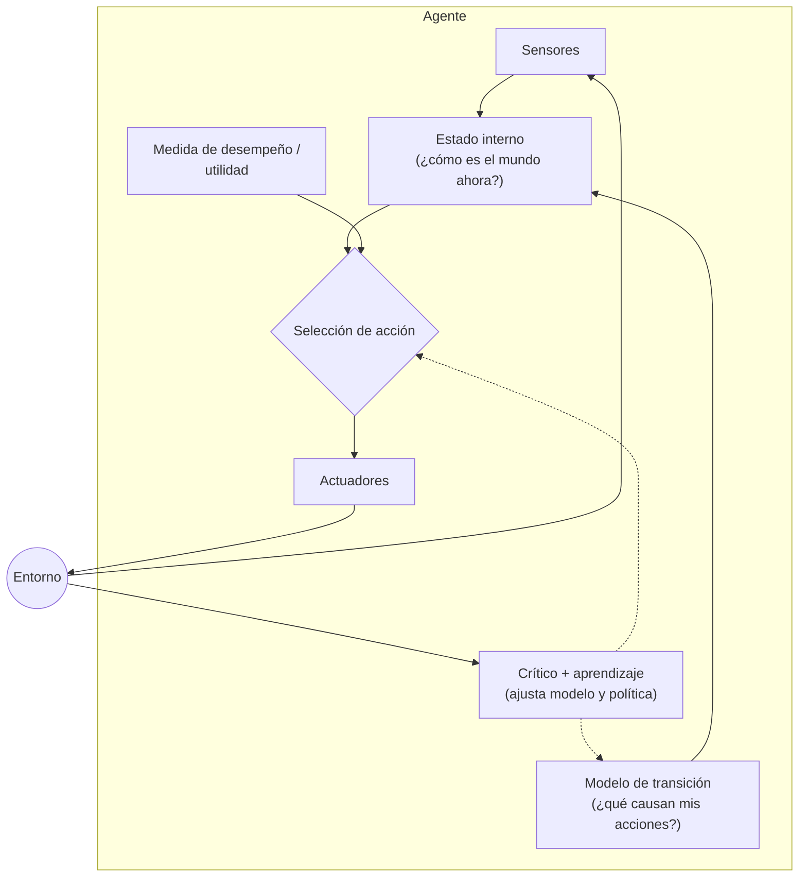

# 004 — Agentes racionales, entornos y medidas de desempeño

> [← Clase anterior](../../../classes/part-00-foundations-history-and-scientific-method/003-inviernos-resurgimientos-y-ciclos-de-expectativas/README.md) · [Índice de la parte](../README.md) · [Clase siguiente →](../../../classes/part-00-foundations-history-and-scientific-method/005-vectores-matrices-y-geometria-para-ia/README.md)

**Parte:** 00 — Fundamentos, historia y método científico  
**Nivel:** fundamentos · **Horas estimadas:** 4  
**Laboratorio:** `agent` · **Estado:** `EXECUTABLE_CORE`

## 🎯 Propósito

Comprender **agentes racionales, entornos y medidas de desempeño** dentro de la evolución de la inteligencia
artificial, implementar un experimento mínimo verificable y distinguir qué parte
constituye evidencia frente a una afirmación todavía no comprobada.

## 📚 Resultados de aprendizaje

Al finalizar podrás:

1. Explicar agentes racionales, entornos y medidas de desempeño usando los conceptos `PEAS`, `racionalidad`, `entorno`, `desempeño`.
2. Ejecutar el laboratorio con una semilla explícita y revisar su contrato JSON.
3. Identificar al menos un supuesto, una limitación y un riesgo de aplicación.
4. Comparar el enfoque con la etapa anterior de la ruta de aprendizaje.
5. Producir una evidencia reproducible y una conclusión que no exceda los datos.

## 🧩 Conceptos centrales

`PEAS`, `racionalidad`, `entorno`, `desempeño`

## 🗺️ Ubicación en el mapa de la IA

El marco de agentes racionales (AIMA, cap. 2) es el lenguaje unificador de la IA moderna:
permite describir con el mismo vocabulario un termostato, un buscador de rutas, un jugador
de ajedrez y un modelo de lenguaje con herramientas. Sustituye la pregunta filosófica
"¿piensa?" por la pregunta de ingeniería "¿maximiza su medida de desempeño en su entorno?".
Todo el resto del programa — búsqueda, aprendizaje, RL, agentes con LLM — son formas de
construir la función del agente.

## 📖 Fundamentos

### 🤖 Agente, percepción y función del agente

Un **agente** es cualquier entidad que percibe su entorno mediante **sensores** y actúa
sobre él mediante **actuadores**. Formalmente:

```text
secuencia de percepciones:  p₁, p₂, ..., pₜ
función del agente:         f: P* → A   (de historiales de percepción a acciones)
programa del agente:        implementación concreta y finita de f
```

La distinción función/programa importa: la función es la especificación matemática
(potencialmente una tabla infinita); el programa es el código que la aproxima con memoria
y cómputo finitos.

### 🎯 Racionalidad y medida de desempeño

Un **agente racional** elige, para cada secuencia de percepciones, la acción que **maximiza
el valor esperado de la medida de desempeño**, dado el conocimiento previo y las
percepciones hasta el momento. Cuatro precisiones críticas:

1. **Racional ≠ omnisciente:** la racionalidad maximiza el resultado *esperado* con la
   información disponible; no exige conocer el resultado real.
2. **Racional ≠ perfecto:** un agente racional puede obtener malos resultados por mala
   suerte; se juzga la decisión, no el desenlace.
3. La medida de desempeño debe evaluar **estados del entorno**, no estados del agente
   ("cuánta suciedad aspiró" es hackeable aspirando y tirando la misma suciedad; "qué tan
   limpio está el suelo por hora" no).
4. La racionalidad incluye **recopilar información** y **aprender**: ignorar percepciones
   disponibles es irracional.

### 📋 Especificación PEAS

Antes de diseñar un agente se especifica su entorno de tareas con **PEAS**:

- **P**erformance (medida de desempeño): qué se maximiza.
- **E**nvironment (entorno): dónde opera.
- **A**ctuators (actuadores): con qué actúa.
- **S**ensors (sensores): qué percibe.

### 🌍 Dimensiones del entorno

Las propiedades del entorno determinan qué arquitectura de agente es viable:

| Dimensión | Extremo fácil | Extremo difícil |
|---|---|---|
| Observabilidad | Totalmente observable | Parcialmente observable |
| N.º de agentes | Un agente | Multiagente (competitivo/cooperativo) |
| Determinismo | Determinista | Estocástico |
| Episodicidad | Episódico | Secuencial (las acciones afectan el futuro) |
| Dinámica | Estático | Dinámico (cambia mientras el agente delibera) |
| Estados/tiempo | Discreto | Continuo |
| Conocimiento | Conocido (reglas dadas) | Desconocido (hay que aprenderlas) |

El caso más difícil (parcialmente observable, multiagente, estocástico, secuencial,
dinámico, continuo, desconocido) es, por ejemplo, conducir en tráfico real.

### 🏗️ Taxonomía de programas de agente

1. **Reflejo simple:** reglas condición→acción sobre la percepción actual. Solo funciona
   con observabilidad total.
2. **Reflejo con estado (basado en modelo):** mantiene un estado interno actualizado con un
   modelo de transición del mundo; tolera observabilidad parcial.
3. **Basado en metas:** delibera — busca secuencias de acciones que alcanzan una meta
   explícita (conecta con búsqueda, parte 01).
4. **Basado en utilidad:** compara estados por *cuán deseables* son (función de utilidad),
   maneja metas en conflicto y riesgo mediante utilidad esperada.
5. **Que aprende:** cualquiera de los anteriores más un elemento de aprendizaje, un crítico
   y un generador de problemas (exploración). Es la arquitectura general del ML moderno.

## 🧮 Ejemplo trabajado

Especificación PEAS de un agente aspirador en el mundo de dos casillas (A, B) de AIMA:

- **P:** +1 por casilla limpia por paso de tiempo, durante 1000 pasos; −1 por movimiento.
- **E:** dos casillas; la suciedad puede reaparecer con probabilidad 0.1 por paso.
- **A:** `Izquierda`, `Derecha`, `Aspirar`, `NoOp`.
- **S:** posición actual y si la casilla actual está sucia — observabilidad **parcial**
  (no ve la otra casilla).

Traza de un agente reflejo con estado, empezando en A, ambas sucias:

| t | Percepción | Estado interno (creencia) | Acción | Razón |
|---|---|---|---|---|
| 1 | (A, sucia) | B: desconocido | Aspirar | limpiar rinde +1/paso futuro |
| 2 | (A, limpia) | B: desconocido | Derecha | recopilar información es racional |
| 3 | (B, sucia) | A: limpia (hace 1 paso) | Aspirar | idem t=1 |
| 4 | (B, limpia) | A: limpia con prob. 0.9 | NoOp | moverse cuesta −1 y no hay evidencia de suciedad |

Nótese la decisión en t=4: un reflejo simple sin estado oscilaría entre casillas pagando −1
por viaje; el estado interno permite quedarse quieto hasta que la probabilidad de suciedad
acumulada justifique el costo del viaje. La racionalidad depende de la medida P: si el
movimiento no costara nada, patrullar sería óptimo.

## 📊 Propiedades y comparación

| Arquitectura | Requiere modelo del mundo | Maneja obs. parcial | Maneja metas en conflicto | Costo computacional |
|---|---|---|---|---|
| Reflejo simple | No | No | No | Mínimo |
| Reflejo con estado | Sí (transición) | Sí | No | Bajo |
| Basado en metas | Sí | Sí | No (meta binaria) | Medio (búsqueda) |
| Basado en utilidad | Sí | Sí | Sí (utilidad esperada) | Alto |
| Que aprende | Lo aprende | Sí | Sí | Variable + entrenamiento |



## ⚠️ Errores conceptuales frecuentes

1. **"Racional significa que siempre gana."** La racionalidad se define sobre el valor
   *esperado* con la información disponible; un resultado malo no implica una decisión
   irracional (ni viceversa).
2. **"La medida de desempeño es un detalle."** Es la especificación completa del objetivo:
   medidas mal diseñadas producen agentes que optimizan literalmente lo que se midió
   (aspirar y volcar la suciedad para volver a aspirarla).
3. **"Más deliberación siempre es mejor."** En entornos dinámicos, deliberar tiene costo de
   oportunidad; un reflejo rápido puede ser más racional que un plan óptimo tardío.
4. **"Los agentes con LLM son otra cosa."** Encajan en el marco: percepciones (contexto,
   resultados de herramientas), acciones (llamadas a herramientas, texto), medida de
   desempeño (criterio de éxito de la tarea). El marco expone justamente lo que les falta:
   medidas de desempeño explícitas y verificables.
5. **"Entorno determinista = agente trivial."** El ajedrez es determinista y totalmente
   observable, y aun así intratable por fuerza bruta: el tamaño del espacio de estados es
   una dificultad independiente.

## 🚀 Del aprendizaje a la operación

Llevar un agente a operación exige: escribir la especificación PEAS como documento revisable
antes de codificar; validar la medida de desempeño contra el fenómeno de Goodhart (¿qué
comportamiento absurdo la maximizaría?); clasificar el entorno real en las siete dimensiones
para dimensionar sensores y frecuencia de decisión; y definir qué hace el agente cuando sus
percepciones salen del dominio previsto (fallback a humano, modo seguro). El laboratorio de
esta clase ejercita solo el primer eslabón: agente, entorno y medida en versión mínima.

## 🧪 Laboratorio

```bash
python lab.py
```

El laboratorio llama a `ai_evolution.labs.run_lab("agent")`. Esta
decisión evita 183 implementaciones divergentes: cada clase tiene un entrypoint
propio, pero los motores didácticos se prueban como una biblioteca común.

### 🔍 Evidencia esperada

- tipo de laboratorio y semilla;
- entradas o decisiones observables;
- resultado estructurado;
- lista `evidence` con hechos que pueden inspeccionarse;
- lista `limitations` que impide presentar la demo como producción.

## 📓 Notebooks

- [📓 `notebook.ipynb`](notebook.ipynb): recorrido guiado con la materia resumida.
- [✍️ `notebook_student.ipynb`](notebook_student.ipynb): ejercicios para resolver.
- [✅ `notebook_solution.ipynb`](notebook_solution.ipynb): solución de referencia explicada.

## 📝 Evaluación

| Criterio | Peso |
|---|---:|
| Comprensión conceptual | 25 % |
| Ejecución reproducible | 25 % |
| Interpretación basada en evidencia | 25 % |
| Riesgos, límites y mejora propuesta | 25 % |

Consulta [assessment.md](assessment.md) para preguntas y criterio de aceptación.

## ⚠️ Errores comunes

| Síntoma | Causa probable | Corrección |
|---|---|---|
| El código corre, pero no hay conclusión | Se confundió ejecución con aprendizaje | Explica qué demuestra y qué no demuestra |
| El resultado cambia sin explicación | No se registró semilla o configuración | Conserva semilla, versión y parámetros |
| Se promete uso real | Se extrapoló desde una demo educativa | Declara entorno, datos, límites y revisión humana |
| Se copia una métrica aislada | No existe baseline ni costo de error | Añade comparación y criterio de decisión |

## ❓ Preguntas frecuentes

**¿Debo usar una API comercial?**  
No. El núcleo funciona localmente. Las extensiones LIVE se documentan por separado.

**¿El laboratorio representa una implementación industrial?**  
No por sí solo. Enseña el contrato y el patrón; producción exige integración,
seguridad, observabilidad, pruebas y operación.

**¿Dónde profundizo?**  
Revisa las especializaciones enlazadas en el README raíz y la ruta siguiente.

## 🔗 Referencias

- [Russell, S. & Norvig, P. *Artificial Intelligence: A Modern Approach*, 4.ª ed., cap. 2](https://aima.cs.berkeley.edu/) — uso: desarrollo extendido del tema
- [Turing, A. M. (1950). Computing Machinery and Intelligence (criterio conductual precursor)](https://doi.org/10.1093/mind/LIX.236.433) — uso: fuente primaria del mecanismo estudiado
- [Sutton, R. & Barto, A. *Reinforcement Learning: An Introduction*, 2.ª ed., cap. 1 (agente-entorno-recompensa)](http://incompleteideas.net/book/the-book-2nd.html) — uso: desarrollo extendido del tema
- [Nilsson, N. (2010). *The Quest for Artificial Intelligence* (PDF oficial)](https://ai.stanford.edu/~nilsson/QAI/qai.pdf) — uso: referencia consultada en su fuente original

<!-- papers:inicio -->

---

## 📜 Papers que fundamentan esta clase

> Bloque generado por `python scripts/link_papers_to_classes.py`. La fuente es [`papers/catalog/papers.json`](../../../papers/catalog/papers.json).

| Paper | Año | Qué desbloqueó | Miniatura |
|---|---:|---|---|
| [P59 · Agentes inteligentes: teoría y práctica](../../../papers/foundational/P59_agente_racional/README.md) | 1995 | Fija qué es un agente y qué propiedades lo definen, y separa la teoría de las arquitecturas y de los lenguajes que la implementan. | [notebook](../../../notebooks/papers/P59_agente_racional.ipynb) |

Cada ficha explica el problema anterior, la matemática mínima, los límites y los errores de atribución más frecuentes. Para leerlas con método: [cómo leer un paper de IA](../../../papers/guides/COMO_LEER_UN_PAPER_DE_IA.md) · [anexos matemáticos](../../../papers/annexes/README.md).
<!-- papers:fin -->
<!-- bibliografia:inicio -->

---

## 📚 Bibliografía de apoyo

> Bloque generado por `python scripts/link_sources_to_classes.py`. Cada obra lleva su localizador verificado en [`sources/bibliography.json`](../../../sources/bibliography.json).

Los papers dicen **de dónde salió** el mecanismo. Estas obras lo **desarrollan** con el espacio que una clase no tiene: teoría completa, demostraciones y ejercicios.

| Obra | Edición | Localizador | Papel en esta clase |
|---|---|---|---|
| Russell, Stuart J. y Norvig, Peter — *Artificial Intelligence: A Modern Approach* | 4.ª · 2020 | [ISBN 9780134610993](https://openlibrary.org/isbn/9780134610993) · [web de la obra](https://aima.cs.berkeley.edu/) | citada en las referencias de esta clase · cap. 2 · obra de referencia de la parte 00 |
| Sutton, Richard S. y Barto, Andrew G. — *Reinforcement Learning: An Introduction* | 2.ª · 2018 | [ISBN 9780262039246](https://openlibrary.org/isbn/9780262039246) · [web de la obra](http://incompleteideas.net/book/the-book-2nd.html) | citada en las referencias de esta clase · cap. 1 |
<!-- bibliografia:fin -->

---

## ⬅️ Clase anterior

[003 — Inviernos, resurgimientos y ciclos de expectativas](../../part-00-foundations-history-and-scientific-method/003-inviernos-resurgimientos-y-ciclos-de-expectativas/README.md)

## ➡️ Siguiente clase

[005 — Vectores, matrices y geometría para IA](../../part-00-foundations-history-and-scientific-method/005-vectores-matrices-y-geometria-para-ia/README.md)
