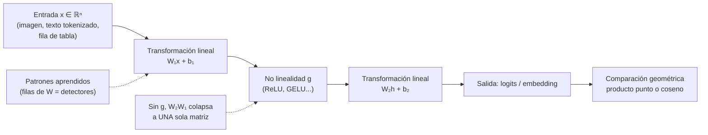

# 005 — Vectores, matrices y geometría para IA

> [← Clase anterior](../../../classes/part-00-foundations-history-and-scientific-method/004-agentes-racionales-entornos-y-medidas-de-desempeno/README.md) · [Índice de la parte](../README.md) · [Clase siguiente →](../../../classes/part-00-foundations-history-and-scientific-method/006-probabilidad-incertidumbre-y-estadistica-basica/README.md)

**Parte:** 00 — Fundamentos, historia y método científico  
**Nivel:** fundamentos · **Horas estimadas:** 4  
**Laboratorio:** `optimization` · **Estado:** `EXECUTABLE_CORE`

## 🎯 Propósito

Comprender **vectores, matrices y geometría para ia** dentro de la evolución de la inteligencia
artificial, implementar un experimento mínimo verificable y distinguir qué parte
constituye evidencia frente a una afirmación todavía no comprobada.

## 📚 Resultados de aprendizaje

Al finalizar podrás:

1. Explicar vectores, matrices y geometría para ia usando los conceptos `vectores`, `matrices`, `producto punto`, `distancia`.
2. Ejecutar el laboratorio con una semilla explícita y revisar su contrato JSON.
3. Identificar al menos un supuesto, una limitación y un riesgo de aplicación.
4. Comparar el enfoque con la etapa anterior de la ruta de aprendizaje.
5. Producir una evidencia reproducible y una conclusión que no exceda los datos.

## 🧩 Conceptos centrales

`vectores`, `matrices`, `producto punto`, `distancia`

## 🗺️ Ubicación en el mapa de la IA

El álgebra lineal es el idioma nativo de la IA moderna: datos, parámetros, activaciones y
gradientes son vectores y matrices, y casi todo modelo — de la regresión lineal al
transformer — es una composición de productos matriciales y no linealidades. Esta clase da
la base geométrica que reaparecerá en embeddings y similitud (búsqueda semántica), en
descenso de gradiente (parte de optimización) y en la mecánica de atención de los LLM.

## 📖 Fundamentos

### 📐 Vectores: tres lecturas del mismo objeto

Un vector **x** ∈ ℝⁿ admite tres interpretaciones intercambiables:

1. **Lista de números:** `x = [x₁, ..., xₙ]` — la vista del programador (array).
2. **Punto/flecha en el espacio:** la vista geométrica — dirección y magnitud.
3. **Objeto representado:** en IA, una fila de datos, una imagen aplanada, un embedding de
   palabra. La apuesta central del deep learning es que la *semántica* puede codificarse
   como *geometría*: cosas parecidas → vectores cercanos.

Operaciones básicas (componente a componente): suma `x + y`, escalado `αx`. Con ellas se
definen **combinaciones lineales** `α₁x₁ + ... + αₖxₖ`, y de ahí los conceptos de
independencia lineal, base y dimensión.

### 🎯 Producto punto, norma y ángulo

```text
producto punto:   x · y = Σᵢ xᵢ yᵢ
norma euclídea:   ‖x‖ = √(x · x)
coseno:           cos θ = (x · y) / (‖x‖ ‖y‖)
distancia:        d(x, y) = ‖x − y‖
```

El producto punto mide *alineación*: positivo si apuntan en direcciones similares, cero si
son ortogonales, negativo si se oponen. De él derivan las dos medidas de similitud
dominantes en IA: **similitud coseno** (ignora magnitud, estándar en embeddings de texto) y
**distancia euclídea** (sensible a magnitud, estándar en clustering). Una neurona artificial
computa exactamente `w · x + b`: su "detección" es un producto punto entre la entrada y un
patrón aprendido.

### 🔲 Matrices como transformaciones lineales

Una matriz A ∈ ℝᵐˣⁿ es una función lineal ℝⁿ → ℝᵐ: `y = Ax`. Leerla como transformación
(no como tabla) es el salto conceptual clave:

- Las **columnas de A** son las imágenes de los vectores de la base canónica: dicen a dónde
  va cada eje.
- La composición de transformaciones es el **producto de matrices**: `B(Ax) = (BA)x`.
  No conmuta: rotar y luego estirar ≠ estirar y luego rotar.
- Una capa densa de red neuronal es `h = g(Wx + b)`: transformación lineal W, traslación b,
  no linealidad g. Sin g, apilar capas colapsa a una sola matriz (composición de lineales
  es lineal) — por eso las activaciones no lineales son imprescindibles.

Dimensiones: `(m×n)·(n×k) → (m×k)`; el índice interior debe coincidir. La mayoría de bugs
de shape en NumPy/PyTorch son violaciones de esta regla.

### 🧭 Nociones geométricas que reaparecen en IA

- **Proyección** de x sobre u (unitario): `proj_u(x) = (x·u)u` — base de PCA y de "cuánto
  de este concepto hay en este embedding".
- **Hiperplano** `w·x + b = 0`: frontera de decisión de un clasificador lineal; w es su
  normal. Separabilidad lineal = existe un hiperplano que separa las clases (la limitación
  XOR del perceptrón es exactamente esto).
- **Maldición de la dimensionalidad:** en dimensión alta, las distancias euclídeas se
  concentran y los volúmenes se vacían; la similitud coseno y las estructuras de índice
  aproximado (ANN) existen en parte por esto.

## 🧮 Ejemplo trabajado

Similitud entre tres "documentos" representados como vectores de conteo sobre el
vocabulario `[ia, datos, fútbol]`:

```text
d₁ = [2, 3, 0]   (habla de IA y datos)
d₂ = [1, 2, 0]   (habla de IA y datos, más corto)
d₃ = [0, 1, 4]   (habla sobre todo de fútbol)
```

Paso a paso para (d₁, d₂):

```text
d₁ · d₂ = 2·1 + 3·2 + 0·0 = 8
‖d₁‖ = √(4+9+0) = √13 ≈ 3.606
‖d₂‖ = √(1+4+0) = √5  ≈ 2.236
cos(d₁,d₂) = 8 / (3.606·2.236) ≈ 8/8.062 ≈ 0.992   → casi idénticos en tema
```

Para (d₁, d₃): `d₁·d₃ = 0+3+0 = 3`, `‖d₃‖ = √17 ≈ 4.123`,
`cos ≈ 3/(3.606·4.123) ≈ 0.202` → temas distintos.

Obsérvese que la distancia euclídea `‖d₁−d₂‖ = ‖[1,1,0]‖ = √2 ≈ 1.41` es *mayor* que cero
aunque los documentos traten exactamente lo mismo: el coseno corrige la diferencia de
longitud. Este es el motivo por el que los motores de embeddings usan coseno por defecto.

## 📊 Propiedades y comparación

| Medida | Fórmula | Sensible a magnitud | Rango | Uso típico en IA |
|---|---|---|---|---|
| Producto punto | Σ xᵢyᵢ | Sí | (−∞, ∞) | Capas densas, atención (QKᵀ) |
| Similitud coseno | x·y/(‖x‖‖y‖) | No | [−1, 1] | Embeddings, búsqueda semántica |
| Distancia euclídea | ‖x−y‖ | Sí | [0, ∞) | k-means, k-NN en dimensión baja |
| Distancia Manhattan | Σ\|xᵢ−yᵢ\| | Sí | [0, ∞) | Datos dispersos, robustez a outliers |



## ⚠️ Errores conceptuales frecuentes

1. **"El producto de matrices es componente a componente."** Ese es el producto de Hadamard;
   el producto matricial estándar es composición de transformaciones (filas por columnas)
   y no conmuta.
2. **"Coseno y euclídea dan el mismo ranking."** Solo si todos los vectores tienen la misma
   norma; con normas distintas los rankings divergen (ver ejemplo trabajado).
3. **"Más capas lineales = más capacidad."** Sin no linealidad entre ellas, cualquier
   pila de capas lineales equivale a una sola transformación lineal.
4. **"La intuición de 2D/3D escala a dimensión 768."** En dimensión alta casi todos los
   vectores aleatorios son casi ortogonales y las distancias se concentran; hay que razonar
   con álgebra, no con dibujos.
5. **"Un embedding cercano implica significado idéntico."** Cercanía geométrica refleja
   coocurrencia estadística en los datos de entrenamiento; puede codificar sesgos o
   asociaciones espurias, no sinonimia garantizada.

## 🚀 Del aprendizaje a la operación

En sistemas reales, esta base se convierte en: elegir métrica de similitud y normalización
coherentes en *todo* el pipeline (indexar con coseno y consultar con euclídea es un bug
clásico de RAG); vigilar shapes y convenciones fila/columna entre bibliotecas; usar
operaciones vectorizadas (BLAS/GPU) en lugar de bucles Python — una diferencia de órdenes
de magnitud; y validar que la geometría del embedding realmente separa las clases del
dominio propio antes de construir encima.

## 🧪 Laboratorio

```bash
python lab.py
```

El laboratorio llama a `ai_evolution.labs.run_lab("optimization")`. Esta
decisión evita 183 implementaciones divergentes: cada clase tiene un entrypoint
propio, pero los motores didácticos se prueban como una biblioteca común.

### 🔍 Evidencia esperada

- tipo de laboratorio y semilla;
- entradas o decisiones observables;
- resultado estructurado;
- lista `evidence` con hechos que pueden inspeccionarse;
- lista `limitations` que impide presentar la demo como producción.

## 📓 Notebooks

- [📓 `notebook.ipynb`](notebook.ipynb): recorrido guiado con la materia resumida.
- [✍️ `notebook_student.ipynb`](notebook_student.ipynb): ejercicios para resolver.
- [✅ `notebook_solution.ipynb`](notebook_solution.ipynb): solución de referencia explicada.

## 📝 Evaluación

| Criterio | Peso |
|---|---:|
| Comprensión conceptual | 25 % |
| Ejecución reproducible | 25 % |
| Interpretación basada en evidencia | 25 % |
| Riesgos, límites y mejora propuesta | 25 % |

Consulta [assessment.md](assessment.md) para preguntas y criterio de aceptación.

## ⚠️ Errores comunes

| Síntoma | Causa probable | Corrección |
|---|---|---|
| El código corre, pero no hay conclusión | Se confundió ejecución con aprendizaje | Explica qué demuestra y qué no demuestra |
| El resultado cambia sin explicación | No se registró semilla o configuración | Conserva semilla, versión y parámetros |
| Se promete uso real | Se extrapoló desde una demo educativa | Declara entorno, datos, límites y revisión humana |
| Se copia una métrica aislada | No existe baseline ni costo de error | Añade comparación y criterio de decisión |

## ❓ Preguntas frecuentes

**¿Debo usar una API comercial?**  
No. El núcleo funciona localmente. Las extensiones LIVE se documentan por separado.

**¿El laboratorio representa una implementación industrial?**  
No por sí solo. Enseña el contrato y el patrón; producción exige integración,
seguridad, observabilidad, pruebas y operación.

**¿Dónde profundizo?**  
Revisa las especializaciones enlazadas en el README raíz y la ruta siguiente.

## 🔗 Referencias

- [Deisenroth, Faisal & Ong. *Mathematics for Machine Learning*, caps. 2-3 (PDF oficial gratuito)](https://mml-book.github.io/) — uso: referencia consultada en su fuente original
- [Goodfellow, Bengio & Courville. *Deep Learning*, cap. 2: Linear Algebra](https://www.deeplearningbook.org/) — uso: desarrollo extendido del tema
- [3Blue1Brown. *Essence of Linear Algebra* (serie visual)](https://www.3blue1brown.com/topics/linear-algebra) — uso: referencia consultada en su fuente original
- [Strang, G. MIT OCW 18.06 Linear Algebra](https://ocw.mit.edu/courses/18-06-linear-algebra-spring-2010/) — uso: referencia consultada en su fuente original
- [NumPy: documentación oficial de álgebra lineal](https://numpy.org/doc/stable/reference/routines.linalg.html) — uso: referencia consultada en su fuente original

<!-- papers:inicio -->

---

## 📜 Papers que fundamentan esta clase

> Bloque generado por `python scripts/link_papers_to_classes.py`. La fuente es [`papers/catalog/papers.json`](../../../papers/catalog/papers.json).

| Paper | Año | Qué desbloqueó | Miniatura |
|---|---:|---|---|
| [P53 · Sobre las líneas y planos de ajuste más próximo a sistemas de puntos en el espacio](../../../papers/foundational/P53_pca/README.md) | 1901 | La primera respuesta al problema de resumir una nube de puntos con menos dimensiones sin privilegiar ninguna variable. | [notebook](../../../notebooks/papers/P53_pca.ipynb) |

Cada ficha explica el problema anterior, la matemática mínima, los límites y los errores de atribución más frecuentes. Para leerlas con método: [cómo leer un paper de IA](../../../papers/guides/COMO_LEER_UN_PAPER_DE_IA.md) · [anexos matemáticos](../../../papers/annexes/README.md).
<!-- papers:fin -->
---

## ⬅️ Clase anterior

[004 — Agentes racionales, entornos y medidas de desempeño](../../part-00-foundations-history-and-scientific-method/004-agentes-racionales-entornos-y-medidas-de-desempeno/README.md)

## ➡️ Siguiente clase

[006 — Probabilidad, incertidumbre y estadística básica](../../part-00-foundations-history-and-scientific-method/006-probabilidad-incertidumbre-y-estadistica-basica/README.md)
