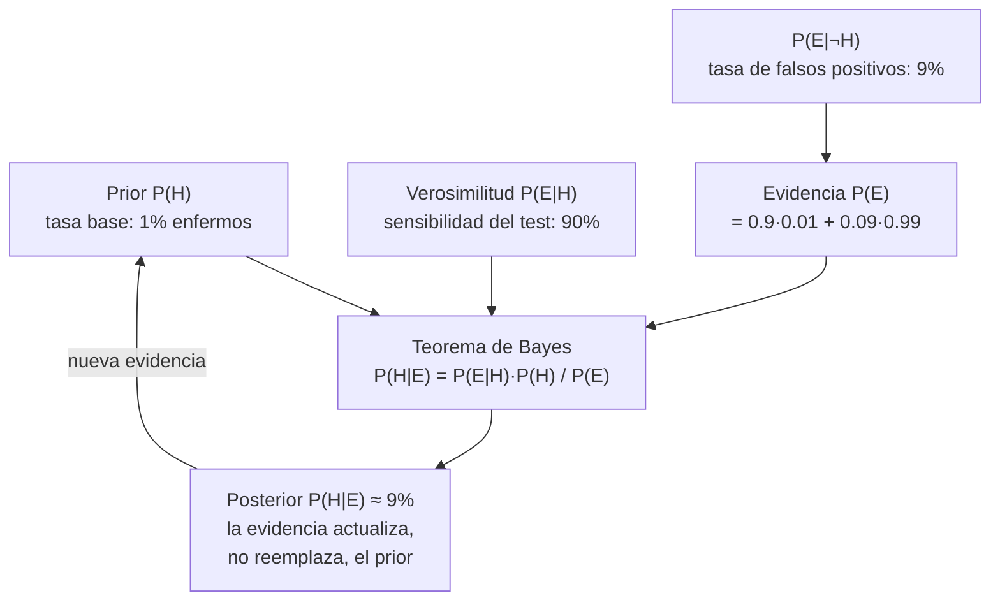

# 006 — Probabilidad, incertidumbre y estadística básica

> [← Clase anterior](../../../classes/part-00-foundations-history-and-scientific-method/005-vectores-matrices-y-geometria-para-ia/README.md) · [Índice de la parte](../README.md) · [Clase siguiente →](../../../classes/part-00-foundations-history-and-scientific-method/007-logica-algoritmos-y-complejidad-computacional/README.md)

**Parte:** 00 — Fundamentos, historia y método científico  
**Nivel:** fundamentos · **Horas estimadas:** 4  
**Laboratorio:** `probability` · **Estado:** `EXECUTABLE_CORE`

## 🎯 Propósito

Comprender **probabilidad, incertidumbre y estadística básica** dentro de la evolución de la inteligencia
artificial, implementar un experimento mínimo verificable y distinguir qué parte
constituye evidencia frente a una afirmación todavía no comprobada.

## 📚 Resultados de aprendizaje

Al finalizar podrás:

1. Explicar probabilidad, incertidumbre y estadística básica usando los conceptos `probabilidad`, `Bayes`, `distribuciones`, `incertidumbre`.
2. Ejecutar el laboratorio con una semilla explícita y revisar su contrato JSON.
3. Identificar al menos un supuesto, una limitación y un riesgo de aplicación.
4. Comparar el enfoque con la etapa anterior de la ruta de aprendizaje.
5. Producir una evidencia reproducible y una conclusión que no exceda los datos.

## 🧩 Conceptos centrales

`probabilidad`, `Bayes`, `distribuciones`, `incertidumbre`

## 🗺️ Ubicación en el mapa de la IA

La probabilidad es el cálculo de la incertidumbre, y la IA opera casi siempre bajo
incertidumbre: sensores ruidosos, datos incompletos, mundos parcialmente observables. El
giro probabilístico de los años 90 (redes bayesianas, métodos estadísticos) sacó al campo
de su segundo invierno, y hoy todo clasificador emite probabilidades y todo LLM es,
literalmente, una distribución de probabilidad sobre el siguiente token. Esta clase da el
mínimo necesario para las partes de machine learning y para leer métricas con honestidad.

## 📖 Fundamentos

### 🎲 Axiomas y vocabulario

Una probabilidad asigna a cada evento A un número P(A) que cumple (Kolmogórov):

```text
1. P(A) ≥ 0
2. P(Ω) = 1              (algo del espacio muestral ocurre)
3. P(A ∪ B) = P(A) + P(B)   si A y B son disjuntos
```

De ahí: P(¬A) = 1 − P(A), y la **regla de la suma general**
P(A∪B) = P(A) + P(B) − P(A∩B). Dos lecturas filosóficas conviven: frecuentista
(límite de frecuencias relativas) y bayesiana (grado de creencia coherente); en la práctica
de IA se usan ambas según convenga al problema.

### 🔗 Probabilidad condicional e independencia

```text
P(A|B) = P(A∩B) / P(B)          (probabilidad de A sabiendo que ocurrió B)
regla del producto:  P(A∩B) = P(A|B) P(B)
independencia:       P(A∩B) = P(A) P(B)   ⇔   P(A|B) = P(A)
```

Condicionar es *actualizar el universo*: al saber B, el espacio muestral se reduce a B.
La independencia es un supuesto de modelado, no un hecho por defecto: asumirla donde no
existe (p. ej., entre features correlacionadas) es una fuente clásica de modelos
sobreconfiados.

### 🔄 Teorema de Bayes

```text
P(H|E) = P(E|H) · P(H) / P(E)

posterior = verosimilitud × prior / evidencia
```

Bayes invierte la dirección del condicional: de "probabilidad de la evidencia dada la
hipótesis" (que el modelo o el test médico conocen) a "probabilidad de la hipótesis dada la
evidencia" (que es lo que uno quiere). P(E) se expande por probabilidad total:
`P(E) = P(E|H)P(H) + P(E|¬H)P(¬H)`. Es el fundamento de los clasificadores naive Bayes,
del filtrado de spam, de la inferencia en redes bayesianas y del razonamiento diagnóstico.

### 📊 Variables aleatorias, esperanza y varianza

Una variable aleatoria X asigna números a resultados. Sus resúmenes centrales:

```text
esperanza:  E[X] = Σ x · P(X=x)          (media ponderada por probabilidad)
varianza:   Var(X) = E[(X − E[X])²]      (dispersión alrededor de la media)
desviación estándar: σ = √Var(X)
```

Distribuciones que hay que reconocer: **Bernoulli** (un ensayo sí/no), **binomial** (número
de éxitos en n ensayos), **uniforme**, **normal/gaussiana** (suma de muchos efectos
pequeños independientes — teorema central del límite). La **ley de los grandes números**
garantiza que el promedio muestral converge a E[X]: es la licencia matemática para estimar
probabilidades simulando (método Monte Carlo), que es exactamente lo que hace el laboratorio
de esta clase con una semilla fija.

### ⚠️ Estadística mínima para leer resultados

- Un **estimador** calculado sobre una muestra tiene **error muestral**: reportar una
  métrica sin tamaño de muestra ni intervalo es reportar ruido potencial.
- **Correlación no es causalidad:** dos variables pueden covariar por una causa común o
  por azar (con suficientes comparaciones, el azar *garantiza* correlaciones espurias).
- La media es sensible a outliers; la mediana no. Elegir el resumen según la distribución.

## 🧮 Ejemplo trabajado

El clásico problema del test diagnóstico, que casi todo el mundo responde mal la primera vez.
Una enfermedad afecta al 1 % de la población. El test detecta al 90 % de los enfermos
(sensibilidad) y da falso positivo en el 9 % de los sanos. Si una persona da positivo,
¿cuál es la probabilidad de que esté enferma?

Con 10 000 personas, en números enteros:

```text
Enfermos:  100   → positivos verdaderos: 100 × 0.90 =  90
Sanos:    9900   → falsos positivos:    9900 × 0.09 = 891

P(enfermo | positivo) = 90 / (90 + 891) = 90/981 ≈ 0.092  →  ~9 %
```

Por Bayes directamente: P(H|E) = (0.90 · 0.01) / (0.90·0.01 + 0.09·0.99)
= 0.009/0.0981 ≈ **0.092**. La intuición dice "90 %"; la respuesta correcta es ~9 %,
porque el **prior** (1 %) domina: hay muchos más sanos que pueden dar falso positivo que
enfermos que den verdadero positivo. Moraleja directa para IA: un clasificador "90 %
preciso" sobre una clase rara produce mayoritariamente falsas alarmas — por eso exigimos
precisión/recall y no solo accuracy.

## 📊 Propiedades y comparación

| Concepto | Qué responde | Trampa típica |
|---|---|---|
| P(A) | Frecuencia/creencia marginal | Ignorar que depende de la población de referencia |
| P(A\|B) | Creencia actualizada por evidencia | Confundir P(A\|B) con P(B\|A) (falacia del fiscal) |
| Bayes | Invierte el condicional con el prior | Omitir el prior (ignorar la tasa base) |
| E[X] | Valor promedio a largo plazo | Usarla con distribuciones sin media estable o con outliers |
| Var(X) | Dispersión esperada | Reportar medias sin dispersión ni n |
| Monte Carlo | Estima E[X] simulando | Olvidar la semilla → resultados irreproducibles |



## ⚠️ Errores conceptuales frecuentes

1. **Confundir P(A|B) con P(B|A).** "El 90 % de los enfermos da positivo" no implica "el
   90 % de los positivos está enfermo" — la diferencia la pone el prior (ver ejemplo).
2. **Ignorar la tasa base.** Evaluar un detector de fraude, spam o enfermedad rara por su
   accuracy global: un modelo que dice siempre "no" acierta 99 % y es inútil.
3. **"Independiente" como valor por defecto.** Multiplicar probabilidades solo es válido
   bajo independencia; features de un mismo individuo raramente lo son.
4. **Tratar la probabilidad del modelo como calibrada.** Que un softmax diga 0.97 no
   significa que el modelo acierte el 97 % de las veces que dice 0.97; la calibración se
   mide, no se asume.
5. **Confundir significancia con importancia.** Con n enorme, diferencias triviales se
   vuelven "significativas"; con n pequeño, efectos reales quedan invisibles. Siempre
   reportar tamaño de efecto y n.

## 🚀 Del aprendizaje a la operación

En producción este material se convierte en: medir la **calibración** de las probabilidades
del modelo (reliability diagrams, ECE) antes de usarlas para decidir; fijar umbrales de
decisión según costos asimétricos de falso positivo/negativo, no en 0.5 por defecto;
monitorear el cambio del prior en el tiempo (la tasa base de fraude de ayer no es la de
mañana); y acompañar toda métrica reportada de su n, su intervalo y la semilla del
experimento que la produjo.

## 🧪 Laboratorio

```bash
python lab.py
```

El laboratorio llama a `ai_evolution.labs.run_lab("probability")`. Esta
decisión evita 183 implementaciones divergentes: cada clase tiene un entrypoint
propio, pero los motores didácticos se prueban como una biblioteca común.

### 🔍 Evidencia esperada

- tipo de laboratorio y semilla;
- entradas o decisiones observables;
- resultado estructurado;
- lista `evidence` con hechos que pueden inspeccionarse;
- lista `limitations` que impide presentar la demo como producción.

## 📓 Notebooks

- [📓 `notebook.ipynb`](notebook.ipynb): recorrido guiado con la materia resumida.
- [✍️ `notebook_student.ipynb`](notebook_student.ipynb): ejercicios para resolver.
- [✅ `notebook_solution.ipynb`](notebook_solution.ipynb): solución de referencia explicada.

## 📝 Evaluación

| Criterio | Peso |
|---|---:|
| Comprensión conceptual | 25 % |
| Ejecución reproducible | 25 % |
| Interpretación basada en evidencia | 25 % |
| Riesgos, límites y mejora propuesta | 25 % |

Consulta [assessment.md](assessment.md) para preguntas y criterio de aceptación.

## ⚠️ Errores comunes

| Síntoma | Causa probable | Corrección |
|---|---|---|
| El código corre, pero no hay conclusión | Se confundió ejecución con aprendizaje | Explica qué demuestra y qué no demuestra |
| El resultado cambia sin explicación | No se registró semilla o configuración | Conserva semilla, versión y parámetros |
| Se promete uso real | Se extrapoló desde una demo educativa | Declara entorno, datos, límites y revisión humana |
| Se copia una métrica aislada | No existe baseline ni costo de error | Añade comparación y criterio de decisión |

## ❓ Preguntas frecuentes

**¿Debo usar una API comercial?**  
No. El núcleo funciona localmente. Las extensiones LIVE se documentan por separado.

**¿El laboratorio representa una implementación industrial?**  
No por sí solo. Enseña el contrato y el patrón; producción exige integración,
seguridad, observabilidad, pruebas y operación.

**¿Dónde profundizo?**  
Revisa las especializaciones enlazadas en el README raíz y la ruta siguiente.

## 🔗 Referencias

- [Russell, S. & Norvig, P. *AIMA*, 4.ª ed., caps. 12-13 (quantifying uncertainty)](https://aima.cs.berkeley.edu/)
- [Deisenroth, Faisal & Ong. *Mathematics for Machine Learning*, cap. 6 (PDF oficial gratuito)](https://mml-book.github.io/)
- [Goodfellow, Bengio & Courville. *Deep Learning*, cap. 3: Probability and Information Theory](https://www.deeplearningbook.org/)
- [Seeing Theory — visualizaciones interactivas de probabilidad (Brown University)](https://seeing-theory.brown.edu/)
- [Ioannidis, J. (2005). Why Most Published Research Findings Are False. *PLoS Medicine*](https://doi.org/10.1371/journal.pmed.0020124)

<!-- papers:inicio -->

---

## 📜 Papers que fundamentan esta clase

> Bloque generado por `python scripts/link_papers_to_classes.py`. La fuente es [`papers/catalog/papers.json`](../../../papers/catalog/papers.json).

| Paper | Año | Qué desbloqueó | Miniatura |
|---|---:|---|---|
| [P55 · Una teoría matemática de la comunicación](../../../papers/foundational/P55_shannon/README.md) | 1948 | Define la información como reducción de incertidumbre y le pone unidad, cota y límite: el bit, la entropía y la capacidad del canal. | [notebook](../../../notebooks/papers/P55_shannon.ipynb) |

Cada ficha explica el problema anterior, la matemática mínima, los límites y los errores de atribución más frecuentes. Para leerlas con método: [cómo leer un paper de IA](../../../papers/guides/COMO_LEER_UN_PAPER_DE_IA.md) · [anexos matemáticos](../../../papers/annexes/README.md).
<!-- papers:fin -->
---

## ⬅️ Clase anterior

[005 — Vectores, matrices y geometría para IA](../../part-00-foundations-history-and-scientific-method/005-vectores-matrices-y-geometria-para-ia/README.md)

## ➡️ Siguiente clase

[007 — Lógica, algoritmos y complejidad computacional](../../part-00-foundations-history-and-scientific-method/007-logica-algoritmos-y-complejidad-computacional/README.md)
