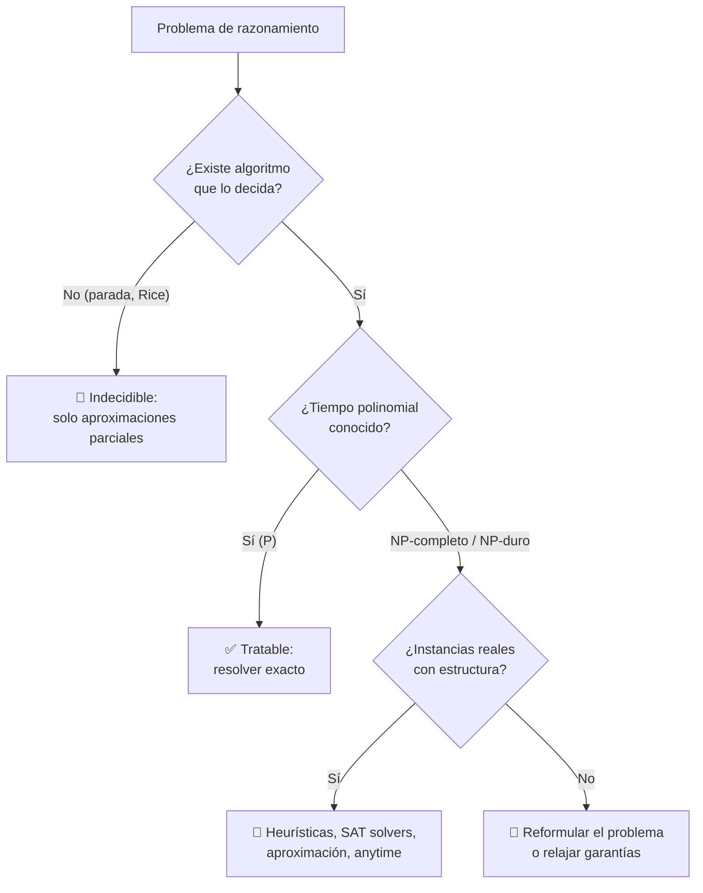

# 007 — Lógica, algoritmos y complejidad computacional

> [← Clase anterior](../../../classes/part-00-foundations-history-and-scientific-method/006-probabilidad-incertidumbre-y-estadistica-basica/README.md) · [Índice de la parte](../README.md) · [Clase siguiente →](../../../classes/part-00-foundations-history-and-scientific-method/008-datos-evidencia-hipotesis-y-falsabilidad/README.md)

**Parte:** 00 — Fundamentos, historia y método científico  
**Nivel:** fundamentos · **Horas estimadas:** 4  
**Laboratorio:** `logic` · **Estado:** `EXECUTABLE_CORE`

## 🎯 Propósito

Comprender **lógica, algoritmos y complejidad computacional** dentro de la evolución de la inteligencia
artificial, implementar un experimento mínimo verificable y distinguir qué parte
constituye evidencia frente a una afirmación todavía no comprobada.

## 📚 Resultados de aprendizaje

Al finalizar podrás:

1. Explicar lógica, algoritmos y complejidad computacional usando los conceptos `lógica`, `algoritmos`, `complejidad`, `decidibilidad`.
2. Ejecutar el laboratorio con una semilla explícita y revisar su contrato JSON.
3. Identificar al menos un supuesto, una limitación y un riesgo de aplicación.
4. Comparar el enfoque con la etapa anterior de la ruta de aprendizaje.
5. Producir una evidencia reproducible y una conclusión que no exceda los datos.

## 🧩 Conceptos centrales

`lógica`, `algoritmos`, `complejidad`, `decidibilidad`

## 🗺️ Ubicación en el mapa de la IA

La lógica fue el primer lenguaje de la IA (el Logic Theorist de 1956 demostraba teoremas), y
la teoría de la complejidad explica por qué esa primera IA chocó contra un muro: muchos
problemas de razonamiento son intratables en el peor caso — la "explosión combinatoria" que
diagnosticó el informe Lighthill. Esta clase da los tres instrumentos para razonar sobre
límites: lógica formal (qué se puede expresar), análisis de algoritmos (cuánto cuesta) y
computabilidad (qué es imposible), fundamentos de la parte de búsqueda y de todo el programa.

## 📖 Fundamentos

### 🔣 Lógica proposicional: sintaxis y semántica

La lógica proposicional maneja proposiciones atómicas (p, q) y conectivos
(¬, ∧, ∨, →, ↔). Conceptos clave:

- **Modelo:** una asignación de verdad a cada átomo. Con n átomos hay 2ⁿ modelos.
- **Consecuencia lógica (KB ⊨ α):** α es verdadera en *todos* los modelos donde KB es
  verdadera. Verificarlo por tabla de verdad cuesta O(2ⁿ) — primera aparición del muro
  exponencial.
- **Inferencia:** procedimientos como *modus ponens* (de `p` y `p→q`, concluir `q`) y
  resolución. Un sistema de inferencia útil debe ser **correcto** (solo deriva consecuencias
  verdaderas) y ojalá **completo** (deriva todas).
- **SAT:** decidir si una fórmula tiene algún modelo que la haga verdadera. Es el problema
  NP-completo canónico (Cook, 1971) y, a la vez, la base de solvers industriales que
  resuelven instancias enormes en la práctica.

La lógica de primer orden añade objetos, relaciones y cuantificadores (∀, ∃); gana
expresividad y pierde decidibilidad: la consecuencia lógica es solo semidecidible.

### ⏱️ Algoritmos y notación asintótica

Un algoritmo es un procedimiento finito, definido y efectivo. Su costo se describe con
notación asintótica sobre el tamaño de entrada n:

```text
O(g)  : cota superior     ("no crece más rápido que g")
Ω(g)  : cota inferior
Θ(g)  : cota ajustada     (superior e inferior a la vez)
```

Jerarquía de crecimiento que hay que tener interiorizada:

```text
O(1) < O(log n) < O(n) < O(n log n) < O(n²) < O(n³) < O(2ⁿ) < O(n!)
```

La frontera práctica está entre polinomial y exponencial: duplicar la velocidad del hardware
suma una constante al tamaño tratable de un problema exponencial (2ⁿ), mientras que
multiplica el de uno lineal. Ningún hardware rescata a un algoritmo exponencial.

### 🧩 P, NP y NP-completitud

- **P:** problemas de decisión resolubles en tiempo polinomial.
- **NP:** problemas cuya solución propuesta es *verificable* en tiempo polinomial.
- **NP-completo:** los más difíciles de NP; todo problema de NP se reduce a ellos en tiempo
  polinomial. SAT fue el primero (teorema de Cook-Levin, 1971); planificación, muchos
  problemas de scheduling y variantes de inferencia en IA son NP-duros.
- Si P = NP se desconoce (problema del milenio); la evidencia práctica sugiere P ≠ NP.

Consecuencia para IA: la intratabilidad del peor caso no prohíbe resolver *instancias
reales* — heurísticas, aproximaciones y solvers SAT/SMT modernos lo hacen a diario — pero
obliga a renunciar a garantías universales de optimalidad o tiempo.

### 🛑 Computabilidad: lo imposible, no solo lo caro

Por encima de "caro" está "imposible": Turing (1936) demostró que el **problema de la
parada** (¿este programa termina con esta entrada?) es **indecidible** — no existe algoritmo
que lo responda para todos los casos. Del teorema de Rice se sigue que toda propiedad
semántica no trivial de programas es indecidible. Esto acota lo que cualquier IA puede
hacer: verificar comportamiento arbitrario de software, garantizar ausencia total de
errores o predecir su propia conducta en general son problemas sin solución algorítmica
exacta y universal.

## 🧮 Ejemplo trabajado

**Parte A — inferencia proposicional.** KB = {p→q, q→r, p}. ¿KB ⊨ r?

```text
1. p          (hecho)
2. p → q      (regla)      ⇒ modus ponens: q
3. q → r      (regla)      ⇒ modus ponens: r        ∎  KB ⊨ r
```

Verificación semántica: en toda asignación donde p=V, p→q=V y q→r=V, forzosamente q=V y
r=V. Con 3 átomos habría 2³=8 modelos que revisar por tabla; el encadenamiento llegó en 2
pasos — la inferencia sintáctica evita enumerar modelos.

**Parte B — el muro exponencial en números.** Un solver ingenuo de SAT prueba las 2ⁿ
asignaciones, a 10⁹ asignaciones/segundo:

| n átomos | 2ⁿ | Tiempo |
|---|---|---|
| 20 | ~10⁶ | 1 ms |
| 40 | ~10¹² | 18 minutos |
| 60 | ~10¹⁸ | 36 años |
| 80 | ~10²⁴ | 38 millones de años |

Sumar 20 variables multiplica el tiempo por un millón. Esta tabla *es* la explosión
combinatoria de Lighthill (clase 003) y la razón de ser de las heurísticas (parte 01).

## 📊 Propiedades y comparación

| Formalismo / clase | Expresividad | Decidible | Costo típico | Uso en IA |
|---|---|---|---|---|
| Lógica proposicional | Baja (hechos atómicos) | Sí | SAT: NP-completo | Solvers, verificación, planificación |
| Lógica de primer orden | Alta (objetos, relaciones) | Semidecidible | Sin cota general | Representación de conocimiento |
| P (polinomial) | — | Sí | n, n log n, n² | Grafos, ordenación, inferencia acotada |
| NP-completo | — | Sí (caro) | Exponencial en el peor caso | SAT, planificación, scheduling |
| Indecidible | — | No | ∞ | Límite absoluto (parada, Rice) |



## ⚠️ Errores conceptuales frecuentes

1. **"NP significa 'no polinomial'."** NP = *verificable* en tiempo polinomial
   (nondeterministic polynomial). P ⊆ NP, y si P=NP todo NP sería polinomial.
2. **"NP-completo = imposible en la práctica."** SAT solvers modernos resuelven instancias
   industriales con millones de variables; la dureza es del *peor caso*, no de toda instancia.
3. **"Con más hardware/nube desaparece el problema exponencial."** Duplicar cómputo suma
   ~1 al n tratable de 2ⁿ; el crecimiento exponencial devora cualquier constante.
4. **"La indecidibilidad es lo mismo que la intratabilidad."** Intratable = caro pero
   computable; indecidible = no existe algoritmo, con cualquier recurso, para todos los casos.
5. **"O(g) describe el caso típico."** Es una cota superior asintótica del peor caso salvo
   que se diga otra cosa; quicksort es O(n²) en el peor caso y Θ(n log n) en promedio.

## 🚀 Del aprendizaje a la operación

Profesionalmente, esto se traduce en: clasificar el problema antes de codificar (¿es
polinomial, NP-duro, indecidible?) porque el veredicto decide entre solución exacta,
heurística o rediseño; presupuestar el crecimiento de la entrada (lo que funciona con
n=10³ puede morir con n=10⁶); usar solvers maduros (SAT/SMT/MILP) en lugar de búsqueda
artesanal; y desconfiar por principio de cualquier herramienta que prometa verificar
propiedades semánticas arbitrarias de programas — el teorema de Rice ya dictó sentencia.

## 🧪 Laboratorio

```bash
python lab.py
```

El laboratorio llama a `ai_evolution.labs.run_lab("logic")`. Esta
decisión evita 183 implementaciones divergentes: cada clase tiene un entrypoint
propio, pero los motores didácticos se prueban como una biblioteca común.

### 🔍 Evidencia esperada

- tipo de laboratorio y semilla;
- entradas o decisiones observables;
- resultado estructurado;
- lista `evidence` con hechos que pueden inspeccionarse;
- lista `limitations` que impide presentar la demo como producción.

## 📓 Notebooks

- [📓 `notebook.ipynb`](notebook.ipynb): recorrido guiado con la materia resumida.
- [✍️ `notebook_student.ipynb`](notebook_student.ipynb): ejercicios para resolver.
- [✅ `notebook_solution.ipynb`](notebook_solution.ipynb): solución de referencia explicada.

## 📝 Evaluación

| Criterio | Peso |
|---|---:|
| Comprensión conceptual | 25 % |
| Ejecución reproducible | 25 % |
| Interpretación basada en evidencia | 25 % |
| Riesgos, límites y mejora propuesta | 25 % |

Consulta [assessment.md](assessment.md) para preguntas y criterio de aceptación.

## ⚠️ Errores comunes

| Síntoma | Causa probable | Corrección |
|---|---|---|
| El código corre, pero no hay conclusión | Se confundió ejecución con aprendizaje | Explica qué demuestra y qué no demuestra |
| El resultado cambia sin explicación | No se registró semilla o configuración | Conserva semilla, versión y parámetros |
| Se promete uso real | Se extrapoló desde una demo educativa | Declara entorno, datos, límites y revisión humana |
| Se copia una métrica aislada | No existe baseline ni costo de error | Añade comparación y criterio de decisión |

## ❓ Preguntas frecuentes

**¿Debo usar una API comercial?**  
No. El núcleo funciona localmente. Las extensiones LIVE se documentan por separado.

**¿El laboratorio representa una implementación industrial?**  
No por sí solo. Enseña el contrato y el patrón; producción exige integración,
seguridad, observabilidad, pruebas y operación.

**¿Dónde profundizo?**  
Revisa las especializaciones enlazadas en el README raíz y la ruta siguiente.

## 🔗 Referencias

- [Turing, A. M. (1936). On Computable Numbers, with an Application to the Entscheidungsproblem](https://doi.org/10.1112/plms/s2-42.1.230)
- [Cook, S. (1971). The Complexity of Theorem-Proving Procedures (SAT es NP-completo)](https://doi.org/10.1145/800157.805047)
- [Russell, S. & Norvig, P. *AIMA*, 4.ª ed., caps. 7-8 (agentes lógicos) y apéndice A (complejidad)](https://aima.cs.berkeley.edu/)
- [Clay Mathematics Institute. P vs NP (problema del milenio)](https://www.claymath.org/millennium/p-vs-np/)
- [Nilsson, N. (2010). *The Quest for Artificial Intelligence*, caps. sobre razonamiento lógico (PDF oficial)](https://ai.stanford.edu/~nilsson/QAI/qai.pdf)

<!-- papers:inicio -->

---

## 📜 Papers que fundamentan esta clase

> Bloque generado por `python scripts/link_papers_to_classes.py`. La fuente es [`papers/catalog/papers.json`](../../../papers/catalog/papers.json).

| Paper | Año | Qué desbloqueó | Miniatura |
|---|---:|---|---|
| [P54 · Un cálculo lógico de las ideas inmanentes en la actividad nerviosa](../../../papers/foundational/P54_mcculloch_pitts/README.md) | 1943 | Establece que una red de neuronas de umbral puede calcular cualquier función lógica: el puente entre biología y computación. | [notebook](../../../notebooks/papers/P54_mcculloch_pitts.ipynb) |
| [P58 · La informática como indagación empírica: símbolos y búsqueda](../../../papers/foundational/P58_simbolos_y_busqueda/README.md) | 1976 | Enuncia las dos hipótesis que resumen veinte años de IA simbólica: el sistema de símbolos físicos y la búsqueda heurística. | [notebook](../../../notebooks/papers/P58_simbolos_y_busqueda.ipynb) |

Cada ficha explica el problema anterior, la matemática mínima, los límites y los errores de atribución más frecuentes. Para leerlas con método: [cómo leer un paper de IA](../../../papers/guides/COMO_LEER_UN_PAPER_DE_IA.md) · [anexos matemáticos](../../../papers/annexes/README.md).
<!-- papers:fin -->
---

## ⬅️ Clase anterior

[006 — Probabilidad, incertidumbre y estadística básica](../../part-00-foundations-history-and-scientific-method/006-probabilidad-incertidumbre-y-estadistica-basica/README.md)

## ➡️ Siguiente clase

[008 — Datos, evidencia, hipótesis y falsabilidad](../../part-00-foundations-history-and-scientific-method/008-datos-evidencia-hipotesis-y-falsabilidad/README.md)
