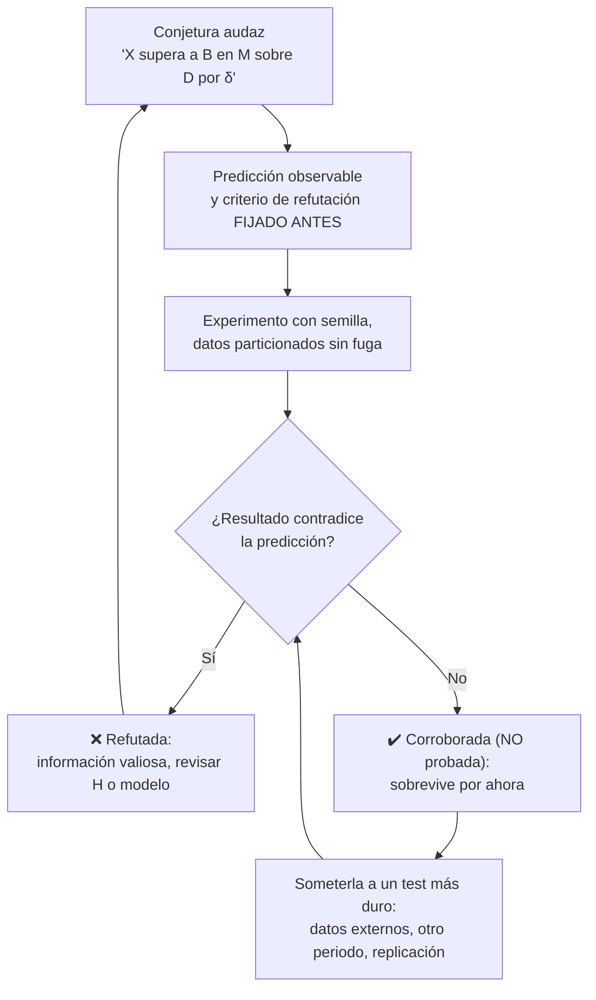

# Teoría — Datos, evidencia, hipótesis y falsabilidad

## 🗺️ Ubicación en el mapa de la IA

La IA es una disciplina empírica: sus afirmaciones ("este modelo es mejor", "esta técnica
generaliza") se sostienen o caen con experimentos. Esta clase importa el criterio de
demarcación de Popper — falsabilidad — al trabajo con modelos y datos, y es el fundamento
metodológico de los entornos reproducibles (clase 009), de la lectura crítica de papers
(clase 010) y de cada laboratorio del programa, cuyo contrato JSON separa explícitamente
`evidence` de `limitations`.

## 📖 Fundamentos

### 🔍 Falsabilidad como criterio de demarcación

Para Popper, una hipótesis es **científica** si y solo si existe alguna observación posible
que la refutaría. "Este modelo alcanza ≥ 0.85 de F1 en datos de 2025 no vistos" es
falsable; "este modelo entiende el lenguaje" no lo es hasta que se traduzca a predicciones
observables. Dos consecuencias operativas:

- La ciencia avanza por **conjeturas y refutaciones**: proponer hipótesis audaces y
  someterlas a los tests más duros disponibles, no buscar confirmaciones.
- Ninguna cantidad de confirmaciones *demuestra* una hipótesis universal (problema de la
  inducción de Hume); una sola refutación sólida la derriba. La asimetría es el motor.

### 🧪 De la pregunta al experimento

Estructura mínima de una hipótesis experimental en IA:

```text
H: "El sistema/técnica X supera al baseline B en la métrica M
    sobre la población de datos D, por al menos δ."

Falsable porque: si M(X) − M(B) < δ en una muestra representativa de D,  H queda refutada.
```

Cada componente es obligatorio: sin baseline B no hay comparación; sin población D definida
no se sabe a qué generaliza; sin margen δ cualquier diferencia de ruido "confirma"; sin
métrica M fijada *antes* de mirar los resultados, se cae en la selección post-hoc.

### 📊 Jerarquía de la evidencia en IA

No toda evidencia pesa igual. De más débil a más fuerte:

1. **Anécdota / demo:** un ejemplo elegido a mano. Sirve para ilustrar, no para concluir.
2. **Evaluación en muestra de entrenamiento:** inválida — memorizar no es generalizar.
3. **Held-out interno:** partición de test del mismo dataset. Mínimo aceptable; vulnerable
   a fuga de información (*leakage*) y a sobreajuste al benchmark.
4. **Datos externos / fuera de distribución:** otra fuente, otro periodo temporal.
5. **Replicación independiente:** otro equipo, otro código, mismos resultados. El patrón
   oro; su escasez en ML es la "crisis de reproducibilidad" documentada por Kapoor y
   Narayanan (2023), que hallaron leakage en cientos de papers aplicados.

### 🕳️ Patologías del razonamiento con datos

- **Fuga de datos (leakage):** información del test contamina el entrenamiento (duplicados,
  features derivadas del futuro, normalizar antes de particionar). Produce métricas
  ficticiamente altas que colapsan en producción.
- **p-hacking / garden of forking paths:** probar configuraciones hasta que una "funciona"
  y reportar solo esa. Con 20 variantes y α=0.05, se espera un falso positivo por puro azar.
- **HARKing** (*Hypothesizing After Results are Known*): presentar un hallazgo exploratorio
  como si fuera la hipótesis original. Legítimo como exploración, fraudulento como
  confirmación.
- **Sesgo de supervivencia y de publicación:** solo se publican los experimentos que
  salieron bien; el registro público sobreestima sistemáticamente el efecto real
  (Ioannidis, 2005).
- **Goodhart:** cuando la métrica se vuelve objetivo, deja de medir lo que medía —
  sobreajuste comunitario a benchmarks públicos incluido.

### ✅ Contrato de evidencia del programa

Cada laboratorio de este repositorio emite un JSON con `seed`, `evidence` y `limitations`.
Es una implementación en miniatura del criterio popperiano: la evidencia es inspeccionable
y reproducible (misma semilla → mismo resultado), y las limitaciones declaran de antemano
dónde la conclusión deja de valer — el equivalente a especificar qué observación refutaría
el claim.

## 🧮 Ejemplo trabajado

Un equipo afirma: "nuestro clasificador de fraude tiene accuracy 0.99". Auditemos con
números. El dataset tiene 100 000 transacciones, 1 000 fraudulentas (1 %).

```text
Modelo trivial "nunca es fraude":  acierta 99 000 / 100 000 = 0.99 de accuracy
                                   recall sobre fraude = 0/1000 = 0.0
```

El claim es literalmente cierto y prácticamente vacío: no supera al baseline trivial.
Reformulación falsable correcta:

```text
H: "El modelo alcanza recall ≥ 0.70 con precisión ≥ 0.80 sobre transacciones
    de un mes posterior al periodo de entrenamiento (validación temporal)."
```

Supongamos que en ese mes hay 900 fraudes y el modelo marca 950 transacciones, de las
cuales 720 son fraude real: precisión = 720/950 ≈ 0.758 → **H queda refutada** (0.758 <
0.80) aunque recall = 720/900 = 0.80 cumpla. La refutación es informativa: dice exactamente
qué mejorar y evita desplegar un sistema que generaría ~230 falsas alarmas mensuales.

## 📊 Propiedades y comparación

| Nivel de evidencia | Ejemplo | ¿Falsable? | Riesgo principal |
|---|---|---|---|
| Demo elegida a mano | "Mira cómo responde bien" | No | Cherry-picking |
| Métrica en entrenamiento | acc=0.99 (train) | Sí, pero irrelevante | Memorización |
| Held-out interno | acc en test split | Sí | Leakage, sobreajuste al benchmark |
| Validación temporal/externa | Datos de otro periodo | Sí | Deriva de distribución (informativa) |
| Replicación independiente | Otro equipo reproduce | Sí | Costo; escasez de incentivos |



## ⚠️ Errores conceptuales frecuentes

1. **"Los datos hablan por sí mismos."** Los datos solo responden preguntas bien planteadas;
   sin hipótesis previa, cualquier patrón encontrado puede ser ruido con buena prensa.
2. **"Mi hipótesis fue confirmada, luego es verdadera."** La corroboración no es prueba;
   solo indica que la hipótesis sobrevivió a *ese* test. La confianza se gana con tests
   progresivamente más duros.
3. **"Más accuracy = mejor modelo."** Sin baseline, tasa base, métrica apropiada al costo
   de error y población definida, la cifra no significa nada (ver ejemplo trabajado).
4. **"Explorar datos está mal."** La exploración es legítima y necesaria; el error es
   disfrazar hallazgos exploratorios de confirmaciones (HARKing). La solución es declarar
   qué fue exploratorio y validar en datos frescos.
5. **"La reproducibilidad es burocracia."** Es la condición mínima para que un resultado
   sea evidencia y no anécdota: sin semilla, versión y datos fijados, ni siquiera el propio
   autor puede verificar su claim.

## 🚀 Del aprendizaje a la operación

En un flujo profesional esto se institucionaliza: hipótesis y métrica de éxito escritas
*antes* del experimento (pre-registro interno); particiones temporales y auditoría de
leakage como paso obligatorio del pipeline; un registro de experimentos fallidos (los
silencios sesgan tanto como los éxitos); y monitoreo post-despliegue que trata cada
predicción en producción como un test continuo de la hipótesis del modelo — con criterios
de rollback definidos de antemano.

## 🔗 Referencias

- [Popper, K. — entrada en la Stanford Encyclopedia of Philosophy (falsabilidad y demarcación)](https://plato.stanford.edu/entries/popper/)
- [Ioannidis, J. (2005). Why Most Published Research Findings Are False. *PLoS Medicine*](https://doi.org/10.1371/journal.pmed.0020124)
- [Kapoor, S. & Narayanan, A. (2023). Leakage and the Reproducibility Crisis in ML-based Science](https://arxiv.org/abs/2207.07048)
- [Sandve et al. (2013). Ten Simple Rules for Reproducible Computational Research. *PLoS Comp Bio*](https://doi.org/10.1371/journal.pcbi.1003285)
- [Pineau et al. (2021). Improving Reproducibility in Machine Learning Research](https://arxiv.org/abs/2003.12206)

---

> [⬅️ Volver a la clase](README.md) · [📝 Evaluación](assessment.md) · [📚 Índice de la parte](../README.md)
