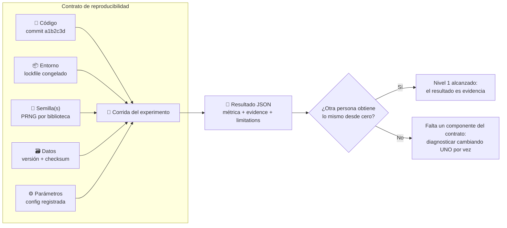

# 009 — Entornos Python, Git y experimentos reproducibles

> [← Clase anterior](../../../classes/part-00-foundations-history-and-scientific-method/008-datos-evidencia-hipotesis-y-falsabilidad/README.md) · [Índice de la parte](../README.md) · [Clase siguiente →](../../../classes/part-00-foundations-history-and-scientific-method/010-como-leer-papers-benchmarks-y-claims-de-ia/README.md)

**Parte:** 00 — Fundamentos, historia y método científico  
**Nivel:** fundamentos · **Horas estimadas:** 4  
**Laboratorio:** `observability` · **Estado:** `EXECUTABLE_CORE`

## 🎯 Propósito

Comprender **entornos python, git y experimentos reproducibles** dentro de la evolución de la inteligencia
artificial, implementar un experimento mínimo verificable y distinguir qué parte
constituye evidencia frente a una afirmación todavía no comprobada.

## 📚 Resultados de aprendizaje

Al finalizar podrás:

1. Explicar entornos python, git y experimentos reproducibles usando los conceptos `Python`, `Git`, `semillas`, `entornos`.
2. Ejecutar el laboratorio con una semilla explícita y revisar su contrato JSON.
3. Identificar al menos un supuesto, una limitación y un riesgo de aplicación.
4. Comparar el enfoque con la etapa anterior de la ruta de aprendizaje.
5. Producir una evidencia reproducible y una conclusión que no exceda los datos.

## 🧩 Conceptos centrales

`Python`, `Git`, `semillas`, `entornos`

## 🗺️ Ubicación en el mapa de la IA

Si la clase 008 estableció que un claim sin experimento reproducible es una anécdota, esta
clase da la infraestructura para que los experimentos *sean* reproducibles: entornos de
Python aislados y declarados, control de versiones con Git, y gestión explícita de la
aleatoriedad con semillas. Es la caja de herramientas silenciosa detrás de cada laboratorio
del programa (todos aceptan `seed` y devuelven un JSON verificable) y de cualquier práctica
seria de ML, donde "funciona en mi máquina" es el modo de fallo más caro.

## 📖 Fundamentos

### 🎚️ Los cuatro niveles de reproducibilidad

```text
Nivel 0 — Repetibilidad:    yo, en mi máquina, hoy → mismo resultado.
Nivel 1 — Reproducibilidad: otra persona, con mi código y datos → mismo resultado.
Nivel 2 — Replicabilidad:   otro equipo, con SU implementación → misma conclusión.
Nivel 3 — Generalización:   la conclusión sobrevive con otros datos/dominios.
```

Esta clase asegura los niveles 0-1. Requieren fijar cinco cosas: **código** (Git),
**dependencias** (entorno declarado), **datos** (versión e integridad), **aleatoriedad**
(semillas) y **configuración** (parámetros registrados, no hardcodeados a medias).

### 🐍 Entornos virtuales de Python

Un entorno virtual (`venv`) es un directorio con un intérprete y un `site-packages`
propios: aísla las dependencias de un proyecto de las del sistema y de otros proyectos.

```text
python -m venv .venv                    # crear
.venv\Scripts\activate                  # activar (Windows)
source .venv/bin/activate               # activar (Unix)
pip install -e .                        # instalar el proyecto en modo editable
pip freeze > requirements-lock.txt      # congelar versiones exactas
```

Distinción crítica: `requirements.txt`/`pyproject.toml` declaran dependencias *directas*
con rangos ("numpy>=1.26"); un **lockfile** (`pip freeze`, `uv lock`, `poetry.lock`) congela
el grafo *completo* con versiones exactas. La reproducibilidad exige el lockfile: dos
instalaciones con el mismo rango en fechas distintas pueden resolver versiones diferentes y
cambiar resultados numéricos.

### 🌱 Aleatoriedad y semillas

Los generadores pseudoaleatorios (PRNG) son deterministas: una **semilla** fija toda la
secuencia. `random.seed(42)` y `numpy.random.default_rng(42)` hacen el experimento
repetible. Advertencias honestas:

- Cada biblioteca tiene su propio PRNG: fijar `random` no fija NumPy ni PyTorch; hay que
  sembrar cada fuente que se use.
- La semilla garantiza repetibilidad, **no validez**: un resultado que solo se sostiene con
  la semilla 42 es ruido. La práctica correcta es reportar media y dispersión sobre varias
  semillas.
- En GPU, algunas operaciones son no deterministas por diseño (atomics, reducciones
  paralelas); el determinismo total puede exigir flags específicos y costar rendimiento.

### 🌳 Git: instantáneas verificables del código

Git guarda **commits**: instantáneas inmutables del árbol de archivos, identificadas por un
hash SHA que depende del contenido y de la historia. Para experimentos:

```text
git init / clone          # crear u obtener el repositorio
git add -p                # revisar QUÉ se incluye, fragmento a fragmento
git commit -m "..."       # instantánea con mensaje que explica el porqué
git tag exp-2026-07-29    # marcar el estado exacto de un experimento
git diff / log / show     # auditar qué cambió entre dos resultados
```

El hash del commit es el eslabón que une un número en un informe con el código exacto que
lo produjo: un resultado sin commit asociado no es auditable. Las ramas permiten aislar
experimentos; `.gitignore` mantiene fuera datos pesados, secretos y artefactos derivados
(los datos se versionan con herramientas dedicadas o con checksums registrados).

### 🧾 El contrato experimental mínimo

Todo experimento del programa registra, como mínimo:

```text
{commit, entorno (lockfile), semilla(s), parámetros, datos+versión, métrica, fecha}
```

El laboratorio de esta clase (`run_lab("observability", seed=...)`) implementa la versión
mínima: mismo seed → mismo JSON, y el resultado incluye la evidencia y las limitaciones
declaradas. Ese contrato es lo que en la clase 008 convierte una corrida en evidencia.

## 🧮 Ejemplo trabajado

Reconstruyamos "por qué cambió la métrica" con el contrato completo. Estado A (reportado en
un informe) y estado B (corrida de hoy):

| Componente | Estado A | Estado B | ¿Explica el cambio? |
|---|---|---|---|
| Commit | `a1b2c3d` | `a1b2c3d` | No (código idéntico) |
| Lockfile | numpy 1.26.4 | numpy 2.1.0 | **Candidato** (cambio mayor de versión) |
| Semilla | 42 | 42 | No |
| Datos | ventas_2025Q4.csv, sha256 `9f3e...` | mismo hash | No |
| Métrica | MAE = 12.3 | MAE = 14.1 | — |

Diagnóstico en tres pasos reproducibles:

```text
1. git diff A..B                      → vacío: el código no cambió
2. diff requirements-lock (A vs B)    → numpy 1.26.4 → 2.1.0
3. recrear venv con el lockfile de A  → MAE vuelve a 12.3  ∎ causa aislada
```

Sin lockfile, este diagnóstico habría sido imposible: la diferencia se habría atribuido al
modelo, a los datos o al azar. Nótese el método: cambiar **una** variable por vez, igual
que en cualquier experimento.

## 📊 Propiedades y comparación

| Herramienta | Qué fija | Qué NO fija | Costo de adopción |
|---|---|---|---|
| `venv` + lockfile | Versiones exactas de paquetes Python | Versión de Python, libs de sistema | Minutos |
| `pyenv` / instaladores | Versión del intérprete | Paquetes, SO | Minutos |
| Git (commit + tag) | Código y configuración versionada | Datos pesados, entorno | Horas de hábito |
| Semillas explícitas | Secuencia del PRNG | Validez estadística, no-determinismo GPU | Minutos |
| Contenedores (Docker) | SO + libs de sistema + Python + paquetes | Hardware, drivers | Días |



## ⚠️ Errores conceptuales frecuentes

1. **"Fijé la semilla, mi resultado es válido."** La semilla da repetibilidad, no validez:
   si la conclusión cambia con otras semillas, lo reproducible era el ruido.
2. **"requirements.txt con rangos basta."** Los rangos resuelven distinto según la fecha de
   instalación; sin lockfile, dos máquinas "iguales" no lo son.
3. **"Git es una carpeta de backups."** Commits atómicos con mensajes explicativos y tags
   por experimento son metadatos científicos; un solo commit gigante "cambios" destruye la
   auditabilidad.
4. **"El notebook es el experimento."** Un notebook ejecutado fuera de orden con estado
   oculto no es reproducible; la lógica estable vive en módulos importables (como
   `ai_evolution.labs`) y el notebook solo orquesta y narra.
5. **"Versionar datos = meterlos en Git."** Git degrada con binarios grandes; lo correcto
   es registrar versión y checksum, y usar almacenamiento de datos dedicado.

## 🚀 Del aprendizaje a la operación

En equipos reales este contrato escala a: CI que reconstruye el entorno desde el lockfile y
re-ejecuta los experimentos de humo en cada push; tracking de experimentos con herramientas
dedicadas (MLflow, W&B) en lugar de hojas de cálculo; contenedores para fijar también el
sistema operativo; y datos versionados con checksums verificados en el pipeline. La regla
operativa no cambia: si un número no puede regenerarse desde commit + lockfile + semilla +
datos, no entra en un informe.

## 🧪 Laboratorio

```bash
python lab.py
```

El laboratorio llama a `ai_evolution.labs.run_lab("observability")`. Esta
decisión evita 183 implementaciones divergentes: cada clase tiene un entrypoint
propio, pero los motores didácticos se prueban como una biblioteca común.

### 🔍 Evidencia esperada

- tipo de laboratorio y semilla;
- entradas o decisiones observables;
- resultado estructurado;
- lista `evidence` con hechos que pueden inspeccionarse;
- lista `limitations` que impide presentar la demo como producción.

## 📓 Notebooks

- [📓 `notebook.ipynb`](notebook.ipynb): recorrido guiado con la materia resumida.
- [✍️ `notebook_student.ipynb`](notebook_student.ipynb): ejercicios para resolver.
- [✅ `notebook_solution.ipynb`](notebook_solution.ipynb): solución de referencia explicada.

## 📝 Evaluación

| Criterio | Peso |
|---|---:|
| Comprensión conceptual | 25 % |
| Ejecución reproducible | 25 % |
| Interpretación basada en evidencia | 25 % |
| Riesgos, límites y mejora propuesta | 25 % |

Consulta [assessment.md](assessment.md) para preguntas y criterio de aceptación.

## ⚠️ Errores comunes

| Síntoma | Causa probable | Corrección |
|---|---|---|
| El código corre, pero no hay conclusión | Se confundió ejecución con aprendizaje | Explica qué demuestra y qué no demuestra |
| El resultado cambia sin explicación | No se registró semilla o configuración | Conserva semilla, versión y parámetros |
| Se promete uso real | Se extrapoló desde una demo educativa | Declara entorno, datos, límites y revisión humana |
| Se copia una métrica aislada | No existe baseline ni costo de error | Añade comparación y criterio de decisión |

## ❓ Preguntas frecuentes

**¿Debo usar una API comercial?**  
No. El núcleo funciona localmente. Las extensiones LIVE se documentan por separado.

**¿El laboratorio representa una implementación industrial?**  
No por sí solo. Enseña el contrato y el patrón; producción exige integración,
seguridad, observabilidad, pruebas y operación.

**¿Dónde profundizo?**  
Revisa las especializaciones enlazadas en el README raíz y la ruta siguiente.

## 🔗 Referencias

- [Documentación oficial de `venv` (Python)](https://docs.python.org/3/library/venv.html)
- [Documentación oficial de `random` — nota sobre semillas y determinismo](https://docs.python.org/3/library/random.html)
- [Pro Git (Chacon & Straub) — libro oficial gratuito](https://git-scm.com/book/en/v2)
- [Sandve et al. (2013). Ten Simple Rules for Reproducible Computational Research](https://doi.org/10.1371/journal.pcbi.1003285)
- [Pineau et al. (2021). Improving Reproducibility in Machine Learning Research (checklist NeurIPS)](https://arxiv.org/abs/2003.12206)

---

## ⬅️ Clase anterior

[008 — Datos, evidencia, hipótesis y falsabilidad](../../part-00-foundations-history-and-scientific-method/008-datos-evidencia-hipotesis-y-falsabilidad/README.md)

## ➡️ Siguiente clase

[010 — Cómo leer papers, benchmarks y claims de IA](../../part-00-foundations-history-and-scientific-method/010-como-leer-papers-benchmarks-y-claims-de-ia/README.md)
