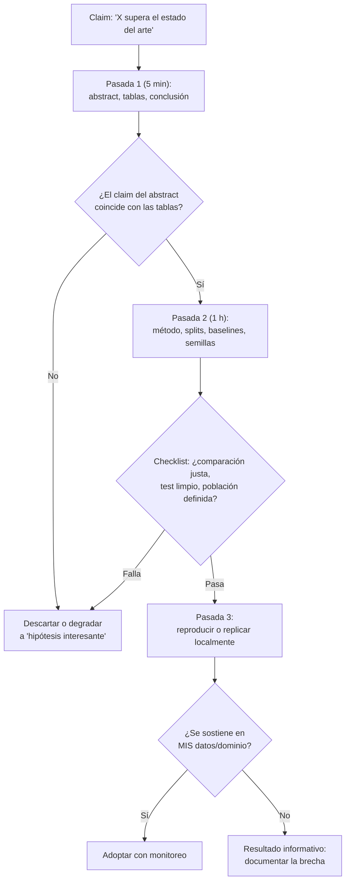

# 010 — Cómo leer papers, benchmarks y claims de IA

> [← Clase anterior](../../../classes/part-00-foundations-history-and-scientific-method/009-entornos-python-git-y-experimentos-reproducibles/README.md) · [Índice de la parte](../README.md) · [Clase siguiente →](../../../classes/part-00-foundations-history-and-scientific-method/011-etica-desde-el-diseno-y-limites-de-automatizacion/README.md)

**Parte:** 00 — Fundamentos, historia y método científico  
**Nivel:** fundamentos · **Horas estimadas:** 4  
**Laboratorio:** `evaluation` · **Estado:** `EXECUTABLE_CORE`

## 🎯 Propósito

Comprender **cómo leer papers, benchmarks y claims de ia** dentro de la evolución de la inteligencia
artificial, implementar un experimento mínimo verificable y distinguir qué parte
constituye evidencia frente a una afirmación todavía no comprobada.

## 📚 Resultados de aprendizaje

Al finalizar podrás:

1. Explicar cómo leer papers, benchmarks y claims de ia usando los conceptos `papers`, `benchmarks`, `claims`, `replicación`.
2. Ejecutar el laboratorio con una semilla explícita y revisar su contrato JSON.
3. Identificar al menos un supuesto, una limitación y un riesgo de aplicación.
4. Comparar el enfoque con la etapa anterior de la ruta de aprendizaje.
5. Producir una evidencia reproducible y una conclusión que no exceda los datos.

## 🧩 Conceptos centrales

`papers`, `benchmarks`, `claims`, `replicación`

## 🗺️ Ubicación en el mapa de la IA

La IA produce decenas de miles de papers al año y un flujo constante de anuncios con
métricas espectaculares; la capacidad de leerlos críticamente es tan parte del oficio como
programar. Esta clase aplica la falsabilidad (clase 008) y la reproducibilidad (clase 009)
al material publicado: cómo desarmar un paper, qué mide realmente un benchmark y qué
preguntas hacerle a un claim antes de creerlo. Es la herramienta de supervivencia para el
resto del programa, donde se leerán papers seminales en casi cada parte.

## 📖 Fundamentos

### 📄 Anatomía de un paper de ML

Las secciones tienen funciones retóricas distintas y se leen con niveles de confianza
distintos:

- **Abstract/Introducción:** el claim en su versión más vendedora. Anotar qué se promete.
- **Método:** qué se hizo. Buscar los detalles que afectan la comparación: ¿mismo
  presupuesto de cómputo y de búsqueda de hiperparámetros para el baseline?
- **Experimentos:** la evidencia real. Aquí viven las tablas, los datasets y las
  condiciones. Es la sección contra la que se audita el abstract.
- **Limitaciones/Apéndices:** donde los autores honestos entierran las malas noticias
  (varianza entre semillas, resultados negativos, trucos de preprocesamiento).

Método de lectura en tres pasadas (Keshav): (1) título, abstract, figuras y conclusión —
5 minutos, decidir si sigue; (2) lectura completa sin demostraciones, anotando supuestos —
1 hora; (3) reconstrucción mental o real del experimento — la única pasada que habilita a
citarlo como evidencia.

### 📏 Qué mide (y qué no) un benchmark

Un benchmark es una **muestra congelada de una tarea**, no la tarea. Cadena de
representatividad que puede romperse en cada eslabón:

```text
capacidad real → tarea idealizada → dataset recolectado → split de test → métrica agregada
```

Modos de fallo documentados:

- **Contaminación:** el test estuvo en los datos de entrenamiento (crítico con LLMs
  entrenados sobre la web: el benchmark público *está* en la web).
- **Sobreajuste comunitario (Goodhart):** años de optimizar contra el mismo leaderboard
  producen mejoras específicas del benchmark que no transfieren.
- **Artefactos y atajos:** el modelo explota regularidades espurias del dataset (longitud,
  léxico) en lugar de la capacidad nominal.
- **Saturación:** cerca del techo, las diferencias entre sistemas son ruido de anotación.
- **Métrica ≠ calidad:** accuracy agregada oculta el desempeño por subgrupos y el costo
  asimétrico de errores.

### 🧾 Checklist para auditar un claim

Preguntas mínimas ante "X alcanza el estado del arte" o "X supera a los humanos":

```text
1. ¿Comparación justa?    mismo dato, mismo cómputo, misma búsqueda de hiperparámetros
2. ¿Baselines fuertes?    ¿incluye el baseline trivial y el clásico bien afinado?
3. ¿Cuántas semillas?     ¿reportan media ± dispersión o una corrida afortunada?
4. ¿Población definida?   ¿"supera a humanos" — a cuáles, en qué subconjunto, con qué UI?
5. ¿Test limpio?          ¿auditaron contaminación/leakage? ¿test temporalmente posterior?
6. ¿Código y datos?       ¿se puede reproducir? ¿hay lockfile/pesos/configuración?
7. ¿Quién paga?           conflictos de interés declarados; los press releases no son papers
8. ¿Sobrevive fuera?      ¿hay evaluación out-of-distribution o replicación independiente?
```

Dodge et al. (2019) mostraron que reportar resultados sin el presupuesto de búsqueda de
hiperparámetros hace incomparables los sistemas: con más intentos, cualquier método "gana".
Pineau et al. (2021) convirtieron esta clase de preguntas en la checklist oficial de NeurIPS.

### 🎭 Tipología de claims

- **Claim de capacidad:** "el modelo puede razonar" — exige definición operativa y test
  falsable, si no, es marketing.
- **Claim de métrica:** "94.3 en el benchmark Y" — verificable pero estrecho; preguntar
  por la cadena benchmark→capacidad.
- **Claim de superioridad:** "supera a GPT-x / a médicos" — auditar la comparación
  (versión, prompt, fecha, subconjunto).
- **Claim de tendencia:** "la escala resolverá Z" — extrapolación; pedir la curva con
  incertidumbre, recordar la clase 003.

## 🧮 Ejemplo trabajado

Claim publicado: "Nuestro modelo diagnostica neumonía mejor que radiólogos (AUC 0.94 vs
0.87)". Auditoría con la checklist:

| # | Pregunta | Hallazgo en el paper (caso realista) | Veredicto |
|---|---|---|---|
| 1 | ¿Comparación justa? | Radiólogos sin historia clínica ni imágenes previas; el modelo evaluado en su distribución | Comparación asimétrica |
| 2 | ¿Baseline? | No compara con la regla clínica estándar | Falta baseline fuerte |
| 4 | ¿Población? | Un solo hospital, un solo fabricante de equipos | Generalización no demostrada |
| 5 | ¿Test limpio? | Split aleatorio por *imagen*, no por *paciente*: imágenes del mismo paciente en train y test | **Leakage** |
| 8 | ¿Fuera de distribución? | Sin validación externa | Pendiente |

Reescritura honesta del claim: "En imágenes del hospital H con equipos del fabricante F,
con partición por imagen (no por paciente), el modelo obtiene AUC 0.94 frente a 0.87 de
radiólogos evaluados sin contexto clínico". Así formulado, el propio autor vería los
huecos. Este patrón (split por imagen, un centro, comparación asimétrica) no es hipotético:
es la falla modal que Kapoor y Narayanan catalogaron en la literatura de ML aplicado.

## 📊 Propiedades y comparación

| Fuente | Fiabilidad típica | Sesgo dominante | Uso correcto |
|---|---|---|---|
| Paper revisado por pares | Media-alta | Publicación (solo éxitos) | Evidencia, tras pasada 2-3 |
| Preprint (arXiv) | Variable | Sin filtro; velocidad | Señal temprana, verificar |
| Leaderboard público | Media | Goodhart, contaminación | Comparar tendencias, no décimas |
| Blog corporativo / press release | Baja | Interés comercial | Hipótesis a verificar, nunca evidencia |
| Replicación independiente | Alta | Escasez | El patrón oro cuando existe |



## ⚠️ Errores conceptuales frecuentes

1. **"Está publicado/revisado por pares, luego es cierto."** La revisión filtra errores
   groseros, no verifica reproducibilidad; la tasa de resultados no replicables en ML
   aplicado es sustancial (Kapoor & Narayanan, 2023).
2. **"Mejor número en el benchmark = mejor sistema para mi problema."** El benchmark es una
   muestra congelada de otra distribución; la transferencia al dominio propio se mide, no
   se supone.
3. **"Superhumano en el test = superhumano en la tarea."** Los "humanos" del claim suelen
   ser anotadores con tiempo limitado y sin contexto; la tarea real incluye información y
   responsabilidad que el test excluye.
4. **"Una décima más de métrica importa."** Sin varianza entre semillas ni test de
   significancia, décimas son ruido; exigir media ± desviación sobre varias corridas.
5. **"El abstract resume fielmente el paper."** El abstract es la sección de ventas; la
   auditoría se hace contra la sección de experimentos y los apéndices.

## 🚀 Del aprendizaje a la operación

En la práctica profesional, este material se convierte en un protocolo de adopción de
tecnología: ningún modelo o técnica entra al stack sin (a) replicar el claim clave en un
subconjunto de datos propios, (b) comparar contra el baseline interno actual con el mismo
presupuesto de ajuste, (c) registrar el experimento con el contrato de la clase 009, y
(d) documentar la brecha entre el número publicado y el observado — que existirá, y cuya
magnitud es información de planificación, no una decepción.

## 🧪 Laboratorio

```bash
python lab.py
```

El laboratorio llama a `ai_evolution.labs.run_lab("evaluation")`. Esta
decisión evita 180 implementaciones divergentes: cada clase tiene un entrypoint
propio, pero los motores didácticos se prueban como una biblioteca común.

### 🔍 Evidencia esperada

- tipo de laboratorio y semilla;
- entradas o decisiones observables;
- resultado estructurado;
- lista `evidence` con hechos que pueden inspeccionarse;
- lista `limitations` que impide presentar la demo como producción.

## 📓 Notebooks

- [📓 `notebook.ipynb`](notebook.ipynb): recorrido guiado con la materia resumida.
- [✍️ `notebook_student.ipynb`](notebook_student.ipynb): ejercicios para resolver.
- [✅ `notebook_solution.ipynb`](notebook_solution.ipynb): solución de referencia explicada.

## 📝 Evaluación

| Criterio | Peso |
|---|---:|
| Comprensión conceptual | 25 % |
| Ejecución reproducible | 25 % |
| Interpretación basada en evidencia | 25 % |
| Riesgos, límites y mejora propuesta | 25 % |

Consulta [assessment.md](assessment.md) para preguntas y criterio de aceptación.

## ⚠️ Errores comunes

| Síntoma | Causa probable | Corrección |
|---|---|---|
| El código corre, pero no hay conclusión | Se confundió ejecución con aprendizaje | Explica qué demuestra y qué no demuestra |
| El resultado cambia sin explicación | No se registró semilla o configuración | Conserva semilla, versión y parámetros |
| Se promete uso real | Se extrapoló desde una demo educativa | Declara entorno, datos, límites y revisión humana |
| Se copia una métrica aislada | No existe baseline ni costo de error | Añade comparación y criterio de decisión |

## ❓ Preguntas frecuentes

**¿Debo usar una API comercial?**  
No. El núcleo funciona localmente. Las extensiones LIVE se documentan por separado.

**¿El laboratorio representa una implementación industrial?**  
No por sí solo. Enseña el contrato y el patrón; producción exige integración,
seguridad, observabilidad, pruebas y operación.

**¿Dónde profundizo?**  
Revisa las especializaciones enlazadas en el README raíz y la ruta siguiente.

## 🔗 Referencias

- [Keshav, S. (2007). How to Read a Paper (método de tres pasadas)](https://doi.org/10.1145/1273445.1273458)
- [Dodge et al. (2019). Show Your Work: Improved Reporting of Experimental Results](https://arxiv.org/abs/1909.03004)
- [Pineau et al. (2021). Improving Reproducibility in ML Research (checklist NeurIPS)](https://arxiv.org/abs/2003.12206)
- [Kapoor, S. & Narayanan, A. (2023). Leakage and the Reproducibility Crisis in ML-based Science](https://arxiv.org/abs/2207.07048)
- [Ioannidis, J. (2005). Why Most Published Research Findings Are False](https://doi.org/10.1371/journal.pmed.0020124)

---

## ⬅️ Clase anterior

[009 — Entornos Python, Git y experimentos reproducibles](../../part-00-foundations-history-and-scientific-method/009-entornos-python-git-y-experimentos-reproducibles/README.md)

## ➡️ Siguiente clase

[011 — Ética desde el diseño y límites de automatización](../../part-00-foundations-history-and-scientific-method/011-etica-desde-el-diseno-y-limites-de-automatizacion/README.md)
