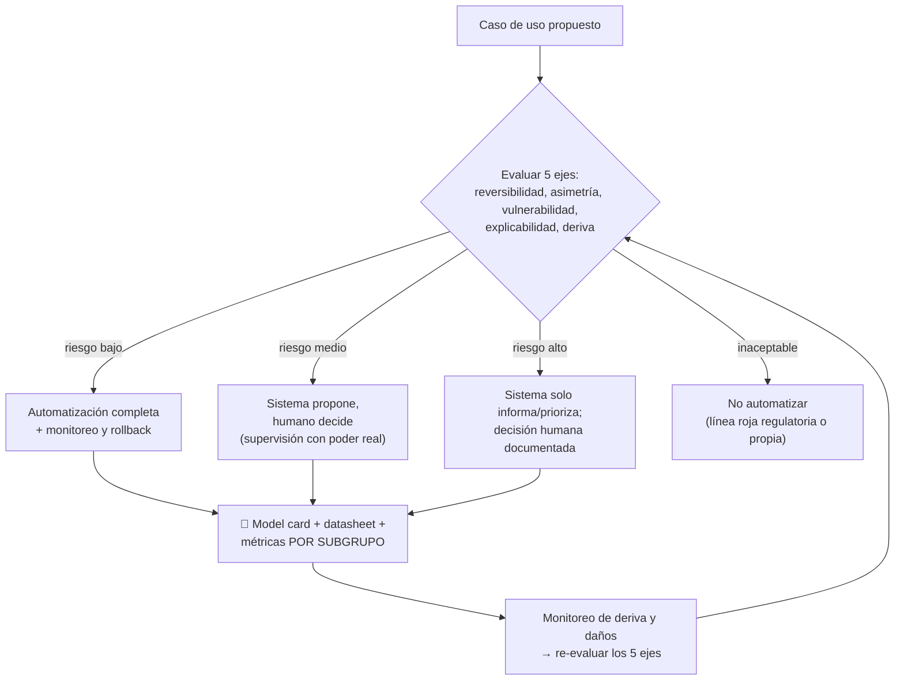

# 011 — Ética desde el diseño y límites de automatización

> [← Clase anterior](../../../classes/part-00-foundations-history-and-scientific-method/010-como-leer-papers-benchmarks-y-claims-de-ia/README.md) · [Índice de la parte](../README.md) · [Clase siguiente →](../../../classes/part-00-foundations-history-and-scientific-method/012-proyecto-mapa-evolutivo-verificable-de-la-ia/README.md)

**Parte:** 00 — Fundamentos, historia y método científico  
**Nivel:** fundamentos · **Horas estimadas:** 4  
**Laboratorio:** `safety` · **Estado:** `EXECUTABLE_CORE`

## 🎯 Propósito

Comprender **ética desde el diseño y límites de automatización** dentro de la evolución de la inteligencia
artificial, implementar un experimento mínimo verificable y distinguir qué parte
constituye evidencia frente a una afirmación todavía no comprobada.

## 📚 Resultados de aprendizaje

Al finalizar podrás:

1. Explicar ética desde el diseño y límites de automatización usando los conceptos `ética`, `impacto`, `límites`, `supervisión`.
2. Ejecutar el laboratorio con una semilla explícita y revisar su contrato JSON.
3. Identificar al menos un supuesto, una limitación y un riesgo de aplicación.
4. Comparar el enfoque con la etapa anterior de la ruta de aprendizaje.
5. Producir una evidencia reproducible y una conclusión que no exceda los datos.

## 🧩 Conceptos centrales

`ética`, `impacto`, `límites`, `supervisión`

## 🗺️ Ubicación en el mapa de la IA

La ética aparece en la primera parte del programa, y no al final, por una razón de
ingeniería: las decisiones con carga ética (qué datos usar, qué métrica optimizar, qué se
automatiza y qué no) se toman en el diseño, cuando cambiarlas cuesta poco — no en la
auditoría posterior, cuando cuesta el proyecto entero. Esta clase conecta la medida de
desempeño de los agentes (clase 004) y la honestidad experimental (clases 008-010) con sus
consecuencias sobre personas, y anticipa los marcos regulatorios que gobiernan la parte de
despliegue.

## 📖 Fundamentos

### 🏗️ Ética desde el diseño (ethics by design)

Principio: los valores se implementan en artefactos técnicos concretos, no en declaraciones.
Traducciones directas:

| Decisión de diseño | Carga ética implícita |
|---|---|
| Métrica a optimizar | Qué errores importan y a quién perjudican |
| Datos de entrenamiento | Qué poblaciones están representadas y cuáles no |
| Umbral de decisión | Trade-off explícito entre falsos positivos y negativos |
| Interfaz y defaults | Qué conducta del usuario se induce |
| Registro y trazas | Si el daño podrá investigarse y atribuirse |

Un sistema de scoring crediticio entrenado con decisiones históricas *ya contiene* una
postura ética (perpetuar el patrón histórico); no adoptarla conscientemente no la elimina,
solo la deja sin dueño.

### ⚖️ Conceptos operativos

- **Sesgo (bias):** error sistemático que afecta de forma desigual a subgrupos. Entra por
  los datos (muestreo, etiquetas históricas), por la métrica (agregada sobre subgrupos
  desiguales) o por el despliegue (uso fuera de la población de diseño). Se *mide* por
  subgrupo — accuracy global puede ocultar disparidades severas.
- **Equidad (fairness):** existen múltiples definiciones formales (paridad demográfica,
  igualdad de oportunidades, calibración por grupo) y son **mutuamente incompatibles** en
  general (resultado de imposibilidad de Kleinberg et al. / Chouldechova): elegir una es una
  decisión de política, no un detalle técnico.
- **Transparencia y rendición de cuentas:** documentación estandarizada del modelo (*Model
  Cards*, Mitchell et al. 2019) y de los datos (*Datasheets for Datasets*, Gebru et al.
  2021): uso previsto, poblaciones evaluadas, límites conocidos.
- **Supervisión humana significativa:** que el humano en el circuito pueda *realmente*
  discrepar del sistema (tiempo, información, autoridad e incentivos para hacerlo); un
  humano que aprueba en cadena lo que el sistema propone es teatro de supervisión
  (*automation bias* documentado).

### 🚦 Límites de automatización: qué no se delega

Criterios para decidir el grado de autonomía admisible de un sistema:

```text
1. Reversibilidad del daño:   ¿el error se puede deshacer? (recomendación de película
                              vs. denegación de crédito vs. diagnóstico)
2. Costo asimétrico:          ¿un falso negativo vale lo mismo que un falso positivo?
3. Población vulnerable:      ¿el error cae sobre quien menos puede defenderse?
4. Explicabilidad exigible:   ¿la decisión debe poder justificarse individualmente
                              (derecho, medicina, empleo)?
5. Deriva del entorno:        ¿la distribución cambia más rápido de lo que se re-evalúa?
```

Cuanto más alto puntúa un caso en estos ejes, más cerca debe estar del extremo "el sistema
solo *informa*, el humano decide" y más lejos de "el sistema decide y ejecuta". Los marcos
regulatorios modernos codifican esta gradación: el AI Act europeo (Reglamento 2024/1689)
clasifica sistemas por nivel de riesgo (inaceptable/alto/limitado/mínimo) con obligaciones
proporcionales, y el NIST AI RMF estructura el ciclo govern-map-measure-manage.

### 🧾 El artefacto de esta clase

El laboratorio `safety` ejercita la versión mínima: una decisión automatizada con umbral,
la tabla de errores por subgrupo y la declaración explícita de `limitations`. El artefacto
`risk_and_limitations.md` de cada clase del programa es un Model Card embrionario.

## 🧮 Ejemplo trabajado

Un clasificador decide qué solicitudes de crédito revisar manualmente. Métricas por
subgrupo sobre 2 000 casos de test (1 000 por grupo), con el mismo umbral global 0.5:

| | Grupo A | Grupo B |
|---|---|---|
| Tasa real de impago | 10 % | 10 % |
| Recall (impagos detectados) | 80/100 = 0.80 | 50/100 = 0.50 |
| Falsos positivos (buenos pagadores rechazados) | 90/900 = 0.10 | 180/900 = 0.20 |
| Accuracy del grupo | (80+810)/1000 = **0.89** | (50+720)/1000 = **0.77** |
| Accuracy global reportada | (890+770)/2000 = **0.83** | |

El informe ejecutivo diría "accuracy 0.83". La tabla por subgrupo muestra que el grupo B
sufre el doble de rechazos injustos (0.20 vs 0.10) y la mitad de protección frente a
impagos reales (0.50 vs 0.80) **con la misma tasa base**: el modelo está peor calibrado
para B (típicamente por menos datos históricos de ese grupo). Opciones de diseño, cada una
con carga ética explícita: recolectar datos de B, umbrales por grupo (¿es legal en la
jurisdicción?), o enviar B a revisión humana (¿con qué sesgos revisa el humano?). No hay
opción neutra; la ética desde el diseño consiste en elegir con los números sobre la mesa y
documentar la elección.

## 📊 Propiedades y comparación

| Enfoque | Cuándo actúa | Costo de corregir | Ejemplo de artefacto |
|---|---|---|---|
| Ética desde el diseño | Antes de construir | Bajo | Métrica por subgrupo elegida ex ante, datasheet |
| Auditoría posterior | Tras construir | Alto | Informe de sesgo sobre sistema en uso |
| Cumplimiento reactivo | Tras el incidente | Máximo (+daño) | Retirada del sistema, sanción |
| Teatro ético | Nunca (solo comunica) | — | Principios sin métricas ni dueños |



## ⚠️ Errores conceptuales frecuentes

1. **"La ética es subjetiva, no se puede medir."** Las consecuencias se miden: tasas de
   error por subgrupo, calibración por grupo, daños reportados. Lo valorativo es elegir el
   trade-off; lo técnico es exponerlo con números.
2. **"Quitamos la variable protegida, ya no hay sesgo."** Las variables correlacionadas
   (código postal, historial) la reconstruyen (*proxy discrimination*); la equidad se
   evalúa sobre resultados, no sobre columnas eliminadas.
3. **"Un humano revisa, así que hay supervisión."** Sin tiempo, información e incentivos
   para discrepar, el humano ratifica (automation bias); la supervisión se diseña y se mide
   (tasa de discrepancia) como cualquier componente.
4. **"Optimizar todas las definiciones de fairness a la vez."** Es matemáticamente imposible
   en general; hay que elegir la definición apropiada al dominio y justificarla.
5. **"La regulación mata la innovación, mejor ignorarla hasta el final."** Los requisitos
   del AI Act y NIST AI RMF (documentación, gestión de riesgo, datos de calidad) son
   práctica de ingeniería sólida; adoptarlos tarde cuesta rediseños completos.

## 🚀 Del aprendizaje a la operación

En producción, esta clase se convierte en artefactos con dueño: un registro de decisiones
de diseño con su justificación ética (qué métrica, qué umbral, por qué); model cards y
datasheets versionados junto al código; evaluación por subgrupo en el pipeline de CI, no
solo en el informe inicial; un canal de reporte de daños con SLA de respuesta; y un mapa de
qué decisiones el sistema tiene prohibido tomar solo — revisado cuando cambia la población,
el modelo o la ley.

## 🧪 Laboratorio

```bash
python lab.py
```

El laboratorio llama a `ai_evolution.labs.run_lab("safety")`. Esta
decisión evita 183 implementaciones divergentes: cada clase tiene un entrypoint
propio, pero los motores didácticos se prueban como una biblioteca común.

### 🔍 Evidencia esperada

- tipo de laboratorio y semilla;
- entradas o decisiones observables;
- resultado estructurado;
- lista `evidence` con hechos que pueden inspeccionarse;
- lista `limitations` que impide presentar la demo como producción.

## 📓 Notebooks

- [📓 `notebook.ipynb`](notebook.ipynb): recorrido guiado con la materia resumida.
- [✍️ `notebook_student.ipynb`](notebook_student.ipynb): ejercicios para resolver.
- [✅ `notebook_solution.ipynb`](notebook_solution.ipynb): solución de referencia explicada.

## 📝 Evaluación

| Criterio | Peso |
|---|---:|
| Comprensión conceptual | 25 % |
| Ejecución reproducible | 25 % |
| Interpretación basada en evidencia | 25 % |
| Riesgos, límites y mejora propuesta | 25 % |

Consulta [assessment.md](assessment.md) para preguntas y criterio de aceptación.

## ⚠️ Errores comunes

| Síntoma | Causa probable | Corrección |
|---|---|---|
| El código corre, pero no hay conclusión | Se confundió ejecución con aprendizaje | Explica qué demuestra y qué no demuestra |
| El resultado cambia sin explicación | No se registró semilla o configuración | Conserva semilla, versión y parámetros |
| Se promete uso real | Se extrapoló desde una demo educativa | Declara entorno, datos, límites y revisión humana |
| Se copia una métrica aislada | No existe baseline ni costo de error | Añade comparación y criterio de decisión |

## ❓ Preguntas frecuentes

**¿Debo usar una API comercial?**  
No. El núcleo funciona localmente. Las extensiones LIVE se documentan por separado.

**¿El laboratorio representa una implementación industrial?**  
No por sí solo. Enseña el contrato y el patrón; producción exige integración,
seguridad, observabilidad, pruebas y operación.

**¿Dónde profundizo?**  
Revisa las especializaciones enlazadas en el README raíz y la ruta siguiente.

## 🔗 Referencias

- [Mitchell et al. (2019). Model Cards for Model Reporting](https://arxiv.org/abs/1810.03993)
- [Gebru et al. (2021). Datasheets for Datasets](https://arxiv.org/abs/1803.09010)
- [NIST AI Risk Management Framework](https://www.nist.gov/itl/ai-risk-management-framework)
- [Reglamento (UE) 2024/1689 — AI Act (texto oficial)](https://eur-lex.europa.eu/eli/reg/2024/1689/oj)
- [Kleinberg, Mullainathan & Raghavan (2016). Inherent Trade-Offs in the Fair Determination of Risk Scores](https://arxiv.org/abs/1609.05807)
- [ACM Code of Ethics and Professional Conduct](https://www.acm.org/code-of-ethics)

<!-- papers:inicio -->

---

## 📜 Papers que fundamentan esta clase

> Bloque generado por `python scripts/link_papers_to_classes.py`. La fuente es [`papers/catalog/papers.json`](../../../papers/catalog/papers.json).

| Paper | Año | Qué desbloqueó | Miniatura |
|---|---:|---|---|
| [P61 · Sobre los peligros de los loros estocásticos: ¿pueden ser demasiado grandes los modelos de lenguaje?](../../../papers/foundational/P61_stochastic_parrots/README.md) | 2021 | Pone por escrito el coste de la carrera por el tamaño: quién paga, quién queda representado y qué se afirma de más sobre la comprensión. | [notebook](../../../notebooks/papers/P61_stochastic_parrots.ipynb) |

Cada ficha explica el problema anterior, la matemática mínima, los límites y los errores de atribución más frecuentes. Para leerlas con método: [cómo leer un paper de IA](../../../papers/guides/COMO_LEER_UN_PAPER_DE_IA.md) · [anexos matemáticos](../../../papers/annexes/README.md).
<!-- papers:fin -->
---

## ⬅️ Clase anterior

[010 — Cómo leer papers, benchmarks y claims de IA](../../part-00-foundations-history-and-scientific-method/010-como-leer-papers-benchmarks-y-claims-de-ia/README.md)

## ➡️ Siguiente clase

[012 — Proyecto: mapa evolutivo verificable de la IA](../../part-00-foundations-history-and-scientific-method/012-proyecto-mapa-evolutivo-verificable-de-la-ia/README.md)
