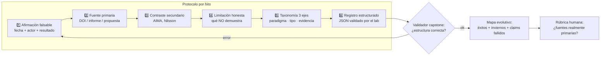

# 012 — Proyecto: mapa evolutivo verificable de la IA

> [← Clase anterior](../../../classes/part-00-foundations-history-and-scientific-method/011-etica-desde-el-diseno-y-limites-de-automatizacion/README.md) · [Índice de la parte](../README.md) · [Clase siguiente →](../../../classes/part-01-symbolic-ai-search-logic-and-planning/013-espacios-de-estados-y-formulacion-de-problemas/README.md)

**Parte:** 00 — Fundamentos, historia y método científico  
**Nivel:** fundamentos · **Horas estimadas:** 10  
**Laboratorio:** `capstone` · **Estado:** `EXECUTABLE_CORE`

## 🎯 Propósito

Comprender **proyecto: mapa evolutivo verificable de la ia** dentro de la evolución de la inteligencia
artificial, implementar un experimento mínimo verificable y distinguir qué parte
constituye evidencia frente a una afirmación todavía no comprobada.

## 📚 Resultados de aprendizaje

Al finalizar podrás:

1. Explicar proyecto: mapa evolutivo verificable de la ia usando los conceptos `timeline`, `evidencia`, `fuentes`, `taxonomía`.
2. Ejecutar el laboratorio con una semilla explícita y revisar su contrato JSON.
3. Identificar al menos un supuesto, una limitación y un riesgo de aplicación.
4. Comparar el enfoque con la etapa anterior de la ruta de aprendizaje.
5. Producir una evidencia reproducible y una conclusión que no exceda los datos.

## 🧩 Conceptos centrales

`timeline`, `evidencia`, `fuentes`, `taxonomía`

## 🗺️ Ubicación en el mapa de la IA

Esta clase cierra la parte 00 integrando sus once piezas en un artefacto único: una línea
de tiempo de la IA donde **cada hito es una afirmación verificable con fuente primaria**,
clasificada en una taxonomía explícita y acompañada de su evidencia y sus límites. No es un
ejercicio de memoria histórica: es el primer proyecto donde el estudiante aplica el método
del programa completo (claim → fuente → evidencia → limitación) a un corpus real, el mismo
método que usará para evaluar modelos y papers en las partes siguientes.

## 📖 Fundamentos

### 🗂️ Qué es un hito verificable

Un hito del mapa no es "en 1997 la IA venció al ajedrez", sino un registro estructurado:

```text
hito:
  fecha:        1997-05-11
  afirmación:   "Deep Blue (IBM) vence a Kasparov 3.5-2.5 en match a 6 partidas"
  taxonomía:    [búsqueda, juegos, hardware especializado]
  fuente_primaria: paper/documento del equipo o registro del evento
  evidencia:    resultado del match, documentado por múltiples fuentes independientes
  limitación:   dominio cerrado; sin transferencia; hardware ad hoc (norma de la clase 001:
                la conclusión no excede los datos)
```

Los criterios de calidad vienen de las clases anteriores: la afirmación debe ser falsable
(clase 008), la fuente debe ser primaria o canónica, no un press release (clase 010), y la
clasificación debe usar la taxonomía del campo (clases 001-004).

### 🌳 Una taxonomía operativa para clasificar hitos

Tres ejes de clasificación que el proyecto debe aplicar de forma consistente:

1. **Paradigma:** simbólico/lógico (Logic Theorist, sistemas expertos) · conexionista
   (perceptrón, deep learning) · probabilístico/estadístico (redes bayesianas, ML clásico)
   · híbrido/agéntico.
2. **Tipo de avance:** teórico (indecidibilidad, NP-completitud) · algorítmico
   (retropropagación, atención) · de sistema/ingeniería (Deep Blue, AlphaGo) · de datos o
   hardware (ImageNet, GPU) · institucional (Dartmouth, informes ALPAC/Lighthill).
3. **Estado de la evidencia:** verificado con fuente primaria · verificado con fuentes
   secundarias sólidas · claim de la época luego refutado o matizado (¡también son hitos!:
   las promesas de Simon de 1965 pertenecen al mapa *como claims fallidos*).

Registrar claims fallidos con la misma disciplina que los éxitos es lo que hace al mapa
*evolutivo* y no hagiográfico: los inviernos (clase 003) solo se entienden si el mapa
conserva las promesas que los precedieron.

### 🔍 Protocolo de verificación de cada hito

```text
1. Redactar la afirmación en forma falsable (fecha, actor, resultado medible).
2. Localizar la fuente primaria (paper con DOI, informe oficial, propuesta original).
3. Contrastar 1 fuente secundaria independiente (AIMA cap. 1, Nilsson).
4. Anotar qué NO demuestra el hito (limitación honesta).
5. Clasificar en los 3 ejes de la taxonomía.
6. Registrar el hito en el formato estructurado (JSON/YAML) del proyecto.
```

El laboratorio `capstone` valida mecánicamente la parte estructural (campos presentes,
fechas coherentes, taxonomía cerrada); la calidad de las fuentes la valida la rúbrica de
`assessment.md` — un validador automático no puede saber si una fuente es primaria, y esa
distinción entre lo verificable por máquina y lo que exige juicio es en sí misma una
lección del programa.

### 🧭 Esqueleto mínimo del mapa (12 hitos ancla)

El proyecto parte de un esqueleto que el estudiante debe verificar y extender: 1936
(Turing, computabilidad) · 1943 (McCulloch-Pitts) · 1950 (juego de imitación) · 1956
(Dartmouth) · 1965 (promesa de Simon, *claim fallido*) · 1969 (Perceptrons) · 1973
(Lighthill) · 1986 (retropropagación popularizada) · 1997 (Deep Blue) · 2012 (AlexNet) ·
2017 (atención/transformers) · 2022+ (LLMs desplegados masivamente). Cada uno debe pasar
el protocolo de 6 pasos; el estudiante añade al menos 8 hitos propios con el mismo estándar.

## 🧮 Ejemplo trabajado

Apliquemos el protocolo completo al hito de 1950:

| Paso | Resultado |
|---|---|
| 1. Afirmación falsable | "En octubre de 1950, A. M. Turing publica en *Mind* LIX(236) el artículo que propone el juego de imitación como criterio operativo" |
| 2. Fuente primaria | DOI 10.1093/mind/LIX.236.433 (verificable: resuelve al artículo) |
| 3. Fuente secundaria | AIMA 4e, §1.1; Nilsson (2010), cap. 2 |
| 4. Limitación honesta | El artículo NO afirma que las máquinas piensen ni fija el test como definición de IA; propone un sustituto operativo y predice (falsablemente) el desempeño hacia el año 2000 |
| 5. Taxonomía | Paradigma: pre-paradigmático/fundacional · Tipo: teórico · Evidencia: primaria verificada |
| 6. Registro | `{"date":"1950-10","claim":"...","source_doi":"10.1093/mind/LIX.236.433","taxonomy":["foundational","theoretical"],"limitations":["no define IA","criterio conductual, no de competencia"]}` |

Contraejemplo instructivo: la cifra popular "Turing predijo que en 2000 las máquinas
pasarían el test" es imprecisa — lo que el artículo dice es que hacia el año 2000 un
interrogador promedio tendría no más de 70 % de probabilidad de identificar correctamente
tras 5 minutos. La versión popular es *menos falsable* que la original: reconstruir el claim
exacto desde la fuente es el músculo que este proyecto entrena.

## 📊 Propiedades y comparación

| Enfoque de línea de tiempo | Fuentes | Claims fallidos | ¿Auditable? | Valor formativo |
|---|---|---|---|---|
| Divulgativa (blog, marketing) | Secundarias o ninguna | Omitidos | No | Bajo: narrativa de progreso lineal |
| Académica narrativa (AIMA §1.1) | Mixtas, citadas | Mencionados | Parcial | Alto, pero no estructurado |
| **Mapa verificable (este proyecto)** | Primarias + contraste | Registrados como hitos | Sí (formato + protocolo) | Alto y reutilizable programáticamente |



## ⚠️ Errores conceptuales frecuentes

1. **"Una línea de tiempo es neutral."** Toda selección de hitos es una tesis sobre qué
   importa; la taxonomía explícita y los claims fallidos incluidos hacen la tesis auditable
   en lugar de implícita.
2. **"Wikipedia/un blog es fuente suficiente."** Son puntos de partida para *localizar* la
   fuente primaria, no la fuente; el protocolo exige llegar al documento original o a una
   referencia canónica con página/capítulo.
3. **"Los fracasos no son hitos."** ALPAC, Lighthill y las promesas incumplidas explican la
   forma de la curva tanto como los éxitos; omitirlos produce el sesgo de supervivencia de
   la clase 008.
4. **"Si el validador pasa, el proyecto está bien."** El validador comprueba estructura;
   la calidad de fuentes y la honestidad de las limitaciones las evalúa la rúbrica. Confundir
   validación mecánica con validez es exactamente el error de la clase 010 con benchmarks.
5. **"Más hitos = mejor mapa."** Veinte hitos verificados con protocolo completo valen más
   que cien copiados; la densidad sin verificación reintroduce el ruido que el proyecto
   busca eliminar.

## 🚀 Del aprendizaje a la operación

El patrón de este proyecto — registro estructurado + fuente + evidencia + limitación +
validación automática de estructura + revisión humana de calidad — es el mismo que en la
industria toman los *model cards*, los registros de decisiones de arquitectura (ADR) y los
inventarios de sistemas de IA que exigen marcos como el AI Act. Quien sabe construir un mapa
histórico auditable sabe construir el inventario auditable de los sistemas de su
organización: cambia el contenido, no el método.

## 🧪 Laboratorio

```bash
python lab.py
```

El laboratorio llama a `ai_evolution.labs.run_lab("capstone")`. Esta
decisión evita 183 implementaciones divergentes: cada clase tiene un entrypoint
propio, pero los motores didácticos se prueban como una biblioteca común.

### 🔍 Evidencia esperada

- tipo de laboratorio y semilla;
- entradas o decisiones observables;
- resultado estructurado;
- lista `evidence` con hechos que pueden inspeccionarse;
- lista `limitations` que impide presentar la demo como producción.

## 📓 Notebooks

- [📓 `notebook.ipynb`](notebook.ipynb): recorrido guiado con la materia resumida.
- [✍️ `notebook_student.ipynb`](notebook_student.ipynb): ejercicios para resolver.
- [✅ `notebook_solution.ipynb`](notebook_solution.ipynb): solución de referencia explicada.

## 📝 Evaluación

| Criterio | Peso |
|---|---:|
| Comprensión conceptual | 25 % |
| Ejecución reproducible | 25 % |
| Interpretación basada en evidencia | 25 % |
| Riesgos, límites y mejora propuesta | 25 % |

Consulta [assessment.md](assessment.md) para preguntas y criterio de aceptación.

## ⚠️ Errores comunes

| Síntoma | Causa probable | Corrección |
|---|---|---|
| El código corre, pero no hay conclusión | Se confundió ejecución con aprendizaje | Explica qué demuestra y qué no demuestra |
| El resultado cambia sin explicación | No se registró semilla o configuración | Conserva semilla, versión y parámetros |
| Se promete uso real | Se extrapoló desde una demo educativa | Declara entorno, datos, límites y revisión humana |
| Se copia una métrica aislada | No existe baseline ni costo de error | Añade comparación y criterio de decisión |

## ❓ Preguntas frecuentes

**¿Debo usar una API comercial?**  
No. El núcleo funciona localmente. Las extensiones LIVE se documentan por separado.

**¿El laboratorio representa una implementación industrial?**  
No por sí solo. Enseña el contrato y el patrón; producción exige integración,
seguridad, observabilidad, pruebas y operación.

**¿Dónde profundizo?**  
Revisa las especializaciones enlazadas en el README raíz y la ruta siguiente.

## 🔗 Referencias

- [Turing, A. M. (1950). Computing Machinery and Intelligence. *Mind*, LIX(236)](https://doi.org/10.1093/mind/LIX.236.433)
- [McCarthy, Minsky, Rochester & Shannon (1955). Propuesta de Dartmouth (documento original)](http://jmc.stanford.edu/articles/dartmouth/dartmouth.pdf)
- [Lighthill, J. (1973). Artificial Intelligence: A General Survey](http://www.chilton-computing.org.uk/inf/literature/reports/lighthill_report/p001.htm)
- [Russell, S. & Norvig, P. *AIMA*, 4.ª ed., §1.1 (historia, para contraste secundario)](https://aima.cs.berkeley.edu/)
- [Nilsson, N. (2010). *The Quest for Artificial Intelligence* (PDF oficial gratuito)](https://ai.stanford.edu/~nilsson/QAI/qai.pdf)

---

## ⬅️ Clase anterior

[011 — Ética desde el diseño y límites de automatización](../../part-00-foundations-history-and-scientific-method/011-etica-desde-el-diseno-y-limites-de-automatizacion/README.md)

## ➡️ Siguiente clase

[013 — Espacios de estados y formulación de problemas](../../part-01-symbolic-ai-search-logic-and-planning/013-espacios-de-estados-y-formulacion-de-problemas/README.md)
