# 📜 Parte 00 — Fundamentos, historia y método científico

**Nivel:** fundamentos · **Duración sugerida:** 3–4 semanas ·
**Clases:** 12

Construye el mapa del campo, su historia, el vocabulario técnico y el método experimental que se utilizará en todo el programa.

## 🧭 Secuencia de la parte

```mermaid
flowchart LR
    L001["001<br/>Qué es inteligencia<br/>artificial y qué<br/>no es"]
    L002["002<br/>De Turing a<br/>Dartmouth: nacimiento formal<br/>del campo"]
    L003["003<br/>Inviernos, resurgimientos y<br/>ciclos de expectativas"]
    L004["004<br/>Agentes racionales, entornos<br/>y medidas de<br/>desempeño"]
    L005["005<br/>Vectores, matrices y<br/>geometría para IA"]
    L006["006<br/>Probabilidad, incertidumbre y<br/>estadística básica"]
    L007["007<br/>Lógica, algoritmos y<br/>complejidad computacional"]
    L008["008<br/>Datos, evidencia, hipótesis<br/>y falsabilidad"]
    L009["009<br/>Entornos Python, Git<br/>y experimentos reproducibles"]
    L010["010<br/>Cómo leer papers,<br/>benchmarks y claims<br/>de IA"]
    L011["011<br/>Ética desde el<br/>diseño y límites<br/>de automatización"]
    L012["012<br/>Proyecto: mapa evolutivo<br/>verificable de la<br/>IA"]
    L001 --> L002
    L002 --> L003
    L003 --> L004
    L004 --> L005
    L005 --> L006
    L006 --> L007
    L007 --> L008
    L008 --> L009
    L009 --> L010
    L010 --> L011
    L011 --> L012
```

## 📚 Clases

| ID | Tema | Laboratorio | Horas |
|---:|---|---|---:|
| 001 | [Qué es inteligencia artificial y qué no es](001-que-es-inteligencia-artificial-y-que-no-es/README.md) | `frontier` | 4 |
| 002 | [De Turing a Dartmouth: nacimiento formal del campo](002-de-turing-a-dartmouth-nacimiento-formal-del-campo/README.md) | `frontier` | 4 |
| 003 | [Inviernos, resurgimientos y ciclos de expectativas](003-inviernos-resurgimientos-y-ciclos-de-expectativas/README.md) | `evaluation` | 4 |
| 004 | [Agentes racionales, entornos y medidas de desempeño](004-agentes-racionales-entornos-y-medidas-de-desempeno/README.md) | `agent` | 4 |
| 005 | [Vectores, matrices y geometría para IA](005-vectores-matrices-y-geometria-para-ia/README.md) | `optimization` | 4 |
| 006 | [Probabilidad, incertidumbre y estadística básica](006-probabilidad-incertidumbre-y-estadistica-basica/README.md) | `probability` | 4 |
| 007 | [Lógica, algoritmos y complejidad computacional](007-logica-algoritmos-y-complejidad-computacional/README.md) | `logic` | 4 |
| 008 | [Datos, evidencia, hipótesis y falsabilidad](008-datos-evidencia-hipotesis-y-falsabilidad/README.md) | `evaluation` | 4 |
| 009 | [Entornos Python, Git y experimentos reproducibles](009-entornos-python-git-y-experimentos-reproducibles/README.md) | `observability` | 4 |
| 010 | [Cómo leer papers, benchmarks y claims de IA](010-como-leer-papers-benchmarks-y-claims-de-ia/README.md) | `evaluation` | 4 |
| 011 | [Ética desde el diseño y límites de automatización](011-etica-desde-el-diseno-y-limites-de-automatizacion/README.md) | `safety` | 4 |
| 012 | [Proyecto: mapa evolutivo verificable de la IA](012-proyecto-mapa-evolutivo-verificable-de-la-ia/README.md) | `capstone` | 10 |

## 📝 Evaluación de la parte

- 40 % laboratorios y notebooks.
- 25 % explicaciones y comparación de enfoques.
- 20 % evaluación de riesgos y limitaciones.
- 15 % mini-proyecto o integración.

[🏠 Volver al programa](../../README.md) · [➡️ Parte 01 — IA simbólica, búsqueda, lógica y planificación](../part-01-symbolic-ai-search-logic-and-planning/README.md)
