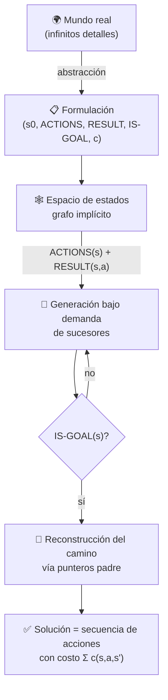

# 013 — Espacios de estados y formulación de problemas

> [← Clase anterior](../../../classes/part-00-foundations-history-and-scientific-method/012-proyecto-mapa-evolutivo-verificable-de-la-ia/README.md) · [Índice de la parte](../README.md) · [Clase siguiente →](../../../classes/part-01-symbolic-ai-search-logic-and-planning/014-busqueda-en-anchura-y-profundidad/README.md)

**Parte:** 01 — IA simbólica, búsqueda, lógica y planificación  
**Nivel:** fundamentos · **Horas estimadas:** 4  
**Laboratorio:** `search` · **Estado:** `EXECUTABLE_CORE`

## 🎯 Propósito

Comprender **espacios de estados y formulación de problemas** dentro de la evolución de la inteligencia
artificial, implementar un experimento mínimo verificable y distinguir qué parte
constituye evidencia frente a una afirmación todavía no comprobada.

## 📚 Resultados de aprendizaje

Al finalizar podrás:

1. Explicar espacios de estados y formulación de problemas usando los conceptos `estado`, `acciones`, `objetivo`, `costo`.
2. Ejecutar el laboratorio con una semilla explícita y revisar su contrato JSON.
3. Identificar al menos un supuesto, una limitación y un riesgo de aplicación.
4. Comparar el enfoque con la etapa anterior de la ruta de aprendizaje.
5. Producir una evidencia reproducible y una conclusión que no exceda los datos.

## 🧩 Conceptos centrales

`estado`, `acciones`, `objetivo`, `costo`

## 🗺️ Ubicación en el mapa de la IA

La formulación de problemas como espacios de estados es la puerta de entrada a la IA simbólica: fue el marco con el que Newell y Simon plantearon el *General Problem Solver* y el que organiza los capítulos de búsqueda de AIMA. Precede a todos los algoritmos de búsqueda (BFS, DFS, A*, minimax) porque ninguno puede ejecutarse sin un problema bien formulado. Habilita después la planificación clásica (STRIPS/PDDL), donde los estados se describen con lógica en lugar de enumerarse, y sigue vigente en aprendizaje por refuerzo, donde el MDP es un espacio de estados con transiciones estocásticas.

## 📖 Fundamentos

### 🧩 Los cinco componentes de un problema de búsqueda

Un **problema de búsqueda** bien formulado (AIMA 4e, cap. 3) se define con cinco componentes:

1. **Estado inicial** `s0`: la situación de partida.
2. **Acciones** `ACTIONS(s)`: el conjunto finito de acciones aplicables en el estado `s`.
3. **Modelo de transición** `RESULT(s, a)`: el estado que resulta de ejecutar la acción `a` en `s`. También llamado función sucesora.
4. **Test de objetivo** `IS-GOAL(s)`: predicado que decide si `s` es un estado meta (puede haber varios).
5. **Costo de acción** `c(s, a, s') >= 0`: el costo de dar ese paso. El costo de un camino es la suma de los costos de sus acciones.

El **espacio de estados** es el grafo dirigido implícito cuyos vértices son todos los estados alcanzables desde `s0` y cuyas aristas son las transiciones. Una **solución** es un camino de `s0` a un estado objetivo; una **solución óptima** es la de costo mínimo.

```text
PROBLEMA = (s0, ACTIONS, RESULT, IS-GOAL, c)

función SOLUCION-VALIDA(problema, [a1, ..., an]):
    s ← problema.s0
    costo ← 0
    para cada acción ai:
        si ai ∉ ACTIONS(s): devolver INVÁLIDA
        costo ← costo + c(s, ai, RESULT(s, ai))
        s ← RESULT(s, ai)
    devolver IS-GOAL(s), costo
```

### 🔍 Estado ≠ nodo

Distinción crucial que la implementación debe respetar:

- Un **estado** es una configuración del mundo (p. ej. la disposición de fichas del 8-puzzle).
- Un **nodo** de búsqueda es una estructura de datos: contiene un estado, un puntero al nodo padre, la acción que lo generó y el costo acumulado `g(n)`. Dos nodos distintos pueden contener el mismo estado (alcanzado por caminos distintos).

Reconstruir la solución consiste en seguir los punteros padre desde el nodo objetivo hasta la raíz.

### 📐 Abstracción y granularidad

Formular es **abstraer**: decidir qué detalles del mundo entran en el estado. En el problema de viajar de Arad a Bucarest (el mapa de Rumania de AIMA), el estado es solo "ciudad actual"; se descartan clima, combustible y hora. Una abstracción es **válida** si toda solución abstracta puede expandirse a una solución del mundo real, y es **útil** si las acciones abstractas son más fáciles de ejecutar que el problema original. Elegir mal la granularidad es el error de diseño más caro: un estado demasiado fino explota combinatoriamente; uno demasiado grueso pierde soluciones.

### 📈 Tamaño del espacio y factor de ramificación

Dos números gobiernan la dificultad:

- **Factor de ramificación** `b`: número medio de acciones aplicables por estado.
- **Profundidad** `d`: longitud de la solución más corta.

El árbol de búsqueda tiene O(b^d) nodos. Ejemplos clásicos de tamaño de espacio de estados:

| Problema | Estados | Observación |
|---|---:|---|
| 8-puzzle | 9!/2 = 181 440 | resoluble por fuerza bruta |
| 15-puzzle | 16!/2 ≈ 1,05 × 10¹³ | exige heurísticas |
| Cubo de Rubik 3×3 | ≈ 4,3 × 10¹⁹ | resuelto con IDA* + bases de patrones |
| Ajedrez (posiciones) | ≈ 10⁴⁴ (estimación de Shannon) | intratable de forma exacta |

Por eso el espacio de estados casi nunca se materializa: se **genera bajo demanda** con `ACTIONS` y `RESULT`.

## 🧮 Ejemplo trabajado

Formulación completa del **problema de las jarras** (jarra de 4 L y jarra de 3 L, grifo ilimitado; objetivo: exactamente 2 L en la jarra de 4 L):

- **Estado:** par `(x, y)` con `0 ≤ x ≤ 4`, `0 ≤ y ≤ 3`. Espacio: 5 × 4 = 20 estados.
- **Estado inicial:** `(0, 0)`.
- **Acciones:** llenar4, llenar3, vaciar4, vaciar3, verter4→3, verter3→4.
- **Test de objetivo:** `x = 2`.
- **Costo:** 1 por acción (minimizar número de pasos).

Traza de una solución óptima (6 pasos), aplicando `RESULT` a mano:

```text
(0,0) --llenar3-->   (0,3)
(0,3) --verter3→4--> (3,0)
(3,0) --llenar3-->   (3,3)
(3,3) --verter3→4--> (4,2)   # solo cabe 1 L más en la jarra de 4
(4,2) --vaciar4-->   (0,2)
(0,2) --verter3→4--> (2,0)   ✔ IS-GOAL: x = 2
```

Cada línea es verificable aplicando la definición de la acción. Nótese que el estado `(4,2)` codifica todo lo necesario: no hace falta recordar el historial para decidir las acciones siguientes (la formulación es markoviana).

## 📊 Propiedades y comparación

| Criterio de formulación | Estado atómico (esta clase) | Estado factorizado (CSP, clase 018) | Estado estructurado (STRIPS, clase 023) |
|---|---|---|---|
| Representación | caja negra indivisible | vector de variables con dominios | conjunto de literales lógicos |
| Acciones | enumeradas por función | asignaciones de variables | operadores con precondiciones/efectos |
| Ventaja | máxima generalidad | propagación de restricciones | acciones descritas sin enumerar estados |
| Desventaja | el algoritmo no "ve" dentro del estado | solo problemas de asignación | requiere modelado lógico |
| Algoritmos típicos | BFS, DFS, A* | backtracking, AC-3 | GraphPlan, Fast Downward |



## ⚠️ Errores conceptuales frecuentes

1. **"El espacio de estados es una estructura de datos que se construye entera."** Falso: es un grafo *implícito*; se explora generando sucesores bajo demanda. Materializarlo es imposible ya para el 15-puzzle.
2. **Confundir estado con nodo.** El estado describe el mundo; el nodo añade padre, acción y costo acumulado. Ignorar la diferencia impide detectar estados repetidos y reconstruir la solución.
3. **Meter el historial dentro del estado sin necesidad.** Si el objetivo y las acciones solo dependen de la configuración actual, incluir "cómo llegué aquí" multiplica el espacio sin ganar nada.
4. **Suponer que el objetivo es un estado único.** `IS-GOAL` es un predicado: en las jarras, cualquier `(2, y)` sirve; en ajedrez, "jaque mate" describe muchísimas posiciones distintas.
5. **Olvidar el costo y optimizar "número de pasos" por defecto.** Si las acciones tienen costos distintos (peajes, tiempo), la solución con menos pasos puede no ser la óptima; la formulación debe declarar `c` explícitamente.

## 🚀 Del aprendizaje a la operación

En un sistema real (logística, verificación de software, robótica), la formulación no viene dada: hay que extraerla de requisitos ambiguos y validarla con expertos del dominio. Faltan además: pruebas de que `RESULT` es fiel al sistema real (simulador validado o telemetría), manejo de acciones que fallan o tienen efectos no deterministas (lo que exige MDPs o planificación con contingencias), y monitoreo de que la abstracción sigue siendo válida cuando el entorno cambia. Un modelo de transición equivocado produce planes "óptimos" que fracasan al ejecutarse, y ese error no lo detecta ningún algoritmo de búsqueda.

## 🧪 Laboratorio

```bash
python lab.py
```

El laboratorio llama a `ai_evolution.labs.run_lab("search")`. Esta
decisión evita 183 implementaciones divergentes: cada clase tiene un entrypoint
propio, pero los motores didácticos se prueban como una biblioteca común.

### 🔍 Evidencia esperada

- tipo de laboratorio y semilla;
- entradas o decisiones observables;
- resultado estructurado;
- lista `evidence` con hechos que pueden inspeccionarse;
- lista `limitations` que impide presentar la demo como producción.

## 📓 Notebooks

- [📓 `notebook.ipynb`](notebook.ipynb): recorrido guiado con la materia resumida.
- [✍️ `notebook_student.ipynb`](notebook_student.ipynb): ejercicios para resolver.
- [✅ `notebook_solution.ipynb`](notebook_solution.ipynb): solución de referencia explicada.

## 📝 Evaluación

| Criterio | Peso |
|---|---:|
| Comprensión conceptual | 25 % |
| Ejecución reproducible | 25 % |
| Interpretación basada en evidencia | 25 % |
| Riesgos, límites y mejora propuesta | 25 % |

Consulta [assessment.md](assessment.md) para preguntas y criterio de aceptación.

## ⚠️ Errores comunes

| Síntoma | Causa probable | Corrección |
|---|---|---|
| El código corre, pero no hay conclusión | Se confundió ejecución con aprendizaje | Explica qué demuestra y qué no demuestra |
| El resultado cambia sin explicación | No se registró semilla o configuración | Conserva semilla, versión y parámetros |
| Se promete uso real | Se extrapoló desde una demo educativa | Declara entorno, datos, límites y revisión humana |
| Se copia una métrica aislada | No existe baseline ni costo de error | Añade comparación y criterio de decisión |

## ❓ Preguntas frecuentes

**¿Debo usar una API comercial?**  
No. El núcleo funciona localmente. Las extensiones LIVE se documentan por separado.

**¿El laboratorio representa una implementación industrial?**  
No por sí solo. Enseña el contrato y el patrón; producción exige integración,
seguridad, observabilidad, pruebas y operación.

**¿Dónde profundizo?**  
Revisa las especializaciones enlazadas en el README raíz y la ruta siguiente.

## 🔗 Referencias

- Russell, S. y Norvig, P. (2021). *Artificial Intelligence: A Modern Approach* (4.ª ed.), cap. 3 "Solving Problems by Searching". [https://aima.cs.berkeley.edu/](https://aima.cs.berkeley.edu/)
- Newell, A. y Simon, H. A. (1976). "Computer Science as Empirical Inquiry: Symbols and Search". *Communications of the ACM*, 19(3). [https://doi.org/10.1145/360018.360022](https://doi.org/10.1145/360018.360022)
- Nilsson, N. J. (1980). *Principles of Artificial Intelligence*. Morgan Kaufmann — caps. 1-2 sobre representación por espacios de estados.
- Stanford Encyclopedia of Philosophy — "Logic and Artificial Intelligence". [https://plato.stanford.edu/entries/logic-ai/](https://plato.stanford.edu/entries/logic-ai/)

<!-- papers:inicio -->

---

## 📜 Papers que fundamentan esta clase

> Bloque generado por `python scripts/link_papers_to_classes.py`. La fuente es [`papers/catalog/papers.json`](../../../papers/catalog/papers.json).

| Paper | Año | Qué desbloqueó | Miniatura |
|---|---:|---|---|
| [P58 · La informática como indagación empírica: símbolos y búsqueda](../../../papers/foundational/P58_simbolos_y_busqueda/README.md) | 1976 | Enuncia las dos hipótesis que resumen veinte años de IA simbólica: el sistema de símbolos físicos y la búsqueda heurística. | [notebook](../../../notebooks/papers/P58_simbolos_y_busqueda.ipynb) |
| [P64 · Informe sobre un programa general de resolución de problemas](../../../papers/foundational/P64_gps/README.md) | 1959 | Separa por primera vez el método de resolución del dominio concreto: el análisis medios-fines elige el operador por la diferencia que reduce. | [notebook](../../../notebooks/papers/P64_gps.ipynb) |

Cada ficha explica el problema anterior, la matemática mínima, los límites y los errores de atribución más frecuentes. Para leerlas con método: [cómo leer un paper de IA](../../../papers/guides/COMO_LEER_UN_PAPER_DE_IA.md) · [anexos matemáticos](../../../papers/annexes/README.md).
<!-- papers:fin -->
---

## ⬅️ Clase anterior

[012 — Proyecto: mapa evolutivo verificable de la IA](../../part-00-foundations-history-and-scientific-method/012-proyecto-mapa-evolutivo-verificable-de-la-ia/README.md)

## ➡️ Siguiente clase

[014 — Búsqueda en anchura y profundidad](../../part-01-symbolic-ai-search-logic-and-planning/014-busqueda-en-anchura-y-profundidad/README.md)
