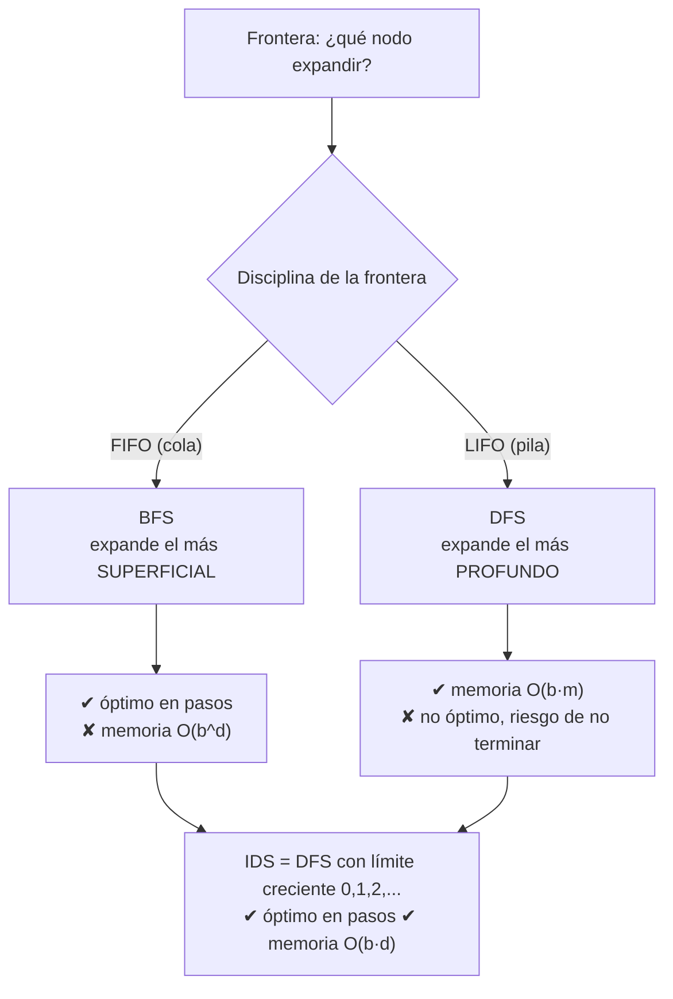

# 014 — Búsqueda en anchura y profundidad

> [← Clase anterior](../../../classes/part-01-symbolic-ai-search-logic-and-planning/013-espacios-de-estados-y-formulacion-de-problemas/README.md) · [Índice de la parte](../README.md) · [Clase siguiente →](../../../classes/part-01-symbolic-ai-search-logic-and-planning/015-costo-uniforme-busqueda-voraz-y-a/README.md)

**Parte:** 01 — IA simbólica, búsqueda, lógica y planificación  
**Nivel:** fundamentos · **Horas estimadas:** 4  
**Laboratorio:** `search` · **Estado:** `EXECUTABLE_CORE`

## 🎯 Propósito

Comprender **búsqueda en anchura y profundidad** dentro de la evolución de la inteligencia
artificial, implementar un experimento mínimo verificable y distinguir qué parte
constituye evidencia frente a una afirmación todavía no comprobada.

## 📚 Resultados de aprendizaje

Al finalizar podrás:

1. Explicar búsqueda en anchura y profundidad usando los conceptos `BFS`, `DFS`, `frontera`, `visitados`.
2. Ejecutar el laboratorio con una semilla explícita y revisar su contrato JSON.
3. Identificar al menos un supuesto, una limitación y un riesgo de aplicación.
4. Comparar el enfoque con la etapa anterior de la ruta de aprendizaje.
5. Producir una evidencia reproducible y una conclusión que no exceda los datos.

## 🧩 Conceptos centrales

`BFS`, `DFS`, `frontera`, `visitados`

## 🗺️ Ubicación en el mapa de la IA

BFS y DFS son los dos algoritmos de **búsqueda no informada** fundamentales: exploran el espacio de estados (clase 013) sin ninguna pista sobre dónde está el objetivo. Históricamente son anteriores a la IA misma (teoría de grafos), pero la IA los convirtió en motores de resolución de problemas generales. Son el baseline contra el que se mide toda búsqueda informada (clase 015) y la base de algoritmos posteriores: la profundización iterativa combina ambos, y el backtracking de los CSP (clase 018) es un DFS con poda.

## 📖 Fundamentos

### 🌊 BFS: búsqueda en anchura

BFS expande los nodos por **niveles de profundidad**: primero la raíz, luego todos sus sucesores, luego los sucesores de estos. La frontera es una **cola FIFO**. Con costos uniformes, el primer objetivo encontrado está a profundidad mínima.

```text
función BFS(problema):
    nodo ← Nodo(problema.s0)
    si IS-GOAL(nodo.estado): devolver nodo
    frontera ← cola FIFO con [nodo]
    alcanzados ← {problema.s0}
    mientras frontera no vacía:
        nodo ← frontera.pop_izquierda()
        para cada hijo en EXPANDIR(problema, nodo):
            s ← hijo.estado
            si IS-GOAL(s): devolver hijo          # test al GENERAR
            si s ∉ alcanzados:
                alcanzados.añadir(s)
                frontera.push_derecha(hijo)
    devolver FALLO
```

Detalle fino (AIMA 4e, §3.4.1): BFS puede aplicar el test de objetivo **al generar** el nodo (early goal test) porque la profundidad garantiza optimalidad en pasos; eso ahorra expandir un nivel entero, O(b^d) nodos.

### 🕳️ DFS: búsqueda en profundidad

DFS expande siempre el nodo **más profundo** de la frontera (pila LIFO o recursión). Baja por una rama hasta agotar sucesores y entonces **retrocede** (backtracking).

```text
función DFS-ARBOL(problema, nodo, límite):
    si IS-GOAL(nodo.estado): devolver nodo
    si límite = 0: devolver CORTE
    para cada hijo en EXPANDIR(problema, nodo):
        resultado ← DFS-ARBOL(problema, hijo, límite - 1)
        si resultado ≠ FALLO: devolver resultado
    devolver FALLO
```

Su virtud no es el tiempo sino la **memoria**: solo guarda la rama actual y los hermanos no expandidos, O(b·m) frente al O(b^d) exponencial de BFS. Su vicio: en grafos con ciclos (o espacios infinitos) sin control de repetidos, **no termina**; y la primera solución encontrada puede ser arbitrariamente peor que la óptima.

### 🔁 Profundización iterativa (IDS)

IDS ejecuta DFS con límite de profundidad 0, 1, 2, ... hasta encontrar solución. Parece derrochador, pero la mayoría de los nodos de un árbol están en el último nivel: el sobrecosto de repetir los niveles superiores es un factor constante (≈ b/(b−1)). IDS combina la memoria O(b·d) de DFS con la completitud y optimalidad (en pasos) de BFS, y es la opción no informada por defecto cuando el espacio es grande y la profundidad de la solución desconocida.

### 📚 Grafo vs. árbol: el conjunto `alcanzados`

Sin memoria de estados visitados (búsqueda en árbol), los caminos redundantes hacen el trabajo exponencialmente mayor: en una cuadrícula, un árbol de profundidad `d` tiene 4^d hojas pero solo O(d²) celdas distintas. La **búsqueda en grafo** mantiene `alcanzados` y descarta duplicados; cuesta memoria O(|estados|) pero evita la redundancia. La elección árbol/grafo es un trade-off memoria-tiempo, no un detalle de implementación.

## 🧮 Ejemplo trabajado

Grafo de 6 nodos (aristas no dirigidas), inicio `A`, objetivo `F`:

```text
A—B, A—C, B—D, C—E, D—F, E—F
```

**Traza BFS** (frontera FIFO, `alcanzados` al generar):

| Paso | Expande | Genera | Frontera después | Alcanzados |
|---|---|---|---|---|
| 1 | A | B, C | [B, C] | {A, B, C} |
| 2 | B | D (A ya alcanzado) | [C, D] | {A, B, C, D} |
| 3 | C | E | [D, E] | {A, ..., E} |
| 4 | D | **F** → objetivo al generar | — | — |

Solución: `A → B → D → F` (3 aristas, la mínima). Nodos expandidos: 4.

**Traza DFS** (orden alfabético de sucesores, evitando repetidos en la rama):

```text
A → B → D → F ✔   (encuentra F a profundidad 3)
```

Con este orden DFS tuvo suerte. Si los sucesores de `A` se visitaran en orden `C` primero: `A → C → E → F` también da 3. Pero en el grafo `A—B, B—C, C—F, A—F`, DFS por orden alfabético devuelve `A→B→C→F` (3 aristas) cuando existe `A→F` (1 arista): DFS **no garantiza** el camino más corto; BFS sí.

## 📊 Propiedades y comparación

Sea `b` el factor de ramificación, `d` la profundidad de la solución más superficial, `m` la profundidad máxima del espacio:

| Propiedad | BFS | DFS (árbol) | DFS limitado (ℓ) | IDS |
|---|---|---|---|---|
| Completo | Sí (b finito) | No (ciclos/∞) | No si ℓ < d | Sí (b finito) |
| Óptimo (en pasos) | Sí | No | No | Sí |
| Tiempo | O(b^d) | O(b^m) | O(b^ℓ) | O(b^d) |
| Memoria | O(b^d) | O(b·m) | O(b·ℓ) | O(b·d) |

El cuello de botella práctico de BFS es la **memoria**: con b = 10 y ~1 kB por nodo, la profundidad 10 exige del orden de 10 TB (estimación del propio AIMA); DFS a la misma profundidad usa kilobytes.



## ⚠️ Errores conceptuales frecuentes

1. **"DFS es más rápido que BFS."** Ambos son O(b^d)/O(b^m) en el peor caso; DFS ahorra *memoria*, no tiempo. Puede ser más rápido o catastróficamente más lento según dónde esté el objetivo.
2. **"BFS siempre encuentra la solución óptima."** Solo en número de pasos (costos uniformes). Con costos de acción distintos, la solución óptima la garantiza costo uniforme/Dijkstra (clase 015), no BFS.
3. **Olvidar `alcanzados` y sorprenderse de que DFS no termina.** En cualquier grafo con ciclos, la búsqueda en árbol pura entra en bucle; hay que controlar repetidos al menos sobre la rama actual.
4. **Creer que IDS "desperdicia" trabajo re-expandiendo niveles.** El último nivel domina el conteo: para b = 10, repetir los niveles superiores añade ~11 % de nodos. Es el precio de tener memoria lineal.
5. **Aplicar el early goal test a algoritmos de costo.** En BFS es válido; en costo uniforme/A* el test debe hacerse al *expandir*, no al generar, o se pierde la optimalidad.

## 🚀 Del aprendizaje a la operación

Un BFS/DFS de juguete opera sobre un grafo en memoria; en producción (crawlers, análisis de dependencias, verificación de modelos) el grafo vive detrás de APIs con latencia, límites de tasa y fallos parciales, y `alcanzados` puede requerir estructuras aproximadas (filtros de Bloom) o almacenamiento externo cuando hay miles de millones de estados. Además hacen falta cotas de tiempo/memoria con degradación controlada, paralelización de la frontera (BFS por niveles se distribuye bien; DFS no) y métricas de progreso, porque "sigue buscando" y "entró en bucle" son indistinguibles sin instrumentación.

## 🧪 Laboratorio

```bash
python lab.py
```

El laboratorio llama a `ai_evolution.labs.run_lab("search")`. Esta
decisión evita 180 implementaciones divergentes: cada clase tiene un entrypoint
propio, pero los motores didácticos se prueban como una biblioteca común.

### 🔍 Evidencia esperada

- tipo de laboratorio y semilla;
- entradas o decisiones observables;
- resultado estructurado;
- lista `evidence` con hechos que pueden inspeccionarse;
- lista `limitations` que impide presentar la demo como producción.

## 📓 Notebooks

- [📓 `notebook.ipynb`](notebook.ipynb): recorrido guiado con la materia resumida.
- [✍️ `notebook_student.ipynb`](notebook_student.ipynb): ejercicios para resolver.
- [✅ `notebook_solution.ipynb`](notebook_solution.ipynb): solución de referencia explicada.

## 📝 Evaluación

| Criterio | Peso |
|---|---:|
| Comprensión conceptual | 25 % |
| Ejecución reproducible | 25 % |
| Interpretación basada en evidencia | 25 % |
| Riesgos, límites y mejora propuesta | 25 % |

Consulta [assessment.md](assessment.md) para preguntas y criterio de aceptación.

## ⚠️ Errores comunes

| Síntoma | Causa probable | Corrección |
|---|---|---|
| El código corre, pero no hay conclusión | Se confundió ejecución con aprendizaje | Explica qué demuestra y qué no demuestra |
| El resultado cambia sin explicación | No se registró semilla o configuración | Conserva semilla, versión y parámetros |
| Se promete uso real | Se extrapoló desde una demo educativa | Declara entorno, datos, límites y revisión humana |
| Se copia una métrica aislada | No existe baseline ni costo de error | Añade comparación y criterio de decisión |

## ❓ Preguntas frecuentes

**¿Debo usar una API comercial?**  
No. El núcleo funciona localmente. Las extensiones LIVE se documentan por separado.

**¿El laboratorio representa una implementación industrial?**  
No por sí solo. Enseña el contrato y el patrón; producción exige integración,
seguridad, observabilidad, pruebas y operación.

**¿Dónde profundizo?**  
Revisa las especializaciones enlazadas en el README raíz y la ruta siguiente.

## 🔗 Referencias

- Russell, S. y Norvig, P. (2021). *AIMA* (4.ª ed.), §3.3-3.4 "Search Algorithms / Uninformed Search Strategies". [https://aima.cs.berkeley.edu/](https://aima.cs.berkeley.edu/)
- Moore, E. F. (1959). "The shortest path through a maze". *Proceedings of the International Symposium on the Theory of Switching* — origen de BFS para caminos mínimos.
- Korf, R. E. (1985). "Depth-first iterative-deepening: An optimal admissible tree search". *Artificial Intelligence*, 27(1). [https://doi.org/10.1016/0004-3702(85)90084-0](https://doi.org/10.1016/0004-3702(85)90084-0)
- Cormen, T. H. et al. (2022). *Introduction to Algorithms* (4.ª ed.), cap. 20 "Elementary Graph Algorithms" — BFS/DFS con análisis formal.

---

## ⬅️ Clase anterior

[013 — Espacios de estados y formulación de problemas](../../part-01-symbolic-ai-search-logic-and-planning/013-espacios-de-estados-y-formulacion-de-problemas/README.md)

## ➡️ Siguiente clase

[015 — Costo uniforme, búsqueda voraz y A*](../../part-01-symbolic-ai-search-logic-and-planning/015-costo-uniforme-busqueda-voraz-y-a/README.md)
