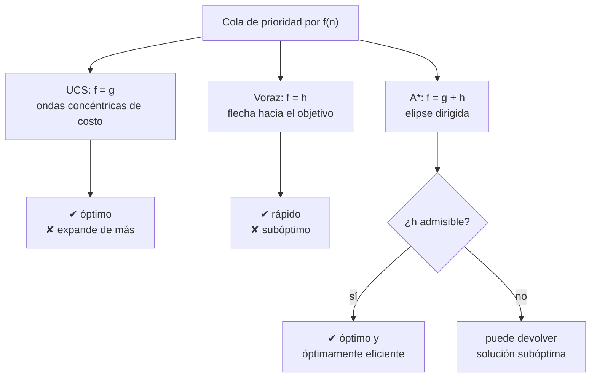

# 015 — Costo uniforme, búsqueda voraz y A*

> [← Clase anterior](../../../classes/part-01-symbolic-ai-search-logic-and-planning/014-busqueda-en-anchura-y-profundidad/README.md) · [Índice de la parte](../README.md) · [Clase siguiente →](../../../classes/part-01-symbolic-ai-search-logic-and-planning/016-diseno-y-validacion-de-heuristicas/README.md)

**Parte:** 01 — IA simbólica, búsqueda, lógica y planificación  
**Nivel:** fundamentos · **Horas estimadas:** 4  
**Laboratorio:** `search` · **Estado:** `EXECUTABLE_CORE`

## 🎯 Propósito

Comprender **costo uniforme, búsqueda voraz y a*** dentro de la evolución de la inteligencia
artificial, implementar un experimento mínimo verificable y distinguir qué parte
constituye evidencia frente a una afirmación todavía no comprobada.

## 📚 Resultados de aprendizaje

Al finalizar podrás:

1. Explicar costo uniforme, búsqueda voraz y a* usando los conceptos `UCS`, `greedy`, `A*`, `heurística`.
2. Ejecutar el laboratorio con una semilla explícita y revisar su contrato JSON.
3. Identificar al menos un supuesto, una limitación y un riesgo de aplicación.
4. Comparar el enfoque con la etapa anterior de la ruta de aprendizaje.
5. Producir una evidencia reproducible y una conclusión que no exceda los datos.

## 🧩 Conceptos centrales

`UCS`, `greedy`, `A*`, `heurística`

## 🗺️ Ubicación en el mapa de la IA

Esta clase da el salto de la búsqueda ciega (clase 014) a la **búsqueda informada**: usar conocimiento del dominio, empaquetado en una función heurística, para expandir menos nodos. A* (Hart, Nilsson y Raphael, 1968, desarrollado para el robot Shakey) es probablemente el algoritmo más influyente de la IA clásica: sigue siendo el estándar en videojuegos, robótica y planificación (los planificadores tipo Fast Downward son A* sobre espacios STRIPS). Prepara directamente la clase 016 (qué hace buena a una heurística).

## 📖 Fundamentos

### 🧭 Un solo algoritmo, tres funciones de evaluación

Los tres métodos son **best-first search** con frontera de prioridad ordenada por una función `f(n)`; solo cambia `f`:

| Algoritmo | f(n) | Usa costo real g | Usa heurística h |
|---|---|---|---|
| Costo uniforme (UCS / Dijkstra) | g(n) | ✔ | ✘ |
| Voraz (greedy best-first) | h(n) | ✘ | ✔ |
| A* | g(n) + h(n) | ✔ | ✔ |

donde `g(n)` es el costo acumulado desde el inicio hasta `n`, y `h(n)` es una **estimación** del costo desde `n` hasta el objetivo, con `h(objetivo) = 0`.

```text
función BEST-FIRST(problema, f):
    nodo ← Nodo(problema.s0, g=0)
    frontera ← cola de prioridad ordenada por f, con [nodo]
    alcanzados ← {problema.s0: nodo}
    mientras frontera no vacía:
        nodo ← frontera.pop_min()
        si IS-GOAL(nodo.estado): devolver nodo    # test al EXPANDIR
        para cada hijo en EXPANDIR(problema, nodo):
            s ← hijo.estado
            si s ∉ alcanzados o hijo.g < alcanzados[s].g:
                alcanzados[s] ← hijo               # re-apertura por camino mejor
                frontera.push(hijo)
    devolver FALLO
```

Dos detalles no negociables: el test de objetivo se hace **al expandir** (al sacar de la cola), no al generar — de lo contrario UCS y A* pierden la optimalidad —; y un estado ya alcanzado se **reabre** si aparece un camino más barato.

### 💰 Costo uniforme: optimalidad sin información

UCS expande siempre el nodo de menor `g`. Cuando extrae un nodo de la frontera, ya no puede existir camino más barato hasta él (todos los costos son ≥ 0): por eso es **óptimo y completo** si los costos de acción son ≥ ε > 0. Es la generalización de BFS a costos arbitrarios y equivale al algoritmo de Dijkstra con un solo destino. Su complejidad se expresa en función del costo óptimo `C*`: O(b^(1+⌊C*/ε⌋)), que puede ser mucho peor que O(b^d) si hay acciones muy baratas.

### 🎯 Voraz: rápida y ciega al pasado

La búsqueda voraz expande el nodo que *parece* más cercano al objetivo (`f = h`). Suele llegar rápido, pero ignora lo gastado: puede tomar caminos largos que "apuntan bien" y, con búsqueda en árbol, entrar en bucles. No es óptima ni completa (en árbol); su interés es que expande muy pocos nodos cuando la heurística es razonable.

### ⭐ A*: lo mejor de ambos

A* ordena por `f(n) = g(n) + h(n)`: el costo estimado de la mejor solución *que pasa por n*. Sus garantías dependen de la heurística (definiciones formales en la clase 016):

- Con `h` **admisible** (nunca sobreestima): A* con búsqueda en árbol es **óptimo**.
- Con `h` **consistente** (`h(n) ≤ c(n, a, n′) + h(n′)`): A* con búsqueda en grafo es óptimo y nunca necesita reabrir nodos; los valores `f` a lo largo de cualquier camino son no decrecientes.
- A* es **óptimamente eficiente**: ningún algoritmo óptimo que use la misma `h` puede evitar expandir los nodos con `f(n) < C*`.

Su límite práctico es la memoria: guarda toda la frontera y los alcanzados, exponencial en el peor caso. Variantes como IDA* y SMA* cambian tiempo por memoria.

## 🧮 Ejemplo trabajado

Grafo dirigido con costos; inicio `S`, objetivo `G`. Heurística entre paréntesis:

```text
S(6) --2--> A(4)     S --3--> B(2)
A --3--> C(1)        B --4--> C(1)
C --2--> G(0)        B --6--> G(0)
```

Verificación de admisibilidad: los costos reales al objetivo son h*(S)=7, h*(A)=5, h*(B)=6, h*(C)=2; cada `h` está por debajo ✔.

**Traza de A*** (`f = g + h`; la frontera muestra `estado: g+h=f`):

| Paso | Expande | Frontera después |
|---|---|---|
| 0 | — | S: 0+6=6 |
| 1 | S (f=6) | A: 2+4=6, B: 3+2=5 |
| 2 | B (f=5) | A: 6, C: 7+1=8 (vía B), G: 9+0=9 |
| 3 | A (f=6) | C: **5+1=6** (vía A, reabre: 5 < 7), G: 9 |
| 4 | C (f=6) | G: **7**+0=7 (vía A-C, mejora 9) |
| 5 | G (f=7) | ✔ solución S→A→C→G, costo 7 |

- **Voraz** habría hecho: S → B (h=2) → G (h=0): devuelve S→B→G con costo 9 ≠ óptimo.
- **UCS** expande S(0), A(2), B(3), C(5), G(7): mismo resultado que A* pero ordenando por `g` puro; en grafos grandes expande muchos más nodos que A*.
- El paso 3 muestra la **re-apertura**: C se había alcanzado vía B con g=7 y se sustituye al hallar g=5. Esta `h` es admisible pero **no consistente**: h(S)=6 > c(S,B)+h(B)=3+2=5, y esa subestimación relativa de B hizo que B se expandiera "demasiado pronto"; por eso hubo reapertura.

## 📊 Propiedades y comparación

| Propiedad | UCS | Voraz | A* (h admisible/consistente) |
|---|---|---|---|
| Completo | Sí (costos ≥ ε > 0) | Solo en grafo finito | Sí |
| Óptimo | Sí | No | Sí |
| Tiempo | O(b^(1+⌊C*/ε⌋)) | O(b^m), a menudo mucho menos | exponencial en el error de h |
| Memoria | como el tiempo | como el tiempo | guarda frontera + alcanzados |
| Necesita h | No | Sí | Sí |
| Nodos expandidos | muchos (círculo de radio C*) | pocos | intermedio: todos con f(n) < C* |



## ⚠️ Errores conceptuales frecuentes

1. **Testear el objetivo al generar el nodo (como en BFS).** UCS y A* deben testearlo al *expandir*; el primer camino que genera el objetivo puede no ser el más barato (véase el paso 2 vs. 5 del ejemplo).
2. **"A* siempre es más rápido que UCS."** Solo si `h` aporta información; con `h = 0`, A* *es* UCS. Y una `h` cara de calcular puede hacer que A* pierda en tiempo de reloj aunque expanda menos nodos.
3. **"Greedy no sirve porque no es óptimo."** En problemas donde cualquier solución razonable vale y el tiempo apremia, voraz (o weighted A*, `f = g + w·h`) es la elección correcta consciente del trade-off.
4. **Ignorar la re-apertura de nodos.** Con heurística admisible pero no consistente, marcar estados como "cerrados para siempre" rompe la optimalidad de A* en grafo.
5. **Confundir el costo del camino con la profundidad.** UCS con costos uniformes degenera en BFS; la diferencia solo aparece cuando `c` varía por acción.

## 🚀 Del aprendizaje a la operación

Entre este laboratorio y un A* de producción (navegación, videojuegos, ruteo logístico) median: heurísticas específicas del dominio validadas empíricamente (clase 016), estructuras de datos afinadas (montículos con decrease-key o cubetas), preprocesamiento del grafo (contraction hierarchies en mapas reales, que dejan a Dijkstra puro obsoleto a escala continental), replanificación incremental cuando el mundo cambia (D* Lite en robótica) y límites de memoria explícitos con degradación a variantes anytime. Además, el grafo real viene de datos con errores: un costo mal cargado invalida la "optimalidad" sin que el algoritmo lo detecte.

## 🧪 Laboratorio

```bash
python lab.py
```

El laboratorio llama a `ai_evolution.labs.run_lab("search")`. Esta
decisión evita 183 implementaciones divergentes: cada clase tiene un entrypoint
propio, pero los motores didácticos se prueban como una biblioteca común.

### 🔍 Evidencia esperada

- tipo de laboratorio y semilla;
- entradas o decisiones observables;
- resultado estructurado;
- lista `evidence` con hechos que pueden inspeccionarse;
- lista `limitations` que impide presentar la demo como producción.

## 📓 Notebooks

- [📓 `notebook.ipynb`](notebook.ipynb): recorrido guiado con la materia resumida.
- [✍️ `notebook_student.ipynb`](notebook_student.ipynb): ejercicios para resolver.
- [✅ `notebook_solution.ipynb`](notebook_solution.ipynb): solución de referencia explicada.

## 📝 Evaluación

| Criterio | Peso |
|---|---:|
| Comprensión conceptual | 25 % |
| Ejecución reproducible | 25 % |
| Interpretación basada en evidencia | 25 % |
| Riesgos, límites y mejora propuesta | 25 % |

Consulta [assessment.md](assessment.md) para preguntas y criterio de aceptación.

## ⚠️ Errores comunes

| Síntoma | Causa probable | Corrección |
|---|---|---|
| El código corre, pero no hay conclusión | Se confundió ejecución con aprendizaje | Explica qué demuestra y qué no demuestra |
| El resultado cambia sin explicación | No se registró semilla o configuración | Conserva semilla, versión y parámetros |
| Se promete uso real | Se extrapoló desde una demo educativa | Declara entorno, datos, límites y revisión humana |
| Se copia una métrica aislada | No existe baseline ni costo de error | Añade comparación y criterio de decisión |

## ❓ Preguntas frecuentes

**¿Debo usar una API comercial?**  
No. El núcleo funciona localmente. Las extensiones LIVE se documentan por separado.

**¿El laboratorio representa una implementación industrial?**  
No por sí solo. Enseña el contrato y el patrón; producción exige integración,
seguridad, observabilidad, pruebas y operación.

**¿Dónde profundizo?**  
Revisa las especializaciones enlazadas en el README raíz y la ruta siguiente.

## 🔗 Referencias

- Hart, P. E., Nilsson, N. J. y Raphael, B. (1968). "A Formal Basis for the Heuristic Determination of Minimum Cost Paths". *IEEE Trans. on Systems Science and Cybernetics*, 4(2). [https://doi.org/10.1109/TSSC.1968.300136](https://doi.org/10.1109/TSSC.1968.300136) — uso: fuente primaria del mecanismo estudiado
- Dijkstra, E. W. (1959). "A note on two problems in connexion with graphs". *Numerische Mathematik*, 1. [https://doi.org/10.1007/BF01386390](https://doi.org/10.1007/BF01386390) — uso: fuente primaria del mecanismo estudiado
- Russell, S. y Norvig, P. (2021). *AIMA* (4.ª ed.), §3.5 "Informed (Heuristic) Search Strategies". [https://aima.cs.berkeley.edu/](https://aima.cs.berkeley.edu/) — uso: desarrollo extendido del tema
- Pearl, J. (1984). *Heuristics: Intelligent Search Strategies for Computer Problem Solving*. Addison-Wesley — análisis formal de A* y sus variantes.

<!-- papers:inicio -->

---

## 📜 Papers que fundamentan esta clase

> Bloque generado por `python scripts/link_papers_to_classes.py`. La fuente es [`papers/catalog/papers.json`](../../../papers/catalog/papers.json).

| Paper | Año | Qué desbloqueó | Miniatura |
|---|---:|---|---|
| [P67 · Una base formal para la determinación heurística de caminos de coste mínimo](../../../papers/foundational/P67_a_estrella/README.md) | 1968 | Convierte la heurística de recurso práctico en garantía demostrable: si nunca sobrestima, el camino encontrado es óptimo. | [notebook](../../../notebooks/papers/P67_a_estrella.ipynb) |

Cada ficha explica el problema anterior, la matemática mínima, los límites y los errores de atribución más frecuentes. Para leerlas con método: [cómo leer un paper de IA](../../../papers/guides/COMO_LEER_UN_PAPER_DE_IA.md) · [anexos matemáticos](../../../papers/annexes/README.md).
<!-- papers:fin -->
---

## ⬅️ Clase anterior

[014 — Búsqueda en anchura y profundidad](../../part-01-symbolic-ai-search-logic-and-planning/014-busqueda-en-anchura-y-profundidad/README.md)

## ➡️ Siguiente clase

[016 — Diseño y validación de heurísticas](../../part-01-symbolic-ai-search-logic-and-planning/016-diseno-y-validacion-de-heuristicas/README.md)
