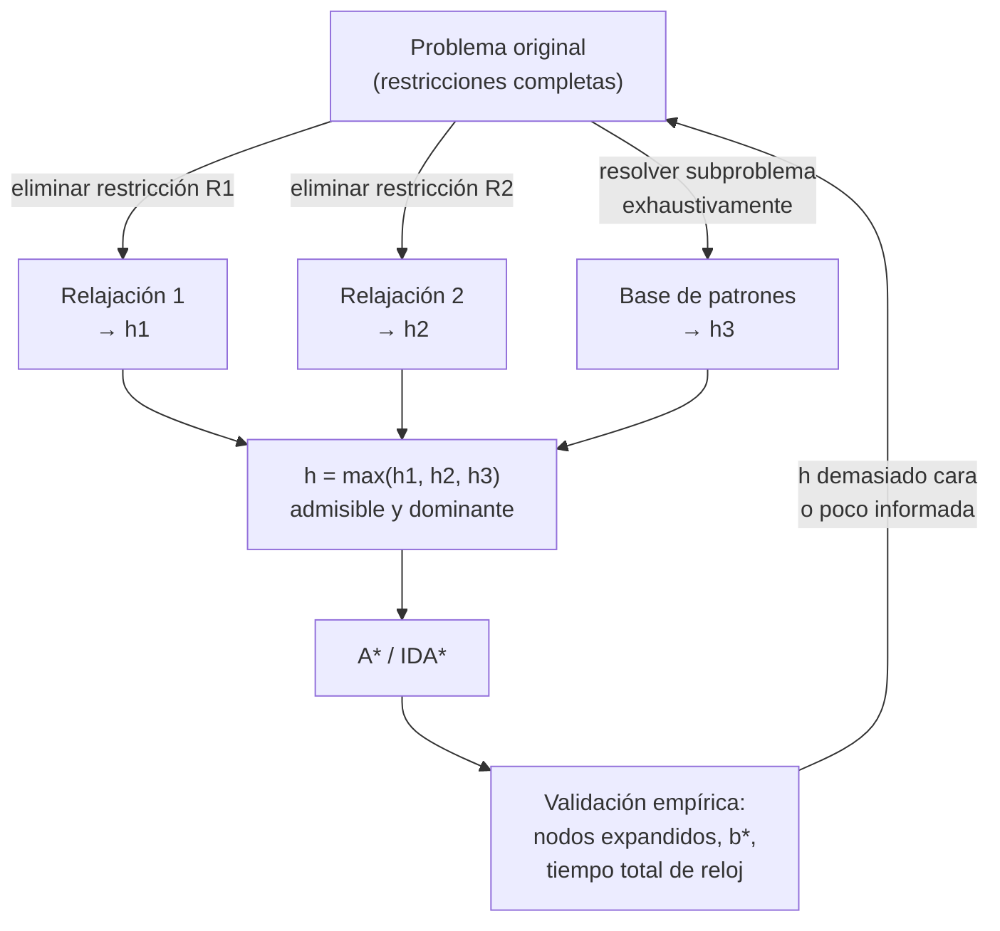

# Teoría — Diseño y validación de heurísticas

## 🗺️ Ubicación en el mapa de la IA

Las garantías de A* (clase 015) valen lo que valga su heurística: esta clase estudia qué hace a una heurística *correcta* (admisibilidad, consistencia) y *buena* (dominancia, factor de ramificación efectivo). La idea central — derivar heurísticas resolviendo **problemas relajados** — reaparece en toda la IA: las heurísticas de los planificadores PDDL (clase 023) son relajaciones automáticas, y las bases de datos de patrones anticipan la idea de precomputar conocimiento que luego guía la búsqueda, como hoy hacen las funciones de valor aprendidas en RL.

## 📖 Fundamentos

### ✅ Admisibilidad

Una heurística `h` es **admisible** si nunca sobreestima el costo real mínimo al objetivo:

```text
∀n:  0 ≤ h(n) ≤ h*(n)        donde h*(n) = costo óptimo real de n al objetivo
```

Es una garantía de *optimismo*: la solución puede ser peor de lo que `h` promete, nunca mejor. Con `h` admisible, A* en árbol devuelve siempre una solución óptima: si devolviera una subóptima de costo C > C*, algún nodo del camino óptimo tendría f(n) = g(n) + h(n) ≤ C* < C y habría sido expandido antes.

### 🔗 Consistencia (monotonía)

`h` es **consistente** si cumple la desigualdad triangular con cada arista:

```text
∀n, a, n' sucesor:  h(n) ≤ c(n, a, n') + h(n')      y  h(objetivo) = 0
```

Consistencia ⇒ admisibilidad (se prueba por inducción sobre la longitud del camino al objetivo), pero no al revés. Su consecuencia operativa: los valores `f` son no decrecientes a lo largo de cualquier camino, así que la primera vez que A* en grafo *expande* un estado ya lo hace con su `g` óptimo y **nunca hay que reabrir nodos**. Casi todas las heurísticas naturales (distancias geométricas, relajaciones) son consistentes; construir una admisible-pero-inconsistente requiere cierto esfuerzo deliberado.

### 🏆 Dominancia y calidad

Si `h2(n) ≥ h1(n)` para todo `n` (ambas admisibles), `h2` **domina** a `h1` y A* con `h2` nunca expande más nodos que con `h1` (salvo empates en f = C*). Regla práctica: entre heurísticas admisibles, gana la más grande. De hecho, el **máximo** de varias admisibles es admisible y las domina a todas:

```text
h(n) = max(h1(n), h2(n), ..., hk(n))
```

La calidad se mide empíricamente con el **factor de ramificación efectivo** b*: si A* expandió N nodos para una solución a profundidad d, b* es la solución de `N + 1 = 1 + b* + (b*)² + ... + (b*)^d`. Una heurística buena acerca b* a 1. Para el 8-puzzle a profundidad d = 12 (datos de AIMA): IDS expande 3 644 035 nodos (b* ≈ 2,78), A* con fichas mal colocadas 227 (b* ≈ 1,42), A* con Manhattan 73 (b* ≈ 1,24).

### 🛠️ De dónde salen: problemas relajados

Método sistemático: **eliminar restricciones** del problema. El costo óptimo del problema relajado es una cota inferior del original (todo camino del original sigue siendo válido en el relajado), luego es admisible; y como se calcula sobre el problema relajado *resuelto exactamente*, suele ser consistente.

- 8-puzzle, regla original: "una ficha se mueve a la casilla adyacente vacía".
  - Relajación 1: "una ficha se mueve a cualquier casilla" → `h1` = número de fichas mal colocadas.
  - Relajación 2: "una ficha se mueve a una casilla adyacente (aunque esté ocupada)" → `h2` = suma de distancias Manhattan. `h2` domina a `h1`.
- Rutas en mapa: relajar "moverse por carreteras" a "volar en línea recta" → distancia euclídea.

Otras dos fuentes: **bases de datos de patrones** (resolver exhaustivamente subproblemas — p. ej. solo las fichas 1-4 — y tabular los costos exactos, Culberson y Schaeffer 1998) y **aprendizaje** de h a partir de instancias resueltas (sin garantía de admisibilidad, salvo que se acote).

### ⚖️ El trade-off real

Una heurística más informada expande menos nodos pero cuesta más por nodo. El tiempo total es ≈ `nodos_expandidos × (costo_generación + costo_h)`. Una `h` perfecta (h = h*) reduce la búsqueda a seguir el camino óptimo, pero calcular h* equivale a resolver el problema. El punto óptimo está en heurísticas baratas y razonablemente informadas — o precomputadas, pagando memoria en vez de tiempo.

## 🧮 Ejemplo trabajado

Estado del 8-puzzle (0 = hueco) y objetivo estándar:

```text
estado s:  7 2 4        objetivo:  0 1 2
           5 0 6                   3 4 5
           8 3 1                   6 7 8
```

**h1 (fichas mal colocadas):** comparando casilla a casilla, las 8 fichas están fuera de su lugar → `h1(s) = 8`.

**h2 (Manhattan):** distancia |Δfila| + |Δcolumna| de cada ficha a su posición objetivo:

| Ficha | 1 | 2 | 3 | 4 | 5 | 6 | 7 | 8 |
|---|---|---|---|---|---|---|---|---|
| Posición actual (f,c) | (2,2) | (0,1) | (2,1) | (0,2) | (1,0) | (1,2) | (0,0) | (2,0) |
| Posición objetivo (f,c) | (0,1) | (0,2) | (1,0) | (1,1) | (1,2) | (2,0) | (2,1) | (2,2) |
| Distancia | 3 | 1 | 2 | 1 | 2 | 3 | 2 | 2 |

`h2(s) = 3+1+2+1+2+3+2+2 = 16`. El costo real es `h*(s) = 26` (instancia usada en AIMA): ambas son cotas inferiores (8 ≤ 16 ≤ 26 ✔) y `h2` domina a `h1`, así que A* con `h2` expandirá menos nodos. Nótese cuánta información pierde `h1`: sabe *que* las fichas están mal, no *cuán lejos*.

## 📊 Propiedades y comparación

| Heurística (8-puzzle) | Admisible | Consistente | Informatividad | Costo de cálculo |
|---|---|---|---|---|
| h0 = 0 (UCS) | Sí | Sí | nula | O(1) |
| h1 = fichas mal colocadas | Sí | Sí | baja | O(k) |
| h2 = Manhattan | Sí | Sí | media (domina h1) | O(k) |
| Conflictos lineales + Manhattan | Sí | Sí | alta | O(k²) |
| Base de datos de patrones | Sí | Sí | muy alta | O(1) consulta + memoria/precómputo |
| h aprendida sin cota | No garantizado | No garantizado | variable | según modelo |



## ⚠️ Errores conceptuales frecuentes

1. **"Si h es admisible, A* es rápido."** Admisibilidad garantiza *optimalidad del resultado*, no eficiencia: h = 0 es admisible y da UCS. La velocidad depende de cuán cerca esté h de h*.
2. **Confundir admisible con consistente.** Toda consistente es admisible; lo inverso es falso. Con admisible-no-consistente, A* en grafo debe permitir reabrir nodos o pierde optimalidad.
3. **Sumar heurísticas admisibles y asumir que la suma es admisible.** En general sobreestima (cuenta los mismos movimientos dos veces). Solo es válido si son **aditivas/disjuntas** (p. ej. bases de patrones disjuntas, donde cada movimiento se acredita a un solo patrón). La combinación siempre segura es `max`.
4. **Escalar la heurística "para que busque más rápido" y esperar optimalidad.** `w·h` con w > 1 (weighted A*) puede sobreestimar: gana velocidad y pierde la garantía, acotando el resultado por w·C*. Es un trade-off legítimo, pero hay que declararlo.
5. **Validar solo con una instancia.** La calidad de una heurística se reporta sobre un conjunto de instancias (media de nodos expandidos, b*, tiempo total), no sobre el caso donde funcionó bien.

## 🚀 Del aprendizaje a la operación

En producción, la heurística se elige con *benchmarks* del dominio real, no con intuición: hay que medir nodos expandidos, tiempo de reloj y memoria sobre cargas representativas, y repetir la medición cuando el dominio cambia (un mapa con obras rompe la calibración de una h aprendida). Las bases de patrones exigen decidir cuánta memoria dedicar al precómputo y regenerarla en cada cambio de dominio. Y si se usan heurísticas aprendidas sin garantía de admisibilidad, el sistema debe declarar que las soluciones pueden ser subóptimas y acotar empíricamente cuánto.

## 🔗 Referencias

- Russell, S. y Norvig, P. (2021). *AIMA* (4.ª ed.), §3.6 "Heuristic Functions". [https://aima.cs.berkeley.edu/](https://aima.cs.berkeley.edu/)
- Pearl, J. (1984). *Heuristics: Intelligent Search Strategies for Computer Problem Solving*. Addison-Wesley — el tratado clásico sobre heurísticas admisibles y su análisis.
- Culberson, J. C. y Schaeffer, J. (1998). "Pattern Databases". *Computational Intelligence*, 14(3). [https://doi.org/10.1111/0824-7935.00065](https://doi.org/10.1111/0824-7935.00065)
- Felner, A., Korf, R. E. y Hanan, S. (2004). "Additive Pattern Database Heuristics". *JAIR*, 22. [https://doi.org/10.1613/jair.1480](https://doi.org/10.1613/jair.1480)

---

> [⬅️ Volver a la clase](README.md) · [📝 Evaluación](assessment.md) · [📚 Índice de la parte](../README.md)
