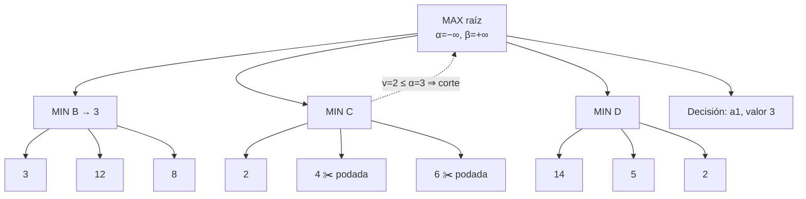

# 017 — Juegos: minimax y poda alfa-beta

> [← Clase anterior](../../../classes/part-01-symbolic-ai-search-logic-and-planning/016-diseno-y-validacion-de-heuristicas/README.md) · [Índice de la parte](../README.md) · [Clase siguiente →](../../../classes/part-01-symbolic-ai-search-logic-and-planning/018-problemas-de-satisfaccion-de-restricciones/README.md)

**Parte:** 01 — IA simbólica, búsqueda, lógica y planificación  
**Nivel:** fundamentos · **Horas estimadas:** 4  
**Laboratorio:** `search` · **Estado:** `EXECUTABLE_CORE`

## 🎯 Propósito

Comprender **juegos: minimax y poda alfa-beta** dentro de la evolución de la inteligencia
artificial, implementar un experimento mínimo verificable y distinguir qué parte
constituye evidencia frente a una afirmación todavía no comprobada.

## 📚 Resultados de aprendizaje

Al finalizar podrás:

1. Explicar juegos: minimax y poda alfa-beta usando los conceptos `minimax`, `alfa-beta`, `adversarial`, `utilidad`.
2. Ejecutar el laboratorio con una semilla explícita y revisar su contrato JSON.
3. Identificar al menos un supuesto, una limitación y un riesgo de aplicación.
4. Comparar el enfoque con la etapa anterior de la ruta de aprendizaje.
5. Producir una evidencia reproducible y una conclusión que no exceda los datos.

## 🧩 Conceptos centrales

`minimax`, `alfa-beta`, `adversarial`, `utilidad`

## 🗺️ Ubicación en el mapa de la IA

La búsqueda adversarial extiende la búsqueda en espacios de estados (clases 013-016) a entornos con un **oponente** que elige contra nosotros. Minimax formaliza la idea de von Neumann (teorema minimax, 1928) como algoritmo; el programa de damas de Samuel (1959) y Deep Blue (1997) son sus hitos. La línea evolutiva continúa: AlphaGo (2016) sustituyó la función de evaluación manual por redes neuronales y el barrido exhaustivo por búsqueda de árbol Monte Carlo, pero el esqueleto — explorar un árbol de jugadas alternadas y respaldar valores — sigue siendo el de esta clase.

## 📖 Fundamentos

### 🎲 Formulación de un juego

Un juego de suma cero, dos jugadores, turnos alternos e información perfecta se define con: estado inicial `s0`, `TO-MOVE(s)` (a quién le toca), `ACTIONS(s)`, `RESULT(s, a)`, `IS-TERMINAL(s)` y `UTILITY(s, jugador)` (valor numérico del estado terminal: p. ej. +1 victoria, 0 tablas, −1 derrota). **Suma cero** significa que lo que gana MAX lo pierde MIN, así que basta un solo número por estado.

### ♟️ Minimax

El **valor minimax** de un estado es la utilidad que obtiene MAX si ambos juegan perfectamente de ahí en adelante:

```text
MINIMAX(s) =
    UTILITY(s, MAX)                                si IS-TERMINAL(s)
    max_{a ∈ ACTIONS(s)} MINIMAX(RESULT(s, a))     si TO-MOVE(s) = MAX
    min_{a ∈ ACTIONS(s)} MINIMAX(RESULT(s, a))     si TO-MOVE(s) = MIN
```

El algoritmo es un recorrido DFS del árbol de juego que **respalda** (backs up) los valores desde las hojas: cada nodo MAX toma el máximo de sus hijos, cada nodo MIN el mínimo. Es óptimo *contra un oponente óptimo*; contra un oponente que falla, garantiza al menos ese valor (puede existir otra línea que explote mejor los errores, pero minimax nunca hace peor que su garantía). Complejidad: tiempo O(b^m), memoria O(b·m) — inviable para ajedrez (b ≈ 35, m ≈ 80).

### ✂️ Poda alfa-beta

Idea: mantener durante el recorrido dos cotas del valor que los jugadores ya tienen garantizado en el camino desde la raíz:

- **α**: la mejor opción (máxima) asegurada para MAX hasta ahora.
- **β**: la mejor opción (mínima) asegurada para MIN hasta ahora.

Si en un nodo MIN el valor cae a `v ≤ α`, MAX nunca permitirá llegar aquí (ya tiene algo mejor): se **poda** el resto de hijos. Simétricamente en nodos MAX cuando `v ≥ β`.

```text
función ALFA-BETA(s, α, β):
    si IS-TERMINAL(s): devolver UTILITY(s, MAX)
    si TO-MOVE(s) = MAX:
        v ← −∞
        para cada a en ACTIONS(s):
            v ← max(v, ALFA-BETA(RESULT(s,a), α, β))
            si v ≥ β: devolver v          # poda: MIN nunca dejará llegar aquí
            α ← max(α, v)
        devolver v
    si no:  # MIN
        v ← +∞
        para cada a en ACTIONS(s):
            v ← min(v, ALFA-BETA(RESULT(s,a), α, β))
            si v ≤ α: devolver v          # poda: MAX tiene algo mejor
            β ← min(β, v)
        devolver v
```

La poda **no altera el resultado**: devuelve exactamente el valor minimax. Con **ordenación perfecta** de jugadas (probar primero la mejor) examina O(b^(m/2)) nodos — duplica la profundidad alcanzable con el mismo presupuesto (Knuth y Moore, 1975); con orden aleatorio, ≈ O(b^(3m/4)). Por eso los motores invierten tanto en ordenar jugadas (jugada de la tabla de transposición primero, capturas, killer moves).

### ⏱️ Búsqueda con recursos finitos

Ningún juego interesante se explora hasta las hojas. Se corta a profundidad `d` y se aplica una **función de evaluación** `EVAL(s)`: una estimación de la utilidad esperada, típicamente lineal en rasgos (`EVAL(s) = Σ wi·fi(s)`; en ajedrez: material, movilidad, estructura de peones). Problemas asociados: el **efecto horizonte** (una pérdida inevitable se "empuja" más allá del corte con jadeos tácticos) se mitiga con **búsqueda de quiescencia** (extender el corte hasta posiciones tranquilas, sin capturas pendientes); las **tablas de transposición** cachean valores de estados repetidos alcanzados por distinto orden de jugadas; la **profundización iterativa** da control de tiempo y mejora la ordenación con la mejor jugada de la iteración anterior.

## 🧮 Ejemplo trabajado

Árbol de profundidad 2: la raíz es MAX con tres jugadas (a1, a2, a3); cada hijo es un nodo MIN con tres hojas:

```text
                MAX
       a1     /  a2 |  a3 \
       MIN B     MIN C     MIN D
      /3 12 8\  /2 4 6\   /14 5 2\
```

**Minimax puro:** B = min(3,12,8) = 3; C = min(2,4,6) = 2; D = min(14,5,2) = 2; raíz = max(3,2,2) = **3** → jugar a1. Hojas evaluadas: 9.

**Alfa-beta** (izquierda a derecha, raíz con α=−∞, β=+∞):

```text
B: ve 3, 12, 8 → B = 3.  Raíz: α = 3.
C: primera hoja 2 → v = 2 ≤ α = 3 → PODA (no mira 4 ni 6). C ≤ 2, irrelevante.
D: primera hoja 14 → v = 14, β_D = 14... segunda hoja 5 → v = 5,
   tercera hoja 2 → v = 2 ≤ α = 3 → D ≤ 2, descartado.
Raíz = 3, jugar a1. Hojas evaluadas: 7 de 9.
```

Con ordenación óptima (explorar D en orden 2, 5, 14) la poda habría sido inmediata tras la primera hoja de C y de D: 5 hojas. La ganancia de alfa-beta *depende del orden*, no de la suerte del árbol.

## 📊 Propiedades y comparación

| Propiedad | Minimax | Alfa-beta | Alfa-beta + orden perfecto | MCTS (contraste) |
|---|---|---|---|---|
| Resultado | valor exacto | idéntico a minimax | idéntico | estimación estadística |
| Tiempo | O(b^m) | ≈ O(b^(3m/4)) típico | O(b^(m/2)) | presupuesto fijo de simulaciones |
| Memoria | O(b·m) | O(b·m) | O(b·m) | árbol parcial en memoria |
| Requiere EVAL | sí (con corte) | sí (con corte) | sí | no (rollouts) o red de valor |
| Dónde brilla | árboles pequeños | juegos tácticos (ajedrez) | con buenas jugadas-candidato | b enorme, EVAL difícil (Go) |



## ⚠️ Errores conceptuales frecuentes

1. **"Alfa-beta es una aproximación que sacrifica exactitud por velocidad."** Falso: devuelve exactamente el valor minimax. Lo aproximado es la función de evaluación al cortar profundidad, no la poda.
2. **"Minimax asume que el rival es perfecto, así que contra malos jugadores es malo."** Contra un rival subóptimo minimax obtiene *al menos* su valor garantizado. Lo que sí es cierto: no modela al oponente, así que no *explota* sus debilidades.
3. **Podar comparando valores de hojas en vez de cotas del camino.** α y β son garantías acumuladas *desde la raíz*; usarlas como valores locales del nodo produce podas incorrectas.
4. **Ignorar el orden de exploración.** Alfa-beta con mal orden se acerca a minimax puro. La mitad de la ingeniería de un motor real es ordenación de jugadas.
5. **Evaluar en posiciones "calientes".** Cortar en medio de un intercambio de capturas hace que EVAL mida ruido (efecto horizonte); la quiescencia existe precisamente para eso.

## 🚀 Del aprendizaje a la operación

Entre este laboratorio y un motor de juego real median: función de evaluación calibrada (hoy, redes NNUE entrenadas con millones de posiciones), tablas de transposición con gestión de memoria y colisiones, control de tiempo por jugada con profundización iterativa, paralelización (Lazy SMP) y bancos de pruebas de regresión (miles de partidas contra versiones anteriores para validar cada cambio con significancia estadística). Además, para juegos con azar o información oculta (backgammon, póker) minimax puro no basta: hacen falta expectiminimax o equilibrios de teoría de juegos.

## 🧪 Laboratorio

```bash
python lab.py
```

El laboratorio llama a `ai_evolution.labs.run_lab("search")`. Esta
decisión evita 183 implementaciones divergentes: cada clase tiene un entrypoint
propio, pero los motores didácticos se prueban como una biblioteca común.

### 🔍 Evidencia esperada

- tipo de laboratorio y semilla;
- entradas o decisiones observables;
- resultado estructurado;
- lista `evidence` con hechos que pueden inspeccionarse;
- lista `limitations` que impide presentar la demo como producción.

## 📓 Notebooks

- [📓 `notebook.ipynb`](notebook.ipynb): recorrido guiado con la materia resumida.
- [✍️ `notebook_student.ipynb`](notebook_student.ipynb): ejercicios para resolver.
- [✅ `notebook_solution.ipynb`](notebook_solution.ipynb): solución de referencia explicada.

## 📝 Evaluación

| Criterio | Peso |
|---|---:|
| Comprensión conceptual | 25 % |
| Ejecución reproducible | 25 % |
| Interpretación basada en evidencia | 25 % |
| Riesgos, límites y mejora propuesta | 25 % |

Consulta [assessment.md](assessment.md) para preguntas y criterio de aceptación.

## ⚠️ Errores comunes

| Síntoma | Causa probable | Corrección |
|---|---|---|
| El código corre, pero no hay conclusión | Se confundió ejecución con aprendizaje | Explica qué demuestra y qué no demuestra |
| El resultado cambia sin explicación | No se registró semilla o configuración | Conserva semilla, versión y parámetros |
| Se promete uso real | Se extrapoló desde una demo educativa | Declara entorno, datos, límites y revisión humana |
| Se copia una métrica aislada | No existe baseline ni costo de error | Añade comparación y criterio de decisión |

## ❓ Preguntas frecuentes

**¿Debo usar una API comercial?**  
No. El núcleo funciona localmente. Las extensiones LIVE se documentan por separado.

**¿El laboratorio representa una implementación industrial?**  
No por sí solo. Enseña el contrato y el patrón; producción exige integración,
seguridad, observabilidad, pruebas y operación.

**¿Dónde profundizo?**  
Revisa las especializaciones enlazadas en el README raíz y la ruta siguiente.

## 🔗 Referencias

- Russell, S. y Norvig, P. (2021). *AIMA* (4.ª ed.), cap. 5 "Adversarial Search and Games". [https://aima.cs.berkeley.edu/](https://aima.cs.berkeley.edu/)
- Knuth, D. E. y Moore, R. W. (1975). "An Analysis of Alpha-Beta Pruning". *Artificial Intelligence*, 6(4). [https://doi.org/10.1016/0004-3702(75)90019-3](https://doi.org/10.1016/0004-3702%2875%2990019-3)
- Shannon, C. E. (1950). "Programming a Computer for Playing Chess". *Philosophical Magazine*, 41(314) — el paper fundacional del ajedrez computacional.
- Campbell, M., Hoane, A. J. y Hsu, F. (2002). "Deep Blue". *Artificial Intelligence*, 134(1-2). [https://doi.org/10.1016/S0004-3702(01)00129-1](https://doi.org/10.1016/S0004-3702%2801%2900129-1)
- Silver, D. et al. (2016). "Mastering the game of Go with deep neural networks and tree search". *Nature*, 529. [https://doi.org/10.1038/nature16961](https://doi.org/10.1038/nature16961)

---

## ⬅️ Clase anterior

[016 — Diseño y validación de heurísticas](../../part-01-symbolic-ai-search-logic-and-planning/016-diseno-y-validacion-de-heuristicas/README.md)

## ➡️ Siguiente clase

[018 — Problemas de satisfacción de restricciones](../../part-01-symbolic-ai-search-logic-and-planning/018-problemas-de-satisfaccion-de-restricciones/README.md)
