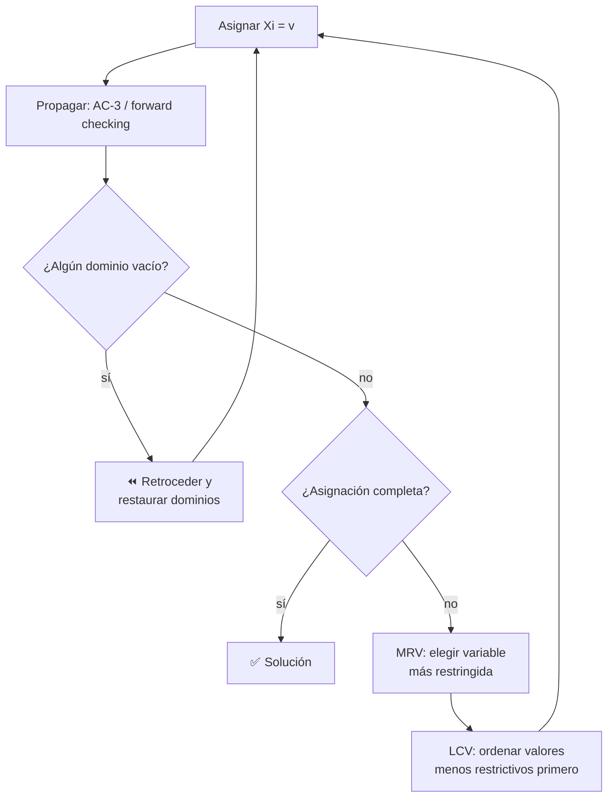

# 018 — Problemas de satisfacción de restricciones

> [← Clase anterior](../../../classes/part-01-symbolic-ai-search-logic-and-planning/017-juegos-minimax-y-poda-alfa-beta/README.md) · [Índice de la parte](../README.md) · [Clase siguiente →](../../../classes/part-01-symbolic-ai-search-logic-and-planning/019-logica-proposicional-e-inferencia/README.md)

**Parte:** 01 — IA simbólica, búsqueda, lógica y planificación  
**Nivel:** fundamentos · **Horas estimadas:** 4  
**Laboratorio:** `logic` · **Estado:** `EXECUTABLE_CORE`

## 🎯 Propósito

Comprender **problemas de satisfacción de restricciones** dentro de la evolución de la inteligencia
artificial, implementar un experimento mínimo verificable y distinguir qué parte
constituye evidencia frente a una afirmación todavía no comprobada.

## 📚 Resultados de aprendizaje

Al finalizar podrás:

1. Explicar problemas de satisfacción de restricciones usando los conceptos `CSP`, `backtracking`, `consistencia`, `restricciones`.
2. Ejecutar el laboratorio con una semilla explícita y revisar su contrato JSON.
3. Identificar al menos un supuesto, una limitación y un riesgo de aplicación.
4. Comparar el enfoque con la etapa anterior de la ruta de aprendizaje.
5. Producir una evidencia reproducible y una conclusión que no exceda los datos.

## 🧩 Conceptos centrales

`CSP`, `backtracking`, `consistencia`, `restricciones`

## 🗺️ Ubicación en el mapa de la IA

Los CSP abandonan el estado atómico de las clases 013-015 por una **representación factorizada**: el estado es un conjunto de variables con dominios, y esa estructura interna permite algo imposible en búsqueda ciega — *deducir* qué ramas son inútiles antes de explorarlas (propagación de restricciones). Es el puente entre búsqueda y lógica: un CSP booleano es exactamente el problema SAT de la clase 019. Sus herederos industriales (programación con restricciones, solvers SMT como Z3) resuelven hoy horarios, verificación de hardware y configuración de productos.

## 📖 Fundamentos

### 🧩 Definición

Un **CSP** es una terna `(X, D, C)`:

- **Variables** `X = {X1, ..., Xn}`.
- **Dominios** `D = {D1, ..., Dn}`: valores posibles de cada variable.
- **Restricciones** `C`: cada una es un par `⟨alcance, relación⟩`, p. ej. `⟨(X1, X2), X1 ≠ X2⟩`. Las más comunes son **binarias** (dos variables); todo CSP puede binarizarse.

Una **asignación** es consistente si no viola restricciones, y completa si cubre todas las variables. Una **solución** = completa y consistente. Decidir si existe solución es NP-completo en general (3-colorabilidad de grafos es un CSP). El **grafo de restricciones** (vértice por variable, arista por restricción binaria) revela estructura explotable: los CSP con grafo en árbol se resuelven en O(n·d²).

### 🔙 Búsqueda con backtracking

El algoritmo base asigna variables una a una en DFS y retrocede al detectar una violación:

```text
función BACKTRACK(csp, asignación):
    si asignación completa: devolver asignación
    var ← ELEGIR-VARIABLE-NO-ASIGNADA(csp, asignación)     # heurística MRV
    para cada valor en ORDENAR-VALORES(var, csp, asignación):  # LCV
        si valor consistente con asignación:
            asignación[var] ← valor
            inferencias ← INFERIR(csp, var, valor)          # forward checking / MAC
            si inferencias ≠ fallo:
                resultado ← BACKTRACK(csp, asignación)
                si resultado ≠ fallo: devolver resultado
            deshacer asignación e inferencias
    devolver fallo
```

Aprovecha la **conmutatividad**: el orden de asignación no cambia el conjunto de soluciones, así que basta ramificar sobre *una* variable por nivel (b = d por nivel, no n·d). Las heurísticas generales que lo hacen práctico:

- **MRV** (minimum remaining values): elegir la variable con menos valores legales — "fail first", detecta callejones pronto.
- **Grado**: como desempate, la variable con más restricciones sobre variables libres.
- **LCV** (least constraining value): probar primero el valor que menos recorta los dominios vecinos — "fail last" en los valores, porque solo necesitamos una solución.

### 📡 Propagación: forward checking y AC-3

**Forward checking**: al asignar `X = v`, eliminar de los dominios de las variables vecinas los valores incompatibles con `v`. Detecta el fallo cuando un dominio queda vacío, pero no propaga en cadena.

**Consistencia de arco**: el arco `(Xi, Xj)` es consistente si para todo valor de `Di` existe algún valor de `Dj` que satisface la restricción. **AC-3** (Mackworth, 1977) impone consistencia de arco en todo el CSP:

```text
función AC-3(csp):
    cola ← todos los arcos (Xi, Xj) del csp
    mientras cola no vacía:
        (Xi, Xj) ← cola.pop()
        si REVISAR(Xi, Xj):                  # ¿se recortó Di?
            si Di vacío: devolver falso      # inconsistencia detectada
            para cada Xk vecino de Xi, k ≠ j:
                cola.añadir((Xk, Xi))        # re-examinar en cadena

función REVISAR(Xi, Xj):
    recortado ← falso
    para cada x en Di:
        si ningún y en Dj satisface la restricción(x, y):
            eliminar x de Di; recortado ← verdadero
    devolver recortado
```

Complejidad O(c·d³) con `c` arcos y dominios de tamaño `d`. AC-3 puede usarse como preproceso o **dentro** de la búsqueda tras cada asignación (algoritmo MAC, *maintaining arc consistency*), el estándar en solvers serios. Importante: consistencia de arco ≠ solución; puede quedar un CSP arco-consistente sin solución (la detección completa exige consistencias superiores o búsqueda).

### 🔄 Alternativa: búsqueda local

Empezar con una asignación completa (inconsistente) y reparar: elegir una variable en conflicto y darle el valor que **minimiza conflictos**. Min-conflicts resuelve el problema de las n-reinas con n = 1 000 000 en tiempo casi constante de pasos esperados, pero es incompleto: puede ciclar y no puede probar insatisfacibilidad.

## 🧮 Ejemplo trabajado

**Colorear el mapa de Australia** con {R, V, A}: variables WA, NT, SA, Q, NSW, V (y T, sin restricciones); SA es adyacente a todas las continentales; además WA-NT, NT-Q, Q-NSW, NSW-V.

Backtracking con MRV + forward checking, empezando por SA (grado máximo):

```text
1. SA = R          → FC: quita R de WA, NT, Q, NSW, V   (dominios: {V,A})
2. MRV empata; grado elige NT (o WA). NT = V
                   → FC: quita V de WA y Q → WA ∈ {A}, Q ∈ {A}
3. MRV: WA = A     (dominio unitario)
4. MRV: Q = A      → FC: quita A de NSW → NSW ∈ {V}
5. NSW = V         → FC: quita V de V(ictoria) → V ∈ {A}
6. V = A, T = cualquiera  ✔ solución sin un solo retroceso
```

Sin heurísticas (orden alfabético WA, NT, Q, NSW, V, SA y valores R, V, A), el mismo problema provoca retrocesos: al llegar a SA su dominio está vacío porque nadie protegió sus opciones. La diferencia no es el algoritmo sino el *orden* — esa es la lección central de los CSP.

## 📊 Propiedades y comparación

| Método | Completo | Detecta insatisfacible | Costo típico | Cuándo usarlo |
|---|---|---|---|---|
| Backtracking puro | Sí | Sí | exponencial, constante alta | nunca solo; baseline |
| + MRV/LCV + forward checking | Sí | Sí | exponencial, poda fuerte | CSP medianos |
| MAC (AC-3 en cada paso) | Sí | Sí | O(c·d³) por nodo, menos nodos | restricciones densas |
| Min-conflicts (local) | No | No | a menudo casi lineal | n-reinas gigantes, scheduling con buena densidad de soluciones |
| Solver CP/SMT industrial | Sí | Sí | motores híbridos | producción |



## ⚠️ Errores conceptuales frecuentes

1. **"AC-3 resuelve el CSP."** Solo poda dominios. Un CSP puede ser arco-consistente y no tener solución (p. ej. tres variables con dominios {R,V} y restricciones ≠ por pares). AC-3 es un filtro, la búsqueda sigue haciendo el trabajo.
2. **Confundir la dirección de MRV y LCV.** Variables: la *más* restringida primero (fallar pronto). Valores: el *menos* restrictivo primero (acomodar a los vecinos). Invertirlos degrada el rendimiento drásticamente.
3. **Tratar el CSP como búsqueda de estados atómica.** Ramificar sobre "todas las asignaciones posibles de cualquier variable" genera n!·d^n hojas donde la formulación conmutativa da d^n. La factorización es el punto.
4. **Olvidar restaurar dominios al retroceder.** Las inferencias de forward checking/MAC son por-rama; no deshacerlas corrompe silenciosamente el resto de la búsqueda.
5. **Usar min-conflicts para probar que "no hay solución".** La búsqueda local no termina con certificado de insatisfacibilidad; para eso hacen falta métodos sistemáticos.

## 🚀 Del aprendizaje a la operación

Un problema real de horarios o asignación de recursos rara vez se entrega como `(X, D, C)`: el trabajo duro es **modelar** — elegir variables y restricciones que el solver explote — y para producción conviene un lenguaje/solver maduro (MiniZinc, OR-Tools CP-SAT, Z3) en lugar de un backtracking propio: traen restricciones globales (`all-different` con filtrado polinómico), reinicios, aprendizaje de cláusulas y paralelismo. Quedan además los requisitos blandos (optimización, no solo satisfacción), la explicación de infactibilidades a usuarios (núcleos IIS) y la re-resolución incremental cuando los datos cambian a mitad de ejecución.

## 🧪 Laboratorio

```bash
python lab.py
```

El laboratorio llama a `ai_evolution.labs.run_lab("logic")`. Esta
decisión evita 180 implementaciones divergentes: cada clase tiene un entrypoint
propio, pero los motores didácticos se prueban como una biblioteca común.

### 🔍 Evidencia esperada

- tipo de laboratorio y semilla;
- entradas o decisiones observables;
- resultado estructurado;
- lista `evidence` con hechos que pueden inspeccionarse;
- lista `limitations` que impide presentar la demo como producción.

## 📓 Notebooks

- [📓 `notebook.ipynb`](notebook.ipynb): recorrido guiado con la materia resumida.
- [✍️ `notebook_student.ipynb`](notebook_student.ipynb): ejercicios para resolver.
- [✅ `notebook_solution.ipynb`](notebook_solution.ipynb): solución de referencia explicada.

## 📝 Evaluación

| Criterio | Peso |
|---|---:|
| Comprensión conceptual | 25 % |
| Ejecución reproducible | 25 % |
| Interpretación basada en evidencia | 25 % |
| Riesgos, límites y mejora propuesta | 25 % |

Consulta [assessment.md](assessment.md) para preguntas y criterio de aceptación.

## ⚠️ Errores comunes

| Síntoma | Causa probable | Corrección |
|---|---|---|
| El código corre, pero no hay conclusión | Se confundió ejecución con aprendizaje | Explica qué demuestra y qué no demuestra |
| El resultado cambia sin explicación | No se registró semilla o configuración | Conserva semilla, versión y parámetros |
| Se promete uso real | Se extrapoló desde una demo educativa | Declara entorno, datos, límites y revisión humana |
| Se copia una métrica aislada | No existe baseline ni costo de error | Añade comparación y criterio de decisión |

## ❓ Preguntas frecuentes

**¿Debo usar una API comercial?**  
No. El núcleo funciona localmente. Las extensiones LIVE se documentan por separado.

**¿El laboratorio representa una implementación industrial?**  
No por sí solo. Enseña el contrato y el patrón; producción exige integración,
seguridad, observabilidad, pruebas y operación.

**¿Dónde profundizo?**  
Revisa las especializaciones enlazadas en el README raíz y la ruta siguiente.

## 🔗 Referencias

- Russell, S. y Norvig, P. (2021). *AIMA* (4.ª ed.), cap. 6 "Constraint Satisfaction Problems". [https://aima.cs.berkeley.edu/](https://aima.cs.berkeley.edu/)
- Mackworth, A. K. (1977). "Consistency in Networks of Relations". *Artificial Intelligence*, 8(1). [https://doi.org/10.1016/0004-3702(77)90007-8](https://doi.org/10.1016/0004-3702%2877%2990007-8)
- Minton, S. et al. (1992). "Minimizing conflicts: a heuristic repair method for constraint satisfaction and scheduling problems". *Artificial Intelligence*, 58(1-3). [https://doi.org/10.1016/0004-3702(92)90007-K](https://doi.org/10.1016/0004-3702%2892%2990007-K)
- Rossi, F., van Beek, P. y Walsh, T. (eds.) (2006). *Handbook of Constraint Programming*. Elsevier.
- MiniZinc — lenguaje de modelado de restricciones: [https://www.minizinc.org/](https://www.minizinc.org/)

---

## ⬅️ Clase anterior

[017 — Juegos: minimax y poda alfa-beta](../../part-01-symbolic-ai-search-logic-and-planning/017-juegos-minimax-y-poda-alfa-beta/README.md)

## ➡️ Siguiente clase

[019 — Lógica proposicional e inferencia](../../part-01-symbolic-ai-search-logic-and-planning/019-logica-proposicional-e-inferencia/README.md)
