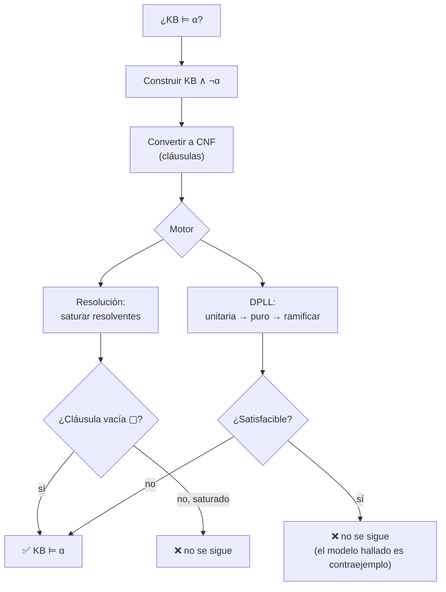

# 019 — Lógica proposicional e inferencia

> [← Clase anterior](../../../classes/part-01-symbolic-ai-search-logic-and-planning/018-problemas-de-satisfaccion-de-restricciones/README.md) · [Índice de la parte](../README.md) · [Clase siguiente →](../../../classes/part-01-symbolic-ai-search-logic-and-planning/020-logica-de-primer-orden-y-unificacion/README.md)

**Parte:** 01 — IA simbólica, búsqueda, lógica y planificación  
**Nivel:** fundamentos · **Horas estimadas:** 4  
**Laboratorio:** `logic` · **Estado:** `EXECUTABLE_CORE`

## 🎯 Propósito

Comprender **lógica proposicional e inferencia** dentro de la evolución de la inteligencia
artificial, implementar un experimento mínimo verificable y distinguir qué parte
constituye evidencia frente a una afirmación todavía no comprobada.

## 📚 Resultados de aprendizaje

Al finalizar podrás:

1. Explicar lógica proposicional e inferencia usando los conceptos `proposiciones`, `CNF`, `resolución`, `inferencia`.
2. Ejecutar el laboratorio con una semilla explícita y revisar su contrato JSON.
3. Identificar al menos un supuesto, una limitación y un riesgo de aplicación.
4. Comparar el enfoque con la etapa anterior de la ruta de aprendizaje.
5. Producir una evidencia reproducible y una conclusión que no exceda los datos.

## 🧩 Conceptos centrales

`proposiciones`, `CNF`, `resolución`, `inferencia`

## 🗺️ Ubicación en el mapa de la IA

Con la lógica, la IA pasa de *buscar* soluciones a **deducirlas**: un agente basado en conocimiento representa lo que sabe con fórmulas y deriva lo que se sigue de ellas. La lógica proposicional es el caso base — booleana, decidible, sin objetos ni relaciones — y su problema central, SAT, fue el primer problema NP-completo (Cook, 1971). Precede a la lógica de primer orden (clase 020) y alimenta directamente la industria actual: los SAT solvers descendientes de DPLL verifican hardware y software a escala, y la planificación clásica puede compilarse a SAT.

## 📖 Fundamentos

### 🔤 Sintaxis y semántica

**Sintaxis**: fórmulas construidas con símbolos proposicionales (P, Q, ...) y conectivas `¬, ∧, ∨, ⇒, ⇔`. **Semántica**: un **modelo** (interpretación) asigna verdadero/falso a cada símbolo; las tablas de las conectivas determinan el valor de cualquier fórmula. Con `n` símbolos hay `2^n` modelos.

Conceptos pivote:

- **Satisfacible**: alguna interpretación la hace verdadera. **Válida** (tautología): todas. **Insatisfacible**: ninguna.
- **Consecuencia lógica** `KB ⊨ α`: en todo modelo donde KB es verdadera, α también. Equivalencia fundamental (refutación): `KB ⊨ α  ⟺  KB ∧ ¬α es insatisfacible`.
- Un procedimiento de inferencia es **correcto** (sound) si solo deriva consecuencias, y **completo** si deriva todas.

### 📋 Forma normal conjuntiva (CNF)

Una fórmula está en **CNF** si es conjunción de **cláusulas** (disyunciones de literales). Toda fórmula se convierte: (1) eliminar ⇔ y ⇒ (`α ⇒ β ≡ ¬α ∨ β`), (2) empujar ¬ hacia dentro (De Morgan), (3) distribuir ∨ sobre ∧. La CNF importa porque resolución y DPLL operan sobre cláusulas.

### ⚔️ Resolución

Una única regla de inferencia, correcta y **refutacionalmente completa** (Robinson, 1965):

```text
(ℓ1 ∨ ... ∨ ℓi ∨ ... ∨ ℓk),   (m1 ∨ ... ∨ ¬ℓi ∨ ... ∨ mn)
────────────────────────────────────────────────────────────
(ℓ1 ∨ ... ∨ ℓk ∨ m1 ∨ ... ∨ mn)      sin ℓi ni ¬ℓi, sin duplicados
```

Para probar `KB ⊨ α`: convertir `KB ∧ ¬α` a CNF y resolver pares de cláusulas hasta derivar la **cláusula vacía** ▢ (contradicción ⇒ se demuestra α) o hasta que no haya resolventes nuevos (⇒ no se sigue). Completa *para refutación*: no genera todas las consecuencias, pero siempre detecta la insatisfacibilidad.

### ⚙️ DPLL: decidir SAT con inteligencia

DPLL (Davis-Putnam-Logemann-Loveland, 1962) es backtracking sobre asignaciones parciales con dos reglas de propagación:

```text
función DPLL(cláusulas, asignación):
    si alguna cláusula es falsa bajo asignación: devolver falso
    si todas las cláusulas son verdaderas: devolver verdadero
    # 1) propagación unitaria: cláusula con un solo literal libre → forzarlo
    si existe cláusula unitaria {ℓ}: devolver DPLL(cláusulas, asignación ∪ {ℓ})
    # 2) literal puro: símbolo que aparece con un solo signo → satisfacerlo
    si existe literal puro ℓ: devolver DPLL(cláusulas, asignación ∪ {ℓ})
    # 3) ramificar
    P ← elegir símbolo libre
    devolver DPLL(cláusulas, asignación ∪ {P=V}) o DPLL(cláusulas, asignación ∪ {P=F})
```

La **propagación unitaria** encadena deducciones sin ramificar (es el motor del algoritmo); es el análogo lógico del forward checking de los CSP. Los SAT solvers modernos (estilo CDCL: MiniSat, Kissat) añaden aprendizaje de cláusulas a partir de conflictos, saltos no cronológicos, reinicios y heurísticas de actividad (VSIDS), y resuelven instancias industriales de millones de variables — pese a que SAT es NP-completo, porque las instancias reales tienen estructura.

### ➡️ El fragmento eficiente: cláusulas de Horn

Una **cláusula de Horn** tiene a lo sumo un literal positivo (`P1 ∧ ... ∧ Pk ⇒ Q` o hechos `Q`). Sobre KB de Horn, el **encadenamiento hacia adelante** (desde los hechos, disparando reglas) y **hacia atrás** (desde la meta, buscando soporte) son correctos, completos y de **tiempo lineal**. Este fragmento es la base de los motores de reglas de la clase 022.

## 🧮 Ejemplo trabajado

KB: "Si llueve, el suelo se moja" (`L ⇒ M`), "Si el suelo se moja, hay resbalones" (`M ⇒ R`), "Llueve" (`L`). Demostrar por **resolución** que `KB ⊨ R`.

1. CNF de la KB: `{¬L ∨ M}`, `{¬M ∨ R}`, `{L}`. Negación de la meta: `{¬R}`.
2. Refutación:

```text
C1: ¬L ∨ M        C2: ¬M ∨ R        C3: L         C4: ¬R
C5 = res(C1, C3) sobre L :  M
C6 = res(C2, C5) sobre M :  R
C7 = res(C6, C4) sobre R :  ▢   (cláusula vacía → contradicción)
∴ KB ∧ ¬R es insatisfacible ⇒ KB ⊨ R  ✔
```

Con **DPLL** sobre las mismas 4 cláusulas: `{L}` es unitaria → L=V; entonces `¬L ∨ M` deja la unitaria `{M}` → M=V; entonces `{R}` unitaria → R=V; pero `{¬R}` queda falsa → insatisfacible, sin ramificar ni una vez. Toda la prueba fue propagación unitaria — típico en KB de Horn.

## 📊 Propiedades y comparación

| Método | Correcto | Completo | Complejidad | Restricción |
|---|---|---|---|---|
| Tabla de verdad | Sí | Sí | O(2^n) siempre | solo viable con pocos símbolos |
| Resolución | Sí | Sí (refutación) | exponencial en el peor caso | requiere CNF |
| DPLL / CDCL | Sí | Sí (decide SAT) | exponencial peor caso; eficaz en la práctica | requiere CNF |
| Encadenamiento adelante/atrás | Sí | Solo en cláusulas de Horn | **lineal** | KB de Horn |
| Lógica proposicional en sí | — | decidible | SAT es NP-completo (Cook, 1971) | sin objetos ni cuantificadores |



## ⚠️ Errores conceptuales frecuentes

1. **Confundir `⊨` (consecuencia semántica) con `⊢` (derivabilidad).** El primero habla de modelos; el segundo, de lo que un procedimiento deriva. Corrección y completitud son exactamente los puentes entre ambos.
2. **Leer `P ⇒ Q` como causalidad o como "si no P, no Q".** Es solo verdad funcional: falsa únicamente cuando P=V y Q=F. Con P falso, la implicación es verdadera (vacuamente).
3. **"Resolución genera todas las consecuencias de la KB."** Es completa *para refutación*: prueba cualquier consecuencia por contradicción, pero saturar la KB no enumera todo lo implicado (p. ej. nunca produce `P ∨ ¬P` desde una KB vacía).
4. **Olvidar negar la meta.** Resolver KB ∧ α y "no encontrar contradicción" no demuestra nada; la prueba es la insatisfacibilidad de KB ∧ **¬**α.
5. **"SAT es NP-completo, luego es inútil en la práctica."** Los CDCL resuelven instancias industriales enormes; NP-completitud habla del peor caso, no del caso estructurado típico. La inversa también engaña: no todo se codifica eficientemente en SAT.

## 🚀 Del aprendizaje a la operación

Usar lógica proposicional en un sistema real (verificación de circuitos, análisis de configuraciones, planificación via SAT) exige: una **codificación** cuidadosa del dominio a variables booleanas (la transformación de Tseitin evita la explosión de la CNF a costa de variables auxiliares), un solver industrial (Kissat, Glucose, Z3) en lugar de un DPLL propio, extracción de núcleos insatisfacibles para *explicar* los fallos, y control de recursos porque el peor caso sigue siendo exponencial. El límite expresivo también pesa: sin objetos ni relaciones, cualquier dominio con individuos obliga a duplicar proposiciones (P_juan, P_maria, ...) — la motivación exacta de la clase 020.

## 🧪 Laboratorio

```bash
python lab.py
```

El laboratorio llama a `ai_evolution.labs.run_lab("logic")`. Esta
decisión evita 180 implementaciones divergentes: cada clase tiene un entrypoint
propio, pero los motores didácticos se prueban como una biblioteca común.

### 🔍 Evidencia esperada

- tipo de laboratorio y semilla;
- entradas o decisiones observables;
- resultado estructurado;
- lista `evidence` con hechos que pueden inspeccionarse;
- lista `limitations` que impide presentar la demo como producción.

## 📓 Notebooks

- [📓 `notebook.ipynb`](notebook.ipynb): recorrido guiado con la materia resumida.
- [✍️ `notebook_student.ipynb`](notebook_student.ipynb): ejercicios para resolver.
- [✅ `notebook_solution.ipynb`](notebook_solution.ipynb): solución de referencia explicada.

## 📝 Evaluación

| Criterio | Peso |
|---|---:|
| Comprensión conceptual | 25 % |
| Ejecución reproducible | 25 % |
| Interpretación basada en evidencia | 25 % |
| Riesgos, límites y mejora propuesta | 25 % |

Consulta [assessment.md](assessment.md) para preguntas y criterio de aceptación.

## ⚠️ Errores comunes

| Síntoma | Causa probable | Corrección |
|---|---|---|
| El código corre, pero no hay conclusión | Se confundió ejecución con aprendizaje | Explica qué demuestra y qué no demuestra |
| El resultado cambia sin explicación | No se registró semilla o configuración | Conserva semilla, versión y parámetros |
| Se promete uso real | Se extrapoló desde una demo educativa | Declara entorno, datos, límites y revisión humana |
| Se copia una métrica aislada | No existe baseline ni costo de error | Añade comparación y criterio de decisión |

## ❓ Preguntas frecuentes

**¿Debo usar una API comercial?**  
No. El núcleo funciona localmente. Las extensiones LIVE se documentan por separado.

**¿El laboratorio representa una implementación industrial?**  
No por sí solo. Enseña el contrato y el patrón; producción exige integración,
seguridad, observabilidad, pruebas y operación.

**¿Dónde profundizo?**  
Revisa las especializaciones enlazadas en el README raíz y la ruta siguiente.

## 🔗 Referencias

- Russell, S. y Norvig, P. (2021). *AIMA* (4.ª ed.), cap. 7 "Logical Agents". [https://aima.cs.berkeley.edu/](https://aima.cs.berkeley.edu/)
- Davis, M., Logemann, G. y Loveland, D. (1962). "A machine program for theorem-proving". *Communications of the ACM*, 5(7). [https://doi.org/10.1145/368273.368557](https://doi.org/10.1145/368273.368557)
- Robinson, J. A. (1965). "A Machine-Oriented Logic Based on the Resolution Principle". *Journal of the ACM*, 12(1). [https://doi.org/10.1145/321250.321253](https://doi.org/10.1145/321250.321253)
- Cook, S. A. (1971). "The complexity of theorem-proving procedures". *Proc. STOC '71*. [https://doi.org/10.1145/800157.805047](https://doi.org/10.1145/800157.805047)
- Biere, A., Heule, M., van Maaren, H. y Walsh, T. (eds.) (2021). *Handbook of Satisfiability* (2.ª ed.). IOS Press.

---

## ⬅️ Clase anterior

[018 — Problemas de satisfacción de restricciones](../../part-01-symbolic-ai-search-logic-and-planning/018-problemas-de-satisfaccion-de-restricciones/README.md)

## ➡️ Siguiente clase

[020 — Lógica de primer orden y unificación](../../part-01-symbolic-ai-search-logic-and-planning/020-logica-de-primer-orden-y-unificacion/README.md)
