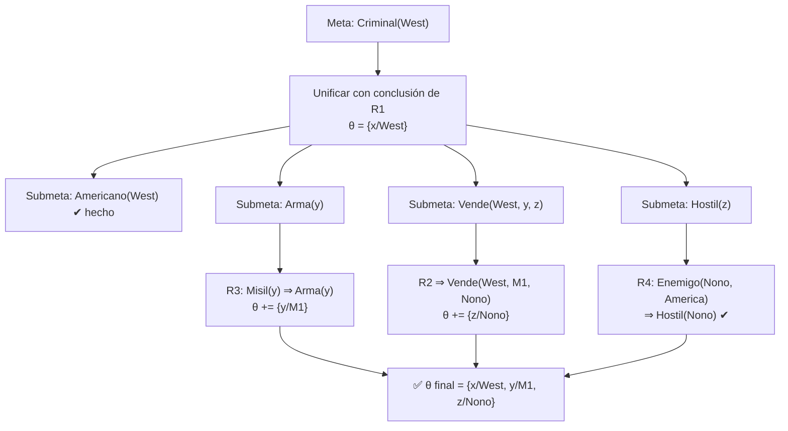

# Teoría — Lógica de primer orden y unificación

## 🗺️ Ubicación en el mapa de la IA

La lógica de primer orden (FOL) añade a la proposicional lo que a esta le falta: **objetos, relaciones y cuantificadores**. Es el lenguaje de representación más influyente de la IA simbólica: Prolog es un fragmento ejecutable de FOL, las ontologías de la clase 021 son fragmentos decidibles de FOL, y STRIPS (clase 023) describe acciones con literales de primer orden. El mecanismo técnico que la hace computable — la **unificación** de Robinson (1965) — reapareció en la inferencia de tipos de los lenguajes funcionales (Hindley-Milner) y en el pattern matching moderno.

## 📖 Fundamentos

### 🌍 Sintaxis y semántica

Elementos del lenguaje:

- **Términos** (denotan objetos): constantes (`Juan`), variables (`x`), funciones (`PadreDe(Juan)`).
- **Fórmulas atómicas** (denotan hechos): predicados sobre términos, `Hermano(Juan, Ricardo)`.
- **Conectivas** proposicionales y **cuantificadores**: `∀x` (universal), `∃x` (existencial).

Un **modelo** de FOL tiene un dominio de objetos y una interpretación que asigna a cada constante un objeto, a cada función una función sobre el dominio y a cada predicado una relación. `KB ⊨ α` se define igual que en proposicional, pero ahora los modelos pueden ser infinitos.

Patrones de traducción que hay que dominar (y donde más se falla):

```text
"Todos los reyes son personas":   ∀x  Rey(x) ⇒ Persona(x)      (∀ con ⇒)
"Algún rey es cruel":             ∃x  Rey(x) ∧ Cruel(x)         (∃ con ∧)
Dualidad:                          ¬∃x P(x)  ≡  ∀x ¬P(x)
```

Usar `∧` con `∀` afirma que *todo objeto* es rey y persona; usar `⇒` con `∃` se satisface con cualquier no-rey: ambas combinaciones son casi siempre un error de modelado.

### 🔁 De la instanciación a la unificación

La inferencia ingenua **proposicionaliza**: instanciación universal (sustituir `∀x` por cada término concreto) reduce FOL a proposicional. Funciona (Herbrand, 1930) pero explota: con funciones, el conjunto de términos es infinito; la semidecidibilidad de FOL (Church-Turing, 1936) significa que si `KB ⊨ α` existe prueba finita, pero si no, el procedimiento puede no terminar jamás.

La **unificación** evita instanciar a ciegas: encuentra la sustitución que hace idénticas dos expresiones.

```text
UNIFICAR(Conoce(Juan, x), Conoce(Juan, Ana))    = {x/Ana}
UNIFICAR(Conoce(Juan, x), Conoce(y, Madre(y)))  = {y/Juan, x/Madre(Juan)}
UNIFICAR(Conoce(Juan, x), Conoce(x, Elena))     = fallo (x no puede ser Juan y Elena)
                                                   → renombrar variables: con Conoce(z, Elena) sí: {z/Juan, x/Elena}
UNIFICAR(P(x), P(F(x)))                          = fallo por OCCURS-CHECK (x dentro de F(x))
```

El algoritmo recorre ambas expresiones en paralelo componiendo sustituciones y devuelve el **unificador más general** (MGU), único salvo renombramiento: el que compromete lo mínimo. El **occurs-check** (¿aparece la variable dentro del término con que se unifica?) evita términos infinitos; muchos Prolog lo omiten por eficiencia, sacrificando corrección en casos límite.

### ⚙️ Inferencia con reglas: Modus Ponens Generalizado

Para KB en **cláusulas definidas** (`p1 ∧ ... ∧ pn ⇒ q` con literales positivos):

```text
p1', ..., pn',   (p1 ∧ ... ∧ pn ⇒ q)         con θ tal que pi'θ = piθ para todo i
──────────────────────────────────────
              qθ
```

- **Encadenamiento hacia adelante**: desde los hechos, aplicar reglas cuyas premisas unifican, hasta derivar la meta o saturar. Correcto y completo para cláusulas definidas (sin funciones: termina; es la semántica de Datalog).
- **Encadenamiento hacia atrás**: desde la meta, buscar reglas cuya conclusión unifique con ella y perseguir sus premisas como submetas (DFS). Es el motor de Prolog; puede entrar en bucles infinitos con recursión izquierda.

### ⚔️ Resolución de primer orden

Generaliza la resolución proposicional: convierte a CNF (con **skolemización**: `∃` se reemplaza por constantes/funciones de Skolem dependientes de los `∀` que lo dominan) y resuelve cláusulas cuyos literales complementarios **unifican**, aplicando el MGU al resolvente. Es refutacionalmente completa para FOL (Robinson, 1965); es la base de los demostradores automáticos (Vampire, E) que hoy ganan la competición CASC.

## 🧮 Ejemplo trabajado

KB (el clásico "el criminal" de AIMA, abreviado):

```text
R1: Americano(x) ∧ Arma(y) ∧ Vende(x, y, z) ∧ Hostil(z) ⇒ Criminal(x)
H1: Americano(West)          H2: Misil(M1)         H3: Posee(Nono, M1)
R2: Misil(y) ∧ Posee(Nono, y) ⇒ Vende(West, y, Nono)
R3: Misil(y) ⇒ Arma(y)       R4: Enemigo(z, America) ⇒ Hostil(z)
H4: Enemigo(Nono, America)
```

**Encadenamiento hacia adelante**, ronda a ronda:

```text
Ronda 1:
  R3 con {y/M1}  (H2)            → Arma(M1)
  R2 con {y/M1}  (H2, H3)        → Vende(West, M1, Nono)
  R4 con {z/Nono} (H4)           → Hostil(Nono)
Ronda 2:
  R1 con {x/West, y/M1, z/Nono}  (H1, Arma(M1), Vende(...), Hostil(Nono))
                                 → Criminal(West)  ✔
```

**Hacia atrás** desde `Criminal(West)`: unifica con la conclusión de R1 vía `{x/West}`; submetas `Americano(West)` ✔ (H1), `Arma(y)` → R3 → `Misil(y)` → `{y/M1}` ✔, `Vende(West, M1, z)` → R2 → `{z/Nono}` ✔, `Hostil(Nono)` → R4 ✔. Cada paso es una unificación verificable a mano; nótese cómo las sustituciones se **componen** y propagan entre submetas (la `y` de Arma queda ligada a M1 para Vende).

## 📊 Propiedades y comparación

| Propiedad | Lógica proposicional | FOL (cláusulas definidas) | FOL completa |
|---|---|---|---|
| Expresa objetos/relaciones | No | Sí | Sí |
| Cuantificadores | No | ∀ implícito en reglas | ∀ y ∃ |
| Decidible | Sí (NP-completo) | Datalog: sí; con funciones: no | No: semidecidible |
| Motor típico | DPLL/CDCL | encadenamiento + unificación (Prolog) | resolución + skolemización (Vampire) |
| Costo de la expresividad | duplicar símbolos por individuo | bucles posibles hacia atrás | no-terminación posible |



## ⚠️ Errores conceptuales frecuentes

1. **`∀` con `∧` y `∃` con `⇒`.** "∀x Rey(x) ∧ Persona(x)" dice que todo el universo es rey; "∃x Rey(x) ⇒ Cruel(x)" es verdadera en cuanto exista un no-rey. Las combinaciones correctas son ∀-⇒ y ∃-∧.
2. **Unificar sin renombrar variables.** `Conoce(Juan, x)` y `Conoce(x, Elena)` comparten `x` por accidente sintáctico; cada cláusula debe llevar variables frescas (standardizing apart) antes de unificar.
3. **Omitir el occurs-check y no saberlo.** `P(x)` con `P(F(x))` no unifica; Prolog estándar lo acepta y crea un término cíclico. Es un trade-off de eficiencia que hay que conocer, no ignorar.
4. **Creer que skolemizar preserva equivalencia.** Preserva *satisfacibilidad* (que es lo que la refutación necesita), no equivalencia lógica: `∃x P(x)` y `P(C_sk)` no son equivalentes.
5. **Esperar que la inferencia FOL siempre termine.** FOL es semidecidible: la búsqueda de prueba de algo que no se sigue puede correr para siempre. Todo sistema real necesita límites de recursos y estrategias de terminación.

## 🚀 Del aprendizaje a la operación

Para usar FOL en producción hay que elegir el fragmento con juicio: Datalog para consultas recursivas sobre bases de datos (garantiza terminación), Prolog para prototipos de razonamiento con control del programador (cortes, negación por fallo — que es *supuesto de mundo cerrado*, no negación clásica), demostradores tipo Vampire/E para verificación, o lógicas de descripción (clase 021) cuando se necesita decidibilidad. Quedan además la ingeniería del conocimiento (¿quién escribe y mantiene los axiomas?), la indexación de términos para unificar contra millones de cláusulas y la integración con datos ruidosos, donde la lógica pura no ofrece gradación de incertidumbre.

## 🔗 Referencias

- Russell, S. y Norvig, P. (2021). *AIMA* (4.ª ed.), caps. 8-9 "First-Order Logic" e "Inference in First-Order Logic". [https://aima.cs.berkeley.edu/](https://aima.cs.berkeley.edu/)
- Robinson, J. A. (1965). "A Machine-Oriented Logic Based on the Resolution Principle". *Journal of the ACM*, 12(1). [https://doi.org/10.1145/321250.321253](https://doi.org/10.1145/321250.321253)
- Kowalski, R. (1974). "Predicate Logic as Programming Language". *IFIP Congress* — el puente entre FOL y Prolog.
- SWI-Prolog — implementación libre de referencia: [https://www.swi-prolog.org/](https://www.swi-prolog.org/)
- Stanford Encyclopedia of Philosophy — "Classical Logic": [https://plato.stanford.edu/entries/logic-classical/](https://plato.stanford.edu/entries/logic-classical/)

---

> [⬅️ Volver a la clase](README.md) · [📝 Evaluación](assessment.md) · [📚 Índice de la parte](../README.md)
