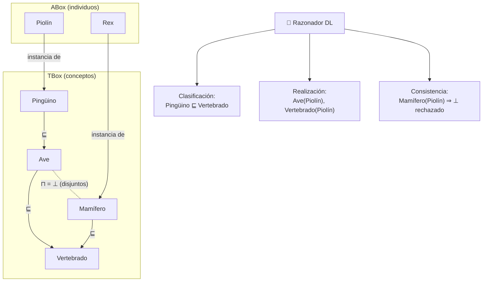

# 021 — Representación del conocimiento y ontologías

> [← Clase anterior](../../../classes/part-01-symbolic-ai-search-logic-and-planning/020-logica-de-primer-orden-y-unificacion/README.md) · [Índice de la parte](../README.md) · [Clase siguiente →](../../../classes/part-01-symbolic-ai-search-logic-and-planning/022-sistemas-expertos-y-motores-de-reglas/README.md)

**Parte:** 01 — IA simbólica, búsqueda, lógica y planificación  
**Nivel:** fundamentos · **Horas estimadas:** 4  
**Laboratorio:** `logic` · **Estado:** `EXECUTABLE_CORE`

## 🎯 Propósito

Comprender **representación del conocimiento y ontologías** dentro de la evolución de la inteligencia
artificial, implementar un experimento mínimo verificable y distinguir qué parte
constituye evidencia frente a una afirmación todavía no comprobada.

## 📚 Resultados de aprendizaje

Al finalizar podrás:

1. Explicar representación del conocimiento y ontologías usando los conceptos `ontologías`, `taxonomías`, `relaciones`, `inferencia`.
2. Ejecutar el laboratorio con una semilla explícita y revisar su contrato JSON.
3. Identificar al menos un supuesto, una limitación y un riesgo de aplicación.
4. Comparar el enfoque con la etapa anterior de la ruta de aprendizaje.
5. Producir una evidencia reproducible y una conclusión que no exceda los datos.

## 🧩 Conceptos centrales

`ontologías`, `taxonomías`, `relaciones`, `inferencia`

## 🗺️ Ubicación en el mapa de la IA

Si las clases 019-020 dieron el *lenguaje* (lógica), esta clase trata el *contenido*: qué conceptos, categorías y relaciones hay que escribir para que un sistema razone sobre un dominio. La ingeniería ontológica viene de las redes semánticas (Quillian, 1968) y los marcos (Minsky, 1974), maduró en las lógicas de descripción y cristalizó en estándares web (RDF, OWL). Hoy sostiene los grafos de conocimiento de Google y Wikidata, y es la mitad simbólica de los sistemas neuro-simbólicos del proyecto de la clase 024.

## 📖 Fundamentos

### 🏛️ Ontología: definición operativa

Una **ontología** es una especificación explícita y formal de una conceptualización compartida (Gruber, 1993): define **clases** (categorías), **individuos** (instancias), **relaciones** (propiedades entre objetos), **atributos** y **axiomas** que restringen las interpretaciones válidas. Una **taxonomía** es el caso particular donde solo hay jerarquía de subsunción (`⊑`, "es-un").

Distinción estructural clave:

- **TBox** (terminológico): conocimiento sobre conceptos — `Perro ⊑ Mamífero`, `Mamífero ⊓ Ave ⊑ ⊥` (disjuntos).
- **ABox** (asercional): conocimiento sobre individuos — `Perro(Fido)`, `dueño(Fido, Ana)`.

### 🕸️ Redes semánticas y herencia

Una red semántica es un grafo: nodos = conceptos/individuos, aristas = relaciones tipadas (`es-un`, `parte-de`, `tiene`). Su operación central es la **herencia**: las propiedades fluyen hacia abajo por `es-un`. La herencia **por defecto con excepciones** (los pájaros vuelan; los pingüinos son pájaros que no vuelan) exige razonamiento **no monótono**: añadir información (Piolín es pingüino) puede *retirar* conclusiones (ya no vuela). La lógica clásica es monótona, por eso se desarrollaron formalismos específicos (lógica por defecto de Reiter, circunscripción de McCarthy).

```text
HEREDAR(individuo, propiedad):
    valor ← buscar propiedad localmente en individuo
    si existe: devolver valor                     # la excepción gana
    para cada clase C en cadena es-un (de específica a general):
        si C define propiedad: devolver C.valor   # el más específico gana
    devolver desconocido
```

### 🔬 Lógicas de descripción: expresividad con decidibilidad

Las **description logics** (DL) son fragmentos de FOL diseñados para que la inferencia sea **decidible** con complejidad conocida. Constructores típicos: `⊓` (intersección), `⊔` (unión), `¬`, `∃r.C` ("algún r lleva a un C"), `∀r.C`, cardinalidades. Servicios de razonamiento estándar:

- **Subsunción**: ¿`C ⊑ D` se sigue de la TBox? (clasificar la jerarquía completa).
- **Satisfacibilidad de concepto**: ¿puede `C` tener instancias?
- **Realización**: ¿de qué clases es instancia cada individuo de la ABox?
- **Consistencia** global de TBox + ABox.

OWL 2 DL (estándar W3C) corresponde a la DL *SROIQ*; sus perfiles (EL, QL, RL) recortan expresividad a cambio de razonamiento polinómico — OWL 2 EL es el perfil de SNOMED CT, la ontología clínica de ~350 000 conceptos que se clasifica en minutos con razonadores tipo ELK.

### 🧱 Decisiones de diseño recurrentes

- **Clase vs. individuo**: ¿"Águila" es una clase (cada águila concreta) o un individuo (la especie, en una ontología de taxonomía biológica)? Depende del uso; mezclarlos es fuente clásica de incoherencias (OWL 2 permite *punning* controlado).
- **`es-un` vs. `parte-de`**: la subsunción hereda propiedades; la mereología no (el motor es parte del coche; el coche no hereda "gira a 3000 rpm").
- **Mundo abierto vs. cerrado**: OWL asume **mundo abierto** (lo no afirmado es *desconocido*, no falso), al contrario que las bases de datos y Prolog. Cambia radicalmente qué se puede concluir: que la ontología no diga que Ana tiene hijos no permite inferir que no los tiene.
- **Reutilizar vs. construir**: ontologías superiores (BFO, DOLCE) y de dominio (SNOMED, Gene Ontology, schema.org) existen para no partir de cero.

## 🧮 Ejemplo trabajado

Mini-ontología zoológica (TBox + ABox) y las inferencias que un razonador DL extrae:

```text
TBox:
  A1: Pinguino ⊑ Ave                A2: Ave ⊑ Vertebrado
  A3: Ave ⊑ Ovíparo                 A4: Mamifero ⊑ Vertebrado
  A5: Ave ⊓ Mamifero ⊑ ⊥            (disjuntos)
  A6: Volador ≡ Animal ⊓ ∃medio.Aire
ABox:
  F1: Pinguino(Piolin)              F2: Mamifero(Rex)
```

Inferencias paso a paso:

```text
1. Subsunción transitiva:  Pinguino ⊑ Ave ⊑ Vertebrado  ⇒  Pinguino ⊑ Vertebrado
2. Realización:            F1 + A1 ⇒ Ave(Piolin);  + A2 ⇒ Vertebrado(Piolin)
                           F1 + A3 ⇒ Ovíparo(Piolin)
3. Consistencia:           si alguien añade Mamifero(Piolin), A5 hace la ABox
                           inconsistente ⇒ el razonador lo rechaza con explicación
4. Mundo abierto:          ¿Volador(Piolin)? DESCONOCIDO — nada afirma ∃medio.Aire,
                           pero tampoco lo niega. Para negar hace falta el axioma
                           Pinguino ⊑ ¬Volador (así se modela la excepción en DL,
                           que no tiene defaults: la clase excepcional se excluye
                           explícitamente).
```

El punto 4 es el contraste práctico entre herencia por defecto (redes semánticas) y DL: en DL las "excepciones" se modelan con axiomas de exclusión explícitos, conservando la monotonía.

## 📊 Propiedades y comparación

| Formalismo | Expresividad | Inferencia | Decidible | Uso típico |
|---|---|---|---|---|
| Taxonomía / tesauro (SKOS) | jerarquía + sinónimos | transitividad | Sí (trivial) | catálogos, vocabularios |
| Red semántica / marcos | relaciones + defaults | herencia con excepciones | según formalización | prototipos, UX de conocimiento |
| RDF + RDFS | tripletas + subclases | reglas simples | Sí (P) | grafos de conocimiento, linked data |
| OWL 2 DL (SROIQ) | alta | tableaux/consecuencia | Sí (N2EXPTIME) | ontologías ricas (biomedicina) |
| OWL 2 EL | media | saturación | Sí (PTIME) | SNOMED CT, ontologías enormes |
| FOL completa | máxima | demostración de teoremas | No | verificación, matemáticas |



## ⚠️ Errores conceptuales frecuentes

1. **Confundir `es-un` (subsunción) con `instancia-de`.** "Fido es-un Perro" es pertenencia (ABox); "Perro es-un Mamífero" es inclusión de clases (TBox). Colapsarlos produce herencias sin sentido ("Fido es una subclase").
2. **Modelar `parte-de` como subsunción.** La rueda no es un tipo de coche. La mereología necesita relaciones propias (transitivas, pero sin herencia de propiedades arbitrarias).
3. **Leer OWL con mentalidad de base de datos (mundo cerrado).** La ausencia de un hecho no lo hace falso; las restricciones de cardinalidad no "validan datos faltantes" como un esquema SQL, y esa confusión es la queja n.º 1 de los recién llegados a OWL.
4. **Esperar defaults y excepciones de la lógica clásica.** DL/OWL son monótonas: "los pájaros vuelan, salvo los pingüinos" exige remodelar (clase AveVoladora, o axioma de exclusión), no un default que se retracta.
5. **Construir la ontología por los nombres y no por los axiomas.** Llamar a una clase "ClienteImportante" no le da semántica; sin axiomas que la definan, el razonador no puede clasificar nada en ella.

## 🚀 Del aprendizaje a la operación

Una ontología operativa es un artefacto de software con ciclo de vida: control de versiones y revisión por expertos de dominio, pruebas de regresión de inferencias (¿esta edición reclasificó 400 conceptos sin querer?), razonadores dimensionados al perfil elegido (ELK para EL, HermiT para DL completa), y pipelines de poblado de la ABox desde datos reales — hoy, a menudo con extracción por LLM *validada* contra los axiomas. El costo dominante no es el razonador sino el **mantenimiento del consenso**: una ontología es un acuerdo social formalizado, y sin gobernanza se degrada en meses.

## 🧪 Laboratorio

```bash
python lab.py
```

El laboratorio llama a `ai_evolution.labs.run_lab("logic")`. Esta
decisión evita 183 implementaciones divergentes: cada clase tiene un entrypoint
propio, pero los motores didácticos se prueban como una biblioteca común.

### 🔍 Evidencia esperada

- tipo de laboratorio y semilla;
- entradas o decisiones observables;
- resultado estructurado;
- lista `evidence` con hechos que pueden inspeccionarse;
- lista `limitations` que impide presentar la demo como producción.

## 📓 Notebooks

- [📓 `notebook.ipynb`](notebook.ipynb): recorrido guiado con la materia resumida.
- [✍️ `notebook_student.ipynb`](notebook_student.ipynb): ejercicios para resolver.
- [✅ `notebook_solution.ipynb`](notebook_solution.ipynb): solución de referencia explicada.

## 📝 Evaluación

| Criterio | Peso |
|---|---:|
| Comprensión conceptual | 25 % |
| Ejecución reproducible | 25 % |
| Interpretación basada en evidencia | 25 % |
| Riesgos, límites y mejora propuesta | 25 % |

Consulta [assessment.md](assessment.md) para preguntas y criterio de aceptación.

## ⚠️ Errores comunes

| Síntoma | Causa probable | Corrección |
|---|---|---|
| El código corre, pero no hay conclusión | Se confundió ejecución con aprendizaje | Explica qué demuestra y qué no demuestra |
| El resultado cambia sin explicación | No se registró semilla o configuración | Conserva semilla, versión y parámetros |
| Se promete uso real | Se extrapoló desde una demo educativa | Declara entorno, datos, límites y revisión humana |
| Se copia una métrica aislada | No existe baseline ni costo de error | Añade comparación y criterio de decisión |

## ❓ Preguntas frecuentes

**¿Debo usar una API comercial?**  
No. El núcleo funciona localmente. Las extensiones LIVE se documentan por separado.

**¿El laboratorio representa una implementación industrial?**  
No por sí solo. Enseña el contrato y el patrón; producción exige integración,
seguridad, observabilidad, pruebas y operación.

**¿Dónde profundizo?**  
Revisa las especializaciones enlazadas en el README raíz y la ruta siguiente.

## 🔗 Referencias

- Russell, S. y Norvig, P. (2021). *AIMA* (4.ª ed.), cap. 10 "Knowledge Representation". [https://aima.cs.berkeley.edu/](https://aima.cs.berkeley.edu/) — uso: desarrollo extendido del tema
- Gruber, T. R. (1993). "A translation approach to portable ontology specifications". *Knowledge Acquisition*, 5(2). [https://doi.org/10.1006/knac.1993.1008](https://doi.org/10.1006/knac.1993.1008) — uso: fuente primaria del mecanismo estudiado
- Baader, F. et al. (eds.) (2007). *The Description Logic Handbook* (2.ª ed.). Cambridge University Press. — uso: desarrollo extendido del tema
- W3C (2012). *OWL 2 Web Ontology Language — Overview* (2.ª ed.): [https://www.w3.org/TR/owl2-overview/](https://www.w3.org/TR/owl2-overview/) — uso: marco normativo de referencia
- Minsky, M. (1974). "A Framework for Representing Knowledge". MIT AI Memo 306. [https://dspace.mit.edu/handle/1721.1/6089](https://dspace.mit.edu/handle/1721.1/6089) — uso: referencia consultada en su fuente original

<!-- papers:inicio -->

---

## 📜 Papers que fundamentan esta clase

> Bloque generado por `python scripts/link_papers_to_classes.py`. La fuente es [`papers/catalog/papers.json`](../../../papers/catalog/papers.json).

| Paper | Año | Qué desbloqueó | Miniatura |
|---|---:|---|---|
| [P71 · Un enfoque de traducción para especificaciones de ontologías portables](../../../papers/foundational/P71_ontologia/README.md) | 1993 | Da la definición que se sigue citando —una ontología es una especificación explícita de una conceptualización— y cinco criterios para juzgarla. | [notebook](../../../notebooks/papers/P71_ontologia.ipynb) |

Cada ficha explica el problema anterior, la matemática mínima, los límites y los errores de atribución más frecuentes. Para leerlas con método: [cómo leer un paper de IA](../../../papers/guides/COMO_LEER_UN_PAPER_DE_IA.md) · [anexos matemáticos](../../../papers/annexes/README.md).
<!-- papers:fin -->
---

## ⬅️ Clase anterior

[020 — Lógica de primer orden y unificación](../../part-01-symbolic-ai-search-logic-and-planning/020-logica-de-primer-orden-y-unificacion/README.md)

## ➡️ Siguiente clase

[022 — Sistemas expertos y motores de reglas](../../part-01-symbolic-ai-search-logic-and-planning/022-sistemas-expertos-y-motores-de-reglas/README.md)
