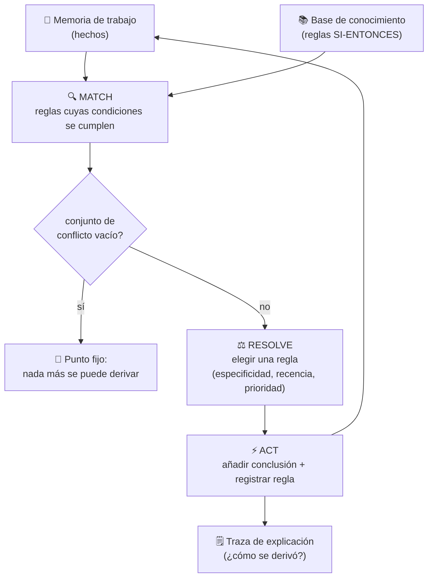

# 022 — Sistemas expertos y motores de reglas

> [← Clase anterior](../../../classes/part-01-symbolic-ai-search-logic-and-planning/021-representacion-del-conocimiento-y-ontologias/README.md) · [Índice de la parte](../README.md) · [Clase siguiente →](../../../classes/part-01-symbolic-ai-search-logic-and-planning/023-planificacion-clasica-con-strips-y-pddl/README.md)

**Parte:** 01 — IA simbólica, búsqueda, lógica y planificación  
**Nivel:** fundamentos · **Horas estimadas:** 4  
**Laboratorio:** `logic` · **Estado:** `EXECUTABLE_CORE`

## 🎯 Propósito

Comprender **sistemas expertos y motores de reglas** dentro de la evolución de la inteligencia
artificial, implementar un experimento mínimo verificable y distinguir qué parte
constituye evidencia frente a una afirmación todavía no comprobada.

## 📚 Resultados de aprendizaje

Al finalizar podrás:

1. Explicar sistemas expertos y motores de reglas usando los conceptos `reglas`, `encadenamiento`, `explicación`, `conocimiento`.
2. Ejecutar el laboratorio con una semilla explícita y revisar su contrato JSON.
3. Identificar al menos un supuesto, una limitación y un riesgo de aplicación.
4. Comparar el enfoque con la etapa anterior de la ruta de aprendizaje.
5. Producir una evidencia reproducible y una conclusión que no exceda los datos.

## 🧩 Conceptos centrales

`reglas`, `encadenamiento`, `explicación`, `conocimiento`

## 🗺️ Ubicación en el mapa de la IA

Los sistemas expertos fueron el primer éxito comercial de la IA: en los años 70-80, sistemas como DENDRAL, MYCIN y XCON demostraron que el conocimiento de un especialista podía codificarse en reglas y ejecutarse con un motor de inferencia. Se apoyan directamente en la lógica de las clases 019-021 (los hechos y reglas son fórmulas, la inferencia es modus ponens aplicado sistemáticamente). Habilitan después la planificación clásica (clase 023, donde las "reglas" pasan a ser operadores con precondiciones y efectos) y son el componente simbólico canónico de los sistemas neuro-simbólicos del proyecto de la clase 024. Los motores de reglas modernos (Drools, CLIPS, motores de decisión bancarios) descienden en línea directa de esta arquitectura.

## 📖 Fundamentos

### 🏛️ Arquitectura de un sistema experto

Un **sistema experto** separa el conocimiento del mecanismo que lo usa. Sus componentes clásicos:

1. **Base de conocimiento**: reglas de producción `SI condiciones ENTONCES conclusión` escritas por (o con) expertos del dominio.
2. **Memoria de trabajo**: los hechos conocidos en un instante dado; crece durante la inferencia.
3. **Motor de inferencia**: el algoritmo que decide qué reglas aplicar y en qué orden. Es genérico: el mismo motor sirve para medicina o configuración de hardware.
4. **Componente de explicación**: responde *¿por qué?* (qué regla pide este dato) y *¿cómo?* (qué cadena de reglas produjo esta conclusión).
5. **Interfaz de adquisición de conocimiento**: cómo se añaden y mantienen las reglas.

Esta separación es la tesis central de la época: *"In the knowledge lies the power"* (Feigenbaum). El motor es trivial comparado con el costo de capturar y mantener el conocimiento.

### ➡️ Encadenamiento hacia adelante (dirigido por datos)

El **forward chaining** parte de los hechos y dispara reglas hasta el punto fijo. Ciclo *match-resolve-act*:

```text
mientras haya cambios:
    MATCH:   encontrar todas las reglas cuyas condiciones ⊆ memoria de trabajo
             y cuya conclusión aún no esté afirmada   → conjunto de conflicto
    RESOLVE: elegir una regla del conjunto de conflicto
             (estrategias: especificidad, recencia, prioridad explícita)
    ACT:     añadir la conclusión a la memoria de trabajo
             y registrar la regla disparada (para la explicación)
```

Es **completo para cláusulas de Horn**: deriva todo hecho atómico implicado por la base (es exactamente el algoritmo de la clase 019, ahora con arquitectura alrededor). Conviene cuando llegan datos y se quiere ver *todo* lo que se sigue de ellos (monitorización, configuración).

### ⬅️ Encadenamiento hacia atrás (dirigido por objetivos)

El **backward chaining** parte de una hipótesis y busca reglas que la concluyan, convirtiendo sus condiciones en subobjetivos, recursivamente, hasta llegar a hechos conocidos o preguntas al usuario. Es el mecanismo de Prolog y de MYCIN. Conviene cuando hay *una* pregunta concreta y muchos hechos irrelevantes: evita derivar conclusiones que nadie pidió. Riesgo: ciclos entre reglas (`a → b`, `b → a`) exigen detección de objetivos repetidos en la pila.

### ⚡ El algoritmo Rete

El paso MATCH ingenuo re-evalúa todas las reglas contra toda la memoria en cada ciclo: O(reglas × hechos^condiciones). **Rete** (Forgy, 1982) lo evita compilando las condiciones de todas las reglas en una **red de discriminación**:

- **Nodos alfa**: filtran hechos por condiciones de un solo patrón (p. ej. `tipo = cliente`); su resultado se guarda en *memorias alfa*.
- **Nodos beta**: hacen *joins* incrementales entre memorias (comparten variables entre condiciones); su resultado se guarda en *memorias beta*.
- Cuando un hecho entra o sale de la memoria de trabajo, solo se propaga **el cambio** (delta) por la red; las coincidencias previas quedan memorizadas.

Trade-off explícito: Rete cambia memoria por velocidad — las memorias alfa/beta pueden crecer mucho, pero cada ciclo cuesta proporcionalmente al cambio, no al total. Es la base de OPS5, CLIPS y Drools (variante ReteOO/PHREAK).

### 🌡️ Incertidumbre: factores de certeza de MYCIN

MYCIN (Shortliffe, años 70) diagnosticaba infecciones bacterianas con ~600 reglas y necesitaba grados de creencia. Introdujo el **factor de certeza** `CF ∈ [-1, 1]` (−1 = refutado, 0 = sin evidencia, +1 = confirmado), con reglas de combinación:

```text
Encadenamiento (regla con CF_regla y premisa con CF_premisa > 0):
    CF(conclusión) = CF_regla × CF_premisa

Premisas conjuntas:  CF(p1 ∧ p2) = min(CF(p1), CF(p2))

Evidencia paralela (dos reglas concluyen lo mismo, ambos CF > 0):
    CF_comb = CF1 + CF2 × (1 − CF1)
```

Los CF **no son probabilidades**: la combinación asume independencia de las evidencias y solo aproxima un razonamiento bayesiano bajo condiciones restrictivas (Heckerman, 1986). Aun así, MYCIN alcanzó desempeño comparable al de especialistas en evaluaciones ciegas — y nunca se usó clínicamente, por responsabilidad legal e integración, una lección de despliegue tan importante como el algoritmo.

## 🧮 Ejemplo trabajado

**1) Forward chaining con la base del laboratorio.** Hechos iniciales: `{tiene_datos, tiene_objetivo}`. Reglas: R1 `{tiene_datos, tiene_objetivo} → puede_experimentar`, R2 `{puede_experimentar} → requiere_baseline`, R3 `{requiere_baseline} → requiere_evaluacion`.

```text
Ciclo 1: MATCH → {R1}            ACT → añade puede_experimentar
Ciclo 2: MATCH → {R2}            ACT → añade requiere_baseline
Ciclo 3: MATCH → {R3}            ACT → añade requiere_evaluacion
Ciclo 4: MATCH → ∅               punto fijo alcanzado
```

Memoria final = `{tiene_datos, tiene_objetivo, puede_experimentar, requiere_baseline, requiere_evaluacion}`: 2 hechos iniciales + 3 derivados = 5 hechos, con 3 reglas disparadas. La lista `rules_fired` del laboratorio ES el componente de explicación: cada conclusión conserva la regla que la originó.

**2) Factores de certeza.** Dos reglas concluyen `infección_por_pseudomonas`: R_a con CF 0,6 cuya premisa se cree con CF 0,8; R_b con CF 0,5 cuya premisa se cree con CF 1,0.

```text
CF_a = 0,6 × 0,8 = 0,48
CF_b = 0,5 × 1,0 = 0,50
CF_comb = 0,48 + 0,50 × (1 − 0,48) = 0,48 + 0,26 = 0,74
```

Dos evidencias moderadas producen una creencia alta, sin llegar nunca a 1: ese es el comportamiento diseñado de la combinación paralela.

## 📊 Propiedades y comparación

| Criterio | Forward chaining | Backward chaining | Forward + Rete |
|---|---|---|---|
| Dirección | datos → conclusiones | objetivo → datos | datos → conclusiones |
| Deriva | todo el punto fijo | solo lo necesario para el objetivo | todo el punto fijo |
| Costo por ciclo | O(reglas × hechos) ingenuo | proporcional a la prueba | proporcional al **cambio** |
| Memoria | baja | pila de objetivos | alta (memorias alfa/beta) |
| Uso típico | monitorización, configuración | diagnóstico, consulta | motores de reglas de producción |
| Completitud (Horn) | sí | sí (con manejo de ciclos) | sí |



## ⚠️ Errores conceptuales frecuentes

1. **"El motor de inferencia contiene el conocimiento."** Falso: el motor es genérico; el conocimiento vive en las reglas. Por eso el cuello de botella histórico fue la *adquisición de conocimiento*, no la inferencia.
2. **Confundir factores de certeza con probabilidades.** Los CF no obedecen los axiomas de probabilidad; su combinación asume independencia. Con evidencias correlacionadas, los CF sobreestiman la certeza — la respuesta rigurosa son las redes bayesianas (parte 02).
3. **"Forward y backward chaining derivan cosas distintas."** Sobre cláusulas de Horn ambos son correctos y completos para hechos atómicos; difieren en *qué* trabajo hacen (todo el punto fijo vs. lo necesario para un objetivo), no en la validez.
4. **Creer que Rete es un algoritmo de inferencia distinto.** Rete solo optimiza el paso MATCH del forward chaining; las conclusiones son idénticas a las del algoritmo ingenuo.
5. **"Más reglas = mejor sistema."** Las bases grandes sufren interacciones no previstas entre reglas (una regla nueva dispara cadenas inesperadas); sin suites de pruebas de regresión sobre casos, el mantenimiento colapsa — la causa principal de la caída comercial de los sistemas expertos.

## 🚀 Del aprendizaje a la operación

El laboratorio dispara 3 reglas escritas a mano sobre 2 hechos; un motor de decisión real (crédito, tarificación, elegibilidad) maneja miles de reglas con ciclo de vida propio: versionado y gobernanza de reglas (quién aprueba un cambio), pruebas de regresión sobre carteras históricas de casos, resolución de conflictos auditable y trazas de explicación que satisfagan a un regulador, no solo a un desarrollador. Falta además el manejo de incertidumbre honesto (los CF del ejemplo no sobreviven evidencia correlacionada) y la integración con datos vivos: en producción, el paso caro no es inferir sino mantener la base de reglas alineada con una realidad que cambia.

## 🧪 Laboratorio

```bash
python lab.py
```

El laboratorio llama a `ai_evolution.labs.run_lab("logic")`. Esta
decisión evita 180 implementaciones divergentes: cada clase tiene un entrypoint
propio, pero los motores didácticos se prueban como una biblioteca común.

### 🔍 Evidencia esperada

- tipo de laboratorio y semilla;
- entradas o decisiones observables;
- resultado estructurado;
- lista `evidence` con hechos que pueden inspeccionarse;
- lista `limitations` que impide presentar la demo como producción.

## 📓 Notebooks

- [📓 `notebook.ipynb`](notebook.ipynb): recorrido guiado con la materia resumida.
- [✍️ `notebook_student.ipynb`](notebook_student.ipynb): ejercicios para resolver.
- [✅ `notebook_solution.ipynb`](notebook_solution.ipynb): solución de referencia explicada.

## 📝 Evaluación

| Criterio | Peso |
|---|---:|
| Comprensión conceptual | 25 % |
| Ejecución reproducible | 25 % |
| Interpretación basada en evidencia | 25 % |
| Riesgos, límites y mejora propuesta | 25 % |

Consulta [assessment.md](assessment.md) para preguntas y criterio de aceptación.

## ⚠️ Errores comunes

| Síntoma | Causa probable | Corrección |
|---|---|---|
| El código corre, pero no hay conclusión | Se confundió ejecución con aprendizaje | Explica qué demuestra y qué no demuestra |
| El resultado cambia sin explicación | No se registró semilla o configuración | Conserva semilla, versión y parámetros |
| Se promete uso real | Se extrapoló desde una demo educativa | Declara entorno, datos, límites y revisión humana |
| Se copia una métrica aislada | No existe baseline ni costo de error | Añade comparación y criterio de decisión |

## ❓ Preguntas frecuentes

**¿Debo usar una API comercial?**  
No. El núcleo funciona localmente. Las extensiones LIVE se documentan por separado.

**¿El laboratorio representa una implementación industrial?**  
No por sí solo. Enseña el contrato y el patrón; producción exige integración,
seguridad, observabilidad, pruebas y operación.

**¿Dónde profundizo?**  
Revisa las especializaciones enlazadas en el README raíz y la ruta siguiente.

## 🔗 Referencias

- [Russell & Norvig, *Artificial Intelligence: A Modern Approach* 4e — cap. 9 (inferencia con reglas, forward/backward chaining)](https://aima.cs.berkeley.edu/)
- [Forgy, C. (1982). "Rete: A Fast Algorithm for the Many Pattern/Many Object Pattern Match Problem". *Artificial Intelligence* 19(1)](https://doi.org/10.1016/0004-3702%2882%2990020-0)
- [Buchanan & Shortliffe (1984). *Rule-Based Expert Systems: The MYCIN Experiments* — libro completo gratuito](https://www.shortliffe.net/Buchanan-Shortliffe-1984/MYCIN%20Book.htm)
- [CLIPS — motor de reglas de dominio público (documentación oficial)](https://www.clipsrules.net/)
- [Drools — documentación oficial del motor de reglas (Rete/PHREAK)](https://www.drools.org/)

---

## ⬅️ Clase anterior

[021 — Representación del conocimiento y ontologías](../../part-01-symbolic-ai-search-logic-and-planning/021-representacion-del-conocimiento-y-ontologias/README.md)

## ➡️ Siguiente clase

[023 — Planificación clásica con STRIPS y PDDL](../../part-01-symbolic-ai-search-logic-and-planning/023-planificacion-clasica-con-strips-y-pddl/README.md)
