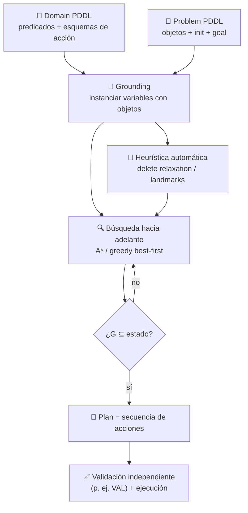

# 023 — Planificación clásica con STRIPS y PDDL

> [← Clase anterior](../../../classes/part-01-symbolic-ai-search-logic-and-planning/022-sistemas-expertos-y-motores-de-reglas/README.md) · [Índice de la parte](../README.md) · [Clase siguiente →](../../../classes/part-01-symbolic-ai-search-logic-and-planning/024-proyecto-asistente-neuro-simbolico-explicable/README.md)

**Parte:** 01 — IA simbólica, búsqueda, lógica y planificación  
**Nivel:** fundamentos · **Horas estimadas:** 4  
**Laboratorio:** `workflow` · **Estado:** `EXECUTABLE_CORE`

## 🎯 Propósito

Comprender **planificación clásica con strips y pddl** dentro de la evolución de la inteligencia
artificial, implementar un experimento mínimo verificable y distinguir qué parte
constituye evidencia frente a una afirmación todavía no comprobada.

## 📚 Resultados de aprendizaje

Al finalizar podrás:

1. Explicar planificación clásica con strips y pddl usando los conceptos `STRIPS`, `PDDL`, `precondiciones`, `efectos`.
2. Ejecutar el laboratorio con una semilla explícita y revisar su contrato JSON.
3. Identificar al menos un supuesto, una limitación y un riesgo de aplicación.
4. Comparar el enfoque con la etapa anterior de la ruta de aprendizaje.
5. Producir una evidencia reproducible y una conclusión que no exceda los datos.

## 🧩 Conceptos centrales

`STRIPS`, `PDDL`, `precondiciones`, `efectos`

## 🗺️ Ubicación en el mapa de la IA

La planificación clásica une las dos mitades de esta parte del curso: la búsqueda (clases 013-017) aporta el algoritmo y la lógica (clases 019-021) aporta la representación. En lugar de enumerar estados atómicos, STRIPS (Fikes y Nilsson, 1971, para el robot Shakey) los describe como conjuntos de literales y describe las acciones por sus precondiciones y efectos — con lo que un solo dominio compacto genera espacios de estados astronómicos. PDDL (1998) estandarizó esa notación y creó la Competición Internacional de Planificación (IPC), que impulsó los planificadores modernos (Fast Downward, LAMA). La planificación es hoy el componente deliberativo de robots, logística y orquestación, y el contraste directo con los agentes LLM que "planifican" sin garantías formales.

## 📖 Fundamentos

### 📐 El modelo de planificación clásica

La planificación clásica asume un entorno **determinista, completamente observable, estático y discreto**. Un problema se define como `⟨P, A, s0, G⟩`:

- `P`: conjunto de **predicados** (hechos atómicos posibles).
- `s0 ⊆ P`: estado inicial — el conjunto de hechos verdaderos al comienzo. Todo lo no listado es falso (**supuesto de mundo cerrado**).
- `G`: la meta, un conjunto de literales que deben ser verdaderos al final (cualquier estado que los contenga sirve).
- `A`: acciones en formato **STRIPS**, cada una con tres listas:

```text
Acción:        mover(b, x, y)         # mover bloque b desde x hasta y
PRE  (precondiciones): {sobre(b,x), libre(b), libre(y)}
ADD  (efectos positivos): {sobre(b,y), libre(x)}
DEL  (efectos negativos): {sobre(b,x), libre(y)}
```

La semántica de la transición es puramente conjuntista:

```text
aplicable(a, s)  ⟺  PRE(a) ⊆ s
RESULT(s, a)     =   (s \ DEL(a)) ∪ ADD(a)
```

Este es el mismo `RESULT` de la clase 013, pero ahora **descrito con lógica en vez de programado**: la "suposición STRIPS" dice que todo lo no mencionado en ADD/DEL permanece igual, lo que resuelve pragmáticamente el *problema del marco* (frame problem) de la clase 021.

### 📄 PDDL: el lenguaje estándar

PDDL separa lo reutilizable de lo concreto:

- **Domain**: predicados y esquemas de acción con variables (`mover(?b ?x ?y)`).
- **Problem**: objetos concretos, estado inicial `(:init ...)` y meta `(:goal ...)`.

```text
(:action mover
  :parameters (?b ?x ?y)
  :precondition (and (sobre ?b ?x) (libre ?b) (libre ?y))
  :effect (and (sobre ?b ?y) (libre ?x)
               (not (sobre ?b ?x)) (not (libre ?y))))
```

Extensiones por niveles (declaradas con `:requirements`): tipos, precondiciones negativas, costos de acción (`:action-costs`), efectos condicionales, PDDL2.1 añade tiempo y variables numéricas. Un planificador anuncia qué requisitos soporta; la referencia viva es [planning.wiki](https://planning.wiki/).

### 🔎 Cómo se resuelve: búsqueda + heurísticas independientes del dominio

Los planificadores actuales dominantes hacen **búsqueda hacia adelante en el espacio de estados** (A*, greedy best-first) con heurísticas extraídas *automáticamente* del dominio — la diferencia clave con la clase 016, donde la heurística la diseñaba un humano:

- **Relajación por borrado (delete relaxation)**: ignorar las listas DEL. En el problema relajado los hechos solo se acumulan, y estimar el costo es tratable. De ahí salen `h_max` (admisible, débil), `h_add` (informativa, no admisible) y `h_FF` (longitud de un plan relajado).
- **Abstracciones y landmarks**: proyectar el problema a subconjuntos de variables (pattern databases) o detectar hechos que *todo* plan debe lograr (landmarks, base del planificador LAMA).

**GraphPlan** (Blum y Furst, 1997) fue el hito intermedio: construye un **grafo de planificación** de niveles alternos de hechos y acciones, propagando relaciones de **exclusión mutua (mutex)** — dos acciones son mutex si una borra precondiciones o efectos de la otra; dos hechos son mutex si toda forma de producirlos es mutex. La meta es alcanzable como muy pronto en el primer nivel donde todos sus literales aparecen sin mutex entre sí; luego se extrae el plan hacia atrás. Hoy GraphPlan casi no se usa como planificador, pero su grafo sigue vivo como fuente de heurísticas.

### 🧗 Complejidad

Decidir si existe un plan (PLANSAT) es **PSPACE-completo** (Bylander, 1994) incluso para STRIPS proposicional. Las heurísticas no eliminan esa cota: la desplazan — por eso el campo se evalúa empíricamente en la IPC con dominios de referencia, no con garantías universales.

## 🧮 Ejemplo trabajado

**Mundo de bloques.** Tres bloques; estado inicial: C sobre A, A y B sobre la mesa. Meta: `{sobre(A,B), sobre(B,C)}`.

```text
s0 = {sobre(C,A), sobreMesa(A), sobreMesa(B), libre(C), libre(B)}

Paso 1: moverAMesa(C, A)
  PRE {sobre(C,A), libre(C)} ⊆ s0 ✔
  s1 = {sobreMesa(A), sobreMesa(B), sobreMesa(C), libre(A), libre(B), libre(C)}

Paso 2: moverDesdeMesa(B, C)
  PRE {sobreMesa(B), libre(B), libre(C)} ⊆ s1 ✔
  s2 = {sobreMesa(A), sobreMesa(C), sobre(B,C), libre(A), libre(B)}

Paso 3: moverDesdeMesa(A, B)
  PRE {sobreMesa(A), libre(A), libre(B)} ⊆ s2 ✔
  s3 = {sobreMesa(C), sobre(B,C), sobre(A,B), libre(A)}

G = {sobre(A,B), sobre(B,C)} ⊆ s3 ✔  →  plan de 3 acciones, óptimo.
```

Obsérvese la trampa clásica: si se intenta lograr `sobre(A,B)` *primero* (mover A sobre B de inmediato), la meta parcial debe deshacerse para lograr `sobre(B,C)` — las metas interactúan (anomalía de Sussman, aquí en versión suave). Los planificadores que tratan las metas como independientes producen planes subóptimos o fallan; las heurísticas de relajación subestiman precisamente estas interacciones.

## 📊 Propiedades y comparación

| Criterio | Búsqueda atómica (013-016) | STRIPS/PDDL + heurística automática | GraphPlan |
|---|---|---|---|
| Representación del estado | caja negra | conjunto de literales | conjunto de literales |
| Heurística | diseñada a mano | extraída del dominio (h_FF, landmarks) | niveles del grafo (admisible) |
| Escala típica | juguete | dominios IPC con 10^20+ estados | intermedio (histórico) |
| Complejidad de decisión | depende del problema | PSPACE-completa | PSPACE-completa |
| Garantías | las del algoritmo (A* óptimo) | óptimo solo con heurística admisible | óptimo en pasos paralelos |



## ⚠️ Errores conceptuales frecuentes

1. **"El plan es una política."** Un plan clásico es una secuencia abierta que presupone determinismo y observabilidad; si una acción falla, no dice qué hacer. Entornos inciertos exigen replanificación, planes con contingencias o MDPs (parte 02).
2. **Olvidar el supuesto de mundo cerrado.** En `(:init ...)` lo no declarado es falso. Omitir `(libre B)` no deja el hecho "desconocido": lo hace falso, y las acciones que lo requieren nunca serán aplicables.
3. **Confundir ADD/DEL con "todo el estado nuevo".** Los efectos describen solo *el cambio*; la suposición STRIPS conserva el resto. Escribir efectos que repiten hechos no cambiados es redundante; olvidar un DEL deja hechos fantasma (B "sigue" sobre la mesa después de apilarlo).
4. **Tratar las metas como independientes.** La anomalía de Sussman muestra que lograr metas una a una puede exigir deshacer trabajo; es la razón por la que la planificación no es una simple concatenación de búsquedas.
5. **"GraphPlan devuelve el plan óptimo en número de acciones."** Optimiza el número de *niveles paralelos*, no de acciones; y hoy su papel práctico es servir de heurística, no de planificador.

## 🚀 Del aprendizaje a la operación

La traza del ejemplo se verifica a mano; un despliegue real (logística, manufactura, operaciones espaciales — PDDL desciende del linaje que llevó a Remote Agent de la NASA) exige: modelar el dominio con expertos y validarlo contra el sistema físico (el error típico está en el modelo, no en el planificador), un ejecutor que monitorice precondiciones en tiempo de ejecución y replanifique al detectar divergencia, validación independiente de planes (herramientas tipo VAL), y manejo de tiempo, recursos y costos que el STRIPS puro no expresa (PDDL2.1+, scheduling). El planificador es la pieza fácil de descargar; el modelo del dominio y el ciclo ejecutar-monitorizar-replanificar son el trabajo de ingeniería.

## 🧪 Laboratorio

```bash
python lab.py
```

El laboratorio llama a `ai_evolution.labs.run_lab("workflow")`. Esta
decisión evita 183 implementaciones divergentes: cada clase tiene un entrypoint
propio, pero los motores didácticos se prueban como una biblioteca común.

### 🔍 Evidencia esperada

- tipo de laboratorio y semilla;
- entradas o decisiones observables;
- resultado estructurado;
- lista `evidence` con hechos que pueden inspeccionarse;
- lista `limitations` que impide presentar la demo como producción.

## 📓 Notebooks

- [📓 `notebook.ipynb`](notebook.ipynb): recorrido guiado con la materia resumida.
- [✍️ `notebook_student.ipynb`](notebook_student.ipynb): ejercicios para resolver.
- [✅ `notebook_solution.ipynb`](notebook_solution.ipynb): solución de referencia explicada.

## 📝 Evaluación

| Criterio | Peso |
|---|---:|
| Comprensión conceptual | 25 % |
| Ejecución reproducible | 25 % |
| Interpretación basada en evidencia | 25 % |
| Riesgos, límites y mejora propuesta | 25 % |

Consulta [assessment.md](assessment.md) para preguntas y criterio de aceptación.

## ⚠️ Errores comunes

| Síntoma | Causa probable | Corrección |
|---|---|---|
| El código corre, pero no hay conclusión | Se confundió ejecución con aprendizaje | Explica qué demuestra y qué no demuestra |
| El resultado cambia sin explicación | No se registró semilla o configuración | Conserva semilla, versión y parámetros |
| Se promete uso real | Se extrapoló desde una demo educativa | Declara entorno, datos, límites y revisión humana |
| Se copia una métrica aislada | No existe baseline ni costo de error | Añade comparación y criterio de decisión |

## ❓ Preguntas frecuentes

**¿Debo usar una API comercial?**  
No. El núcleo funciona localmente. Las extensiones LIVE se documentan por separado.

**¿El laboratorio representa una implementación industrial?**  
No por sí solo. Enseña el contrato y el patrón; producción exige integración,
seguridad, observabilidad, pruebas y operación.

**¿Dónde profundizo?**  
Revisa las especializaciones enlazadas en el README raíz y la ruta siguiente.

## 🔗 Referencias

- [Russell & Norvig, *Artificial Intelligence: A Modern Approach* 4e — cap. 11 (Automated Planning)](https://aima.cs.berkeley.edu/) — uso: desarrollo extendido del tema
- [Fikes & Nilsson (1971). "STRIPS: A New Approach to the Application of Theorem Proving to Problem Solving". *Artificial Intelligence* 2(3-4)](https://doi.org/10.1016/0004-3702%2871%2990010-5) — uso: fuente primaria del mecanismo estudiado
- [Blum & Furst (1997). "Fast Planning Through Planning Graph Analysis". *Artificial Intelligence* 90(1-2)](https://doi.org/10.1016/S0004-3702%2896%2900047-1) — uso: fuente primaria del mecanismo estudiado
- [planning.wiki — referencia comunitaria de PDDL y planificadores](https://planning.wiki/) — uso: referencia consultada en su fuente original
- [Referencia de sintaxis PDDL](https://planning.wiki/ref/pddl) — uso: referencia consultada en su fuente original
- [Fast Downward — planificador de referencia (documentación oficial)](https://www.fast-downward.org/) — uso: referencia consultada en su fuente original

<!-- papers:inicio -->

---

## 📜 Papers que fundamentan esta clase

> Bloque generado por `python scripts/link_papers_to_classes.py`. La fuente es [`papers/catalog/papers.json`](../../../papers/catalog/papers.json).

| Paper | Año | Qué desbloqueó | Miniatura |
|---|---:|---|---|
| [P68 · STRIPS: un nuevo enfoque para aplicar la demostración de teoremas a la resolución de problemas](../../../papers/foundational/P68_strips/README.md) | 1971 | Da a la planificación su representación duradera —precondición, añadir, borrar— y con ella una respuesta práctica al problema del marco. | [notebook](../../../notebooks/papers/P68_strips.ipynb) |

Cada ficha explica el problema anterior, la matemática mínima, los límites y los errores de atribución más frecuentes. Para leerlas con método: [cómo leer un paper de IA](../../../papers/guides/COMO_LEER_UN_PAPER_DE_IA.md) · [anexos matemáticos](../../../papers/annexes/README.md).
<!-- papers:fin -->
---

## ⬅️ Clase anterior

[022 — Sistemas expertos y motores de reglas](../../part-01-symbolic-ai-search-logic-and-planning/022-sistemas-expertos-y-motores-de-reglas/README.md)

## ➡️ Siguiente clase

[024 — Proyecto: asistente neuro-simbólico explicable](../../part-01-symbolic-ai-search-logic-and-planning/024-proyecto-asistente-neuro-simbolico-explicable/README.md)
