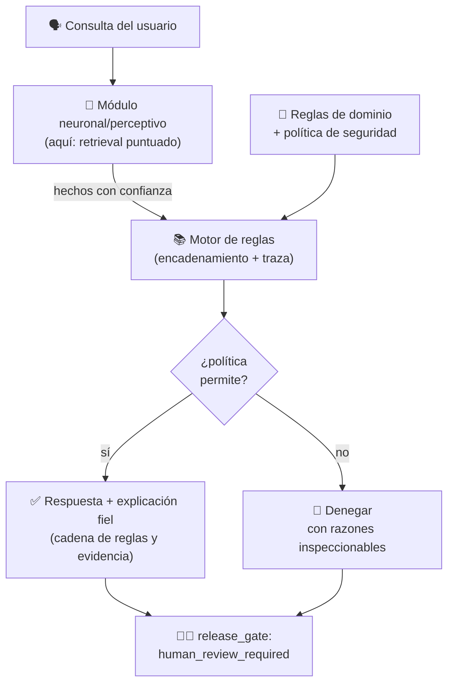

# 024 — Proyecto: asistente neuro-simbólico explicable

> [← Clase anterior](../../../classes/part-01-symbolic-ai-search-logic-and-planning/023-planificacion-clasica-con-strips-y-pddl/README.md) · [Índice de la parte](../README.md) · [Clase siguiente →](../../../classes/part-02-probabilistic-evolutionary-and-decision-ai/025-razonamiento-con-incertidumbre/README.md)

**Parte:** 01 — IA simbólica, búsqueda, lógica y planificación  
**Nivel:** fundamentos · **Horas estimadas:** 10  
**Laboratorio:** `capstone` · **Estado:** `EXECUTABLE_CORE`

## 🎯 Propósito

Comprender **proyecto: asistente neuro-simbólico explicable** dentro de la evolución de la inteligencia
artificial, implementar un experimento mínimo verificable y distinguir qué parte
constituye evidencia frente a una afirmación todavía no comprobada.

## 📚 Resultados de aprendizaje

Al finalizar podrás:

1. Explicar proyecto: asistente neuro-simbólico explicable usando los conceptos `símbolos`, `reglas`, `explicación`, `integración`.
2. Ejecutar el laboratorio con una semilla explícita y revisar su contrato JSON.
3. Identificar al menos un supuesto, una limitación y un riesgo de aplicación.
4. Comparar el enfoque con la etapa anterior de la ruta de aprendizaje.
5. Producir una evidencia reproducible y una conclusión que no exceda los datos.

## 🧩 Conceptos centrales

`símbolos`, `reglas`, `explicación`, `integración`

## 🗺️ Ubicación en el mapa de la IA

Este proyecto cierra la parte simbólica del curso integrando todo lo anterior — búsqueda, lógica, reglas y planificación — con la pregunta que domina la IA actual: ¿cómo combinar el razonamiento simbólico (explicable, verificable, pobre en percepción) con el aprendizaje estadístico (perceptivo, robusto al ruido, opaco)? La IA **neuro-simbólica** es la respuesta programática: sistemas donde componentes neuronales y simbólicos cooperan. Ejemplos reales del patrón: AlphaGo (red neuronal guiando una búsqueda en árbol) y AlphaGeometry (modelo de lenguaje proponiendo construcciones que un motor simbólico verifica). Las partes 03-08 del curso desarrollan el lado neuronal; este proyecto fija el contrato del lado simbólico y de la explicación.

## 📖 Fundamentos

### ⚖️ Por qué integrar: fortalezas complementarias

| Dimensión | Simbólico (reglas, lógica, planificación) | Neuronal (aprendizaje estadístico) |
|---|---|---|
| Origen del conocimiento | escrito por expertos | aprendido de datos |
| Percepción (imagen, audio, texto libre) | muy débil | fortaleza principal |
| Explicación | traza exacta de inferencia | post-hoc, aproximada |
| Garantías / verificación | posibles (correctitud, completitud) | raras, empíricas |
| Robustez al ruido | frágil (todo o nada) | degradación suave |
| Generalización composicional | fuerte (variables, cuantificadores) | límite conocido |

La tesis neuro-simbólica: dejar la **percepción y la propuesta** al lado neuronal y la **verificación, el razonamiento y la explicación** al lado simbólico.

### 🧭 La taxonomía de Kautz

Henry Kautz (conferencia Engelmore, AAAI 2020; publicada en *AI Magazine*, 2022) clasificó las arquitecturas neuro-simbólicas en seis tipos, hoy la referencia estándar para *nombrar* un diseño:

```text
Tipo 1  symbolic Neuro symbolic   — entrada y salida son símbolos; lo neuronal media
                                    (un LLM estándar visto como sistema NS mínimo)
Tipo 2  Symbolic[Neuro]           — sistema simbólico con subrutina neuronal interna
                                    (AlphaGo: MCTS simbólico llama a la red de valor)
Tipo 3  Neuro; Symbolic           — pipeline: la red extrae símbolos, el razonador
                                    opera sobre ellos (percepción → reglas)
Tipo 4  Neuro: Symbolic → Neuro   — conocimiento simbólico compilado en el
                                    entrenamiento de la red (p. ej. como datos/currículo)
Tipo 5  Neuro_{Symbolic}          — reglas tensorizadas como sesgo estructural dentro
                                    de la red (p. ej. Logic Tensor Networks)
Tipo 6  Neuro[Symbolic]           — razonamiento combinatorio verdadero embebido
                                    dentro del motor neuronal (aspiracional)
```

El asistente de este proyecto es **Tipo 3 (Neuro; Symbolic)**: un componente de recuperación/percepción produce hechos con confianza, y un motor de reglas (clase 022) razona sobre ellos y genera la explicación.

### 🔍 Explicabilidad: fiel vs. post-hoc

Distinción central del proyecto:

- **Explicación fiel (por diseño)**: la traza de reglas disparadas ES el cómputo que produjo la decisión. Auditable paso a paso; es lo que entrega el componente simbólico.
- **Explicación post-hoc**: una racionalización generada después sobre un modelo opaco (saliencia, LIME/SHAP, o un LLM "explicando" su respuesta). Puede ser plausible sin ser fiel.

Regla de diseño del asistente: **toda decisión que cruza el gate debe tener explicación fiel**; las partes neuronales aportan evidencia con confianza declarada, nunca la decisión final sin traza.

### 🏗️ Arquitectura del asistente del proyecto

El laboratorio `capstone` integra tres contratos ya vistos y añade el patrón de gobernanza:

1. **Recuperación** (`retrieval`): ranking de documentos por similitud — el sustituto didáctico del componente neuronal perceptivo. Produce evidencia puntuada, no verdades.
2. **Agente** (`agent`): ejecuta un plan de llamadas a herramientas conservando `action → observation` — la traza operativa.
3. **Política de seguridad** (`safety`): reglas explícitas que permiten o deniegan acciones con razones inspeccionables — el componente simbólico normativo.
4. **Gate final**: `release_gate: human_review_required`. La explicación no elimina la revisión humana; la hace posible.

```text
percepción/recuperación (puntuada)  →  hechos con confianza
hechos + reglas de dominio          →  conclusiones con traza (encadenamiento, clase 022)
conclusiones + política             →  decisión permitir/denegar con razones
decisión + traza completa           →  explicación fiel + gate de revisión humana
```

### 🧪 Qué debe demostrar el proyecto

Criterio de aceptación conceptual: para cada salida del asistente debes poder responder, señalando datos del JSON, (a) *qué evidencia* entró, (b) *qué regla o paso* produjo cada conclusión, (c) *por qué* la política permitió o denegó, y (d) *qué NO* está garantizado (las `limitations`). Si alguna respuesta requiere "confiar en el modelo", ese eslabón no es explicable y hay que rediseñarlo o declararlo.

## 🧮 Ejemplo trabajado

Pipeline Tipo 3 en miniatura, con números. El módulo perceptivo (aquí: recuperación bag-of-words) puntúa documentos para la consulta `"herramientas estado objetivo"`:

```text
score(agents) ≈ 0,87   score(models) ≈ 0,33   score(skills) ≈ 0,17
```

Reglas del asistente (umbral fijado por diseño, no aprendido):

```text
R1: score(d) ≥ 0,8                        → evidencia_fuerte(d)
R2: evidencia_fuerte(d) ∧ permitido(read) → citar(d)
R3: acción ∉ permisos                     → denegar(acción, "tool_not_allowed")
```

Traza: R1 dispara solo para `agents` (0,87 ≥ 0,8); R2 autoriza citarlo porque la política permite `read`; una petición de `publish` es denegada por R3 con razón registrada. La explicación final es la cadena completa: *"cito `agents` porque su score 0,87 superó el umbral 0,8 (R1) y la política permite leer (R2); no publiqué porque `publish` no está en los permisos (R3)"*. Cada eslabón es verificable; el único componente no explicable (el score) queda **declarado como evidencia puntuada**, no como verdad.

## 📊 Propiedades y comparación

| Criterio | Solo simbólico (022-023) | Solo neuronal (partes 04-06) | Neuro-simbólico Tipo 3 (este proyecto) |
|---|---|---|---|
| Percepción / texto libre | no maneja | fortaleza | delegada al módulo neuronal |
| Explicación de la decisión | fiel por diseño | post-hoc | fiel desde los hechos hacia adelante |
| Punto ciego | adquisición de conocimiento | opacidad, alucinación | calidad de los símbolos extraídos |
| Falla típica | regla ausente → silencio | error confiado → difícil de detectar | símbolo mal extraído → razonamiento correcto sobre premisa falsa |
| Verificación | formal posible | empírica | formal aguas abajo del extractor |



## ⚠️ Errores conceptuales frecuentes

1. **"Neuro-simbólico = poner un LLM y pedirle que explique."** La autoexplicación de un modelo opaco es post-hoc: puede ser convincente y falsa. La explicación fiel exige que la traza sea el cómputo real.
2. **Asumir que el razonamiento correcto garantiza conclusiones correctas.** Si el módulo perceptivo extrae un símbolo erróneo, el motor de reglas razonará impecablemente sobre una premisa falsa. La calidad del sistema está acotada por la interfaz neuro→simbólica.
3. **Tratar los scores como probabilidades calibradas.** Un score de similitud de 0,87 no significa "87 % de probabilidad de relevancia"; los umbrales de las reglas deben fijarse con datos de validación, y esa calibración es parte del proyecto, no un detalle.
4. **Clasificar el diseño en la taxonomía por moda y no por flujo de datos.** El tipo de Kautz se determina por *quién llama a quién y qué cruza la interfaz* (símbolos, tensores, gradientes), no por qué componentes contiene.
5. **"La explicación elimina la necesidad de revisión humana."** Es al revés: la explicación fiel es lo que hace *posible* una revisión humana efectiva. El gate final no es un adorno del laboratorio; es el patrón de despliegue.

## 🚀 Del aprendizaje a la operación

El capstone integra tres funciones locales deterministas; un asistente neuro-simbólico real sustituye el retrieval por embeddings y un LLM (con lo que la interfaz neuro→simbólica se vuelve el punto crítico a evaluar: precisión de extracción de hechos, calibración de confianzas), añade persistencia y autenticación, registra las trazas de explicación como telemetría auditable (parte de observabilidad, clase 165+), somete la base de reglas al ciclo de vida de la clase 022 (versionado, regresión) y define SLOs para el circuito humano del gate — quién revisa, en cuánto tiempo, con qué criterios. Nada de eso existe aquí, y el JSON del laboratorio lo declara en `limitations`: esa honestidad es exactamente el hábito que el proyecto evalúa.

## 🧪 Laboratorio

```bash
python lab.py
```

El laboratorio llama a `ai_evolution.labs.run_lab("capstone")`. Esta
decisión evita 180 implementaciones divergentes: cada clase tiene un entrypoint
propio, pero los motores didácticos se prueban como una biblioteca común.

### 🔍 Evidencia esperada

- tipo de laboratorio y semilla;
- entradas o decisiones observables;
- resultado estructurado;
- lista `evidence` con hechos que pueden inspeccionarse;
- lista `limitations` que impide presentar la demo como producción.

## 📓 Notebooks

- [📓 `notebook.ipynb`](notebook.ipynb): recorrido guiado con la materia resumida.
- [✍️ `notebook_student.ipynb`](notebook_student.ipynb): ejercicios para resolver.
- [✅ `notebook_solution.ipynb`](notebook_solution.ipynb): solución de referencia explicada.

## 📝 Evaluación

| Criterio | Peso |
|---|---:|
| Comprensión conceptual | 25 % |
| Ejecución reproducible | 25 % |
| Interpretación basada en evidencia | 25 % |
| Riesgos, límites y mejora propuesta | 25 % |

Consulta [assessment.md](assessment.md) para preguntas y criterio de aceptación.

## ⚠️ Errores comunes

| Síntoma | Causa probable | Corrección |
|---|---|---|
| El código corre, pero no hay conclusión | Se confundió ejecución con aprendizaje | Explica qué demuestra y qué no demuestra |
| El resultado cambia sin explicación | No se registró semilla o configuración | Conserva semilla, versión y parámetros |
| Se promete uso real | Se extrapoló desde una demo educativa | Declara entorno, datos, límites y revisión humana |
| Se copia una métrica aislada | No existe baseline ni costo de error | Añade comparación y criterio de decisión |

## ❓ Preguntas frecuentes

**¿Debo usar una API comercial?**  
No. El núcleo funciona localmente. Las extensiones LIVE se documentan por separado.

**¿El laboratorio representa una implementación industrial?**  
No por sí solo. Enseña el contrato y el patrón; producción exige integración,
seguridad, observabilidad, pruebas y operación.

**¿Dónde profundizo?**  
Revisa las especializaciones enlazadas en el README raíz y la ruta siguiente.

## 🔗 Referencias

- [Kautz, H. (2022). "The third AI summer: AAAI Robert S. Engelmore Memorial Lecture". *AI Magazine* 43(1) — la taxonomía de sistemas neuro-simbólicos](https://doi.org/10.1002/aaai.12036)
- [Garcez & Lamb (2020). "Neurosymbolic AI: The 3rd Wave" (arXiv:2012.05876)](https://arxiv.org/abs/2012.05876)
- [Marcus, G. (2020). "The Next Decade in AI: Four Steps Towards Robust Artificial Intelligence" (arXiv:2002.06177)](https://arxiv.org/abs/2002.06177)
- [Russell & Norvig, *Artificial Intelligence: A Modern Approach* 4e — caps. 7-11 (los componentes simbólicos integrados aquí)](https://aima.cs.berkeley.edu/)
- [Silver et al. (2016). "Mastering the game of Go with deep neural networks and tree search". *Nature* 529 — ejemplo canónico Symbolic[Neuro]](https://doi.org/10.1038/nature16961)

---

## ⬅️ Clase anterior

[023 — Planificación clásica con STRIPS y PDDL](../../part-01-symbolic-ai-search-logic-and-planning/023-planificacion-clasica-con-strips-y-pddl/README.md)

## ➡️ Siguiente clase

[025 — Razonamiento con incertidumbre](../../part-02-probabilistic-evolutionary-and-decision-ai/025-razonamiento-con-incertidumbre/README.md)
