# ♟️ Parte 01 — IA simbólica, búsqueda, lógica y planificación

**Nivel:** fundamentos · **Duración sugerida:** 4–5 semanas ·
**Clases:** 12

Recorre la primera gran tradición de la IA: representar problemas de forma explícita y resolverlos mediante búsqueda, reglas, restricciones y planes.

## 🧭 Secuencia de la parte

```mermaid
flowchart LR
    L013["013<br/>Espacios de estados<br/>y formulación de<br/>problemas"]
    L014["014<br/>Búsqueda en anchura<br/>y profundidad"]
    L015["015<br/>Costo uniforme, búsqueda<br/>voraz y A*"]
    L016["016<br/>Diseño y validación<br/>de heurísticas"]
    L017["017<br/>Juegos: minimax y<br/>poda alfa-beta"]
    L018["018<br/>Problemas de satisfacción<br/>de restricciones"]
    L019["019<br/>Lógica proposicional e<br/>inferencia"]
    L020["020<br/>Lógica de primer<br/>orden y unificación"]
    L021["021<br/>Representación del conocimiento<br/>y ontologías"]
    L022["022<br/>Sistemas expertos y<br/>motores de reglas"]
    L023["023<br/>Planificación clásica con<br/>STRIPS y PDDL"]
    L024["024<br/>Proyecto: asistente neuro-simbólico<br/>explicable"]
    L013 --> L014
    L014 --> L015
    L015 --> L016
    L016 --> L017
    L017 --> L018
    L018 --> L019
    L019 --> L020
    L020 --> L021
    L021 --> L022
    L022 --> L023
    L023 --> L024
```

## 📚 Clases

| ID | Tema | Laboratorio | Horas |
|---:|---|---|---:|
| 013 | [Espacios de estados y formulación de problemas](013-espacios-de-estados-y-formulacion-de-problemas/README.md) | `search` | 4 |
| 014 | [Búsqueda en anchura y profundidad](014-busqueda-en-anchura-y-profundidad/README.md) | `search` | 4 |
| 015 | [Costo uniforme, búsqueda voraz y A*](015-costo-uniforme-busqueda-voraz-y-a/README.md) | `search` | 4 |
| 016 | [Diseño y validación de heurísticas](016-diseno-y-validacion-de-heuristicas/README.md) | `search` | 4 |
| 017 | [Juegos: minimax y poda alfa-beta](017-juegos-minimax-y-poda-alfa-beta/README.md) | `search` | 4 |
| 018 | [Problemas de satisfacción de restricciones](018-problemas-de-satisfaccion-de-restricciones/README.md) | `logic` | 4 |
| 019 | [Lógica proposicional e inferencia](019-logica-proposicional-e-inferencia/README.md) | `logic` | 4 |
| 020 | [Lógica de primer orden y unificación](020-logica-de-primer-orden-y-unificacion/README.md) | `logic` | 4 |
| 021 | [Representación del conocimiento y ontologías](021-representacion-del-conocimiento-y-ontologias/README.md) | `logic` | 4 |
| 022 | [Sistemas expertos y motores de reglas](022-sistemas-expertos-y-motores-de-reglas/README.md) | `logic` | 4 |
| 023 | [Planificación clásica con STRIPS y PDDL](023-planificacion-clasica-con-strips-y-pddl/README.md) | `workflow` | 4 |
| 024 | [Proyecto: asistente neuro-simbólico explicable](024-proyecto-asistente-neuro-simbolico-explicable/README.md) | `capstone` | 10 |

## 📝 Evaluación de la parte

- 40 % laboratorios y notebooks.
- 25 % explicaciones y comparación de enfoques.
- 20 % evaluación de riesgos y limitaciones.
- 15 % mini-proyecto o integración.

[⬅️ Parte 00 — Fundamentos, historia y método científico](../part-00-foundations-history-and-scientific-method/README.md) · [🏠 Volver al programa](../../README.md) · [➡️ Parte 02 — IA probabilística, evolutiva y de decisión](../part-02-probabilistic-evolutionary-and-decision-ai/README.md)
