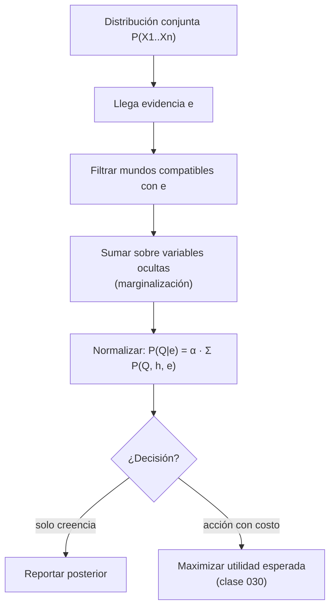

# 025 — Razonamiento con incertidumbre

> [← Clase anterior](../../../classes/part-01-symbolic-ai-search-logic-and-planning/024-proyecto-asistente-neuro-simbolico-explicable/README.md) · [Índice de la parte](../README.md) · [Clase siguiente →](../../../classes/part-02-probabilistic-evolutionary-and-decision-ai/026-teorema-de-bayes-y-actualizacion-de-creencias/README.md)

**Parte:** 02 — IA probabilística, evolutiva y de decisión  
**Nivel:** intermedio · **Horas estimadas:** 6  
**Laboratorio:** `probability` · **Estado:** `EXECUTABLE_CORE`

## 🎯 Propósito

Comprender **razonamiento con incertidumbre** dentro de la evolución de la inteligencia
artificial, implementar un experimento mínimo verificable y distinguir qué parte
constituye evidencia frente a una afirmación todavía no comprobada.

## 📚 Resultados de aprendizaje

Al finalizar podrás:

1. Explicar razonamiento con incertidumbre usando los conceptos `incertidumbre`, `evidencia`, `creencias`, `riesgo`.
2. Ejecutar el laboratorio con una semilla explícita y revisar su contrato JSON.
3. Identificar al menos un supuesto, una limitación y un riesgo de aplicación.
4. Comparar el enfoque con la etapa anterior de la ruta de aprendizaje.
5. Producir una evidencia reproducible y una conclusión que no exceda los datos.

## 🧩 Conceptos centrales

`incertidumbre`, `evidencia`, `creencias`, `riesgo`

## 🗺️ Ubicación en el mapa de la IA

La IA simbólica de la Parte 01 asume conocimiento completo y correcto: si la base de hechos dice `llueve`, entonces llueve. El mundo real no coopera: los sensores fallan, los datos son parciales y las reglas tienen excepciones. El razonamiento con incertidumbre reemplaza la lógica booleana por la teoría de la probabilidad como "lógica extendida" para grados de creencia. Es el fundamento de todo lo que sigue en esta parte: Bayes (026), redes bayesianas (027), HMM (028) y MDP (029) son formas cada vez más estructuradas de gestionar la misma pregunta: ¿qué debo creer y hacer cuando no lo sé todo?

## 📖 Fundamentos

### 🎲 Por qué la lógica no basta

Considera la regla lógica `dolor_de_muelas → caries`. Es falsa (puede ser gingivitis), y su inversa `caries → dolor_de_muelas` también (hay caries asintomáticas). Enumerar todas las excepciones es inviable (**pereza**), la ciencia no las conoce todas (**ignorancia teórica**) y no podemos examinar cada caso (**ignorancia práctica**). La probabilidad resume esas tres fuentes de incertidumbre en un número: `P(caries | dolor_de_muelas) = 0.6` no afirma que la caries sea "60 % verdadera", sino que, dado lo que sabemos, asignamos un grado de creencia de 0.6.

### 📐 El lenguaje: variables aleatorias y distribuciones

- **Variable aleatoria**: función del espacio muestral a valores. `Clima ∈ {sol, lluvia, nube, nieve}`.
- **Distribución conjunta** `P(X₁, …, Xₙ)`: asigna probabilidad a cada combinación de valores. Es el objeto que contiene *toda* la información probabilística del dominio.
- **Axiomas de Kolmogórov**: `0 ≤ P(a) ≤ 1`, `P(verdad) = 1`, y para eventos disjuntos `P(a ∨ b) = P(a) + P(b)`. De ellos se deriva todo lo demás, incluida la regla general `P(a ∨ b) = P(a) + P(b) − P(a ∧ b)`.

### 🔧 Las tres operaciones básicas

Dada la conjunta, todo se responde con tres mecanismos:

```text
1. Marginalización:      P(X) = Σ_y P(X, y)
   ("sumar fuera" las variables que no interesan)

2. Condicionamiento:     P(X | e) = P(X, e) / P(e)
   (restringir el universo a los mundos donde la evidencia e es cierta
    y renormalizar)

3. Regla del producto:   P(X, Y) = P(X | Y) · P(Y)
   (encadenada n veces da la regla de la cadena:
    P(X₁,…,Xₙ) = Π_i P(Xᵢ | X₁,…,Xᵢ₋₁))
```

La **inferencia por enumeración** responde cualquier consulta `P(Q | e)` recorriendo la tabla conjunta: filtra las filas compatibles con `e`, suma por valores de `Q` y normaliza. Es exacta pero cuesta `O(dⁿ)` en tiempo y memoria para `n` variables con `d` valores: por eso existen las redes bayesianas (clase 027).

### 🔗 Independencia: el arma contra la explosión combinatoria

- `X ⊥ Y` (independencia): `P(X, Y) = P(X)·P(Y)`. Rara en la práctica.
- `X ⊥ Y | Z` (independencia condicional): `P(X, Y | Z) = P(X | Z)·P(Y | Z)`. Muy común: el dolor de muelas y que el gancho del dentista se enganche son dependientes entre sí, pero independientes *dado* que hay caries (la causa común explica ambos).

Una conjunta de 32 variables binarias tiene 2³² − 1 ≈ 4.3×10⁹ parámetros libres; si las variables son condicionalmente independientes dada una causa común, bastan 65. La independencia condicional es la razón de ser de los modelos gráficos.

### ⚖️ Creencias, evidencia y riesgo

- **Creencia (belief)**: distribución `P(H)` sobre hipótesis, previa a observar.
- **Evidencia**: valor observado de algunas variables; condiciona la creencia.
- **Riesgo**: la decisión no depende solo de `P(H | e)` sino del **costo del error**. Con `P(caries|e) = 0.4`, tratar o no tratar depende de la utilidad de cada resultado (esto se formaliza en la clase 030). Un agente racional maximiza utilidad esperada, no probabilidad de acierto.

## 🧮 Ejemplo trabajado

Dominio de 3 variables binarias: `Caries`, `Dolor`, `Engancha` (el gancho del dentista se engancha). Distribución conjunta (suma 1.000):

| Caries | Dolor | Engancha | P |
|---|---|---|---:|
| sí | sí | sí | 0.108 |
| sí | sí | no | 0.012 |
| sí | no | sí | 0.072 |
| sí | no | no | 0.008 |
| no | sí | sí | 0.016 |
| no | sí | no | 0.064 |
| no | no | sí | 0.144 |
| no | no | no | 0.576 |

**Consulta 1 — marginal:** `P(Caries=sí) = 0.108+0.012+0.072+0.008 = 0.200`.

**Consulta 2 — condicional:** `P(Caries=sí | Dolor=sí)`.
Filas con `Dolor=sí`: `P(Dolor=sí) = 0.108+0.012+0.016+0.064 = 0.200`.
De ellas, con caries: `0.108+0.012 = 0.120`.
Resultado: `0.120 / 0.200 = 0.600`. El dolor triplica la creencia (0.2 → 0.6).

**Consulta 3 — más evidencia:** `P(Caries=sí | Dolor=sí, Engancha=sí) = 0.108 / (0.108+0.016) = 0.871`. Cada pieza de evidencia coherente refuerza la creencia, pero nunca llega a certeza.

**Verificación de independencia condicional:** `P(Engancha=sí | Caries=sí) = (0.108+0.072)/0.200 = 0.9`, y `P(Engancha=sí | Caries=sí, Dolor=sí) = 0.108/0.120 = 0.9`. Dado `Caries`, el dolor no aporta nada sobre el gancho: `Engancha ⊥ Dolor | Caries`.

## 📊 Propiedades y comparación

| Enfoque | Representa incertidumbre | Combina evidencia | Costo | Limitación principal |
|---|---|---|---|---|
| Lógica proposicional | No (verdadero/falso) | Conjunción monótona | Bajo | Colapsa ante excepciones |
| Lógica no monótona / default | Cualitativa | Retracción de conclusiones | Medio | Sin grados: no distingue 0.51 de 0.99 |
| Factores de certeza (MYCIN) | Numérica ad hoc | Fórmulas heurísticas | Bajo | Incoherente al encadenar evidencia |
| Teoría de probabilidad | Grados de creencia [0,1] | Condicionamiento (Bayes) | Alto en la conjunta plena | Exige estimar parámetros |
| Conjuntos difusos | Vaguedad de predicados | Operadores min/max | Bajo | Modela imprecisión, no ignorancia (clase 032) |



## ⚠️ Errores conceptuales frecuentes

1. **"Probabilidad 0.6 significa que el hecho es parcialmente verdadero."** Falso: el mundo está en un estado definido; el 0.6 mide *nuestra* creencia dada la evidencia disponible. Es epistemología, no ontología.
2. **Confundir `P(a|b)` con `P(b|a)`.** `P(dolor|caries) = 0.6` no implica `P(caries|dolor) = 0.6`; la inversión exige el teorema de Bayes con los priors (clase 026).
3. **Ignorar la normalización.** `P(Caries=sí, Dolor=sí) = 0.12` no es la respuesta a "¿probabilidad de caries dado dolor?"; hay que dividir por `P(Dolor=sí)`.
4. **Suponer independencia sin justificarla.** Multiplicar `P(a)·P(b)` cuando `a` y `b` comparten causa produce estimaciones drásticamente erróneas (el error clásico de "naive" mal aplicado).
5. **Tratar la creencia como decisión.** Elegir la hipótesis más probable ignora costos asimétricos: con `P(incendio) = 0.02` no se ignora la alarma, porque el costo del falso negativo es enorme.

## 🚀 Del aprendizaje a la operación

El laboratorio manipula una conjunta diminuta y perfectamente conocida. En un sistema real: (1) la conjunta nunca se conoce — se estima desde datos con error de muestreo; (2) la enumeración es inviable a partir de decenas de variables y se necesitan modelos gráficos o inferencia aproximada; (3) las probabilidades deben *calibrarse* (que un 0.7 declarado acierte ~70 % de las veces) y monitorearse ante deriva de datos; (4) la salida probabilística exige una capa de decisión con costos explícitos y revisión humana proporcional al riesgo.

## 🧪 Laboratorio

```bash
python lab.py
```

El laboratorio llama a `ai_evolution.labs.run_lab("probability")`. Esta
decisión evita 183 implementaciones divergentes: cada clase tiene un entrypoint
propio, pero los motores didácticos se prueban como una biblioteca común.

### 🔍 Evidencia esperada

- tipo de laboratorio y semilla;
- entradas o decisiones observables;
- resultado estructurado;
- lista `evidence` con hechos que pueden inspeccionarse;
- lista `limitations` que impide presentar la demo como producción.

## 📓 Notebooks

- [📓 `notebook.ipynb`](notebook.ipynb): recorrido guiado con la materia resumida.
- [✍️ `notebook_student.ipynb`](notebook_student.ipynb): ejercicios para resolver.
- [✅ `notebook_solution.ipynb`](notebook_solution.ipynb): solución de referencia explicada.

## 📝 Evaluación

| Criterio | Peso |
|---|---:|
| Comprensión conceptual | 25 % |
| Ejecución reproducible | 25 % |
| Interpretación basada en evidencia | 25 % |
| Riesgos, límites y mejora propuesta | 25 % |

Consulta [assessment.md](assessment.md) para preguntas y criterio de aceptación.

## ⚠️ Errores comunes

| Síntoma | Causa probable | Corrección |
|---|---|---|
| El código corre, pero no hay conclusión | Se confundió ejecución con aprendizaje | Explica qué demuestra y qué no demuestra |
| El resultado cambia sin explicación | No se registró semilla o configuración | Conserva semilla, versión y parámetros |
| Se promete uso real | Se extrapoló desde una demo educativa | Declara entorno, datos, límites y revisión humana |
| Se copia una métrica aislada | No existe baseline ni costo de error | Añade comparación y criterio de decisión |

## ❓ Preguntas frecuentes

**¿Debo usar una API comercial?**  
No. El núcleo funciona localmente. Las extensiones LIVE se documentan por separado.

**¿El laboratorio representa una implementación industrial?**  
No por sí solo. Enseña el contrato y el patrón; producción exige integración,
seguridad, observabilidad, pruebas y operación.

**¿Dónde profundizo?**  
Revisa las especializaciones enlazadas en el README raíz y la ruta siguiente.

## 🔗 Referencias

- Russell, S. & Norvig, P. (2020). *Artificial Intelligence: A Modern Approach*, 4.ª ed., cap. 12 "Quantifying Uncertainty". [https://aima.cs.berkeley.edu/](https://aima.cs.berkeley.edu/)
- Jaynes, E. T. (2003). *Probability Theory: The Logic of Science*. Cambridge University Press.
- Koller, D. & Friedman, N. (2009). *Probabilistic Graphical Models*, caps. 2-3. [https://mitpress.mit.edu/9780262013192/probabilistic-graphical-models/](https://mitpress.mit.edu/9780262013192/probabilistic-graphical-models/)
- Murphy, K. (2022). *Probabilistic Machine Learning: An Introduction*, cap. 2. [https://probml.github.io/pml-book/book1.html](https://probml.github.io/pml-book/book1.html)
- Pearl, J. (1988). *Probabilistic Reasoning in Intelligent Systems*. Morgan Kaufmann.

<!-- papers:inicio -->

---

## 📜 Papers que fundamentan esta clase

> Bloque generado por `python scripts/link_papers_to_classes.py`. La fuente es [`papers/catalog/papers.json`](../../../papers/catalog/papers.json).

| Paper | Año | Qué desbloqueó | Miniatura |
|---|---:|---|---|
| [P88 · Probabilidad, frecuencia y expectativa razonable](../../../papers/foundational/P88_cox/README.md) | 1946 | Demuestra que la probabilidad no es una convención entre varias: es la única forma consistente de extender la lógica a grados de creencia. | [notebook](../../../notebooks/papers/P88_cox.ipynb) |

Cada ficha explica el problema anterior, la matemática mínima, los límites y los errores de atribución más frecuentes. Para leerlas con método: [cómo leer un paper de IA](../../../papers/guides/COMO_LEER_UN_PAPER_DE_IA.md) · [anexos matemáticos](../../../papers/annexes/README.md).
<!-- papers:fin -->
---

## ⬅️ Clase anterior

[024 — Proyecto: asistente neuro-simbólico explicable](../../part-01-symbolic-ai-search-logic-and-planning/024-proyecto-asistente-neuro-simbolico-explicable/README.md)

## ➡️ Siguiente clase

[026 — Teorema de Bayes y actualización de creencias](../../part-02-probabilistic-evolutionary-and-decision-ai/026-teorema-de-bayes-y-actualizacion-de-creencias/README.md)
