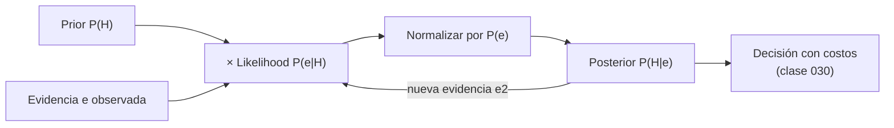

# 026 — Teorema de Bayes y actualización de creencias

> [← Clase anterior](../../../classes/part-02-probabilistic-evolutionary-and-decision-ai/025-razonamiento-con-incertidumbre/README.md) · [Índice de la parte](../README.md) · [Clase siguiente →](../../../classes/part-02-probabilistic-evolutionary-and-decision-ai/027-redes-bayesianas-e-independencia-condicional/README.md)

**Parte:** 02 — IA probabilística, evolutiva y de decisión  
**Nivel:** intermedio · **Horas estimadas:** 6  
**Laboratorio:** `probability` · **Estado:** `EXECUTABLE_CORE`

## 🎯 Propósito

Comprender **teorema de bayes y actualización de creencias** dentro de la evolución de la inteligencia
artificial, implementar un experimento mínimo verificable y distinguir qué parte
constituye evidencia frente a una afirmación todavía no comprobada.

## 📚 Resultados de aprendizaje

Al finalizar podrás:

1. Explicar teorema de bayes y actualización de creencias usando los conceptos `Bayes`, `prior`, `likelihood`, `posterior`.
2. Ejecutar el laboratorio con una semilla explícita y revisar su contrato JSON.
3. Identificar al menos un supuesto, una limitación y un riesgo de aplicación.
4. Comparar el enfoque con la etapa anterior de la ruta de aprendizaje.
5. Producir una evidencia reproducible y una conclusión que no exceda los datos.

## 🧩 Conceptos centrales

`Bayes`, `prior`, `likelihood`, `posterior`

## 🗺️ Ubicación en el mapa de la IA

La clase anterior estableció la probabilidad como lenguaje de creencias; esta clase da el **mecanismo de actualización**: el teorema de Bayes convierte creencias previas más evidencia en creencias posteriores, de forma matemáticamente obligada (no opcional). Es el corazón operativo de la IA probabilística: el clasificador naive Bayes, el filtrado en HMM (028), la inferencia en redes bayesianas (027) y la programación probabilística (035) son, en el fondo, aplicaciones repetidas de esta única ecuación de 1763.

## 📖 Fundamentos

### 📜 El teorema

De la regla del producto `P(a ∧ b) = P(a|b)P(b) = P(b|a)P(a)` se despeja:

```text
              P(e | H) · P(H)
P(H | e) = ───────────────────
                  P(e)

P(H)     prior       — creencia antes de ver la evidencia
P(e|H)   likelihood  — qué tan compatible es la evidencia con la hipótesis
P(e)     evidencia   — constante de normalización: Σ_h P(e|h)P(h)
P(H|e)   posterior   — creencia actualizada
```

Su valor práctico: solemos conocer la dirección **causal** `P(síntoma | enfermedad)` (estable, medible en estudios) y necesitamos la dirección **diagnóstica** `P(enfermedad | síntoma)` (la que cambia con cada epidemia, porque depende del prior). Bayes hace la inversión con contabilidad correcta.

### 🔁 Actualización secuencial

Con evidencias `e₁, e₂, …` el posterior de hoy es el prior de mañana:

```text
P(H | e₁, e₂) ∝ P(e₂ | H, e₁) · P(H | e₁)
```

Si las evidencias son condicionalmente independientes dado `H` (supuesto *naive Bayes*), el término se simplifica a `P(e₂|H)` y la actualización es un producto de likelihoods sobre el prior. El orden de llegada de la evidencia no altera el posterior final.

### 🧾 Forma en odds: la versión mental

Para hipótesis binarias conviene trabajar con momios (odds) `O(H) = P(H)/P(¬H)`:

```text
O(H | e) = O(H) · LR      donde  LR = P(e|H) / P(e|¬H)
```

El **factor de Bayes / razón de verosimilitud (LR)** mide cuánta fuerza probatoria tiene la evidencia: LR = 1 no informa; LR = 10 multiplica los momios por 10. Esta forma evita la falacia de la tasa base porque obliga a partir de los momios previos.

### 🧪 Estimación y suavizado

Cuando los parámetros se estiman de datos, la frecuencia cruda `count(x)/N` asigna probabilidad 0 a lo no visto, y un solo cero aniquila cualquier producto de likelihoods. El **suavizado de Laplace** añade pseudo-conteos: `P(x) = (count(x)+α)/(N+αk)` con `k` valores posibles. Es, en términos bayesianos, un prior Dirichlet sobre los parámetros.

### 🧠 Interpretación

- **Frecuentista**: la probabilidad es límite de frecuencias en repeticiones. Bien definida solo para eventos repetibles.
- **Bayesiana**: la probabilidad es grado de creencia coherente; permite hablar de `P(hipótesis)`. El teorema de Cox y el argumento *Dutch book* muestran que cualquier sistema de creencias graduadas que evite incoherencias debe obedecer los axiomas de probabilidad.

## 🧮 Ejemplo trabajado

**Test diagnóstico.** Prevalencia `P(D) = 0.01`, sensibilidad `P(+|D) = 0.99`, especificidad `P(−|¬D) = 0.95` (es decir, tasa de falsos positivos 0.05). Llega un resultado positivo.

```text
P(+) = P(+|D)P(D) + P(+|¬D)P(¬D)
     = 0.99·0.01  + 0.05·0.99
     = 0.0099     + 0.0495     = 0.0594

P(D|+) = 0.0099 / 0.0594 = 0.1667  ≈ 1/6
```

Con un test "99 % sensible", el positivo solo implica ~17 % de probabilidad de enfermedad: de 10 000 personas, 99 enfermas dan positivo verdadero pero 495 sanas dan falso positivo. **Segundo test positivo independiente** (posterior como nuevo prior):

```text
O(D|+) = (0.1667/0.8333) = 0.2 ;  LR = 0.99/0.05 = 19.8
O(D|++) = 0.2 · 19.8 = 3.96  →  P(D|++) = 3.96/4.96 = 0.798
```

Dos positivos elevan la creencia a ~80 %. La tabla resume la trayectoria de la creencia:

| Evidencia acumulada | P(D) |
|---|---:|
| ninguna (prior) | 0.010 |
| un positivo | 0.167 |
| dos positivos | 0.798 |
| tres positivos | 0.987 |

## 📊 Propiedades y comparación

| Propiedad | Actualización bayesiana | Estimación frecuentista (MLE) | Reglas ad hoc (scores) |
|---|---|---|---|
| Usa conocimiento previo | Sí (prior explícito) | No | Implícito y opaco |
| Coherencia al encadenar evidencia | Garantizada | N/A | No garantizada |
| Datos pequeños | Robusta (prior regulariza) | Sobreajusta / ceros | Frágil |
| Costo | Necesita likelihood y prior | Solo datos | Bajo |
| Crítica principal | Subjetividad del prior | Ignora la tasa base | Sin semántica |



## ⚠️ Errores conceptuales frecuentes

1. **Falacia de la tasa base**: interpretar `P(+|D) = 0.99` como `P(D|+) ≈ 0.99`. El ejemplo trabajado muestra que con prevalencia 1 % el posterior es ~0.17.
2. **Falacia del fiscal**: confundir `P(evidencia | inocente)` pequeña con `P(inocente | evidencia)` pequeña; ignora cuántos inocentes hay en la población de referencia.
3. **Contar dos veces la evidencia correlacionada**: multiplicar likelihoods de dos tests que comparten mecanismo de error como si fueran independientes infla el posterior.
4. **Prior 0 o 1**: asignar probabilidad exacta 0 a una hipótesis la hace irrecuperable ante cualquier evidencia (con `P(H)=0`, el posterior es 0 para siempre). Regla práctica de Cromwell: reservar 0/1 para lógica, no para creencias empíricas.
5. **"El prior es trampa subjetiva"**: no declararlo no lo elimina; el MLE equivale a un prior uniforme implícito. La honestidad está en declararlo y hacer análisis de sensibilidad.

## 🚀 Del aprendizaje a la operación

Aquí los parámetros (prevalencia, sensibilidad) se dan como conocidos; en operación se estiman con intervalos de confianza y caducan (la prevalencia cambia con el tiempo y el lugar). Un sistema real necesita: recalibración periódica del prior con datos frescos, verificación de la independencia asumida entre fuentes de evidencia, suavizado ante eventos no vistos y umbrales de decisión derivados de costos clínicos o de negocio, no del 0.5 por defecto.

## 🧪 Laboratorio

```bash
python lab.py
```

El laboratorio llama a `ai_evolution.labs.run_lab("probability")`. Esta
decisión evita 183 implementaciones divergentes: cada clase tiene un entrypoint
propio, pero los motores didácticos se prueban como una biblioteca común.

### 🔍 Evidencia esperada

- tipo de laboratorio y semilla;
- entradas o decisiones observables;
- resultado estructurado;
- lista `evidence` con hechos que pueden inspeccionarse;
- lista `limitations` que impide presentar la demo como producción.

## 📓 Notebooks

- [📓 `notebook.ipynb`](notebook.ipynb): recorrido guiado con la materia resumida.
- [✍️ `notebook_student.ipynb`](notebook_student.ipynb): ejercicios para resolver.
- [✅ `notebook_solution.ipynb`](notebook_solution.ipynb): solución de referencia explicada.

## 📝 Evaluación

| Criterio | Peso |
|---|---:|
| Comprensión conceptual | 25 % |
| Ejecución reproducible | 25 % |
| Interpretación basada en evidencia | 25 % |
| Riesgos, límites y mejora propuesta | 25 % |

Consulta [assessment.md](assessment.md) para preguntas y criterio de aceptación.

## ⚠️ Errores comunes

| Síntoma | Causa probable | Corrección |
|---|---|---|
| El código corre, pero no hay conclusión | Se confundió ejecución con aprendizaje | Explica qué demuestra y qué no demuestra |
| El resultado cambia sin explicación | No se registró semilla o configuración | Conserva semilla, versión y parámetros |
| Se promete uso real | Se extrapoló desde una demo educativa | Declara entorno, datos, límites y revisión humana |
| Se copia una métrica aislada | No existe baseline ni costo de error | Añade comparación y criterio de decisión |

## ❓ Preguntas frecuentes

**¿Debo usar una API comercial?**  
No. El núcleo funciona localmente. Las extensiones LIVE se documentan por separado.

**¿El laboratorio representa una implementación industrial?**  
No por sí solo. Enseña el contrato y el patrón; producción exige integración,
seguridad, observabilidad, pruebas y operación.

**¿Dónde profundizo?**  
Revisa las especializaciones enlazadas en el README raíz y la ruta siguiente.

## 🔗 Referencias

- Bayes, T. & Price, R. (1763). "An Essay towards solving a Problem in the Doctrine of Chances". *Phil. Trans. Royal Society*, 53, 370-418. [https://doi.org/10.1098/rstl.1763.0053](https://doi.org/10.1098/rstl.1763.0053)
- Russell, S. & Norvig, P. (2020). *AIMA*, 4.ª ed., cap. 12.5-12.6. [https://aima.cs.berkeley.edu/](https://aima.cs.berkeley.edu/)
- Murphy, K. (2022). *Probabilistic Machine Learning: An Introduction*, cap. 4 (estadística bayesiana). [https://probml.github.io/pml-book/book1.html](https://probml.github.io/pml-book/book1.html)
- Gelman, A. et al. (2013). *Bayesian Data Analysis*, 3.ª ed. [http://www.stat.columbia.edu/~gelman/book/](http://www.stat.columbia.edu/~gelman/book/)
- Jurafsky, D. & Martin, J. H. *Speech and Language Processing*, 3.ª ed. (draft), cap. de naive Bayes. [https://web.stanford.edu/~jurafsky/slp3/](https://web.stanford.edu/~jurafsky/slp3/)

<!-- papers:inicio -->

---

## 📜 Papers que fundamentan esta clase

> Bloque generado por `python scripts/link_papers_to_classes.py`. La fuente es [`papers/catalog/papers.json`](../../../papers/catalog/papers.json).

| Paper | Año | Qué desbloqueó | Miniatura |
|---|---:|---|---|
| [P87 · Ensayo para resolver un problema en la doctrina de las probabilidades](../../../papers/foundational/P87_bayes/README.md) | 1763 | La regla que invierte el condicional: pasar de «qué esperaría ver si la hipótesis fuese cierta» a «cuán probable es la hipótesis dado lo que he visto». | [notebook](../../../notebooks/papers/P87_bayes.ipynb) |

Cada ficha explica el problema anterior, la matemática mínima, los límites y los errores de atribución más frecuentes. Para leerlas con método: [cómo leer un paper de IA](../../../papers/guides/COMO_LEER_UN_PAPER_DE_IA.md) · [anexos matemáticos](../../../papers/annexes/README.md).
<!-- papers:fin -->
---

## ⬅️ Clase anterior

[025 — Razonamiento con incertidumbre](../../part-02-probabilistic-evolutionary-and-decision-ai/025-razonamiento-con-incertidumbre/README.md)

## ➡️ Siguiente clase

[027 — Redes bayesianas e independencia condicional](../../part-02-probabilistic-evolutionary-and-decision-ai/027-redes-bayesianas-e-independencia-condicional/README.md)
