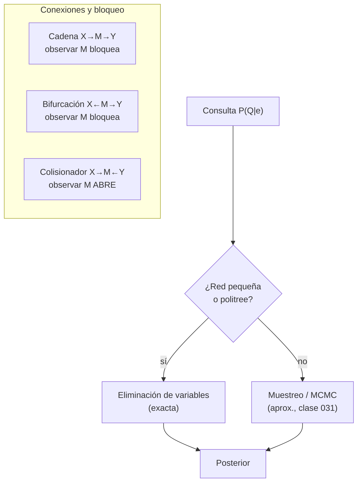

# Teoría — Redes bayesianas e independencia condicional

## 🗺️ Ubicación en el mapa de la IA

La conjunta plena (clase 025) es exacta pero exponencial; Bayes (026) actualiza creencias pero no dice cómo representar dominios grandes. Las redes bayesianas (Pearl, años 80) resuelven ambos problemas: codifican la conjunta como un grafo dirigido acíclico (DAG) que explota independencias condicionales. Fueron el estándar del razonamiento incierto en IA durante dos décadas y son la base de los HMM (028), de la programación probabilística (035) y —leídas causalmente— del do-calculus de Pearl.

## 📖 Fundamentos

### 🕸️ Definición

Una **red bayesiana** es un par (G, Θ):

- **G**: DAG cuyos nodos son variables aleatorias; una arista `X → Y` expresa dependencia directa (a menudo causal).
- **Θ**: para cada nodo, una **tabla de probabilidad condicional (CPT)** `P(Xᵢ | Padres(Xᵢ))`.

La red define la conjunta por la **regla de la cadena factorizada**:

```text
P(X₁, …, Xₙ) = Π_i P(Xᵢ | Padres(Xᵢ))
```

**Ahorro:** con `n` variables binarias y a lo sumo `k` padres por nodo, los parámetros pasan de `2ⁿ − 1` a `≤ n·2ᵏ`. Para n = 30, k = 3: de ~10⁹ a 240.

### 🧭 Semántica local: cada variable es independiente de sus no-descendientes dados sus padres

Esa es la única suposición que hace la red. Todo lo demás (qué independencias se cumplen entre pares arbitrarios) se lee del grafo con **d-separación**.

### 🔀 d-separación: las tres conexiones elementales

Un camino entre `X` e `Y` queda **bloqueado** por el conjunto observado `Z` según el tipo de tramo:

```text
1. Cadena     X → M → Y   bloqueado si M ∈ Z   (mediador observado)
2. Bifurcación X ← M → Y  bloqueado si M ∈ Z   (causa común observada)
3. Colisionador X → M ← Y bloqueado si M ∉ Z y ningún descendiente de M ∈ Z
                           (¡observar el colisionador ABRE el camino!)
```

`X ⊥ Y | Z` se garantiza si **todos** los caminos entre `X` e `Y` están bloqueados por `Z`. El caso 3 produce el fenómeno de **explaining away**: dos causas independientes de un mismo efecto se vuelven dependientes al observar el efecto (si la alarma suena y hubo terremoto, baja la creencia en robo).

### ⚙️ Inferencia

- **Enumeración**: expandir `P(Q|e) = α Σ_h Π_i P(xᵢ|padres)` sobre las variables ocultas `h`. Exponencial en el número de ocultas.
- **Eliminación de variables**: intercalar sumas y productos, guardando resultados intermedios como **factores**; el costo lo domina el factor más grande generado (ancho del orden de eliminación). Exacta y mucho más eficiente en la práctica.
- La inferencia exacta en redes arbitrarias es **NP-dura**; en **politrees** (a lo sumo un camino no dirigido entre cada par) es lineal. Para redes densas se usa inferencia aproximada por muestreo (clase 031).

### 🏗️ Construcción

Orden recomendado: elegir variables → ordenarlas (causas antes que efectos) → para cada una, elegir el conjunto mínimo de padres que la haga independiente de las anteriores → llenar CPTs. Un orden anticausal produce redes correctas pero densas y con parámetros antinaturales.

## 🧮 Ejemplo trabajado

Red clásica de Pearl (alarma antirrobo):

```text
Robo (B)      Terremoto (E)
    \            /
     v          v
       Alarma (A)
      /          \
     v            v
JuanLlama (J)  MaríaLlama (M)
```

CPTs: `P(B)=0.001`, `P(E)=0.002`; `P(A|B,E)=0.95`, `P(A|B,¬E)=0.94`, `P(A|¬B,E)=0.29`, `P(A|¬B,¬E)=0.001`; `P(J|A)=0.90`, `P(J|¬A)=0.05`; `P(M|A)=0.70`, `P(M|¬A)=0.01`.

**Conjunta de un mundo concreto** (los cinco factores se multiplican):

```text
P(j, m, a, ¬b, ¬e) = P(j|a)·P(m|a)·P(a|¬b,¬e)·P(¬b)·P(¬e)
                   = 0.90 · 0.70 · 0.001 · 0.999 · 0.998
                   = 0.000628
```

**Consulta diagnóstica** `P(B | j, m)`: enumerando las 8 combinaciones de `{A, E}` para `B=b` y `B=¬b` se obtiene `P(B|j,m) = α·⟨0.00059224, 0.0014919⟩ ≈ ⟨0.284, 0.716⟩`. Aunque ambos vecinos llamaron, la probabilidad de robo es solo **28.4 %**: el prior 0.001 pesa mucho (compárese con la falacia de tasa base de la clase 026).

**d-separación en la red:** `J ⊥ M | A` (bifurcación con A observada: las llamadas solo se correlacionan a través de la alarma); `B ⊥ E` a priori, pero `B ⟂̸ E | A` (colisionador observado: explaining away).

## 📊 Propiedades y comparación

| Representación | Parámetros (n binarias) | Inferencia exacta | Lee independencias | Interpretación causal |
|---|---|---|---|---|
| Conjunta plena | 2ⁿ − 1 | O(2ⁿ) | No (implícitas) | No |
| Naive Bayes | 2n + 1 | O(n) | Solo una (todo ⊥ dado la clase) | No |
| Red bayesiana | ≤ n·2ᵏ | NP-dura (lineal en politree) | d-separación | Opcional (si aristas = mecanismos) |
| Red de Markov (no dirigida) | según cliques | NP-dura | separación simple | No |



## ⚠️ Errores conceptuales frecuentes

1. **"Arista = causalidad garantizada."** La red solo codifica independencias; la lectura causal exige supuestos extra (clase 035). Dos DAG distintos pueden representar la misma distribución (equivalencia de Markov: `X→Y` y `X←Y` son indistinguibles sin más datos).
2. **"Ausencia de arista = variables independientes."** Significa ausencia de dependencia *directa*; puede haber dependencia mediada por otros caminos.
3. **Tratar el colisionador como una cadena.** Condicionar en un efecto común *crea* dependencia (sesgo de selección): en un hospital, enfermedades independientes en la población parecen correlacionadas entre ingresados.
4. **Creer que la inferencia siempre escala.** Es NP-dura en general; el ancho de árbol de la red decide si la exacta es viable.
5. **Llenar CPTs con frecuencias crudas de pocos datos.** Produce ceros estructurales que anulan mundos posibles; se necesita suavizado o priors (clase 026).

## 🚀 Del aprendizaje a la operación

El laboratorio usa una red diminuta con CPTs dadas. En producción: la **estructura** se aprende de datos (búsqueda con score BIC o tests de independencia) o se elicita de expertos con sesgos documentados; los **parámetros** requieren estimación con intervalos; la inferencia en redes grandes exige motores dedicados (variable elimination optimizada, junction tree o muestreo); y hay que monitorear que las independencias asumidas sigan siendo válidas cuando el proceso generador cambia.

## 🔗 Referencias

- Pearl, J. (1988). *Probabilistic Reasoning in Intelligent Systems: Networks of Plausible Inference*. Morgan Kaufmann.
- Koller, D. & Friedman, N. (2009). *Probabilistic Graphical Models: Principles and Techniques*, caps. 3-9. [https://mitpress.mit.edu/9780262013192/probabilistic-graphical-models/](https://mitpress.mit.edu/9780262013192/probabilistic-graphical-models/)
- Russell, S. & Norvig, P. (2020). *AIMA*, 4.ª ed., cap. 13 "Probabilistic Reasoning". [https://aima.cs.berkeley.edu/](https://aima.cs.berkeley.edu/)
- Cooper, G. F. (1990). "The computational complexity of probabilistic inference using Bayesian belief networks". *Artificial Intelligence*, 42(2-3), 393-405. [https://doi.org/10.1016/0004-3702(90)90060-D](https://doi.org/10.1016/0004-3702(90)90060-D)
- Pearl, J. (2009). *Causality: Models, Reasoning, and Inference*, 2.ª ed., cap. 1. [https://bayes.cs.ucla.edu/BOOK-2K/](https://bayes.cs.ucla.edu/BOOK-2K/)

---

> [⬅️ Volver a la clase](README.md) · [📝 Evaluación](assessment.md) · [📚 Índice de la parte](../README.md)
