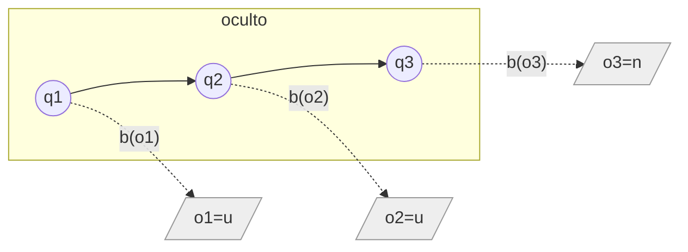

# Teoría — Modelos ocultos de Markov

## 🗺️ Ubicación en el mapa de la IA

Las redes bayesianas (027) modelan un instante; los HMM añaden el **tiempo**: son una red bayesiana dinámica desenrollada, con un estado oculto que evoluciona como cadena de Markov y observaciones ruidosas de ese estado. Dominaron el reconocimiento de voz, el etiquetado gramatical y la bioinformática durante ~30 años (tutorial de Rabiner, 1989), y sus algoritmos (forward, Viterbi) reaparecen en los MDP (029), en el filtrado de Kalman y, conceptualmente, en cualquier sistema que mantiene una "creencia de estado" — incluidos los agentes modernos.

## 📖 Fundamentos

### 🧩 Definición

Un HMM discreto es λ = (S, V, A, B, π):

```text
S = {s₁…s_N}   estados ocultos          V = {v₁…v_M}  símbolos observables
A: a_ij = P(q_{t+1}=s_j | q_t=s_i)      matriz de transición  (N×N)
B: b_j(k) = P(o_t=v_k | q_t=s_j)        matriz de emisión     (N×M)
π: π_i = P(q₁=s_i)                       distribución inicial
```

Dos supuestos estructurales: **Markov de orden 1** (el estado siguiente depende solo del actual) y **emisión condicionada solo al estado actual**. La conjunta se factoriza:

```text
P(q₁…q_T, o₁…o_T) = π_{q₁} b_{q₁}(o₁) · Π_{t=2}^{T} a_{q_{t-1} q_t} b_{q_t}(o_t)
```

### ❓ Los tres problemas de Rabiner

1. **Evaluación** — `P(O | λ)`: ¿qué tan probable es la secuencia observada? → algoritmo **forward**.
2. **Decodificación** — `argmax_Q P(Q | O, λ)`: ¿cuál es la secuencia de estados más probable? → algoritmo de **Viterbi**.
3. **Aprendizaje** — ajustar λ para maximizar `P(O | λ)` → **Baum-Welch** (EM sobre HMM).

### ➡️ Forward (evaluación en O(N²T) en lugar de O(Nᵀ))

La variable forward `α_t(i) = P(o₁…o_t, q_t = s_i)` se calcula por programación dinámica:

```text
Inicialización:  α₁(i) = π_i · b_i(o₁)
Recursión:       α_{t+1}(j) = [ Σ_i α_t(i) · a_ij ] · b_j(o_{t+1})
Terminación:     P(O|λ) = Σ_i α_T(i)
```

Normalizando `α_t` en cada paso se obtiene el **filtrado**: `P(q_t | o₁…o_t)`, la creencia actual del estado. La variable backward `β_t(i)` permite además el **suavizado** `P(q_t | o₁…o_T)` (revisar el pasado con información futura).

### 🏆 Viterbi (decodificación)

Igual recursión pero con `max` en lugar de `Σ`, guardando punteros al mejor predecesor:

```text
δ₁(i) = π_i b_i(o₁)
δ_{t+1}(j) = max_i [ δ_t(i) · a_ij ] · b_j(o_{t+1});   ψ_{t+1}(j) = argmax_i …
Camino: q*_T = argmax_i δ_T(i), luego retroceder por ψ.
```

Complejidad O(N²T). En la práctica se trabaja con logaritmos para evitar underflow (productos de cientos de probabilidades < 1).

### 🔄 Baum-Welch (esbozo)

EM: con λ actual se calculan las responsabilidades `γ_t(i)` (estar en `i` en `t`) y `ξ_t(i,j)` (transitar `i→j` en `t`) usando forward-backward; luego se re-estiman A, B, π como frecuencias esperadas. Garantiza no disminuir `P(O|λ)`; converge a un óptimo local.

## 🧮 Ejemplo trabajado

HMM del clima con 2 estados ocultos {`Lluvia` (R), `Sol` (S)} y observación {`paraguas` (u), `sin paraguas` (n)}:

```text
π = (0.5, 0.5)
A: R→R 0.7, R→S 0.3, S→R 0.3, S→S 0.7
B: b_R(u)=0.9, b_R(n)=0.1, b_S(u)=0.2, b_S(n)=0.8
```

Observaciones: `O = (u, u, n)`.

**Forward:**

```text
t=1: α₁(R)=0.5·0.9=0.45          α₁(S)=0.5·0.2=0.10
t=2: α₂(R)=(0.45·0.7+0.10·0.3)·0.9=(0.315+0.030)·0.9=0.3105
     α₂(S)=(0.45·0.3+0.10·0.7)·0.2=(0.135+0.070)·0.2=0.0410
t=3: α₃(R)=(0.3105·0.7+0.0410·0.3)·0.1=(0.21735+0.0123)·0.1=0.022965
     α₃(S)=(0.3105·0.3+0.0410·0.7)·0.8=(0.09315+0.0287)·0.8=0.097480
P(O|λ)=0.022965+0.097480=0.120445
```

Filtrado en t=3: `P(R|uun) = 0.022965/0.120445 ≈ 0.191` — el día sin paraguas desploma la creencia en lluvia.

**Viterbi:**

```text
t=1: δ₁(R)=0.45, δ₁(S)=0.10
t=2: δ₂(R)=max(0.45·0.7, 0.10·0.3)·0.9 = 0.315·0.9 = 0.2835   (desde R)
     δ₂(S)=max(0.45·0.3, 0.10·0.7)·0.2 = 0.135·0.2 = 0.0270   (desde R)
t=3: δ₃(R)=max(0.2835·0.7, 0.0270·0.3)·0.1 = 0.19845·0.1 = 0.0198 (desde R)
     δ₃(S)=max(0.2835·0.3, 0.0270·0.7)·0.8 = 0.08505·0.8 = 0.0680 (desde R)
```

Mejor camino: `q*₃ = S`, retrocediendo → **(R, R, S)** con probabilidad 0.068. Nótese que la secuencia Viterbi no es la concatenación de los estados marginalmente más probables por instante: optimiza la secuencia *completa*.

## 📊 Propiedades y comparación

| Modelo | Estado | Observación | Inferencia | Uso típico |
|---|---|---|---|---|
| Cadena de Markov | visible, discreto | = estado | trivial | modelado de secuencias simples |
| HMM | oculto, discreto | ruidosa, discreta/continua | forward/Viterbi O(N²T) | voz, POS-tagging, genes |
| Filtro de Kalman | oculto, continuo lineal-gaussiano | lineal + ruido gaussiano | cerrada, exacta | seguimiento, navegación |
| RNN/Transformer | representación aprendida | cualquiera | aproximada por gradiente | secuencias con dependencias largas |



## ⚠️ Errores conceptuales frecuentes

1. **Confundir filtrado con decodificación.** `P(q_t|o₁…o_t)` (forward normalizado) responde "¿dónde estoy ahora?"; Viterbi responde "¿cuál fue la trayectoria completa más probable?". Pueden discrepar.
2. **Sumar los estados más probables por instante y llamarlo Viterbi.** La secuencia de máximos marginales puede incluso ser una trayectoria de probabilidad 0 (transición prohibida).
3. **Olvidar el underflow.** Con T > ~100, los productos colapsan a 0 en float64; se usa log-espacio (Viterbi) o normalización por paso (forward).
4. **Creer que Baum-Welch encuentra el óptimo global.** Es EM: óptimo local dependiente de la inicialización; se corre varias veces con semillas distintas.
5. **Aplicar Markov de orden 1 a dependencias largas sin verificarlo.** Si la observación de hoy depende de hace 10 pasos, el HMM plano lo modela mal; se amplía el estado o se cambia de familia de modelo.

## 🚀 Del aprendizaje a la operación

El ejemplo usa matrices dadas y 3 pasos; producción implica: estimar A y B con Baum-Welch sobre corpora grandes (con reinicios múltiples y suavizado de emisiones no vistas), trabajar íntegramente en log-espacio, elegir N (número de estados) por validación, y aceptar que los sistemas modernos de voz/lenguaje reemplazaron HMM por redes neuronales — el HMM sigue siendo el modelo de referencia cuando hay pocos datos y se necesita interpretabilidad.

## 🔗 Referencias

- Rabiner, L. R. (1989). "A tutorial on hidden Markov models and selected applications in speech recognition". *Proceedings of the IEEE*, 77(2), 257-286. [https://doi.org/10.1109/5.18626](https://doi.org/10.1109/5.18626)
- Viterbi, A. (1967). "Error bounds for convolutional codes and an asymptotically optimum decoding algorithm". *IEEE Trans. Information Theory*, 13(2), 260-269. [https://doi.org/10.1109/TIT.1967.1054010](https://doi.org/10.1109/TIT.1967.1054010)
- Russell, S. & Norvig, P. (2020). *AIMA*, 4.ª ed., cap. 14 "Probabilistic Reasoning over Time". [https://aima.cs.berkeley.edu/](https://aima.cs.berkeley.edu/)
- Jurafsky, D. & Martin, J. H. *Speech and Language Processing*, 3.ª ed. (draft), apéndice sobre HMM. [https://web.stanford.edu/~jurafsky/slp3/](https://web.stanford.edu/~jurafsky/slp3/)
- Bishop, C. (2006). *Pattern Recognition and Machine Learning*, cap. 13. [https://www.microsoft.com/en-us/research/publication/pattern-recognition-machine-learning/](https://www.microsoft.com/en-us/research/publication/pattern-recognition-machine-learning/)

---

> [⬅️ Volver a la clase](README.md) · [📝 Evaluación](assessment.md) · [📚 Índice de la parte](../README.md)
