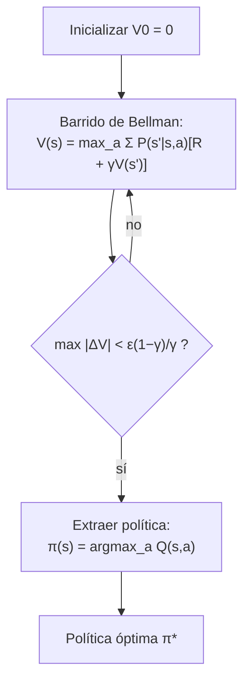

# Teoría — Procesos de decisión de Markov

## 🗺️ Ubicación en el mapa de la IA

Los HMM (028) estiman el estado del mundo; los MDP dan el paso decisivo: **actuar** sobre él. Un MDP modela decisiones secuenciales bajo transiciones estocásticas, con recompensas que se acumulan en el tiempo. Formalizados por Bellman (1957), son el lenguaje matemático del aprendizaje por refuerzo (Sutton & Barto): value iteration y policy iteration son los antecesores exactos de Q-learning y de los métodos que entrenaron a AlphaGo. Junto con la utilidad esperada (030), cierran el puente entre "creer" y "decidir".

## 📖 Fundamentos

### 🧱 Definición

Un MDP es (S, A, P, R, γ):

```text
S          conjunto de estados
A(s)       acciones disponibles en s
P(s'|s,a)  modelo de transición (estocástico)
R(s,a,s')  recompensa inmediata
γ ∈ [0,1)  factor de descuento
```

**Propiedad de Markov**: la transición depende solo del estado y acción actuales. Una **política** π: S → A prescribe qué hacer en cada estado. El objetivo: maximizar el **retorno esperado descontado** `E[Σ_t γᵗ r_t]`. El descuento γ hace finita la suma infinita y codifica preferencia por recompensa temprana: una recompensa a k pasos vale γᵏ veces menos.

### 🧮 Funciones de valor y ecuaciones de Bellman

`Vπ(s)`: retorno esperado partiendo de `s` y siguiendo π. Para la política óptima:

```text
Ecuación de expectativa (política fija π):
  Vπ(s) = Σ_{s'} P(s'|s,π(s)) [ R(s,π(s),s') + γ Vπ(s') ]

Ecuación de optimalidad de Bellman:
  V*(s) = max_a Σ_{s'} P(s'|s,a) [ R(s,a,s') + γ V*(s') ]

Función Q (valor de acción):
  Q*(s,a) = Σ_{s'} P(s'|s,a) [ R(s,a,s') + γ max_{a'} Q*(s',a') ]
  π*(s) = argmax_a Q*(s,a)
```

La ecuación de optimalidad es un sistema no lineal (por el `max`) con solución única para γ < 1; se resuelve por iteración.

### 🔁 Value iteration

```text
V₀(s) ← 0 para todo s
repetir:
    V_{k+1}(s) ← max_a Σ_{s'} P(s'|s,a) [R + γ V_k(s')]
hasta que max_s |V_{k+1}(s) − V_k(s)| < ε(1−γ)/γ
```

El operador de Bellman es una **contracción** con factor γ (teorema del punto fijo de Banach): converge geométricamente a V* desde cualquier inicialización. Costo por iteración: O(|S|²|A|).

### 🔂 Policy iteration

Alterna dos pasos: (1) **evaluación** — resolver `Vπ` para la política actual (sistema lineal de |S| ecuaciones, o iterativamente); (2) **mejora** — `π'(s) ← argmax_a Σ P(s'|s,a)[R + γVπ(s')]`. Si `π' = π`, es óptima. Converge en un número finito de iteraciones (hay finitas políticas y cada mejora es estricta). Suele necesitar pocas iteraciones caras, frente a muchas baratas de value iteration.

### 🌫️ Extensiones

- **POMDP**: el estado no se observa directamente; la política opera sobre la *creencia* (distribución sobre S, mantenida con filtrado tipo HMM). Resolverlos exactamente es intratable en general.
- **RL**: cuando P y R son desconocidos, se aprenden por interacción (Q-learning, métodos de política); el MDP sigue siendo el marco formal subyacente.

## 🧮 Ejemplo trabajado

MDP lineal de 4 estados `s₁—s₂—s₃—s₄`, con `s₄` terminal (recompensa +10 al entrar). Acciones {→, ←}; el movimiento tiene éxito con prob. 0.8 y permanece en el sitio con 0.2. Recompensa de paso −1 por movimiento; γ = 0.9. Value iteration con V₀ = 0 (V(s₄)=0 fijo, terminal):

```text
k=1:
V₁(s₃) = max→ 0.8(10 + 0.9·0) + 0.2(−1 + 0.9·0) = 8.0 − 0.2 = 7.80
V₁(s₂) = max→ 0.8(−1 + 0) + 0.2(−1 + 0) = −1.00
V₁(s₁) = −1.00

k=2:
V₂(s₃) = 0.8(10 + 0) + 0.2(−1 + 0.9·7.80) = 8.0 + 0.2·6.02 = 9.204
        (quedarse en s₃ ahora vale algo: 7.80 descontado)
V₂(s₂) = 0.8(−1 + 0.9·7.80) + 0.2(−1 + 0.9·(−1.00))
       = 0.8·6.02 + 0.2·(−1.90) = 4.816 − 0.380 = 4.436
V₂(s₁) = 0.8(−1 + 0.9·(−1.0)) + 0.2(−1 + 0.9·(−1.0)) = −1.90
```

Tras dos iteraciones ya se ve la estructura: el valor "fluye" hacia atrás desde la meta una capa por iteración, y la política `argmax` es → en todos los estados. Iterando hasta convergencia: `V*(s₃) ≈ 9.42`, `V*(s₂) ≈ 7.02`, `V*(s₁) ≈ 4.88` (verificable sustituyendo en la ecuación de Bellman: cada valor reproduce el lado derecho).

## 📊 Propiedades y comparación

| Método | Requiere modelo P, R | Convergencia | Costo por iteración | Cuándo usar |
|---|---|---|---|---|
| Value iteration | Sí | Geométrica (contracción γ) | O(|S|²|A|) | Muchos estados, γ moderado |
| Policy iteration | Sí | Finita (nº de políticas) | O(|S|³) por evaluación exacta | Pocas políticas buenas, γ alto |
| Q-learning (RL) | No (aprende de muestras) | Asintótica (condiciones de paso) | O(1) por transición | Modelo desconocido |
| POMDP exacto | Sí + modelo de observación | PSPACE-duro | exponencial | Solo problemas pequeños |



## ⚠️ Errores conceptuales frecuentes

1. **Confundir recompensa con valor.** R es inmediata y local; V acumula el futuro descontado. Una acción con R negativa puede ser óptima si conduce a valores altos.
2. **Tratar γ como detalle técnico.** γ define el horizonte efectivo (~1/(1−γ) pasos): γ=0.5 produce agentes miopes; γ→1 puede hacer divergir la suma en problemas continuos sin estados terminales.
3. **Creer que la política óptima es determinista "por suerte".** En todo MDP con horizonte infinito descontado existe una política óptima determinista y estacionaria — es un teorema, no una casualidad.
4. **Ignorar la estocasticidad al planificar.** Elegir la acción del "mejor caso" en lugar del mejor valor *esperado* falla exactamente en los estados de riesgo (el 0.2 de fallo importa).
5. **Aplicar MDP cuando el estado no es observable.** Si el agente no sabe en qué estado está, el problema es un POMDP; usar la observación cruda como estado rompe la propiedad de Markov y las garantías.

## 🚀 Del aprendizaje a la operación

El laboratorio resuelve un MDP diminuto con modelo perfecto y conocido. En el mundo real: |S| suele ser astronómico (se requiere aproximación de funciones — RL profundo), P y R se desconocen o cambian (aprendizaje en línea, deriva), la recompensa mal especificada produce comportamientos indeseados (*reward hacking*), y desplegar una política implica evaluación fuera de línea, límites de seguridad y supervisión humana antes de que las decisiones toquen usuarios o dinero.

## 🔗 Referencias

- Bellman, R. (1957). *Dynamic Programming*. Princeton University Press.
- Sutton, R. S. & Barto, A. G. (2018). *Reinforcement Learning: An Introduction*, 2.ª ed., caps. 3-4. [http://incompleteideas.net/book/the-book-2nd.html](http://incompleteideas.net/book/the-book-2nd.html)
- Puterman, M. L. (1994). *Markov Decision Processes: Discrete Stochastic Dynamic Programming*. Wiley. [https://doi.org/10.1002/9780470316887](https://doi.org/10.1002/9780470316887)
- Russell, S. & Norvig, P. (2020). *AIMA*, 4.ª ed., cap. 17 "Making Complex Decisions". [https://aima.cs.berkeley.edu/](https://aima.cs.berkeley.edu/)
- Kaelbling, L. P., Littman, M. L. & Cassandra, A. R. (1998). "Planning and acting in partially observable stochastic domains". *Artificial Intelligence*, 101(1-2), 99-134. [https://doi.org/10.1016/S0004-3702(98)00023-X](https://doi.org/10.1016/S0004-3702(98)00023-X)

---

> [⬅️ Volver a la clase](README.md) · [📝 Evaluación](assessment.md) · [📚 Índice de la parte](../README.md)
