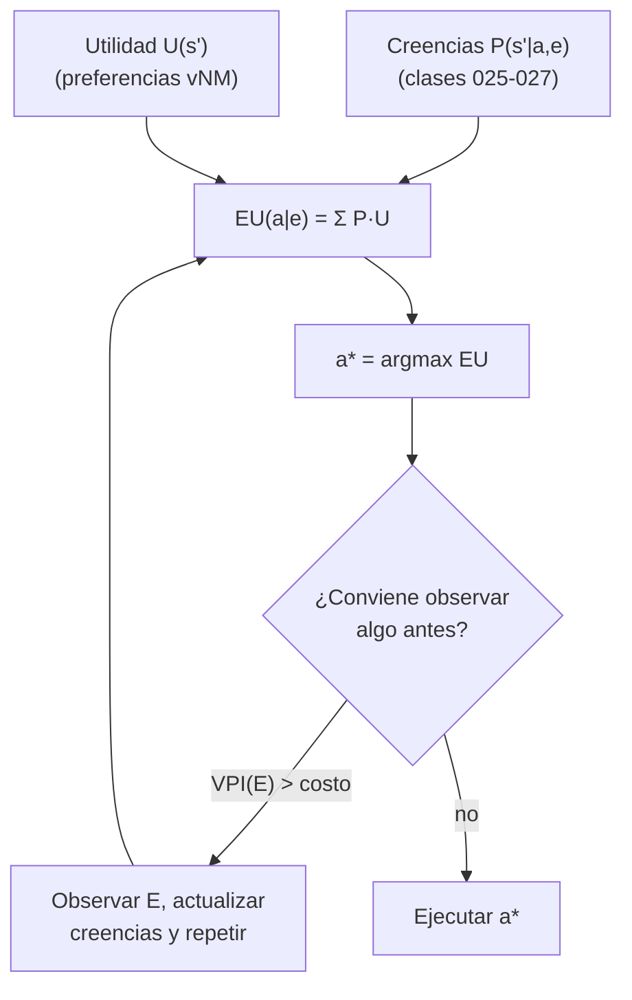

# 030 — Teoría de decisión y utilidad esperada

> [← Clase anterior](../../../classes/part-02-probabilistic-evolutionary-and-decision-ai/029-procesos-de-decision-de-markov/README.md) · [Índice de la parte](../README.md) · [Clase siguiente →](../../../classes/part-02-probabilistic-evolutionary-and-decision-ai/031-metodos-monte-carlo-y-simulacion/README.md)

**Parte:** 02 — IA probabilística, evolutiva y de decisión  
**Nivel:** intermedio · **Horas estimadas:** 6  
**Laboratorio:** `probability` · **Estado:** `EXECUTABLE_CORE`

## 🎯 Propósito

Comprender **teoría de decisión y utilidad esperada** dentro de la evolución de la inteligencia
artificial, implementar un experimento mínimo verificable y distinguir qué parte
constituye evidencia frente a una afirmación todavía no comprobada.

## 📚 Resultados de aprendizaje

Al finalizar podrás:

1. Explicar teoría de decisión y utilidad esperada usando los conceptos `utilidad`, `riesgo`, `decisión`, `preferencias`.
2. Ejecutar el laboratorio con una semilla explícita y revisar su contrato JSON.
3. Identificar al menos un supuesto, una limitación y un riesgo de aplicación.
4. Comparar el enfoque con la etapa anterior de la ruta de aprendizaje.
5. Producir una evidencia reproducible y una conclusión que no exceda los datos.

## 🧩 Conceptos centrales

`utilidad`, `riesgo`, `decisión`, `preferencias`

## 🗺️ Ubicación en el mapa de la IA

La probabilidad (025-027) dice qué creer; la teoría de decisión dice qué **hacer** con esas creencias. Su núcleo — decisión racional = probabilidad + utilidad — viene de von Neumann y Morgenstern (1944) y define la noción misma de "agente racional" que organiza AIMA. Los MDP (029) son su extensión secuencial; las redes de decisión extienden las redes bayesianas (027) con nodos de acción y utilidad; y la crítica empírica (Kahneman & Tversky) delimita cuándo los humanos NO deciden así.

## 📖 Fundamentos

### 🎯 El principio de máxima utilidad esperada (MEU)

Dada una acción `a` con resultados inciertos y una función de utilidad `U`:

```text
EU(a | e) = Σ_{s'} P(Resultado = s' | a, e) · U(s')

acción racional:  a* = argmax_a EU(a | e)
```

La utilidad no es dinero: es una escala numérica de **preferencias**. El dinero suele tener utilidad marginal decreciente (el primer millón cambia la vida; el décimo, no).

### 📜 Axiomas de von Neumann–Morgenstern

Sobre **loterías** `[p₁, r₁; …; pₙ, rₙ]` (resultados con probabilidades), un agente con preferencias que cumplen:

1. **Completitud**: A ≻ B, B ≻ A, o A ~ B.
2. **Transitividad**: A ≻ B y B ≻ C ⇒ A ≻ C.
3. **Continuidad**: si A ≻ B ≻ C, existe p con B ~ [p, A; 1−p, C].
4. **Independencia**: A ≻ B ⇒ [p, A; 1−p, C] ≻ [p, B; 1−p, C].

…se comporta **como si** maximizara la esperanza de alguna función de utilidad U, única salvo transformación afín positiva (aU + b, a > 0). Violar los axiomas expone al agente a ser explotado como "bomba de dinero" (money pump): ciclos de intercambios donde pierde en cada vuelta.

### ⚖️ Actitud frente al riesgo

Para utilidad sobre dinero U(x):

```text
U cóncava  → aversión al riesgo:    U(E[X]) > E[U(X)]  (prefiere lo seguro)
U lineal   → neutralidad al riesgo: decide por valor esperado
U convexa  → propensión al riesgo
```

- **Equivalente cierto (CE)**: cantidad segura tal que `U(CE) = E[U(X)]`.
- **Prima de riesgo**: `E[X] − CE` — cuánto "paga" el agente por eliminar la incertidumbre; es la base económica de los seguros.

### 💡 Valor de la información (VPI)

Cuánto vale observar una variable E antes de decidir:

```text
VPI(E) = [ Σ_e P(e) · max_a EU(a | e) ] − max_a EU(a)
```

Siempre `VPI ≥ 0` (la información no obliga a cambiar de decisión, solo lo permite) y vale 0 si ninguna observación cambiaría la acción elegida. Guía racionalmente qué test pedir, qué sensor instalar, qué pregunta hacer.

### 🧭 Redes de decisión

Una red bayesiana + **nodos de decisión** (rectángulos) + **nodo de utilidad** (rombo). La evaluación: para cada valor de la decisión, propagar probabilidades y promediar utilidades; elegir el máximo. Es el formalismo gráfico del MEU.

### 🧠 La crítica empírica

Allais (1953) y Ellsberg mostraron violaciones sistemáticas del axioma de independencia; Kahneman & Tversky (1979) las organizaron en la **teoría prospectiva**: los humanos evalúan cambios respecto a un punto de referencia, sienten las pérdidas ~2× más que las ganancias y distorsionan probabilidades pequeñas. Consecuencia para IA: los modelos de usuario no deben asumir MEU, pero el *agente artificial* sí puede diseñarse para cumplirlo.

## 🧮 Ejemplo trabajado

**¿Contratar un seguro?** Riqueza inicial w = 10 000 €. Riesgo: perder 5 000 € con probabilidad 0.1. Prima del seguro: 600 €. Utilidad logarítmica `U(x) = ln(x)` (aversión al riesgo).

```text
Sin seguro:
EU = 0.9·ln(10000) + 0.1·ln(5000)
   = 0.9·9.2103 + 0.1·8.5172
   = 8.2893 + 0.8517 = 9.1410

Con seguro (riqueza segura 9400):
EU = ln(9400) = 9.1485

9.1485 > 9.1410  →  contratar el seguro es racional…
…aunque su valor esperado monetario sea peor:
  sin seguro: E[X] = 0.9·10000 + 0.1·5000 = 9500 > 9400
```

**Equivalente cierto sin seguro**: `CE = e^9.1410 ≈ 9330 €`. El agente es indiferente entre el riesgo y 9 330 € seguros; como el seguro le deja 9 400 € > CE, lo compra. **Prima de riesgo** = 9 500 − 9 330 = 170 €: la aseguradora puede cobrar hasta 670 € sobre la pérdida esperada (500 €) y ambos salen ganando en utilidad.

**VPI**: si un peritaje perfecto (gratis) revelara si ocurrirá el siniestro, la decisión sería: asegurar solo si ocurrirá. `EU_info = 0.9·ln(10000) + 0.1·ln(9400·? )` — con seguro "a posteriori" el cálculo muestra que la información perfecta vale más que la prima en escenarios de riesgo alto; con ella, nadie compraría seguros: por eso las aseguradoras temen la selección adversa.

## 📊 Propiedades y comparación

| Criterio de decisión | Usa probabilidades | Usa preferencias graduadas | Riesgo | Falla típica |
|---|---|---|---|---|
| Máximo valor esperado (dinero) | Sí | No (lineal) | Neutral | Ignora ruina: apuesta de San Petersburgo |
| MEU (utilidad esperada) | Sí | Sí | Configurable | Exige elicitar U y P |
| Maximin (peor caso) | No | Ordinal | Extremadamente averso | Paraliza ante riesgos minúsculos |
| Minimax regret | No | Diferencias | Intermedio | Sensible a alternativas irrelevantes |
| Humanos reales (prospectiva) | Distorsionadas | Ref.-dependientes | Asimétrico pérdidas/ganancias | Incoherencia explotable |



## ⚠️ Errores conceptuales frecuentes

1. **Utilidad = dinero.** Maximizar valor esperado monetario justificaría rechazar todo seguro y aceptar la apuesta de San Petersburgo; la concavidad de U explica el comportamiento razonable.
2. **"La utilidad es única."** Solo lo es salvo transformación afín: U y 3U+7 producen exactamente las mismas decisiones; comparar utilidades absolutas entre agentes carece de sentido.
3. **Decidir por la hipótesis más probable.** Sin costos, el argmax de probabilidad puede ser pésimo: un 2 % de incendio domina la decisión si el costo del incendio es enorme.
4. **VPI negativo o "la información puede hacer daño".** Formalmente VPI ≥ 0 para un agente racional; lo que sí puede ser negativo es el valor *neto* (información menos su costo).
5. **Asumir que los usuarios humanos maximizan utilidad esperada.** La evidencia (Allais, framing, aversión a pérdidas) dice lo contrario; los sistemas que modelan personas necesitan modelos descriptivos, no solo normativos.

## 🚀 Del aprendizaje a la operación

El ejemplo asume U y P conocidas y estables. Operacionalmente: elicitar utilidades es difícil y ruidoso (se hace con loterías de referencia o preferencias reveladas), las probabilidades vienen de modelos con error de calibración, los objetivos múltiples exigen utilidades multiatributo con trade-offs explícitos, y una función de utilidad mal especificada en un agente autónomo produce optimización de lo que se midió, no de lo que se quería — el problema de alineación en miniatura.

## 🧪 Laboratorio

```bash
python lab.py
```

El laboratorio llama a `ai_evolution.labs.run_lab("probability")`. Esta
decisión evita 183 implementaciones divergentes: cada clase tiene un entrypoint
propio, pero los motores didácticos se prueban como una biblioteca común.

### 🔍 Evidencia esperada

- tipo de laboratorio y semilla;
- entradas o decisiones observables;
- resultado estructurado;
- lista `evidence` con hechos que pueden inspeccionarse;
- lista `limitations` que impide presentar la demo como producción.

## 📓 Notebooks

- [📓 `notebook.ipynb`](notebook.ipynb): recorrido guiado con la materia resumida.
- [✍️ `notebook_student.ipynb`](notebook_student.ipynb): ejercicios para resolver.
- [✅ `notebook_solution.ipynb`](notebook_solution.ipynb): solución de referencia explicada.

## 📝 Evaluación

| Criterio | Peso |
|---|---:|
| Comprensión conceptual | 25 % |
| Ejecución reproducible | 25 % |
| Interpretación basada en evidencia | 25 % |
| Riesgos, límites y mejora propuesta | 25 % |

Consulta [assessment.md](assessment.md) para preguntas y criterio de aceptación.

## ⚠️ Errores comunes

| Síntoma | Causa probable | Corrección |
|---|---|---|
| El código corre, pero no hay conclusión | Se confundió ejecución con aprendizaje | Explica qué demuestra y qué no demuestra |
| El resultado cambia sin explicación | No se registró semilla o configuración | Conserva semilla, versión y parámetros |
| Se promete uso real | Se extrapoló desde una demo educativa | Declara entorno, datos, límites y revisión humana |
| Se copia una métrica aislada | No existe baseline ni costo de error | Añade comparación y criterio de decisión |

## ❓ Preguntas frecuentes

**¿Debo usar una API comercial?**  
No. El núcleo funciona localmente. Las extensiones LIVE se documentan por separado.

**¿El laboratorio representa una implementación industrial?**  
No por sí solo. Enseña el contrato y el patrón; producción exige integración,
seguridad, observabilidad, pruebas y operación.

**¿Dónde profundizo?**  
Revisa las especializaciones enlazadas en el README raíz y la ruta siguiente.

## 🔗 Referencias

- von Neumann, J. & Morgenstern, O. (1944). *Theory of Games and Economic Behavior*. Princeton University Press. — uso: desarrollo extendido del tema
- Russell, S. & Norvig, P. (2020). *AIMA*, 4.ª ed., cap. 16 "Making Simple Decisions". [https://aima.cs.berkeley.edu/](https://aima.cs.berkeley.edu/) — uso: desarrollo extendido del tema
- Kahneman, D. & Tversky, A. (1979). "Prospect Theory: An Analysis of Decision under Risk". *Econometrica*, 47(2), 263-291. [https://doi.org/10.2307/1914185](https://doi.org/10.2307/1914185) — uso: fuente primaria del mecanismo estudiado
- Howard, R. A. (1966). "Information Value Theory". *IEEE Trans. Systems Science and Cybernetics*, 2(1), 22-26. [https://doi.org/10.1109/TSSC.1966.300074](https://doi.org/10.1109/TSSC.1966.300074) — uso: fuente primaria del mecanismo estudiado
- Savage, L. J. (1954). *The Foundations of Statistics*. Wiley. — uso: desarrollo extendido del tema

<!-- papers:inicio -->

---

## 📜 Papers que fundamentan esta clase

> Bloque generado por `python scripts/link_papers_to_classes.py`. La fuente es [`papers/catalog/papers.json`](../../../papers/catalog/papers.json).

| Paper | Año | Qué desbloqueó | Miniatura |
|---|---:|---|---|
| [P26 · Control a nivel humano mediante aprendizaje por refuerzo profundo](../../../papers/foundational/P26_dqn/README.md) | 2015 | El primer agente que aprende a actuar directamente desde píxeles, con la misma arquitectura y los mismos hiperparámetros en decenas de juegos. | [notebook](../../../notebooks/papers/P26_dqn.ipynb) |

Cada ficha explica el problema anterior, la matemática mínima, los límites y los errores de atribución más frecuentes. Para leerlas con método: [cómo leer un paper de IA](../../../papers/guides/COMO_LEER_UN_PAPER_DE_IA.md) · [anexos matemáticos](../../../papers/annexes/README.md).
<!-- papers:fin -->
---

## ⬅️ Clase anterior

[029 — Procesos de decisión de Markov](../../part-02-probabilistic-evolutionary-and-decision-ai/029-procesos-de-decision-de-markov/README.md)

## ➡️ Siguiente clase

[031 — Métodos Monte Carlo y simulación](../../part-02-probabilistic-evolutionary-and-decision-ai/031-metodos-monte-carlo-y-simulacion/README.md)
