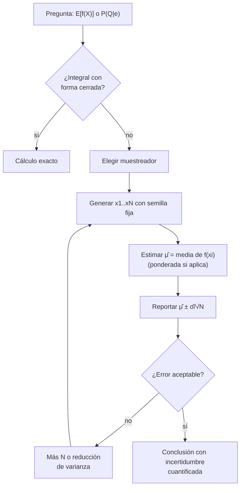

# 031 — Métodos Monte Carlo y simulación

> [← Clase anterior](../../../classes/part-02-probabilistic-evolutionary-and-decision-ai/030-teoria-de-decision-y-utilidad-esperada/README.md) · [Índice de la parte](../README.md) · [Clase siguiente →](../../../classes/part-02-probabilistic-evolutionary-and-decision-ai/032-logica-difusa-y-control-aproximado/README.md)

**Parte:** 02 — IA probabilística, evolutiva y de decisión  
**Nivel:** intermedio · **Horas estimadas:** 6  
**Laboratorio:** `probability` · **Estado:** `EXECUTABLE_CORE`

## 🎯 Propósito

Comprender **métodos monte carlo y simulación** dentro de la evolución de la inteligencia
artificial, implementar un experimento mínimo verificable y distinguir qué parte
constituye evidencia frente a una afirmación todavía no comprobada.

## 📚 Resultados de aprendizaje

Al finalizar podrás:

1. Explicar métodos monte carlo y simulación usando los conceptos `Monte Carlo`, `muestreo`, `estimación`, `varianza`.
2. Ejecutar el laboratorio con una semilla explícita y revisar su contrato JSON.
3. Identificar al menos un supuesto, una limitación y un riesgo de aplicación.
4. Comparar el enfoque con la etapa anterior de la ruta de aprendizaje.
5. Producir una evidencia reproducible y una conclusión que no exceda los datos.

## 🧩 Conceptos centrales

`Monte Carlo`, `muestreo`, `estimación`, `varianza`

## 🗺️ Ubicación en el mapa de la IA

Las clases 025-030 calculan probabilidades y utilidades de forma exacta; eso deja de ser viable cuando el modelo es grande (inferencia NP-dura en redes bayesianas) o la integral no tiene forma cerrada. Monte Carlo — nacido en Los Álamos con Ulam, von Neumann y Metropolis (1949) — sustituye el cálculo por **muestreo**: estimar cantidades como promedios de simulaciones aleatorias. Sostiene la inferencia aproximada en modelos gráficos, la programación probabilística (035), el MCTS de AlphaGo y buena parte del RL moderno.

## 📖 Fundamentos

### 🎯 El estimador Monte Carlo

Para estimar `μ = E[f(X)]` con `X ~ p`:

```text
μ̂_N = (1/N) Σ_{i=1}^{N} f(xᵢ),   xᵢ ~ p  i.i.d.

Ley de los grandes números:  μ̂_N → μ  (consistencia)
TCL: error estándar  σ/√N,  con σ² = Var[f(X)]
```

La propiedad clave: la tasa de convergencia `O(1/√N)` **no depende de la dimensión** del problema — de ahí su ventaja sobre cuadraturas deterministas en alta dimensión. La contrapartida: cada dígito decimal extra de precisión cuesta ×100 muestras.

### 🎲 Muestreo en modelos probabilísticos

- **Muestreo directo (prior sampling)**: en una red bayesiana, muestrear cada nodo en orden topológico según su CPT. Genera mundos con la frecuencia de la conjunta.
- **Muestreo con rechazo**: para `P(Q|e)`, descartar las muestras incompatibles con `e`. Correcto pero desperdicia una fracción `1 − P(e)` de muestras: inútil si la evidencia es improbable.
- **Ponderación por verosimilitud (likelihood weighting)**: fijar las variables de evidencia y ponderar cada muestra por `Π P(eᵢ|padres)`. Nada se descarta, pero con mucha evidencia los pesos degeneran (pocas muestras dominan).
- **MCMC (Metropolis-Hastings, Gibbs)**: construir una cadena de Markov cuya distribución estacionaria es la posterior; tras un periodo de calentamiento (*burn-in*), los estados visitados son muestras (correlacionadas) de la posterior. Escala a problemas donde lo anterior falla.

### 📉 Reducción de varianza

La precisión depende de `σ²`, no solo de N:

- **Muestreo por importancia**: muestrear de `q` y ponderar por `p/q`; una `q` bien elegida concentra muestras donde `|f|·p` es grande.
- **Variables antitéticas**, **variables de control**, **estratificación**: correlacionar o descomponer para cancelar ruido.

### 🌲 De la estimación a la decisión: MCTS

Monte Carlo Tree Search estima el valor de acciones simulando partidas completas (*rollouts*) y equilibra exploración/explotación con UCB. Es el puente entre esta clase y los MDP (029): cuando el árbol es demasiado grande para Bellman exacto, se muestrea.

### 🔁 Reproducibilidad

Los generadores son **pseudo**aleatorios: una semilla fija produce la misma secuencia. En ciencia e ingeniería la semilla es parte del experimento: sin ella, un resultado Monte Carlo no es auditable. Reportar siempre: semilla, N, estimador y error estándar.

## 🧮 Ejemplo trabajado

**Estimar π lanzando dardos.** Se muestrean puntos uniformes en el cuadrado [0,1]²; la fracción que cae dentro del cuarto de círculo (`x²+y² ≤ 1`) estima `π/4`.

```text
π̂ = 4 · (aciertos / N)

f = 1_{x²+y²≤1} es Bernoulli(p = π/4 ≈ 0.7854)
Var[f] = p(1−p) ≈ 0.1685  →  σ ≈ 0.4105
Error estándar de π̂: 4·σ/√N ≈ 1.642/√N
```

| N | error estándar de π̂ | resultado típico |
|---:|---:|---|
| 100 | 0.164 | 3.0 – 3.3 |
| 10 000 | 0.0164 | 3.12 – 3.17 |
| 1 000 000 | 0.00164 | 3.138 – 3.145 |

Cálculo a mano con N = 20 (semilla fija, 16 aciertos): `π̂ = 4·16/20 = 3.2`; el intervalo ±1 e.e. es `3.2 ± 1.64/√20 ≈ 3.2 ± 0.37` — consistente con π. Duplicar la precisión exige cuadruplicar N: de ahí que Monte Carlo se combine con reducción de varianza en lugar de fuerza bruta.

**Ponderación por verosimilitud en la red de la alarma (027):** para `P(B | j, m)` se fijan J = j y M = m; una muestra `(b=no, e=no, a=no)` recibe peso `P(j|¬a)·P(m|¬a) = 0.05·0.01 = 0.0005`, mientras una con `a=sí` recibe `0.9·0.7 = 0.63`: las muestras compatibles con la evidencia dominan la estimación sin descartar ninguna.

## 📊 Propiedades y comparación

| Método | Sesgo | Eficiencia con evidencia rara | Muestras correlacionadas | Cuándo usar |
|---|---|---|---|---|
| Cuadratura determinista | 0 | N/A | N/A | Dimensión baja (≤ 3-4) |
| Muestreo directo | No | No aplica (sin evidencia) | No | Simular el modelo a priori |
| Rechazo | No | Pésima: descarta 1−P(e) | No | Evidencia probable |
| Likelihood weighting | No (ponderado) | Media: pesos degeneran | No | Evidencia moderada |
| MCMC | Asintóticamente no | Buena | Sí (autocorrelación) | Posteriores complejas, alta dimensión |



## ⚠️ Errores conceptuales frecuentes

1. **Reportar la estimación sin el error.** `π̂ = 3.2` no dice nada sin `± 0.37`; el estimador es una variable aleatoria y su incertidumbre es parte del resultado.
2. **"Con más muestras siempre basta."** La convergencia 1/√N es lenta: pasar de 2 a 3 decimales cuesta 100× más cómputo; la reducción de varianza suele rendir más que aumentar N.
3. **Confundir pseudoaleatorio con aleatorio.** La semilla fija hace reproducible el experimento; cambiarla y ver si la conclusión se sostiene es parte de la validación, no un detalle.
4. **Usar muestras MCMC como si fueran i.i.d.** Están autocorrelacionadas: el "tamaño efectivo de muestra" puede ser 10× menor que N, y olvidar el burn-in sesga la estimación.
5. **Muestreo con rechazo ante evidencia improbable.** Con `P(e) = 10⁻⁴`, el 99.99 % del cómputo se tira; hay que cambiar de algoritmo, no de paciencia.

## 🚀 Del aprendizaje a la operación

Estimar π es un juguete con respuesta conocida; en producción la respuesta no se conoce y la validación es indirecta: diagnósticos de convergencia MCMC (R̂ de Gelman-Rubin, tamaño efectivo), comparación entre semillas y muestreadores, pruebas con casos límite calculables y presupuesto de cómputo explícito. Además, las simulaciones heredan los errores del modelo: Monte Carlo cuantifica la incertidumbre *dentro* del modelo, nunca la de haber elegido el modelo equivocado.

## 🧪 Laboratorio

```bash
python lab.py
```

El laboratorio llama a `ai_evolution.labs.run_lab("probability")`. Esta
decisión evita 183 implementaciones divergentes: cada clase tiene un entrypoint
propio, pero los motores didácticos se prueban como una biblioteca común.

### 🔍 Evidencia esperada

- tipo de laboratorio y semilla;
- entradas o decisiones observables;
- resultado estructurado;
- lista `evidence` con hechos que pueden inspeccionarse;
- lista `limitations` que impide presentar la demo como producción.

## 📓 Notebooks

- [📓 `notebook.ipynb`](notebook.ipynb): recorrido guiado con la materia resumida.
- [✍️ `notebook_student.ipynb`](notebook_student.ipynb): ejercicios para resolver.
- [✅ `notebook_solution.ipynb`](notebook_solution.ipynb): solución de referencia explicada.

## 📝 Evaluación

| Criterio | Peso |
|---|---:|
| Comprensión conceptual | 25 % |
| Ejecución reproducible | 25 % |
| Interpretación basada en evidencia | 25 % |
| Riesgos, límites y mejora propuesta | 25 % |

Consulta [assessment.md](assessment.md) para preguntas y criterio de aceptación.

## ⚠️ Errores comunes

| Síntoma | Causa probable | Corrección |
|---|---|---|
| El código corre, pero no hay conclusión | Se confundió ejecución con aprendizaje | Explica qué demuestra y qué no demuestra |
| El resultado cambia sin explicación | No se registró semilla o configuración | Conserva semilla, versión y parámetros |
| Se promete uso real | Se extrapoló desde una demo educativa | Declara entorno, datos, límites y revisión humana |
| Se copia una métrica aislada | No existe baseline ni costo de error | Añade comparación y criterio de decisión |

## ❓ Preguntas frecuentes

**¿Debo usar una API comercial?**  
No. El núcleo funciona localmente. Las extensiones LIVE se documentan por separado.

**¿El laboratorio representa una implementación industrial?**  
No por sí solo. Enseña el contrato y el patrón; producción exige integración,
seguridad, observabilidad, pruebas y operación.

**¿Dónde profundizo?**  
Revisa las especializaciones enlazadas en el README raíz y la ruta siguiente.

## 🔗 Referencias

- Metropolis, N. & Ulam, S. (1949). "The Monte Carlo Method". *Journal of the American Statistical Association*, 44(247), 335-341. [https://doi.org/10.1080/01621459.1949.10483310](https://doi.org/10.1080/01621459.1949.10483310)
- Metropolis, N. et al. (1953). "Equation of State Calculations by Fast Computing Machines". *J. Chemical Physics*, 21(6), 1087-1092. [https://doi.org/10.1063/1.1699114](https://doi.org/10.1063/1.1699114)
- Russell, S. & Norvig, P. (2020). *AIMA*, 4.ª ed., cap. 13.4 (inferencia aproximada). [https://aima.cs.berkeley.edu/](https://aima.cs.berkeley.edu/)
- Robert, C. & Casella, G. (2004). *Monte Carlo Statistical Methods*, 2.ª ed. Springer. [https://doi.org/10.1007/978-1-4757-4145-2](https://doi.org/10.1007/978-1-4757-4145-2)
- Sutton, R. S. & Barto, A. G. (2018). *Reinforcement Learning*, cap. 5 (métodos Monte Carlo). [http://incompleteideas.net/book/the-book-2nd.html](http://incompleteideas.net/book/the-book-2nd.html)

<!-- papers:inicio -->

---

## 📜 Papers que fundamentan esta clase

> Bloque generado por `python scripts/link_papers_to_classes.py`. La fuente es [`papers/catalog/papers.json`](../../../papers/catalog/papers.json).

| Paper | Año | Qué desbloqueó | Miniatura |
|---|---:|---|---|
| [P27 · Dominar el go con redes neuronales profundas y búsqueda en árbol](../../../papers/foundational/P27_alphago/README.md) | 2016 | Une las dos tradiciones de la IA: la búsqueda simbólica de la parte 01 y el aprendizaje profundo de la parte 04, en un solo sistema. | [notebook](../../../notebooks/papers/P27_alphago.ipynb) |

Cada ficha explica el problema anterior, la matemática mínima, los límites y los errores de atribución más frecuentes. Para leerlas con método: [cómo leer un paper de IA](../../../papers/guides/COMO_LEER_UN_PAPER_DE_IA.md) · [anexos matemáticos](../../../papers/annexes/README.md).
<!-- papers:fin -->
---

## ⬅️ Clase anterior

[030 — Teoría de decisión y utilidad esperada](../../part-02-probabilistic-evolutionary-and-decision-ai/030-teoria-de-decision-y-utilidad-esperada/README.md)

## ➡️ Siguiente clase

[032 — Lógica difusa y control aproximado](../../part-02-probabilistic-evolutionary-and-decision-ai/032-logica-difusa-y-control-aproximado/README.md)
