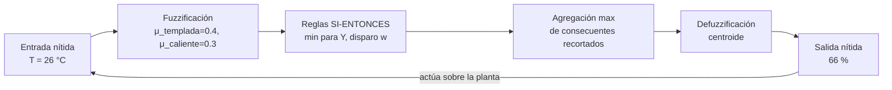

# 032 — Lógica difusa y control aproximado

> [← Clase anterior](../../../classes/part-02-probabilistic-evolutionary-and-decision-ai/031-metodos-monte-carlo-y-simulacion/README.md) · [Índice de la parte](../README.md) · [Clase siguiente →](../../../classes/part-02-probabilistic-evolutionary-and-decision-ai/033-algoritmos-geneticos/README.md)

**Parte:** 02 — IA probabilística, evolutiva y de decisión  
**Nivel:** intermedio · **Horas estimadas:** 6  
**Laboratorio:** `logic` · **Estado:** `EXECUTABLE_CORE`

## 🎯 Propósito

Comprender **lógica difusa y control aproximado** dentro de la evolución de la inteligencia
artificial, implementar un experimento mínimo verificable y distinguir qué parte
constituye evidencia frente a una afirmación todavía no comprobada.

## 📚 Resultados de aprendizaje

Al finalizar podrás:

1. Explicar lógica difusa y control aproximado usando los conceptos `fuzzy`, `membresía`, `reglas`, `control`.
2. Ejecutar el laboratorio con una semilla explícita y revisar su contrato JSON.
3. Identificar al menos un supuesto, una limitación y un riesgo de aplicación.
4. Comparar el enfoque con la etapa anterior de la ruta de aprendizaje.
5. Producir una evidencia reproducible y una conclusión que no exceda los datos.

## 🧩 Conceptos centrales

`fuzzy`, `membresía`, `reglas`, `control`

## 🗺️ Ubicación en el mapa de la IA

La probabilidad (025-031) modela **ignorancia**: no sé si lloverá. La lógica difusa (Zadeh, 1965) modela algo distinto, **vaguedad**: "hace calor" no es verdadero ni falso, es cuestión de grado. Nació como crítica a la rigidez de los conjuntos clásicos y triunfó en el control industrial (metro de Sendai, cámaras, lavadoras) porque traduce reglas lingüísticas de expertos a controladores continuos sin ecuaciones diferenciales. En el mapa de la IA es la rama "aproximada" del razonamiento simbólico, complementaria — no rival — de la probabilística.

## 📖 Fundamentos

### 🌡️ Conjuntos difusos y funciones de membresía

Un conjunto clásico tiene función característica `χ_A: X → {0,1}`; un **conjunto difuso** la generaliza a una **función de membresía** `μ_A: X → [0,1]`. `μ_calor(28 °C) = 0.7` significa que 28 °C pertenece "al 70 %" al concepto *calor*. Formas típicas: triangular, trapezoidal, gaussiana. Una **variable lingüística** (Temperatura) toma valores lingüísticos (fría, templada, caliente), cada uno un conjunto difuso sobre el mismo universo.

### 🔗 Operadores

```text
Negación:      μ_¬A(x) = 1 − μ_A(x)
Intersección:  μ_{A∧B}(x) = min(μ_A, μ_B)     (t-norma; también producto)
Unión:         μ_{A∨B}(x) = max(μ_A, μ_B)     (t-conorma)
```

Consecuencia notable: en general `μ_{A∧¬A} ≠ 0` — se pierde el principio de no contradicción. No es un defecto: 24 °C puede ser "algo cálido y algo fresco" a la vez. Esto marca la diferencia semántica con la probabilidad, donde `P(A ∧ ¬A) = 0` siempre.

### ⚙️ Sistema de inferencia difusa (Mamdani)

Un controlador difuso ejecuta cuatro etapas:

```text
1. Fuzzificación:  entrada nítida x → grados μ de cada conjunto de entrada
2. Evaluación de reglas: "SI temp es alta Y humedad es baja
                          ENTONCES ventilador es rápido"
   fuerza de disparo w = min(μ_alta(temp), μ_baja(hum))
3. Agregación: cada consecuente se recorta a su w (implicación min);
   los consecuentes de todas las reglas se unen con max
4. Defuzzificación: el conjunto agregado → un número nítido
   (centroide: y* = ∫ y·μ(y) dy / ∫ μ(y) dy)
```

La variante **Sugeno** usa consecuentes funcionales (`y = f(x)`) y promedio ponderado en lugar de centroide: más eficiente y apta para optimización automática (ANFIS), menos interpretable lingüísticamente.

### 🧭 Cuándo tiene sentido

La lógica difusa brilla cuando: (a) existe experiencia humana expresable en reglas lingüísticas, (b) el sistema tolera control subóptimo pero suave, (c) modelar la planta con ecuaciones es caro. No aprende de datos por sí sola ni cuantifica incertidumbre epistémica: para eso están los modelos probabilísticos.

## 🧮 Ejemplo trabajado

**Controlador de ventilador** con una entrada (Temperatura, universo 0-40 °C) y una salida (Velocidad, 0-100 %).

Membresías triangulares de entrada: `fría` = triángulo(0, 0, 20); `templada` = triángulo(10, 20, 30); `caliente` = triángulo(20, 40, 40). Salida: `lenta` = tri(0, 0, 50); `media` = tri(25, 50, 75); `rápida` = tri(50, 100, 100).

Reglas: R1: fría → lenta; R2: templada → media; R3: caliente → rápida.

**Entrada nítida: T = 26 °C.**

```text
Fuzzificación:
μ_fría(26)     = 0                       (26 > 20)
μ_templada(26) = (30−26)/(30−20) = 0.4   (rama descendente)
μ_caliente(26) = (26−20)/(40−20) = 0.3   (rama ascendente)

Disparo: R2 con w=0.4 (media recortada a 0.4)
         R3 con w=0.3 (rápida recortada a 0.3)

Defuzzificación (centroide aproximado por muestreo cada 12.5):
y:      25    37.5   50    62.5   75    87.5   100
μ_med:  0     0.4    0.4   0.4    0     0      0     (recortada a 0.4)
μ_ráp:  0     0      0     0.25   0.3   0.3    0.3   (recortada a 0.3)
μ_agg:  0     0.4    0.4   0.4    0.3   0.3    0.3   (máximo)

y* = Σ y·μ / Σ μ
   = (37.5·0.4 + 50·0.4 + 62.5·0.4 + 75·0.3 + 87.5·0.3 + 100·0.3) / (0.4·3 + 0.3·3)
   = (15 + 20 + 25 + 22.5 + 26.25 + 30) / 2.1
   = 138.75 / 2.1 ≈ 66.1 %
```

El ventilador gira al ~66 %: ni "media" ni "rápida", sino una mezcla ponderada por cuán templado y cuán caliente está. Si T sube a 27 °C, la salida sube suavemente (≈ 68 %) — sin el salto brusco de un termostato con umbral.

## 📊 Propiedades y comparación

| Aspecto | Lógica difusa | Probabilidad | Control clásico (PID) |
|---|---|---|---|
| Qué modela | Vaguedad de predicados | Ignorancia sobre hechos | Dinámica de la planta |
| μ(x)=0.7 significa | Pertenencia parcial | 70 % de creencia en hecho nítido | N/A |
| A ∧ ¬A | Puede ser > 0 | Siempre 0 | N/A |
| Fuente del modelo | Reglas de experto | Datos / axiomas | Ecuaciones / ajuste |
| Aprendizaje | No nativo (ANFIS lo añade) | Estimación estadística | Sintonización |
| Garantías de estabilidad | Difíciles de probar | N/A | Teoría madura |



## ⚠️ Errores conceptuales frecuentes

1. **"Difuso = probabilístico."** `μ_calor(28) = 0.7` no es `P(calor) = 0.7`: no hay experimento aleatorio; 28 °C es perfectamente conocido, lo vago es el predicado. Vaguedad ≠ ignorancia.
2. **Creer que las membresías son objetivas.** Son elecciones de diseño (¿dónde empieza "caliente"?); dos ingenieros producen controladores distintos y ambos "correctos". Se validan por desempeño, no por verdad.
3. **Esperar que el sistema aprenda.** Un FIS puro no ajusta nada con datos; sin ANFIS u optimización externa, las reglas erróneas permanecen erróneas.
4. **Ignorar la explosión de reglas.** Con k entradas y m etiquetas cada una, la tabla completa tiene mᵏ reglas; 5 entradas con 7 etiquetas → 16 807 reglas: inviable de elicitar y mantener.
5. **Usar difusa donde hay incertidumbre estadística real.** Para diagnóstico con tasas de error medibles, Bayes (026) da garantías que min/max no puede dar.

## 🚀 Del aprendizaje a la operación

El ejemplo tiene 1 entrada y 3 reglas; un controlador real tiene varias entradas, decenas de reglas y requisitos de estabilidad. Falta aquí: sintonización de membresías con datos (ANFIS/optimización, clases 033-034 sirven para esto), análisis de estabilidad y de casos extremos del actuador, latencia y saturación del hardware, y comparación honesta contra un PID bien sintonizado — que en muchas plantas simples gana con menos complejidad.

## 🧪 Laboratorio

```bash
python lab.py
```

El laboratorio llama a `ai_evolution.labs.run_lab("logic")`. Esta
decisión evita 183 implementaciones divergentes: cada clase tiene un entrypoint
propio, pero los motores didácticos se prueban como una biblioteca común.

### 🔍 Evidencia esperada

- tipo de laboratorio y semilla;
- entradas o decisiones observables;
- resultado estructurado;
- lista `evidence` con hechos que pueden inspeccionarse;
- lista `limitations` que impide presentar la demo como producción.

## 📓 Notebooks

- [📓 `notebook.ipynb`](notebook.ipynb): recorrido guiado con la materia resumida.
- [✍️ `notebook_student.ipynb`](notebook_student.ipynb): ejercicios para resolver.
- [✅ `notebook_solution.ipynb`](notebook_solution.ipynb): solución de referencia explicada.

## 📝 Evaluación

| Criterio | Peso |
|---|---:|
| Comprensión conceptual | 25 % |
| Ejecución reproducible | 25 % |
| Interpretación basada en evidencia | 25 % |
| Riesgos, límites y mejora propuesta | 25 % |

Consulta [assessment.md](assessment.md) para preguntas y criterio de aceptación.

## ⚠️ Errores comunes

| Síntoma | Causa probable | Corrección |
|---|---|---|
| El código corre, pero no hay conclusión | Se confundió ejecución con aprendizaje | Explica qué demuestra y qué no demuestra |
| El resultado cambia sin explicación | No se registró semilla o configuración | Conserva semilla, versión y parámetros |
| Se promete uso real | Se extrapoló desde una demo educativa | Declara entorno, datos, límites y revisión humana |
| Se copia una métrica aislada | No existe baseline ni costo de error | Añade comparación y criterio de decisión |

## ❓ Preguntas frecuentes

**¿Debo usar una API comercial?**  
No. El núcleo funciona localmente. Las extensiones LIVE se documentan por separado.

**¿El laboratorio representa una implementación industrial?**  
No por sí solo. Enseña el contrato y el patrón; producción exige integración,
seguridad, observabilidad, pruebas y operación.

**¿Dónde profundizo?**  
Revisa las especializaciones enlazadas en el README raíz y la ruta siguiente.

## 🔗 Referencias

- Zadeh, L. A. (1965). "Fuzzy Sets". *Information and Control*, 8(3), 338-353. [https://doi.org/10.1016/S0019-9958(65)90241-X](https://doi.org/10.1016/S0019-9958%2865%2990241-X) — uso: fuente primaria del mecanismo estudiado
- Mamdani, E. H. & Assilian, S. (1975). "An experiment in linguistic synthesis with a fuzzy logic controller". *Int. J. Man-Machine Studies*, 7(1), 1-13. [https://doi.org/10.1016/S0020-7373(75)80002-2](https://doi.org/10.1016/S0020-7373%2875%2980002-2) — uso: fuente primaria del mecanismo estudiado
- Takagi, T. & Sugeno, M. (1985). "Fuzzy identification of systems and its applications to modeling and control". *IEEE Trans. SMC*, 15(1), 116-132. [https://doi.org/10.1109/TSMC.1985.6313399](https://doi.org/10.1109/TSMC.1985.6313399) — uso: fuente primaria del mecanismo estudiado
- Jang, J.-S. R. (1993). "ANFIS: adaptive-network-based fuzzy inference system". *IEEE Trans. SMC*, 23(3), 665-685. [https://doi.org/10.1109/21.256541](https://doi.org/10.1109/21.256541) — uso: fuente primaria del mecanismo estudiado
- Ross, T. J. (2010). *Fuzzy Logic with Engineering Applications*, 3.ª ed. Wiley. — uso: desarrollo extendido del tema

<!-- papers:inicio -->

---

## 📜 Papers que fundamentan esta clase

> Bloque generado por `python scripts/link_papers_to_classes.py`. La fuente es [`papers/catalog/papers.json`](../../../papers/catalog/papers.json).

| Paper | Año | Qué desbloqueó | Miniatura |
|---|---:|---|---|
| [P89 · Conjuntos difusos](../../../papers/foundational/P89_fuzzy/README.md) | 1965 | Permite que un elemento pertenezca parcialmente a un conjunto, y con eso da tratamiento formal a la vaguedad de los predicados del lenguaje. | [notebook](../../../notebooks/papers/P89_fuzzy.ipynb) |

Cada ficha explica el problema anterior, la matemática mínima, los límites y los errores de atribución más frecuentes. Para leerlas con método: [cómo leer un paper de IA](../../../papers/guides/COMO_LEER_UN_PAPER_DE_IA.md) · [anexos matemáticos](../../../papers/annexes/README.md).
<!-- papers:fin -->
---

## ⬅️ Clase anterior

[031 — Métodos Monte Carlo y simulación](../../part-02-probabilistic-evolutionary-and-decision-ai/031-metodos-monte-carlo-y-simulacion/README.md)

## ➡️ Siguiente clase

[033 — Algoritmos genéticos](../../part-02-probabilistic-evolutionary-and-decision-ai/033-algoritmos-geneticos/README.md)
