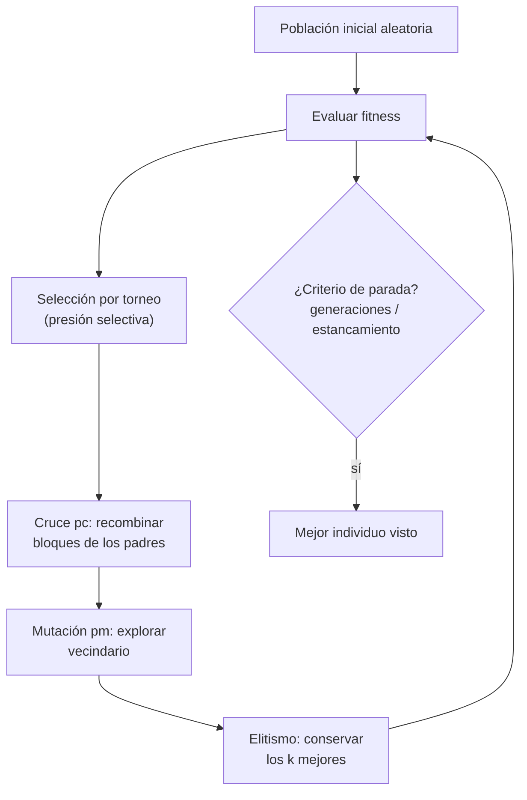

# 033 — Algoritmos genéticos

> [← Clase anterior](../../../classes/part-02-probabilistic-evolutionary-and-decision-ai/032-logica-difusa-y-control-aproximado/README.md) · [Índice de la parte](../README.md) · [Clase siguiente →](../../../classes/part-02-probabilistic-evolutionary-and-decision-ai/034-optimizacion-por-enjambre-y-colonia/README.md)

**Parte:** 02 — IA probabilística, evolutiva y de decisión  
**Nivel:** intermedio · **Horas estimadas:** 6  
**Laboratorio:** `optimization` · **Estado:** `EXECUTABLE_CORE`

## 🎯 Propósito

Comprender **algoritmos genéticos** dentro de la evolución de la inteligencia
artificial, implementar un experimento mínimo verificable y distinguir qué parte
constituye evidencia frente a una afirmación todavía no comprobada.

## 📚 Resultados de aprendizaje

Al finalizar podrás:

1. Explicar algoritmos genéticos usando los conceptos `población`, `mutación`, `cruce`, `selección`.
2. Ejecutar el laboratorio con una semilla explícita y revisar su contrato JSON.
3. Identificar al menos un supuesto, una limitación y un riesgo de aplicación.
4. Comparar el enfoque con la etapa anterior de la ruta de aprendizaje.
5. Producir una evidencia reproducible y una conclusión que no exceda los datos.

## 🧩 Conceptos centrales

`población`, `mutación`, `cruce`, `selección`

## 🗺️ Ubicación en el mapa de la IA

Hasta ahora la parte 02 razona y decide con modelos explícitos; los algoritmos genéticos (Holland, 1975; Goldberg, 1989) atacan otro problema: **optimizar** funciones sin gradiente, sin convexidad y sin forma cerrada, imitando la evolución darwiniana. Pertenecen a la familia de metaheurísticas poblacionales junto con PSO y ACO (034). En la práctica moderna optimizan hiperparámetros, arquitecturas neuronales (neuroevolución), planificación y diseño — y son el recordatorio histórico de que la búsqueda estocástica compite con el cálculo cuando el paisaje es hostil.

## 📖 Fundamentos

### 🧬 Metáfora y componentes

- **Individuo (cromosoma)**: candidato a solución, codificado (bits, enteros, reales, permutaciones).
- **Población**: multiconjunto de N individuos; la diversidad es su capital.
- **Fitness** f(x): función a maximizar; única señal que guía la búsqueda.
- **Selección**: los más aptos se reproducen con mayor probabilidad — explota.
- **Cruce (crossover)**: combina dos padres — recombina bloques buenos.
- **Mutación**: perturbación aleatoria pequeña — explora y evita estancamiento.
- **Elitismo**: copiar los k mejores intactos garantiza no perder lo logrado.

### ⚙️ Bucle canónico

```text
P ← población inicial aleatoria (tamaño N), evaluar fitness
repetir hasta criterio de parada:
    E ← mejores k de P                       # elitismo
    repetir hasta llenar la nueva población:
        p₁, p₂ ← seleccionar(P)              # torneo o ruleta
        h₁, h₂ ← cruzar(p₁, p₂) con prob. pc # pc ≈ 0.6–0.9
        mutar(h₁), mutar(h₂) con prob. pm    # pm ≈ 1/longitud
    P ← E ∪ hijos; evaluar fitness
devolver el mejor individuo visto
```

**Selección por torneo** (tamaño t): elegir t individuos al azar y quedarse con el mejor; t controla la **presión selectiva** (t grande → convergencia rápida y pérdida de diversidad). **Ruleta**: probabilidad proporcional al fitness; sensible a la escala (un superindividuo temprano puede monopolizar).

**Cruce de un punto** en cadenas: cortar ambos padres en una posición y recombinar. Para **permutaciones** (TSP) el cruce debe preservar la validez (OX, PMX); para **reales** se usa cruce aritmético o SBX y mutación gaussiana.

### 📈 Por qué funciona (y cuándo no)

La intuición clásica es el **teorema de esquemas** de Holland: los patrones cortos, de bajo orden y fitness sobre el promedio ("bloques constructivos") reciben exponencialmente más copias en generaciones sucesivas. Es una intuición útil más que una garantía: el teorema tiene supuestos fuertes y no asegura convergencia al óptimo global. El **teorema No Free Lunch** (Wolpert & Macready, 1997) añade la advertencia definitiva: promediado sobre todos los problemas posibles, ningún optimizador supera a otro — un GA solo gana donde la estructura del problema casa con sus operadores.

### 🎛️ El equilibrio exploración/explotación

Todo el diseño (N, pc, pm, presión selectiva, elitismo) regula un único trade-off: explotar las buenas regiones halladas vs. seguir explorando. Convergencia prematura (población clonada en un óptimo local) es el modo de fallo dominante; sus antídotos: mutación suficiente, torneos pequeños, nichos o reinicios.

## 🧮 Ejemplo trabajado

**OneMax**: maximizar el número de unos en una cadena de 8 bits (óptimo = 8). Población N = 4, torneo de 2, cruce de un punto (punto 4), mutación de un bit, elitismo 1.

```text
Generación 0                    fitness
A = 1 0 1 1 0 1 0 0               4
B = 0 1 1 0 1 0 1 0               4
C = 1 1 0 1 0 0 0 1               4
D = 0 0 0 1 0 1 0 0               2

Torneos: (A,D)→A  (B,C)→B  (C,D)→C  (A,B)→A (empate: primero)

Cruce A×B por el punto 4:
  A = 1011|0100, B = 0110|1010
  h₁ = 1011 1010 (f=5)   h₂ = 0110 0100 (f=3)
Cruce C×A por el punto 4:
  h₃ = 1101 0100 (f=4)   h₄ = 1011 0001 (f=4)

Mutación (1 bit al azar): h₂: bit 6 0→1 ⇒ 0110 0110 (f=4)

Generación 1 = {elite A(4), h₁(5), h₂(4), h₃(4)}
mejor: h₁ = 10111010 con f = 5  (mejora sobre 4)
```

Dos observaciones didácticas: (1) el cruce creó `h₁` con 5 unos combinando la mitad izquierda rica de A con la derecha rica de B — el "bloque constructivo" en acción; (2) D, el peor, no sobrevivió a ningún torneo: presión selectiva. Repitiendo el proceso, OneMax converge al óptimo en pocas decenas de generaciones; con `pm = 0` la población puede clonarse antes de llegar (convergencia prematura demostrable con este mismo ejemplo).

## 📊 Propiedades y comparación

| Método | Requiere gradiente | Población | Garantía de óptimo | Coste por iteración | Nicho de uso |
|---|---|---|---|---|---|
| Descenso de gradiente | Sí | No | Local (convexo: global) | Bajo | f diferenciable |
| Hill climbing + reinicios | No | No | Local | Bajo | Paisajes suaves |
| Recocido simulado | No | No | Global (enfriamiento ∞-lento) | Bajo | Combinatoria mediana |
| Algoritmo genético | No | Sí | Ninguna práctica | Alto (N evaluaciones) | Paisajes rugosos, codificación natural |
| CMA-ES | No | Sí | Ninguna, fuerte en continuo | Medio | Optimización continua ≤ ~100 dim |



## ⚠️ Errores conceptuales frecuentes

1. **"El GA encuentra el óptimo global."** No hay garantía práctica; devuelve el mejor visto. Se corre varias veces con semillas distintas y se reporta la distribución, no una corrida.
2. **Confundir fitness alto en la población con progreso.** Si toda la población es idéntica, el fitness medio es alto pero la búsqueda murió (convergencia prematura); hay que monitorear diversidad.
3. **Mutación como protagonista.** Con pm alto el GA degenera en búsqueda aleatoria; la mutación es un seguro contra pérdida de alelos, el cruce hace el trabajo de recombinación.
4. **Codificación descuidada.** Un cruce de un punto sobre una permutación produce hijos inválidos (ciudades repetidas en TSP); el operador debe respetar la semántica de la representación.
5. **Comparar contra nada.** Sin baseline (búsqueda aleatoria, hill climbing con reinicios) no se puede afirmar que el GA "funciona"; a menudo el baseline gana en problemas fáciles con presupuesto igual de evaluaciones.

## 🚀 Del aprendizaje a la operación

OneMax se evalúa en microsegundos; en problemas reales la evaluación del fitness domina el costo (simulaciones, entrenamientos), lo que impone paralelización, fitness aproximado (surrogates) y presupuestos estrictos de evaluaciones. Faltan además: sintonización de hiperparámetros del propio GA (meta-optimización), manejo de restricciones (penalización o reparación), y protocolo estadístico de comparación (múltiples semillas, tests no paramétricos) antes de reclamar superioridad sobre alternativas.

## 🧪 Laboratorio

```bash
python lab.py
```

El laboratorio llama a `ai_evolution.labs.run_lab("optimization")`. Esta
decisión evita 183 implementaciones divergentes: cada clase tiene un entrypoint
propio, pero los motores didácticos se prueban como una biblioteca común.

### 🔍 Evidencia esperada

- tipo de laboratorio y semilla;
- entradas o decisiones observables;
- resultado estructurado;
- lista `evidence` con hechos que pueden inspeccionarse;
- lista `limitations` que impide presentar la demo como producción.

## 📓 Notebooks

- [📓 `notebook.ipynb`](notebook.ipynb): recorrido guiado con la materia resumida.
- [✍️ `notebook_student.ipynb`](notebook_student.ipynb): ejercicios para resolver.
- [✅ `notebook_solution.ipynb`](notebook_solution.ipynb): solución de referencia explicada.

## 📝 Evaluación

| Criterio | Peso |
|---|---:|
| Comprensión conceptual | 25 % |
| Ejecución reproducible | 25 % |
| Interpretación basada en evidencia | 25 % |
| Riesgos, límites y mejora propuesta | 25 % |

Consulta [assessment.md](assessment.md) para preguntas y criterio de aceptación.

## ⚠️ Errores comunes

| Síntoma | Causa probable | Corrección |
|---|---|---|
| El código corre, pero no hay conclusión | Se confundió ejecución con aprendizaje | Explica qué demuestra y qué no demuestra |
| El resultado cambia sin explicación | No se registró semilla o configuración | Conserva semilla, versión y parámetros |
| Se promete uso real | Se extrapoló desde una demo educativa | Declara entorno, datos, límites y revisión humana |
| Se copia una métrica aislada | No existe baseline ni costo de error | Añade comparación y criterio de decisión |

## ❓ Preguntas frecuentes

**¿Debo usar una API comercial?**  
No. El núcleo funciona localmente. Las extensiones LIVE se documentan por separado.

**¿El laboratorio representa una implementación industrial?**  
No por sí solo. Enseña el contrato y el patrón; producción exige integración,
seguridad, observabilidad, pruebas y operación.

**¿Dónde profundizo?**  
Revisa las especializaciones enlazadas en el README raíz y la ruta siguiente.

## 🔗 Referencias

- Holland, J. H. (1975). *Adaptation in Natural and Artificial Systems*. University of Michigan Press (reed. MIT Press, 1992). — uso: desarrollo extendido del tema
- Goldberg, D. E. (1989). *Genetic Algorithms in Search, Optimization, and Machine Learning*. Addison-Wesley. — uso: desarrollo extendido del tema
- Wolpert, D. H. & Macready, W. G. (1997). "No Free Lunch Theorems for Optimization". *IEEE Trans. Evolutionary Computation*, 1(1), 67-82. [https://doi.org/10.1109/4235.585893](https://doi.org/10.1109/4235.585893) — uso: fuente primaria del mecanismo estudiado
- Eiben, A. E. & Smith, J. E. (2015). *Introduction to Evolutionary Computing*, 2.ª ed. Springer. [https://doi.org/10.1007/978-3-662-44874-8](https://doi.org/10.1007/978-3-662-44874-8) — uso: fuente primaria del mecanismo estudiado
- Russell, S. & Norvig, P. (2020). *AIMA*, 4.ª ed., cap. 4.1 (búsqueda local y evolutiva). [https://aima.cs.berkeley.edu/](https://aima.cs.berkeley.edu/) — uso: desarrollo extendido del tema

<!-- papers:inicio -->

---

## 📜 Papers que fundamentan esta clase

> Bloque generado por `python scripts/link_papers_to_classes.py`. La fuente es [`papers/catalog/papers.json`](../../../papers/catalog/papers.json).

| Paper | Año | Qué desbloqueó | Miniatura |
|---|---:|---|---|
| [P90 · Algoritmos genéticos y la asignación óptima de ensayos](../../../papers/foundational/P90_algoritmos_geneticos/README.md) | 1973 | Conecta la evolución artificial con un problema de decisión clásico: cómo repartir ensayos entre alternativas cuando explorar cuesta. | [notebook](../../../notebooks/papers/P90_algoritmos_geneticos.ipynb) |

Cada ficha explica el problema anterior, la matemática mínima, los límites y los errores de atribución más frecuentes. Para leerlas con método: [cómo leer un paper de IA](../../../papers/guides/COMO_LEER_UN_PAPER_DE_IA.md) · [anexos matemáticos](../../../papers/annexes/README.md).
<!-- papers:fin -->
<!-- bibliografia:inicio -->

---

## 📚 Bibliografía de apoyo

> Bloque generado por `python scripts/link_sources_to_classes.py`. Cada obra lleva su localizador verificado en [`sources/bibliography.json`](../../../sources/bibliography.json).

Los papers dicen **de dónde salió** el mecanismo. Estas obras lo **desarrollan** con el espacio que una clase no tiene: teoría completa, demostraciones y ejercicios.

| Obra | Edición | Localizador | Papel en esta clase |
|---|---|---|---|
| Holland, J. H. — *Adaptation in Natural and Artificial Systems* | 1975 | [ISBN 9780262082136](https://openlibrary.org/isbn/9780262082136) | citada en las referencias de esta clase |
| Goldberg, D. E. — *Genetic Algorithms in Search, Optimization, and Machine Learning* | 1989 | [ISBN 9780201157673](https://openlibrary.org/isbn/9780201157673) | citada en las referencias de esta clase |
| Russell, Stuart J. y Norvig, Peter — *Artificial Intelligence: A Modern Approach* | 4.ª · 2020 | [ISBN 9780134610993](https://openlibrary.org/isbn/9780134610993) · [web de la obra](https://aima.cs.berkeley.edu/) | citada en las referencias de esta clase · cap. 4 · obra de referencia de la parte 02 |
| Koller, Daphne y Friedman, Nir — *Probabilistic Graphical Models: Principles and Techniques* | 2010 | [ISBN 9780262013192](https://openlibrary.org/isbn/9780262013192) · [web de la obra](https://mitpress.mit.edu/9780262013192/probabilistic-graphical-models/) | obra de referencia de la parte 02 · modelos gráficos probabilísticos |
| Pearl, J. — *Probabilistic Reasoning in Intelligent Systems* | 1988 | [ISBN 9780080514895](https://openlibrary.org/isbn/9780080514895) | obra de referencia de la parte 02 · redes de creencia |
<!-- bibliografia:fin -->

---

## ⬅️ Clase anterior

[032 — Lógica difusa y control aproximado](../../part-02-probabilistic-evolutionary-and-decision-ai/032-logica-difusa-y-control-aproximado/README.md)

## ➡️ Siguiente clase

[034 — Optimización por enjambre y colonia](../../part-02-probabilistic-evolutionary-and-decision-ai/034-optimizacion-por-enjambre-y-colonia/README.md)
