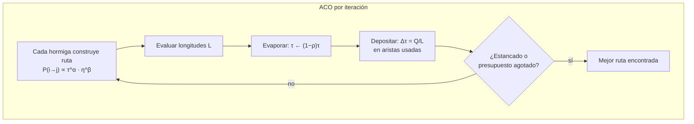

# 034 — Optimización por enjambre y colonia

> [← Clase anterior](../../../classes/part-02-probabilistic-evolutionary-and-decision-ai/033-algoritmos-geneticos/README.md) · [Índice de la parte](../README.md) · [Clase siguiente →](../../../classes/part-02-probabilistic-evolutionary-and-decision-ai/035-programacion-probabilistica-y-causalidad/README.md)

**Parte:** 02 — IA probabilística, evolutiva y de decisión  
**Nivel:** intermedio · **Horas estimadas:** 6  
**Laboratorio:** `optimization` · **Estado:** `EXECUTABLE_CORE`

## 🎯 Propósito

Comprender **optimización por enjambre y colonia** dentro de la evolución de la inteligencia
artificial, implementar un experimento mínimo verificable y distinguir qué parte
constituye evidencia frente a una afirmación todavía no comprobada.

## 📚 Resultados de aprendizaje

Al finalizar podrás:

1. Explicar optimización por enjambre y colonia usando los conceptos `PSO`, `ACO`, `metaheurística`, `exploración`.
2. Ejecutar el laboratorio con una semilla explícita y revisar su contrato JSON.
3. Identificar al menos un supuesto, una limitación y un riesgo de aplicación.
4. Comparar el enfoque con la etapa anterior de la ruta de aprendizaje.
5. Producir una evidencia reproducible y una conclusión que no exceda los datos.

## 🧩 Conceptos centrales

`PSO`, `ACO`, `metaheurística`, `exploración`

## 🗺️ Ubicación en el mapa de la IA

Los GA (033) evolucionan una población por selección y recombinación; la **inteligencia de enjambre** logra optimización con un mecanismo distinto: agentes simples que cooperan mediante interacciones locales, sin selección ni cromosomas. PSO (Kennedy & Eberhart, 1995) imita bandadas que comparten la mejor posición conocida; ACO (Dorigo, años 90) imita hormigas que depositan feromona sobre buenas rutas. Cierran el bloque bio-inspirado del curso y anticipan una idea mayor: comportamiento colectivo inteligente **emergente** de reglas locales — el mismo principio detrás de los sistemas multiagente.

## 📖 Fundamentos

### 🐦 PSO — Particle Swarm Optimization (optimización continua)

Cada partícula i tiene posición `xᵢ`, velocidad `vᵢ`, su mejor posición histórica `pᵢ` (memoria personal) y conoce la mejor global `g` (memoria social). Actualización por dimensión:

```text
vᵢ ← w·vᵢ + c₁·r₁·(pᵢ − xᵢ) + c₂·r₂·(g − xᵢ)
xᵢ ← xᵢ + vᵢ

w  ≈ 0.4–0.9   inercia (exploración)
c₁ ≈ 2         componente cognitiva (volver a lo mío)
c₂ ≈ 2         componente social (ir hacia lo del grupo)
r₁, r₂ ~ U(0,1) por dimensión
```

Tres fuerzas en tensión: inercia (seguir explorando), nostalgia (mi mejor punto), conformismo (el mejor del enjambre). Con `w` alto el enjambre explora; al reducir `w` con el tiempo, converge. Variantes: topología de vecindarios (lbest vs. gbest — gbest converge rápido pero se atasca más), factor de constricción de Clerc para garantizar estabilidad.

### 🐜 ACO — Ant Colony Optimization (optimización combinatoria)

Para problemas de rutas (TSP): m hormigas construyen soluciones paso a paso, eligiendo la arista (i,j) con probabilidad que mezcla **feromona** τ (memoria colectiva) y **heurística** η = 1/distancia:

```text
             τᵢⱼᵅ · ηᵢⱼᵝ
P(i→j) = ─────────────────────      (j no visitada)
          Σ_k τᵢₖᵅ · ηᵢₖᵝ

Actualización de feromona tras cada iteración:
τᵢⱼ ← (1−ρ)·τᵢⱼ + Σ_hormigas Δτᵢⱼ ,   Δτᵢⱼ = Q/L si la hormiga usó (i,j)
```

- α pondera la feromona (experiencia colectiva), β la heurística (miopía codiciosa).
- ρ ∈ (0,1] es la **evaporación**: olvida rutas viejas y evita la congelación temprana.
- El refuerzo Q/L premia rutas cortas: retroalimentación positiva — las buenas aristas reciben más feromona, atraen más hormigas, reciben aún más feromona.

La **estigmergia** (comunicación a través del entorno, no entre agentes) es el concepto central: ninguna hormiga conoce el mapa; el conocimiento vive en la matriz de feromonas.

### 🔄 El patrón común

Ambos algoritmos instancian el mismo esquema: (1) población de constructores estocásticos, (2) memoria compartida de calidad (g en PSO, τ en ACO), (3) retroalimentación positiva moderada por un mecanismo de olvido (inercia decreciente, evaporación), (4) equilibrio exploración/explotación gobernado por 2-3 hiperparámetros. Comparten también el modo de fallo: **estancamiento** cuando la memoria colectiva se vuelve dogma.

## 🧮 Ejemplo trabajado

**PSO a mano en 1D**: minimizar `f(x) = x²`. Dos partículas, w = 0.5, c₁ = c₂ = 1, y para seguirlo a mano fijamos r₁ = r₂ = 0.5 en todas las actualizaciones.

```text
Estado inicial:
P1: x=4,  v=0,  p₁=4      P2: x=−2, v=0,  p₂=−2
f(4)=16, f(−2)=4  →  g = −2

Iteración 1:
P1: v = 0.5·0 + 0.5·(4−4) + 0.5·(−2−4) = −3         x = 4−3 = 1      f=1
P2: v = 0.5·0 + 0.5·(−2+2) + 0.5·(−2+2) = 0          x = −2           f=4
Actualizar memorias: p₁=1 (f=1 < 16), g = 1 (f=1 < 4)

Iteración 2:
P1: v = 0.5·(−3) + 0.5·(1−1) + 0.5·(1−1) = −1.5      x = 1−1.5 = −0.5 f=0.25
P2: v = 0.5·0 + 0.5·(−2+2) + 0.5·(1+2) = 1.5          x = −0.5         f=0.25
p₁ = −0.5, g = −0.5;  p₂ = −0.5

Iteración 3:
P1: v = 0.5·(−1.5) + 0 + 0 = −0.75                    x = −1.25        f=1.56 (peor: no actualiza p₁)
P2: v = 0.5·1.5 + 0 + 0 = 0.75                        x = 0.25         f=0.0625 → g = 0.25
```

En 3 iteraciones el mejor global pasó de f = 4 a f = 0.0625, oscilando alrededor del óptimo x = 0 — el comportamiento típico de PSO: sobrepasar y volver, con amplitud amortiguada por w < 1. Nótese que P1 empeoró en la iteración 3: las partículas individuales fluctúan; el progreso se mide en `g`.

**Intuición ACO (mini-TSP de 4 ciudades)**: con τ inicial uniforme, la primera iteración elige casi por η (distancias); si una hormiga encuentra el tour corto A-B-D-C, sus aristas reciben Δτ = Q/L mayor; en la siguiente iteración P(A→B) crece, más hormigas lo prueban y lo refinan. La evaporación ρ impide que un tour mediocre temprano se fosilice.

## 📊 Propiedades y comparación

| Aspecto | PSO | ACO | GA (033) |
|---|---|---|---|
| Dominio natural | Continuo | Combinatorio (grafos) | Ambos (según codificación) |
| Memoria | pᵢ y g (posiciones) | Matriz de feromonas | Población misma |
| Comunicación | Directa (broadcast de g) | Estigmergia (entorno) | Cruce entre pares |
| Operadores | Suma vectorial | Construcción probabilística | Selección/cruce/mutación |
| Hiperparámetros clave | w, c₁, c₂ | α, β, ρ, m | N, pc, pm, presión |
| Modo de fallo | Colapso prematuro en g | Congelación de feromona | Convergencia prematura |
| Garantías | Ninguna práctica | Convergencia probabilística (variantes) | Ninguna práctica |



## ⚠️ Errores conceptuales frecuentes

1. **"El enjambre es inteligente porque los agentes lo son."** Al revés: los agentes son triviales; la inteligencia emerge de la interacción y la memoria compartida. No hay controlador central que optimice.
2. **Juzgar PSO por la trayectoria de una partícula.** Las partículas individuales oscilan y empeoran; el objeto que converge es el mejor global g (como en el ejemplo trabajado).
3. **Olvidar la evaporación en ACO.** Con ρ = 0 la feromona solo crece y la primera ruta decente monopoliza la búsqueda: retroalimentación positiva sin freno = estancamiento garantizado.
4. **Trasplantar PSO a combinatoria (o ACO a continuo) sin rediseño.** La resta de posiciones no tiene sentido en permutaciones; hay variantes específicas, pero no es "gratis".
5. **Ignorar No Free Lunch.** Ni PSO ni ACO son "mejores que GA" en general; la comparación válida es empírica, en la familia de problemas concreta y con igual presupuesto de evaluaciones.

## 🚀 Del aprendizaje a la operación

El ejemplo usa 2 partículas y r fijos; en uso real: decenas-cientos de partículas/hormigas, r aleatorios con semillas registradas, criterios de parada por estancamiento, y sintonización de w/c o α/β/ρ que puede dominar el resultado. Para producción faltan además paralelización de evaluaciones (el costo real suele estar en f), manejo de restricciones, y reporte estadístico sobre múltiples corridas — un único run exitoso no es evidencia de nada en optimización estocástica.

## 🧪 Laboratorio

```bash
python lab.py
```

El laboratorio llama a `ai_evolution.labs.run_lab("optimization")`. Esta
decisión evita 183 implementaciones divergentes: cada clase tiene un entrypoint
propio, pero los motores didácticos se prueban como una biblioteca común.

### 🔍 Evidencia esperada

- tipo de laboratorio y semilla;
- entradas o decisiones observables;
- resultado estructurado;
- lista `evidence` con hechos que pueden inspeccionarse;
- lista `limitations` que impide presentar la demo como producción.

## 📓 Notebooks

- [📓 `notebook.ipynb`](notebook.ipynb): recorrido guiado con la materia resumida.
- [✍️ `notebook_student.ipynb`](notebook_student.ipynb): ejercicios para resolver.
- [✅ `notebook_solution.ipynb`](notebook_solution.ipynb): solución de referencia explicada.

## 📝 Evaluación

| Criterio | Peso |
|---|---:|
| Comprensión conceptual | 25 % |
| Ejecución reproducible | 25 % |
| Interpretación basada en evidencia | 25 % |
| Riesgos, límites y mejora propuesta | 25 % |

Consulta [assessment.md](assessment.md) para preguntas y criterio de aceptación.

## ⚠️ Errores comunes

| Síntoma | Causa probable | Corrección |
|---|---|---|
| El código corre, pero no hay conclusión | Se confundió ejecución con aprendizaje | Explica qué demuestra y qué no demuestra |
| El resultado cambia sin explicación | No se registró semilla o configuración | Conserva semilla, versión y parámetros |
| Se promete uso real | Se extrapoló desde una demo educativa | Declara entorno, datos, límites y revisión humana |
| Se copia una métrica aislada | No existe baseline ni costo de error | Añade comparación y criterio de decisión |

## ❓ Preguntas frecuentes

**¿Debo usar una API comercial?**  
No. El núcleo funciona localmente. Las extensiones LIVE se documentan por separado.

**¿El laboratorio representa una implementación industrial?**  
No por sí solo. Enseña el contrato y el patrón; producción exige integración,
seguridad, observabilidad, pruebas y operación.

**¿Dónde profundizo?**  
Revisa las especializaciones enlazadas en el README raíz y la ruta siguiente.

## 🔗 Referencias

- Kennedy, J. & Eberhart, R. (1995). "Particle swarm optimization". *Proc. IEEE ICNN*, 1942-1948. [https://doi.org/10.1109/ICNN.1995.488968](https://doi.org/10.1109/ICNN.1995.488968)
- Dorigo, M., Maniezzo, V. & Colorni, A. (1996). "Ant System: optimization by a colony of cooperating agents". *IEEE Trans. SMC-B*, 26(1), 29-41. [https://doi.org/10.1109/3477.484436](https://doi.org/10.1109/3477.484436)
- Dorigo, M. & Stützle, T. (2004). *Ant Colony Optimization*. MIT Press. [https://mitpress.mit.edu/9780262042192/ant-colony-optimization/](https://mitpress.mit.edu/9780262042192/ant-colony-optimization/)
- Clerc, M. & Kennedy, J. (2002). "The particle swarm — explosion, stability, and convergence in a multidimensional complex space". *IEEE Trans. Evolutionary Computation*, 6(1), 58-73. [https://doi.org/10.1109/4235.985692](https://doi.org/10.1109/4235.985692)
- Bonabeau, E., Dorigo, M. & Theraulaz, G. (1999). *Swarm Intelligence: From Natural to Artificial Systems*. Oxford University Press.

<!-- papers:inicio -->

---

## 📜 Papers que fundamentan esta clase

> Bloque generado por `python scripts/link_papers_to_classes.py`. La fuente es [`papers/catalog/papers.json`](../../../papers/catalog/papers.json).

| Paper | Año | Qué desbloqueó | Miniatura |
|---|---:|---|---|
| [P92 · Optimización por enjambre de partículas](../../../papers/foundational/P92_pso/README.md) | 1995 | Optimiza sin gradiente con dos únicas memorias: lo mejor que ha encontrado cada individuo y lo mejor que ha encontrado el grupo. | [notebook](../../../notebooks/papers/P92_pso.ipynb) |
| [P93 · Sistema de hormigas: optimización mediante una colonia de agentes cooperantes](../../../papers/foundational/P93_aco/README.md) | 1996 | La solución no está en ningún agente: está en el rastro que dejan en el entorno y que se refuerza y se evapora. | [notebook](../../../notebooks/papers/P93_aco.ipynb) |

Cada ficha explica el problema anterior, la matemática mínima, los límites y los errores de atribución más frecuentes. Para leerlas con método: [cómo leer un paper de IA](../../../papers/guides/COMO_LEER_UN_PAPER_DE_IA.md) · [anexos matemáticos](../../../papers/annexes/README.md).
<!-- papers:fin -->
---

## ⬅️ Clase anterior

[033 — Algoritmos genéticos](../../part-02-probabilistic-evolutionary-and-decision-ai/033-algoritmos-geneticos/README.md)

## ➡️ Siguiente clase

[035 — Programación probabilística y causalidad](../../part-02-probabilistic-evolutionary-and-decision-ai/035-programacion-probabilistica-y-causalidad/README.md)
