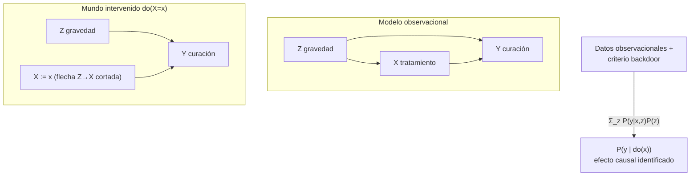

# 035 — Programación probabilística y causalidad

> [← Clase anterior](../../../classes/part-02-probabilistic-evolutionary-and-decision-ai/034-optimizacion-por-enjambre-y-colonia/README.md) · [Índice de la parte](../README.md) · [Clase siguiente →](../../../classes/part-02-probabilistic-evolutionary-and-decision-ai/036-proyecto-sistema-hibrido-para-decisiones/README.md)

**Parte:** 02 — IA probabilística, evolutiva y de decisión  
**Nivel:** intermedio · **Horas estimadas:** 6  
**Laboratorio:** `probability` · **Estado:** `EXECUTABLE_CORE`

## 🎯 Propósito

Comprender **programación probabilística y causalidad** dentro de la evolución de la inteligencia
artificial, implementar un experimento mínimo verificable y distinguir qué parte
constituye evidencia frente a una afirmación todavía no comprobada.

## 📚 Resultados de aprendizaje

Al finalizar podrás:

1. Explicar programación probabilística y causalidad usando los conceptos `causalidad`, `intervención`, `modelos`, `inferencia`.
2. Ejecutar el laboratorio con una semilla explícita y revisar su contrato JSON.
3. Identificar al menos un supuesto, una limitación y un riesgo de aplicación.
4. Comparar el enfoque con la etapa anterior de la ruta de aprendizaje.
5. Producir una evidencia reproducible y una conclusión que no exceda los datos.

## 🧩 Conceptos centrales

`causalidad`, `intervención`, `modelos`, `inferencia`

## 🗺️ Ubicación en el mapa de la IA

Esta clase reúne dos culminaciones de la parte 02. La **programación probabilística** generaliza las redes bayesianas (027): el modelo es un programa con variables aleatorias, y un motor de inferencia (MCMC, variacional — clase 031) calcula posteriores automáticamente. La **causalidad** de Pearl responde a la limitación más profunda de todo lo anterior: la probabilidad condicional describe qué *observamos*, no qué pasaría si *interviniéramos*. Correlación no responde preguntas de acción; el do-calculus sí, y es la frontera actual entre predecir y entender.

## 📖 Fundamentos

### 💻 Programación probabilística (PPL)

Un programa probabilístico define un modelo generativo con dos primitivas:

```python
# pseudocódigo estilo PPL
p    = sample("p", Beta(1, 1))          # prior sobre variable latente
for i in range(N):
    observe(f"y{i}", Bernoulli(p), y[i])  # condicionar en datos
# consulta: posterior de p dado y
```

El motor (PyMC, Stan, NumPyro, Gen) separa **modelo** de **inferencia**: el usuario declara la historia generativa; el sistema corre MCMC/variacional. Ventajas sobre redes dibujadas a mano: control de flujo, recursión, número variable de variables. Costo: la inferencia automática puede fallar silenciosamente (cadenas que no convergen), y hay que auditarla con diagnósticos (R̂, tamaño efectivo).

### 🪜 La escalera de la causalidad (Pearl)

```text
Nivel 1 — Asociación:     P(y | x)        "¿qué veo si observo x?"        (datos)
Nivel 2 — Intervención:   P(y | do(x))    "¿qué pasa si HAGO x?"          (experimento o do-calculus)
Nivel 3 — Contrafactual:  P(y_x | x', y') "¿qué habría pasado si…?"       (modelo estructural completo)
```

`P(y | x) ≠ P(y | do(x))` en general: observar zapatos grandes predice buena lectura en niños (asociación vía edad), pero regalar zapatos no enseña a leer (intervención). El operador `do(X=x)` corta las flechas que entran en X — X deja de escuchar a sus causas — y modela una acción externa.

### 🔀 Confusión (confounding) y el criterio backdoor

Un **confounder** Z causa a la vez el tratamiento X y el resultado Y, creando asociación espuria. Un conjunto Z satisface el **criterio backdoor** para (X, Y) si: (1) ningún nodo de Z es descendiente de X, y (2) Z bloquea (d-separación, clase 027) todo camino entre X e Y que entra a X por una flecha "hacia atrás". Entonces:

```text
Fórmula de ajuste:
P(y | do(x)) = Σ_z P(y | x, z) · P(z)
```

— se estratifica por el confounder y se promedia con los pesos *poblacionales* de Z (no los condicionales a X). El **do-calculus** (tres reglas de reescritura sobre el grafo) generaliza esto y es completo: si el efecto causal es identificable desde datos observacionales + grafo, las reglas lo derivan.

**Advertencia dual**: ajustar por un **colisionador** o por un **mediador** introduce sesgo en lugar de quitarlo. Controlar "por todo lo que se pueda" es un error causal, no prudencia estadística.

### 🧩 Modelos causales estructurales (SCM)

Un SCM asigna a cada variable una ecuación `Xᵢ := fᵢ(Padres(Xᵢ), Uᵢ)` con ruidos exógenos U. El `:=` es asimétrico (mecanismo, no ecuación algebraica). Los SCM soportan los tres niveles: simular (1), mutilar el grafo con do (2), y abducir los U para razonar contrafactualmente (3). Un PPL puede *expresar* un SCM — la síntesis de las dos mitades de esta clase.

## 🧮 Ejemplo trabajado

**¿El tratamiento X cura la enfermedad Y?** Confounder: gravedad Z (los graves reciben el tratamiento con más frecuencia y se curan menos). Datos observacionales de 1 000 pacientes:

| Z (gravedad) | P(z) | P(x=1 \| z) | P(y=1 \| x=1, z) | P(y=1 \| x=0, z) |
|---|---:|---:|---:|---:|
| leve (z₀) | 0.5 | 0.2 | 0.9 | 0.8 |
| grave (z₁) | 0.5 | 0.8 | 0.6 | 0.4 |

**Nivel 1 — asociación cruda** (promedios ponderados por quién recibe el tratamiento):

```text
P(y=1 | x=1) = [0.5·0.2·0.9 + 0.5·0.8·0.6] / (0.5·0.2 + 0.5·0.8)
             = (0.09 + 0.24) / 0.5 = 0.66
P(y=1 | x=0) = [0.5·0.8·0.8 + 0.5·0.2·0.4] / (0.5·0.8 + 0.5·0.2)
             = (0.32 + 0.04) / 0.5 = 0.72
Diferencia observacional: 0.66 − 0.72 = −0.06  →  ¡el tratamiento "empeora"!
```

**Nivel 2 — intervención con ajuste backdoor** (Z bloquea el camino trasero X ← Z → Y):

```text
P(y=1 | do(x=1)) = Σ_z P(y=1|x=1,z)·P(z) = 0.9·0.5 + 0.6·0.5 = 0.75
P(y=1 | do(x=0)) = 0.8·0.5 + 0.4·0.5 = 0.60
Efecto causal medio (ATE): 0.75 − 0.60 = +0.15  →  el tratamiento CURA
```

La asociación cruda (−0.06) y el efecto causal (+0.15) tienen **signo opuesto** — paradoja de Simpson resuelta: el grafo dice que Z es confounder y hay que ajustar; sin grafo, los mismos números no deciden si estratificar o no.

## 📊 Propiedades y comparación

| Pregunta | Herramienta suficiente | Requiere | Falla si |
|---|---|---|---|
| P(y\|x) — predicción | Estadística / ML estándar | Datos i.i.d. | Deriva de distribución |
| P(y\|do(x)) — efecto de acción | RCT (experimento) | Aleatorización costosa/ética | No siempre posible |
| P(y\|do(x)) sin experimento | do-calculus + grafo | DAG causal correcto y completo | Confounders no medidos |
| Contrafactual individual | SCM completo | Ecuaciones y ruidos | Casi nunca identificable solo con datos |
| Posterior de parámetros | PPL + MCMC | Modelo generativo | Cadenas sin converger |



## ⚠️ Errores conceptuales frecuentes

1. **`P(y|x)` como efecto de una acción.** Condicionar selecciona subpoblaciones; intervenir cambia el mecanismo. El ejemplo trabajado muestra que pueden tener signo contrario.
2. **"Controlar por todas las variables disponibles."** Ajustar por colisionadores o mediadores *crea* sesgo (sesgo de colisionador, sobreajuste del efecto); la selección de covariables es un problema del grafo, no de cantidad.
3. **Creer que el DAG sale de los datos.** De datos observacionales solo se identifica la clase de equivalencia de Markov; la orientación causal exige supuestos, experimentos o conocimiento del dominio.
4. **Confundir PPL con "el modelo es correcto".** El motor calcula el posterior *del modelo escrito*; si la historia generativa es errónea, la inferencia impecable da respuestas precisas a la pregunta equivocada. Diagnósticos ≠ validación del modelo.
5. **Saltar al nivel 3 sin fundamento.** Los contrafactuales individuales ("¿se habría curado sin el fármaco?") requieren el SCM completo con sus ruidos; ni un RCT basta para identificarlos en general.

## 🚀 Del aprendizaje a la operación

El ejemplo tiene un confounder medido y un grafo dado; en la práctica el grafo es hipótesis discutible, hay confounders no medidos (se necesitan variables instrumentales, front-door o análisis de sensibilidad) y los datos tienen sesgos de selección propios. Un pipeline causal serio incluye: elicitar y documentar el DAG con expertos, verificar sus implicaciones testeables (independencias), estimar con métodos dobles-robustos y reportar cuánto confounding oculto haría desaparecer el efecto (E-value). En PPL: diagnósticos de convergencia y validación predictiva posterior antes de creer un número.

## 🧪 Laboratorio

```bash
python lab.py
```

El laboratorio llama a `ai_evolution.labs.run_lab("probability")`. Esta
decisión evita 183 implementaciones divergentes: cada clase tiene un entrypoint
propio, pero los motores didácticos se prueban como una biblioteca común.

### 🔍 Evidencia esperada

- tipo de laboratorio y semilla;
- entradas o decisiones observables;
- resultado estructurado;
- lista `evidence` con hechos que pueden inspeccionarse;
- lista `limitations` que impide presentar la demo como producción.

## 📓 Notebooks

- [📓 `notebook.ipynb`](notebook.ipynb): recorrido guiado con la materia resumida.
- [✍️ `notebook_student.ipynb`](notebook_student.ipynb): ejercicios para resolver.
- [✅ `notebook_solution.ipynb`](notebook_solution.ipynb): solución de referencia explicada.

## 📝 Evaluación

| Criterio | Peso |
|---|---:|
| Comprensión conceptual | 25 % |
| Ejecución reproducible | 25 % |
| Interpretación basada en evidencia | 25 % |
| Riesgos, límites y mejora propuesta | 25 % |

Consulta [assessment.md](assessment.md) para preguntas y criterio de aceptación.

## ⚠️ Errores comunes

| Síntoma | Causa probable | Corrección |
|---|---|---|
| El código corre, pero no hay conclusión | Se confundió ejecución con aprendizaje | Explica qué demuestra y qué no demuestra |
| El resultado cambia sin explicación | No se registró semilla o configuración | Conserva semilla, versión y parámetros |
| Se promete uso real | Se extrapoló desde una demo educativa | Declara entorno, datos, límites y revisión humana |
| Se copia una métrica aislada | No existe baseline ni costo de error | Añade comparación y criterio de decisión |

## ❓ Preguntas frecuentes

**¿Debo usar una API comercial?**  
No. El núcleo funciona localmente. Las extensiones LIVE se documentan por separado.

**¿El laboratorio representa una implementación industrial?**  
No por sí solo. Enseña el contrato y el patrón; producción exige integración,
seguridad, observabilidad, pruebas y operación.

**¿Dónde profundizo?**  
Revisa las especializaciones enlazadas en el README raíz y la ruta siguiente.

## 🔗 Referencias

- Pearl, J. (2009). *Causality: Models, Reasoning, and Inference*, 2.ª ed. Cambridge University Press. [https://bayes.cs.ucla.edu/BOOK-2K/](https://bayes.cs.ucla.edu/BOOK-2K/) — uso: referencia consultada en su fuente original
- Pearl, J. (1995). "Causal diagrams for empirical research". *Biometrika*, 82(4), 669-688. [https://doi.org/10.1093/biomet/82.4.669](https://doi.org/10.1093/biomet/82.4.669) — uso: fuente primaria del mecanismo estudiado
- Pearl, J. & Mackenzie, D. (2018). *The Book of Why*. Basic Books. — uso: desarrollo extendido del tema
- Koller, D. & Friedman, N. (2009). *Probabilistic Graphical Models*, cap. 21 (causalidad). [https://mitpress.mit.edu/9780262013192/probabilistic-graphical-models/](https://mitpress.mit.edu/9780262013192/probabilistic-graphical-models/) — uso: referencia consultada en su fuente original
- Documentación de PyMC. [https://www.pymc.io/](https://www.pymc.io/) · Documentación de Stan. [https://mc-stan.org/](https://mc-stan.org/) — uso: referencia consultada en su fuente original

<!-- papers:inicio -->

---

## 📜 Papers que fundamentan esta clase

> Bloque generado por `python scripts/link_papers_to_classes.py`. La fuente es [`papers/catalog/papers.json`](../../../papers/catalog/papers.json).

| Paper | Año | Qué desbloqueó | Miniatura |
|---|---:|---|---|
| [P94 · Stan: un lenguaje de programación probabilística](../../../papers/foundational/P94_programacion_probabilistica/README.md) | 2017 | Separa declarar el modelo de calcular la inferencia: se escribe qué se supone del mundo y el motor devuelve la posterior. | [notebook](../../../notebooks/papers/P94_programacion_probabilistica.ipynb) |
| [P95 · Las siete herramientas de la inferencia causal, con reflexiones sobre aprendizaje automático](../../../papers/foundational/P95_causalidad/README.md) | 2019 | Ordena en tres peldaños lo que un sistema puede responder —asociación, intervención y contrafáctico— y muestra que subir de peldaño exige supuestos que los datos no contienen. | [notebook](../../../notebooks/papers/P95_causalidad.ipynb) |

Cada ficha explica el problema anterior, la matemática mínima, los límites y los errores de atribución más frecuentes. Para leerlas con método: [cómo leer un paper de IA](../../../papers/guides/COMO_LEER_UN_PAPER_DE_IA.md) · [anexos matemáticos](../../../papers/annexes/README.md).
<!-- papers:fin -->
<!-- bibliografia:inicio -->

---

## 📚 Bibliografía de apoyo

> Bloque generado por `python scripts/link_sources_to_classes.py`. Cada obra lleva su localizador verificado en [`sources/bibliography.json`](../../../sources/bibliography.json).

Los papers dicen **de dónde salió** el mecanismo. Estas obras lo **desarrollan** con el espacio que una clase no tiene: teoría completa, demostraciones y ejercicios.

| Obra | Edición | Localizador | Papel en esta clase |
|---|---|---|---|
| Koller, Daphne y Friedman, Nir — *Probabilistic Graphical Models: Principles and Techniques* | 2010 | [ISBN 9780262013192](https://openlibrary.org/isbn/9780262013192) · [web de la obra](https://mitpress.mit.edu/9780262013192/probabilistic-graphical-models/) | citada en las referencias de esta clase · cap. 21 · obra de referencia de la parte 02 |
| Pearl, J. y Mackenzie, D. — *The Book of Why* | 2018 | [ISBN 9780465097609](https://openlibrary.org/isbn/9780465097609) | citada en las referencias de esta clase |
| Russell, Stuart J. y Norvig, Peter — *Artificial Intelligence: A Modern Approach* | 4.ª · 2020 | [ISBN 9780134610993](https://openlibrary.org/isbn/9780134610993) · [web de la obra](https://aima.cs.berkeley.edu/) | obra de referencia de la parte 02 · bloque de incertidumbre y decisión |
| Pearl, J. — *Probabilistic Reasoning in Intelligent Systems* | 1988 | [ISBN 9780080514895](https://openlibrary.org/isbn/9780080514895) | obra de referencia de la parte 02 · redes de creencia |
<!-- bibliografia:fin -->

---

## ⬅️ Clase anterior

[034 — Optimización por enjambre y colonia](../../part-02-probabilistic-evolutionary-and-decision-ai/034-optimizacion-por-enjambre-y-colonia/README.md)

## ➡️ Siguiente clase

[036 — Proyecto: sistema híbrido para decisiones](../../part-02-probabilistic-evolutionary-and-decision-ai/036-proyecto-sistema-hibrido-para-decisiones/README.md)
