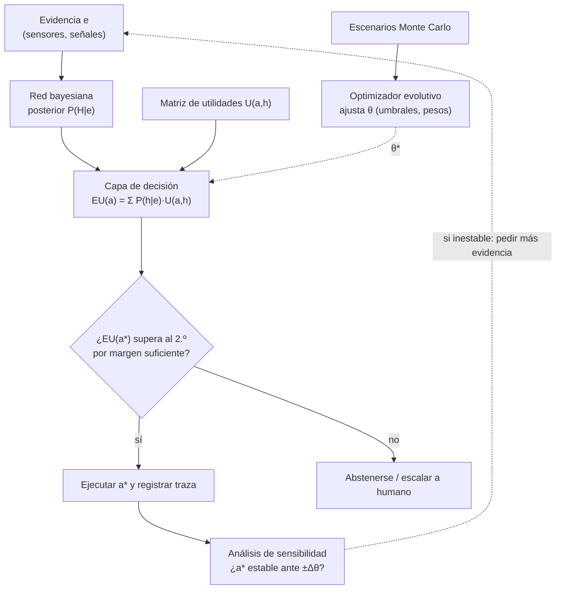

# 036 — Proyecto: sistema híbrido para decisiones

> [← Clase anterior](../../../classes/part-02-probabilistic-evolutionary-and-decision-ai/035-programacion-probabilistica-y-causalidad/README.md) · [Índice de la parte](../README.md) · [Clase siguiente →](../../../classes/part-03-classical-machine-learning/037-flujo-supervisado-y-particion-train-validation-test/README.md)

**Parte:** 02 — IA probabilística, evolutiva y de decisión  
**Nivel:** intermedio · **Horas estimadas:** 10  
**Laboratorio:** `capstone` · **Estado:** `EXECUTABLE_CORE`

## 🎯 Propósito

Comprender **proyecto: sistema híbrido para decisiones** dentro de la evolución de la inteligencia
artificial, implementar un experimento mínimo verificable y distinguir qué parte
constituye evidencia frente a una afirmación todavía no comprobada.

## 📚 Resultados de aprendizaje

Al finalizar podrás:

1. Explicar proyecto: sistema híbrido para decisiones usando los conceptos `Bayes`, `reglas`, `optimización`, `trazabilidad`.
2. Ejecutar el laboratorio con una semilla explícita y revisar su contrato JSON.
3. Identificar al menos un supuesto, una limitación y un riesgo de aplicación.
4. Comparar el enfoque con la etapa anterior de la ruta de aprendizaje.
5. Producir una evidencia reproducible y una conclusión que no exceda los datos.

## 🧩 Conceptos centrales

`Bayes`, `reglas`, `optimización`, `trazabilidad`

## 🗺️ Ubicación en el mapa de la IA

Esta clase cierra la Parte 02 integrando sus tres familias: la inferencia probabilística (025-028, 035), la decisión secuencial bajo incertidumbre (029-030) y la optimización sin gradientes (031-034). Un sistema híbrido de decisión combina una red bayesiana para estimar el estado del mundo, un criterio de utilidad esperada (o un MDP si la decisión es secuencial) para elegir la acción, y un optimizador evolutivo para ajustar los parámetros libres del diseño. Este patrón —percibir con probabilidad, decidir con utilidad, afinar con búsqueda— reaparece en la Parte 03 con modelos aprendidos de datos y en el aprendizaje por refuerzo posterior.

## 📖 Fundamentos

### 🧱 Anatomía de un sistema híbrido de decisión

Un sistema de decisión bajo incertidumbre se descompone en cuatro capas con contratos explícitos entre sí:

```text
1. Capa de creencias (red bayesiana)
   entrada : evidencia observada e (síntomas, sensores, señales)
   salida  : posterior P(H | e) sobre los estados relevantes del mundo

2. Capa de decisión (utilidad esperada / MDP)
   entrada : P(H | e) + tabla de utilidades U(acción, estado)
   salida  : acción a* = argmax_a Σ_h P(h | e) · U(a, h)
             (si la decisión es secuencial: política π* de un MDP
              resuelta con value iteration)

3. Capa de optimización (algoritmo evolutivo)
   entrada : parámetros libres θ del sistema (umbrales de decisión,
             pesos de la utilidad, hiperparámetros)
   salida  : θ* que maximiza el desempeño esperado sobre escenarios
             simulados (Monte Carlo)

4. Capa de trazabilidad
   registra: evidencia usada, posterior calculado, utilidades,
             acción elegida, semilla y versión de parámetros.
```

La separación importa: las creencias son *epistémicas* (qué es probablemente cierto) y las utilidades son *normativas* (qué preferimos). Mezclarlas —por ejemplo, inflar una probabilidad porque el error sería caro— corrompe ambas capas; el costo del error pertenece a `U`, no a `P`.

### 🔗 Contratos entre capas

- **BN → decisión:** el posterior debe estar normalizado y calibrado; la capa de decisión lo consume tal cual, sin re-ponderarlo.
- **Decisión → optimización:** la función objetivo del optimizador es la utilidad esperada media sobre `N` escenarios muestreados (Monte Carlo, clase 031); la varianza del estimador (~1/√N) limita cuán finas pueden ser las comparaciones entre candidatos.
- **MDP dentro de la capa de decisión:** si las acciones tienen consecuencias en el tiempo, la acción óptima ya no es un `argmax` puntual sino la política de un MDP `(S, A, P, R, γ)` resuelta por iteración de valores (clase 029). El posterior de la BN alimenta el estado de creencia inicial.

### 📏 Criterios de diseño de sistemas de decisión

1. **Separar estimación de preferencia** (probabilidad vs utilidad).
2. **Explicitar el costo de cada error**: una matriz `U(a, h)` completa, no solo "acierto/fallo".
3. **Cuantificar la robustez**: análisis de sensibilidad — ¿la acción óptima cambia si el prior o una utilidad se mueve ±20 %? Si `a*` es estable en todo el rango plausible, la decisión es robusta; si no, el sistema debe pedir más evidencia o escalar a un humano.
4. **Reproducibilidad**: semilla, versión de parámetros y evidencia registradas en cada decisión.
5. **Umbral de abstención**: si `max_a EU(a)` supera al segundo mejor por menos que la incertidumbre del estimador, la salida honesta es "no decidir aún".

### 📉 Análisis de sensibilidad

Sea `EU(a; θ)` la utilidad esperada de la acción `a` con parámetros `θ` (priors, CPTs, utilidades). El análisis de sensibilidad de una vía perturba un parámetro a la vez dentro de su rango plausible y observa si `argmax_a EU(a; θ)` cambia. El **valor de cruce** es el valor del parámetro donde dos acciones empatan; si está lejos de la estimación puntual, la decisión es insensible a ese parámetro. Esto convierte "el modelo puede estar mal" en una afirmación medible: *cuánto* tendría que estar mal para cambiar la recomendación.

## 🧮 Ejemplo trabajado

Sistema de triaje de mantenimiento: decidir si **detener** una máquina o **continuar** produciendo.

**Capa 1 — creencias.** Red de dos nodos: `Falla → Vibración`. Prior `P(Falla)=0.10`; sensor con `P(Vib | Falla)=0.9`, `P(Vib | ¬Falla)=0.2`. Se observa vibración:

```text
P(Falla | Vib) = 0.9·0.10 / (0.9·0.10 + 0.2·0.90)
              = 0.09 / (0.09 + 0.18) = 0.333
```

**Capa 2 — decisión.** Utilidades (en miles): `U(detener, falla)=−5` (reparación programada), `U(detener, ¬falla)=−5` (parada innecesaria cuesta lo mismo), `U(continuar, falla)=−40` (rotura catastrófica), `U(continuar, ¬falla)=0`.

```text
EU(detener)   = 0.333·(−5)  + 0.667·(−5)  = −5.0
EU(continuar) = 0.333·(−40) + 0.667·0     = −13.3
→ a* = detener, aunque P(falla) sea solo 1/3: el costo asimétrico decide.
```

**Capa 3 — sensibilidad.** ¿Con qué posterior empatan? `−5 = p·(−40)` → `p = 0.125`. La recomendación "detener" se mantiene mientras `P(Falla | Vib) > 0.125`; el posterior estimado (0.333) está lejos del cruce, así que la decisión es robusta a errores moderados del prior. Despejando hacia el prior: el empate ocurre con `P(Falla) ≈ 0.031` — habría que creer que las fallas son 3 veces más raras de lo estimado para cambiar de acción.

**Capa 4 — optimización.** Si el umbral de alarma del sensor es un parámetro continuo `θ`, un algoritmo evolutivo (clase 033) busca el `θ*` que maximiza la utilidad media sobre miles de escenarios simulados con Monte Carlo, sin necesitar gradientes del simulador.

## 📊 Propiedades y comparación

| Arquitectura | Estado del mundo | Preferencias | Secuencialidad | Ajuste de parámetros | Riesgo principal |
|---|---|---|---|---|---|
| Reglas duras (`si vib → detener`) | Implícito, binario | Implícitas en la regla | No | Manual | Umbrales arbitrarios, sin grados |
| Solo red bayesiana | Posterior explícito | Ausentes | No | CPTs estimadas | Reporta creencia, no decide |
| BN + utilidad esperada (esta clase) | Posterior explícito | Matriz U explícita | No | Sensibilidad + evolución | U difícil de elicitar |
| MDP completo | Estado + transiciones | Recompensa por paso | Sí (política) | Value iteration | Explosión de estados |
| RL aprendido de datos | Implícito en la red | Recompensa | Sí | Gradientes/simulación | Opacidad, necesita muchos datos |



## ⚠️ Errores conceptuales frecuentes

1. **"La acción óptima es la del estado más probable."** Falso: con `P(falla)=0.33` el estado más probable es `¬falla`, pero la acción óptima es detener. El `argmax` se toma sobre utilidades esperadas, no sobre probabilidades.
2. **Ajustar probabilidades para reflejar costos.** Inflar `P(falla)` "por precaución" rompe la calibración y hace imposible auditar el sistema; la precaución se codifica en `U`.
3. **Optimizar sin controlar el ruido de Monte Carlo.** Comparar dos candidatos `θ` con pocas simulaciones selecciona ganadores por azar; hay que fijar semillas comunes (common random numbers) o aumentar `N` hasta que la diferencia supere el error estándar.
4. **Presentar la recomendación sin sensibilidad.** Un `a*` sin valores de cruce es una caja negra: no se sabe si la decisión pende de un prior dudoso.
5. **Confundir demo con despliegue.** Este proyecto valida el patrón de integración; un sistema real exige CPTs estimadas de datos, elicitación formal de utilidades y revisión humana proporcional al riesgo.

## 🚀 Del aprendizaje a la operación

El capstone integra motores didácticos con parámetros dados. En operación real faltan: (1) estimar las CPTs desde datos históricos con incertidumbre de muestreo (y re-estimarlas ante deriva); (2) elicitar utilidades con las partes interesadas mediante técnicas formales (loterías de referencia), no números inventados; (3) validar la calibración del posterior antes de conectarlo a decisiones; (4) definir gobernanza — quién revisa las decisiones de alto impacto y cómo se audita la traza; (5) monitoreo continuo del desempeño de la política frente al baseline humano.

## 🧪 Laboratorio

```bash
python lab.py
```

El laboratorio llama a `ai_evolution.labs.run_lab("capstone")`. Esta
decisión evita 183 implementaciones divergentes: cada clase tiene un entrypoint
propio, pero los motores didácticos se prueban como una biblioteca común.

### 🔍 Evidencia esperada

- tipo de laboratorio y semilla;
- entradas o decisiones observables;
- resultado estructurado;
- lista `evidence` con hechos que pueden inspeccionarse;
- lista `limitations` que impide presentar la demo como producción.

## 📓 Notebooks

- [📓 `notebook.ipynb`](notebook.ipynb): recorrido guiado con la materia resumida.
- [✍️ `notebook_student.ipynb`](notebook_student.ipynb): ejercicios para resolver.
- [✅ `notebook_solution.ipynb`](notebook_solution.ipynb): solución de referencia explicada.

## 📝 Evaluación

| Criterio | Peso |
|---|---:|
| Comprensión conceptual | 25 % |
| Ejecución reproducible | 25 % |
| Interpretación basada en evidencia | 25 % |
| Riesgos, límites y mejora propuesta | 25 % |

Consulta [assessment.md](assessment.md) para preguntas y criterio de aceptación.

## ⚠️ Errores comunes

| Síntoma | Causa probable | Corrección |
|---|---|---|
| El código corre, pero no hay conclusión | Se confundió ejecución con aprendizaje | Explica qué demuestra y qué no demuestra |
| El resultado cambia sin explicación | No se registró semilla o configuración | Conserva semilla, versión y parámetros |
| Se promete uso real | Se extrapoló desde una demo educativa | Declara entorno, datos, límites y revisión humana |
| Se copia una métrica aislada | No existe baseline ni costo de error | Añade comparación y criterio de decisión |

## ❓ Preguntas frecuentes

**¿Debo usar una API comercial?**  
No. El núcleo funciona localmente. Las extensiones LIVE se documentan por separado.

**¿El laboratorio representa una implementación industrial?**  
No por sí solo. Enseña el contrato y el patrón; producción exige integración,
seguridad, observabilidad, pruebas y operación.

**¿Dónde profundizo?**  
Revisa las especializaciones enlazadas en el README raíz y la ruta siguiente.

## 🔗 Referencias

- [Russell & Norvig — *Artificial Intelligence: A Modern Approach*, 4e (caps. 13, 16 y 17: incertidumbre, decisiones simples y decisiones secuenciales)](https://aima.cs.berkeley.edu/)
- [Koller & Friedman — *Probabilistic Graphical Models: Principles and Techniques* (MIT Press)](https://mitpress.mit.edu/9780262013192/probabilistic-graphical-models/)
- [Sutton & Barto — *Reinforcement Learning: An Introduction*, 2e (cap. 3-4: MDP y programación dinámica; PDF oficial gratuito)](http://incompleteideas.net/book/the-book-2nd.html)
- [Howard, R. A. (1966) — "Information Value Theory", *IEEE Transactions on Systems Science and Cybernetics* (análisis de decisiones y valor de la información)](https://doi.org/10.1109/TSSC.1966.300074)
- [Bellman, R. (1957) — "A Markovian Decision Process", *Journal of Mathematics and Mechanics*](https://www.jstor.org/stable/24900506)
- [Kochenderfer, Wheeler & Wray — *Algorithms for Decision Making* (MIT Press, PDF oficial gratuito)](https://algorithmsbook.com/)

---

## ⬅️ Clase anterior

[035 — Programación probabilística y causalidad](../../part-02-probabilistic-evolutionary-and-decision-ai/035-programacion-probabilistica-y-causalidad/README.md)

## ➡️ Siguiente clase

[037 — Flujo supervisado y partición train-validation-test](../../part-03-classical-machine-learning/037-flujo-supervisado-y-particion-train-validation-test/README.md)
