# 🎲 Parte 02 — IA probabilística, evolutiva y de decisión

**Nivel:** intermedio · **Duración sugerida:** 4–5 semanas ·
**Clases:** 12

Introduce decisiones bajo incertidumbre, modelos temporales, simulación, lógica difusa y métodos de búsqueda inspirados en la naturaleza.

## 🧭 Secuencia de la parte

```mermaid
flowchart LR
    L025["025<br/>Razonamiento con incertidumbre"]
    L026["026<br/>Teorema de Bayes<br/>y actualización de<br/>creencias"]
    L027["027<br/>Redes bayesianas e<br/>independencia condicional"]
    L028["028<br/>Modelos ocultos de<br/>Markov"]
    L029["029<br/>Procesos de decisión<br/>de Markov"]
    L030["030<br/>Teoría de decisión<br/>y utilidad esperada"]
    L031["031<br/>Métodos Monte Carlo<br/>y simulación"]
    L032["032<br/>Lógica difusa y<br/>control aproximado"]
    L033["033<br/>Algoritmos genéticos"]
    L034["034<br/>Optimización por enjambre<br/>y colonia"]
    L035["035<br/>Programación probabilística y<br/>causalidad"]
    L036["036<br/>Proyecto: sistema híbrido<br/>para decisiones"]
    L025 --> L026
    L026 --> L027
    L027 --> L028
    L028 --> L029
    L029 --> L030
    L030 --> L031
    L031 --> L032
    L032 --> L033
    L033 --> L034
    L034 --> L035
    L035 --> L036
```

## 📚 Clases

| ID | Tema | Laboratorio | Horas |
|---:|---|---|---:|
| 025 | [Razonamiento con incertidumbre](025-razonamiento-con-incertidumbre/README.md) | `probability` | 6 |
| 026 | [Teorema de Bayes y actualización de creencias](026-teorema-de-bayes-y-actualizacion-de-creencias/README.md) | `probability` | 6 |
| 027 | [Redes bayesianas e independencia condicional](027-redes-bayesianas-e-independencia-condicional/README.md) | `probability` | 6 |
| 028 | [Modelos ocultos de Markov](028-modelos-ocultos-de-markov/README.md) | `probability` | 6 |
| 029 | [Procesos de decisión de Markov](029-procesos-de-decision-de-markov/README.md) | `workflow` | 6 |
| 030 | [Teoría de decisión y utilidad esperada](030-teoria-de-decision-y-utilidad-esperada/README.md) | `probability` | 6 |
| 031 | [Métodos Monte Carlo y simulación](031-metodos-monte-carlo-y-simulacion/README.md) | `probability` | 6 |
| 032 | [Lógica difusa y control aproximado](032-logica-difusa-y-control-aproximado/README.md) | `logic` | 6 |
| 033 | [Algoritmos genéticos](033-algoritmos-geneticos/README.md) | `optimization` | 6 |
| 034 | [Optimización por enjambre y colonia](034-optimizacion-por-enjambre-y-colonia/README.md) | `optimization` | 6 |
| 035 | [Programación probabilística y causalidad](035-programacion-probabilistica-y-causalidad/README.md) | `probability` | 6 |
| 036 | [Proyecto: sistema híbrido para decisiones](036-proyecto-sistema-hibrido-para-decisiones/README.md) | `capstone` | 10 |

## 📝 Evaluación de la parte

- 40 % laboratorios y notebooks.
- 25 % explicaciones y comparación de enfoques.
- 20 % evaluación de riesgos y limitaciones.
- 15 % mini-proyecto o integración.

[⬅️ Parte 01 — IA simbólica, búsqueda, lógica y planificación](../part-01-symbolic-ai-search-logic-and-planning/README.md) · [🏠 Volver al programa](../../README.md) · [➡️ Parte 03 — Machine learning clásico](../part-03-classical-machine-learning/README.md)
