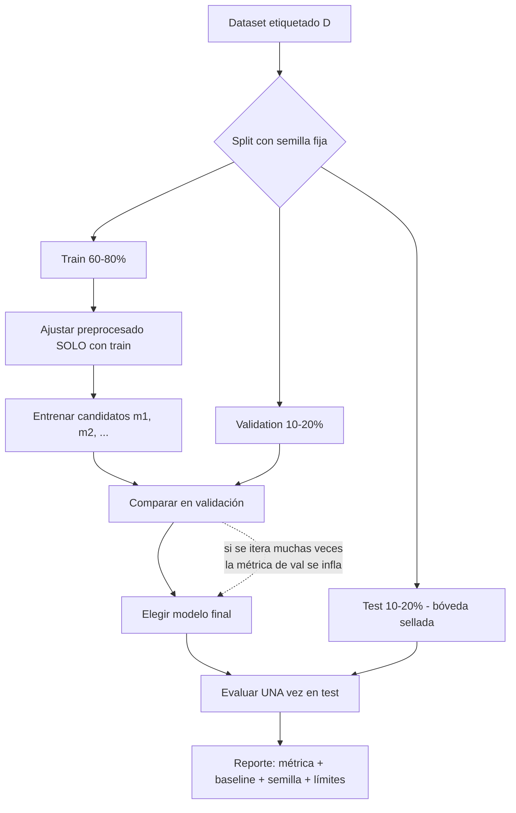

# 037 — Flujo supervisado y partición train-validation-test

> [← Clase anterior](../../../classes/part-02-probabilistic-evolutionary-and-decision-ai/036-proyecto-sistema-hibrido-para-decisiones/README.md) · [Índice de la parte](../README.md) · [Clase siguiente →](../../../classes/part-03-classical-machine-learning/038-regresion-lineal-regularizacion-y-diagnostico/README.md)

**Parte:** 03 — Machine learning clásico  
**Nivel:** intermedio · **Horas estimadas:** 6  
**Laboratorio:** `ml` · **Estado:** `EXECUTABLE_CORE`

## 🎯 Propósito

Comprender **flujo supervisado y partición train-validation-test** dentro de la evolución de la inteligencia
artificial, implementar un experimento mínimo verificable y distinguir qué parte
constituye evidencia frente a una afirmación todavía no comprobada.

## 📚 Resultados de aprendizaje

Al finalizar podrás:

1. Explicar flujo supervisado y partición train-validation-test usando los conceptos `supervisado`, `split`, `fuga`, `baseline`.
2. Ejecutar el laboratorio con una semilla explícita y revisar su contrato JSON.
3. Identificar al menos un supuesto, una limitación y un riesgo de aplicación.
4. Comparar el enfoque con la etapa anterior de la ruta de aprendizaje.
5. Producir una evidencia reproducible y una conclusión que no exceda los datos.

## 🧩 Conceptos centrales

`supervisado`, `split`, `fuga`, `baseline`

## 🗺️ Ubicación en el mapa de la IA

Con esta clase el programa cruza la frontera hacia el aprendizaje automático: en las partes
anteriores el conocimiento se escribía a mano (reglas, distribuciones, heurísticas); aquí el
sistema **induce** el mapeo entrada→salida desde ejemplos etiquetados. El protocolo
train/validation/test que se establece aquí es el contrato metodológico de *todo* lo que
sigue — desde la regresión lineal (clase 038) hasta el fine-tuning de modelos de lenguaje —
porque sin partición honesta ninguna métrica del resto del programa es creíble.

## 📖 Fundamentos

### 🎓 El problema del aprendizaje supervisado

Dado un conjunto de datos $D = \{(x_i, y_i)\}_{i=1}^{n}$ con entradas $x_i \in \mathcal{X}$
y etiquetas $y_i \in \mathcal{Y}$, muestreado i.i.d. de una distribución desconocida
$P(X, Y)$, el objetivo es encontrar una función $f: \mathcal{X} \to \mathcal{Y}$ que
minimice el **riesgo esperado**:

```text
R(f) = E[ L(f(X), Y) ]        ← lo que importa: error sobre datos FUTUROS
R̂(f) = (1/n) Σ L(f(xᵢ), yᵢ)   ← lo único medible: error sobre la muestra
```

donde `L` es una función de pérdida (0/1 en clasificación, cuadrática en regresión).
El problema central es que optimizamos `R̂` (riesgo empírico) pero queremos `R` (riesgo
real). La diferencia `R − R̂` es la **brecha de generalización**, y crece cuando el modelo
tiene capacidad suficiente para memorizar la muestra (sobreajuste).

### ✂️ Por qué tres particiones y no una

- **Train:** ajusta los parámetros del modelo (pesos, umbrales, splits del árbol).
- **Validation (desarrollo):** compara configuraciones e hiperparámetros. Cada vez que se
  elige "el mejor modelo según validación", la métrica de validación se vuelve optimista,
  porque la selección misma es una forma de ajuste.
- **Test:** se toca **una sola vez**, al final, para estimar el riesgo real del modelo ya
  elegido. Si se usa para decidir algo, deja de ser test.

La regla se deriva de un hecho estadístico simple: la estimación de error sobre datos que
influyeron en *cualquier* decisión (parámetros, hiperparámetros, features, preprocesado)
está sesgada hacia abajo. Proporciones habituales: 60/20/20 u 80/10/10 con datos
abundantes; con pocos datos se sustituye validación por **validación cruzada k-fold**
(k=5 o k=10): se entrena k veces dejando fuera un pliegue distinto y se promedia.

### 🕳️ Fuga de datos (data leakage)

Fuga = cualquier información del conjunto de evaluación que se filtra al entrenamiento.
Formas típicas, de la más burda a la más sutil:

1. **Duplicados** entre train y test (o el mismo cliente/paciente en ambos lados).
2. **Preprocesado antes del split:** calcular media/desviación para normalizar, imputar
   nulos o seleccionar features usando TODO el dataset. Lo correcto: ajustar el
   preprocesador solo con train y aplicarlo a validación/test.
3. **Fuga temporal:** entrenar con datos posteriores a los que se predicen.
4. **Fuga de etiqueta:** una columna que es consecuencia del target (p. ej. "monto
   reembolsado" para predecir fraude).

### 📏 Baseline: la vara mínima

Un **baseline** es el modelo más simple razonable: predecir la clase mayoritaria, la media
del target, o el valor del instante anterior en series. Cumple dos funciones: (a) detecta
problemas triviales o etiquetas filtradas — si el baseline ya acierta 99 %, la tarea o los
datos tienen algo raro —, y (b) da denominador al valor del modelo: un accuracy de 0.92
no significa nada si la clase mayoritaria es el 91 % de los casos.

### 🔁 El flujo completo

```text
1. Congelar el protocolo: métrica, split, semilla, baseline.
2. Separar test y NO mirarlo.
3. Ajustar preprocesado + modelo con train.
4. Comparar candidatos con validación (o k-fold).
5. Elegir UN modelo final; reentrenar con train+val si procede.
6. Medir UNA vez sobre test → estimación honesta del riesgo.
7. Reportar: métrica ± incertidumbre, baseline, semilla, versión de datos.
```

## 🧮 Ejemplo trabajado

Dataset de 10 correos (5 spam, 5 legítimos) y un clasificador por umbral sobre la
cantidad de enlaces del correo. Split 6/2/2 con semilla fija:

| Conjunto | Correos (enlaces, etiqueta) |
|---|---|
| Train (6) | (0,L) (1,L) (2,L) (4,S) (5,S) (7,S) |
| Val (2) | (1,L) (6,S) |
| Test (2) | (3,L) (5,S) |

Candidatos de umbral `t` (predecir spam si enlaces ≥ t) evaluados en **train**:
`t=3` acierta 6/6; `t=2` acierta 5/6 (marca (2,L) como spam); `t=5` acierta 5/6.
En **validación**, `t=3` acierta 2/2 y los otros 1/2 o 2/2 según el caso: se elige `t=3`.
Recién ahora se mira **test**: (3,L) → 3≥3 predice spam ✗; (5,S) → spam ✓. Accuracy de
test = 0.5, igual que el baseline de clase mayoritaria. Moraleja: el 100 % en train y
validación era optimismo de muestra pequeña; el test honesto lo revela. Con n tan chico
la conclusión correcta es "no hay evidencia de que el umbral supere al baseline", no
"el modelo funciona".

## 📊 Propiedades y comparación

| Estrategia de evaluación | Costo de cómputo | Sesgo de la estimación | Varianza | Cuándo usarla |
|---|---|---|---|---|
| Hold-out simple (train/test) | 1 entrenamiento | Bajo si test no se reutiliza | Alta con pocos datos | Datos abundantes |
| Train/val/test | 1 entrenamiento + selección | Val: optimista; test: honesto | Media | Selección de hiperparámetros |
| k-fold CV (k=5,10) | k entrenamientos | Levemente pesimista | Baja (promedio) | Datos escasos |
| Leave-one-out | n entrenamientos | Casi insesgado | Alta y caro | n muy pequeño |
| Split temporal | 1+ entrenamientos | Honesto para series | Depende de ventanas | Datos con orden temporal |



## ⚠️ Errores conceptuales frecuentes

1. **"Normalizo todo el dataset y después hago el split."** Las estadísticas de
   normalización ya vieron el test: hay fuga. El orden correcto es split → fit del
   preprocesador en train → transform del resto.
2. **"Mi accuracy de validación es la estimación del error real."** No: tras comparar
   muchos candidatos, la métrica del ganador en validación está sesgada al alza. Solo el
   test intacto estima el riesgo real.
3. **"Puedo mirar el test varias veces si no reentreno."** Cada mirada que influye en una
   decisión (elegir features, parar el tuning) convierte el test en validación.
4. **"El split aleatorio siempre vale."** Con grupos (mismo paciente, misma tienda) hay que
   separar por grupo; con series temporales, por tiempo. Un split aleatorio ahí es fuga.
5. **"No necesito baseline, la métrica habla sola."** Sin baseline no se distingue un
   modelo útil de una clase desbalanceada o una etiqueta filtrada.

## 🚀 Del aprendizaje a la operación

En producción el dataset no es fijo: la distribución cambia (*drift*), y el protocolo se
convierte en monitoreo continuo — reentrenos programados, conjuntos de evaluación
refrescados y comparación permanente contra el baseline y el modelo anterior. Faltan además
el versionado de datos y de splits (para poder reproducir cualquier métrica histórica),
pruebas de fuga automatizadas en el pipeline de features, y la decisión de negocio explícita
sobre qué costo tiene cada tipo de error antes de fijar la métrica a optimizar.

## 🧪 Laboratorio

```bash
python lab.py
```

El laboratorio llama a `ai_evolution.labs.run_lab("ml")`. Esta
decisión evita 183 implementaciones divergentes: cada clase tiene un entrypoint
propio, pero los motores didácticos se prueban como una biblioteca común.

### 🔍 Evidencia esperada

- tipo de laboratorio y semilla;
- entradas o decisiones observables;
- resultado estructurado;
- lista `evidence` con hechos que pueden inspeccionarse;
- lista `limitations` que impide presentar la demo como producción.

## 📓 Notebooks

- [📓 `notebook.ipynb`](notebook.ipynb): recorrido guiado con la materia resumida.
- [✍️ `notebook_student.ipynb`](notebook_student.ipynb): ejercicios para resolver.
- [✅ `notebook_solution.ipynb`](notebook_solution.ipynb): solución de referencia explicada.

## 📝 Evaluación

| Criterio | Peso |
|---|---:|
| Comprensión conceptual | 25 % |
| Ejecución reproducible | 25 % |
| Interpretación basada en evidencia | 25 % |
| Riesgos, límites y mejora propuesta | 25 % |

Consulta [assessment.md](assessment.md) para preguntas y criterio de aceptación.

## ⚠️ Errores comunes

| Síntoma | Causa probable | Corrección |
|---|---|---|
| El código corre, pero no hay conclusión | Se confundió ejecución con aprendizaje | Explica qué demuestra y qué no demuestra |
| El resultado cambia sin explicación | No se registró semilla o configuración | Conserva semilla, versión y parámetros |
| Se promete uso real | Se extrapoló desde una demo educativa | Declara entorno, datos, límites y revisión humana |
| Se copia una métrica aislada | No existe baseline ni costo de error | Añade comparación y criterio de decisión |

## ❓ Preguntas frecuentes

**¿Debo usar una API comercial?**  
No. El núcleo funciona localmente. Las extensiones LIVE se documentan por separado.

**¿El laboratorio representa una implementación industrial?**  
No por sí solo. Enseña el contrato y el patrón; producción exige integración,
seguridad, observabilidad, pruebas y operación.

**¿Dónde profundizo?**  
Revisa las especializaciones enlazadas en el README raíz y la ruta siguiente.

## 🔗 Referencias

- [James, Witten, Hastie, Tibshirani — *An Introduction to Statistical Learning* (2e), cap. 2 y 5 (bias-variance y cross-validation), PDF oficial gratuito](https://www.statlearning.com/)
- [Hastie, Tibshirani, Friedman — *The Elements of Statistical Learning* (2e), cap. 7 "Model Assessment and Selection", PDF oficial](https://hastie.su.domains/ElemStatLearn/)
- [scikit-learn User Guide — Cross-validation: evaluating estimator performance](https://scikit-learn.org/stable/modules/cross_validation.html)
- [scikit-learn — Common pitfalls: data leakage](https://scikit-learn.org/stable/common_pitfalls.html#data-leakage)
- [Kaufman et al. (2012), "Leakage in Data Mining: Formulation, Detection, and Avoidance", ACM TKDD. DOI 10.1145/2382577.2382579](https://doi.org/10.1145/2382577.2382579)

<!-- papers:inicio -->

---

## 📜 Papers que fundamentan esta clase

> Bloque generado por `python scripts/link_papers_to_classes.py`. La fuente es [`papers/catalog/papers.json`](../../../papers/catalog/papers.json).

| Paper | Año | Qué desbloqueó | Miniatura |
|---|---:|---|---|
| [P76 · Un estudio de la validación cruzada y el bootstrap para estimar exactitud y seleccionar modelos](../../../papers/foundational/P76_validacion_cruzada/README.md) | 1995 | Fija la práctica estándar de evaluación —diez pliegues estratificados— con evidencia empírica en lugar de costumbre. | [notebook](../../../notebooks/papers/P76_validacion_cruzada.ipynb) |
| [P80 · Modelización estadística: las dos culturas](../../../papers/foundational/P80_dos_culturas/README.md) | 2001 | Nombra la división que organiza el campo: suponer un mecanismo generador frente a medir la capacidad de predecir. | [notebook](../../../notebooks/papers/P80_dos_culturas.ipynb) |

Cada ficha explica el problema anterior, la matemática mínima, los límites y los errores de atribución más frecuentes. Para leerlas con método: [cómo leer un paper de IA](../../../papers/guides/COMO_LEER_UN_PAPER_DE_IA.md) · [anexos matemáticos](../../../papers/annexes/README.md).
<!-- papers:fin -->
---

## ⬅️ Clase anterior

[036 — Proyecto: sistema híbrido para decisiones](../../part-02-probabilistic-evolutionary-and-decision-ai/036-proyecto-sistema-hibrido-para-decisiones/README.md)

## ➡️ Siguiente clase

[038 — Regresión lineal, regularización y diagnóstico](../../part-03-classical-machine-learning/038-regresion-lineal-regularizacion-y-diagnostico/README.md)
