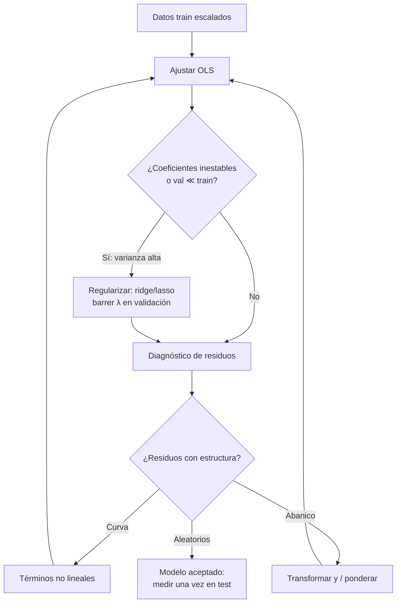

# 038 — Regresión lineal, regularización y diagnóstico

> [← Clase anterior](../../../classes/part-03-classical-machine-learning/037-flujo-supervisado-y-particion-train-validation-test/README.md) · [Índice de la parte](../README.md) · [Clase siguiente →](../../../classes/part-03-classical-machine-learning/039-clasificacion-logistica-y-umbrales/README.md)

**Parte:** 03 — Machine learning clásico  
**Nivel:** intermedio · **Horas estimadas:** 6  
**Laboratorio:** `ml` · **Estado:** `EXECUTABLE_CORE`

## 🎯 Propósito

Comprender **regresión lineal, regularización y diagnóstico** dentro de la evolución de la inteligencia
artificial, implementar un experimento mínimo verificable y distinguir qué parte
constituye evidencia frente a una afirmación todavía no comprobada.

## 📚 Resultados de aprendizaje

Al finalizar podrás:

1. Explicar regresión lineal, regularización y diagnóstico usando los conceptos `regresión`, `L1`, `L2`, `residuos`.
2. Ejecutar el laboratorio con una semilla explícita y revisar su contrato JSON.
3. Identificar al menos un supuesto, una limitación y un riesgo de aplicación.
4. Comparar el enfoque con la etapa anterior de la ruta de aprendizaje.
5. Producir una evidencia reproducible y una conclusión que no exceda los datos.

## 🧩 Conceptos centrales

`regresión`, `L1`, `L2`, `residuos`

## 🗺️ Ubicación en el mapa de la IA

La regresión lineal (Legendre 1805, Gauss 1809, formalizada por Galton y Pearson a fines
del s. XIX) es el modelo supervisado más antiguo y sigue siendo el punto de partida
obligado: es el baseline interpretable contra el que se justifica cualquier modelo más
complejo. Introduce tres ideas que atraviesan todo el ML moderno — mínimos cuadrados como
optimización de una pérdida, regularización como control de capacidad, y diagnóstico de
residuos como auditoría del modelo — y es el ancestro directo de la regresión logística
(clase 039) y de cada capa lineal de una red neuronal (parte 04).

## 📖 Fundamentos

### 📐 El modelo y la pérdida

El modelo lineal supone que el target es una combinación lineal de las features más ruido:

```text
y = β₀ + β₁x₁ + ... + β_d x_d + ε,     ε ~ ruido de media 0
```

Los **mínimos cuadrados ordinarios (OLS)** eligen los coeficientes que minimizan la suma
de cuadrados de los residuos:

```text
RSS(β) = Σᵢ (yᵢ − ŷᵢ)²  con  ŷᵢ = β₀ + Σⱼ βⱼ xᵢⱼ
```

En forma matricial, con `X` de tamaño n×(d+1) (columna de unos incluida), la solución
cerrada es la **ecuación normal**:

```text
β̂ = (XᵀX)⁻¹ Xᵀ y
```

Para el caso simple (una feature) hay fórmulas directas:
`β̂₁ = Σ(xᵢ−x̄)(yᵢ−ȳ) / Σ(xᵢ−x̄)²` y `β̂₀ = ȳ − β̂₁ x̄`. La calidad del ajuste se resume
con `R² = 1 − RSS/TSS`, la fracción de varianza del target explicada por el modelo.

### 🎛️ Regularización: ridge (L2) y lasso (L1)

Cuando hay muchas features, colinealidad o pocos datos, `XᵀX` se vuelve casi singular y
los coeficientes OLS explotan en magnitud y varianza. La regularización añade a la pérdida
una penalización sobre el tamaño de los coeficientes (nunca sobre β₀):

```text
Ridge:  min RSS(β) + λ Σⱼ βⱼ²      → encoge todos los coeficientes, no anula ninguno
Lasso:  min RSS(β) + λ Σⱼ |βⱼ|     → puede anular coeficientes: selección de variables
```

- λ = 0 recupera OLS; λ → ∞ colapsa los coeficientes hacia 0 (el modelo tiende a predecir la media).
- λ se elige por validación (o k-fold), nunca sobre el test.
- Ridge tiene solución cerrada `β̂ = (XᵀX + λI)⁻¹ Xᵀy`; lasso requiere optimización
  iterativa (descenso por coordenadas) porque |β| no es diferenciable en 0.
- La geometría explica la diferencia: la bola L1 tiene esquinas sobre los ejes, y el
  óptimo restringido cae con probabilidad positiva en una esquina (coeficiente = 0);
  la bola L2 es esférica y solo encoge.
- **Escalar las features es obligatorio** antes de regularizar: la penalización es la
  misma para todos los coeficientes, y sus magnitudes dependen de las unidades.

En términos del compromiso sesgo-varianza: OLS es insesgado pero puede tener varianza
enorme; la regularización acepta un poco de sesgo a cambio de mucha menos varianza, y el
error total (sesgo² + varianza + ruido) suele bajar.

### 🩺 Diagnóstico de residuos

El residuo `eᵢ = yᵢ − ŷᵢ` es la ventana a los supuestos del modelo. Se inspecciona el
gráfico residuos vs. predicciones y el Q-Q plot:

| Patrón en los residuos | Supuesto violado | Acción típica |
|---|---|---|
| Curva (forma de U) | Linealidad | Términos polinómicos, transformar features |
| Abanico (varianza crece) | Homocedasticidad | Transformar y (log), mínimos cuadrados ponderados |
| Rachas correlacionadas | Independencia | Modelos de series (clase 045) |
| Colas pesadas en Q-Q | Normalidad del ruido | Pérdidas robustas (Huber), revisar outliers |
| Puntos aislados con residuo enorme | Outliers / leverage | Investigar el dato antes de borrarlo |

Un R² alto con residuos estructurados es un modelo equivocado que memoriza la tendencia;
un R² modesto con residuos aleatorios puede ser el modelo correcto para un fenómeno ruidoso.

## 🧮 Ejemplo trabajado

Cinco observaciones: horas de estudio x = [1, 2, 3, 4, 5], nota y = [2, 4, 5, 4, 6].

```text
x̄ = 3,  ȳ = 4.2
Σ(xᵢ−x̄)(yᵢ−ȳ) = (−2)(−2.2) + (−1)(−0.2) + 0(0.8) + 1(−0.2) + 2(1.8) = 4.4 − 0.2 + 0 − 0.2 + 3.6 = 8.0
Σ(xᵢ−x̄)² = 4 + 1 + 0 + 1 + 4 = 10
β̂₁ = 8.0 / 10 = 0.8        β̂₀ = 4.2 − 0.8·3 = 1.8
```

Modelo: `ŷ = 1.8 + 0.8x`. Predicciones: [2.6, 3.4, 4.2, 5.0, 5.8];
residuos: [−0.6, 0.6, 0.8, −1.0, 0.2]; RSS = 0.36+0.36+0.64+1.00+0.04 = 2.4;
TSS = Σ(yᵢ−ȳ)² = 4.84+0.04+0.64+0.04+3.24 = 8.8 → **R² = 1 − 2.4/8.8 ≈ 0.727**.

Versión ridge del coeficiente (con x e y centrados, sin intercepto penalizado):
`β̂₁(λ) = Σxᵢyᵢ / (Σxᵢ² + λ) = 8/(10+λ)`. Con λ=2: β̂₁ = 0.667 — el coeficiente se
encoge hacia 0 y la recta se aplana: menos varianza, algo más de sesgo.

## 📊 Propiedades y comparación

| Método | Solución | Coeficientes nulos | Colinealidad | Hiperparámetro | Cuándo preferirlo |
|---|---|---|---|---|---|
| OLS | Cerrada, O(nd² + d³) | No | Frágil | Ninguno | n ≫ d, features poco correlacionadas |
| Ridge (L2) | Cerrada con λI | No (solo encoge) | Estable | λ por CV | Muchas features correlacionadas |
| Lasso (L1) | Iterativa | Sí (sparse) | Elige 1 del grupo | λ por CV | Se busca selección de variables |
| Elastic Net | Iterativa | Sí | Reparte en el grupo | λ, α por CV | Grupos de features correlacionadas |



## ⚠️ Errores conceptuales frecuentes

1. **"R² alto = buen modelo."** R² solo mide varianza explicada en los datos usados; sube
   siempre al añadir features (por eso existe R² ajustado) y no detecta residuos
   estructurados ni sobreajuste. Se valida fuera de muestra.
2. **"Los coeficientes indican importancia causal."** Un coeficiente mide asociación
   condicional al resto de las features, con signo que puede invertirse por colinealidad o
   confusores. Regresión ≠ causalidad (eso exige diseño, clase 035).
3. **"Regularizar sin escalar."** La penalización castiga por igual a un coeficiente en
   metros y a otro en milímetros; sin estandarizar, λ castiga arbitrariamente según unidades.
4. **"Lasso encontró LAS variables verdaderas."** Con features correlacionadas lasso elige
   una casi al azar y anula las demás; la selección es inestable entre re-muestreos.
5. **"Más datos siempre arreglan la colinealidad."** La colinealidad exacta (una feature
   combinación lineal de otras) hace `XᵀX` singular sin importar n; hay que eliminar o
   combinar features, o regularizar.

## 🚀 Del aprendizaje a la operación

Entre este núcleo y un uso real median: la elección de λ con validación cruzada anidada
(para no contaminar la estimación de error), intervalos de confianza o bootstrap sobre los
coeficientes antes de interpretar signos, pruebas de estabilidad del modelo ante re-muestreo,
monitoreo de drift de las features en producción (un modelo lineal extrapola linealmente
fuera del rango visto, y lo hace en silencio), y la documentación de las transformaciones
exactas para reproducir la predicción en el sistema de serving.

## 🧪 Laboratorio

```bash
python lab.py
```

El laboratorio llama a `ai_evolution.labs.run_lab("ml")`. Esta
decisión evita 183 implementaciones divergentes: cada clase tiene un entrypoint
propio, pero los motores didácticos se prueban como una biblioteca común.

### 🔍 Evidencia esperada

- tipo de laboratorio y semilla;
- entradas o decisiones observables;
- resultado estructurado;
- lista `evidence` con hechos que pueden inspeccionarse;
- lista `limitations` que impide presentar la demo como producción.

## 📓 Notebooks

- [📓 `notebook.ipynb`](notebook.ipynb): recorrido guiado con la materia resumida.
- [✍️ `notebook_student.ipynb`](notebook_student.ipynb): ejercicios para resolver.
- [✅ `notebook_solution.ipynb`](notebook_solution.ipynb): solución de referencia explicada.

## 📝 Evaluación

| Criterio | Peso |
|---|---:|
| Comprensión conceptual | 25 % |
| Ejecución reproducible | 25 % |
| Interpretación basada en evidencia | 25 % |
| Riesgos, límites y mejora propuesta | 25 % |

Consulta [assessment.md](assessment.md) para preguntas y criterio de aceptación.

## ⚠️ Errores comunes

| Síntoma | Causa probable | Corrección |
|---|---|---|
| El código corre, pero no hay conclusión | Se confundió ejecución con aprendizaje | Explica qué demuestra y qué no demuestra |
| El resultado cambia sin explicación | No se registró semilla o configuración | Conserva semilla, versión y parámetros |
| Se promete uso real | Se extrapoló desde una demo educativa | Declara entorno, datos, límites y revisión humana |
| Se copia una métrica aislada | No existe baseline ni costo de error | Añade comparación y criterio de decisión |

## ❓ Preguntas frecuentes

**¿Debo usar una API comercial?**  
No. El núcleo funciona localmente. Las extensiones LIVE se documentan por separado.

**¿El laboratorio representa una implementación industrial?**  
No por sí solo. Enseña el contrato y el patrón; producción exige integración,
seguridad, observabilidad, pruebas y operación.

**¿Dónde profundizo?**  
Revisa las especializaciones enlazadas en el README raíz y la ruta siguiente.

## 🔗 Referencias

- [James, Witten, Hastie, Tibshirani — *An Introduction to Statistical Learning* (2e), cap. 3 (regresión lineal) y 6 (regularización), PDF oficial](https://www.statlearning.com/) — uso: desarrollo extendido del tema
- [Hastie, Tibshirani, Friedman — *The Elements of Statistical Learning* (2e), cap. 3 "Linear Methods for Regression", PDF oficial](https://hastie.su.domains/ElemStatLearn/) — uso: desarrollo extendido del tema
- [Tibshirani (1996), "Regression Shrinkage and Selection via the Lasso", JRSS B. DOI 10.1111/j.2517-6161.1996.tb02080.x](https://doi.org/10.1111/j.2517-6161.1996.tb02080.x) — uso: fuente primaria del mecanismo estudiado
- [Hoerl & Kennard (1970), "Ridge Regression: Biased Estimation for Nonorthogonal Problems", Technometrics. DOI 10.1080/00401706.1970.10488634](https://doi.org/10.1080/00401706.1970.10488634) — uso: fuente primaria del mecanismo estudiado
- [scikit-learn User Guide — Linear Models](https://scikit-learn.org/stable/modules/linear_model.html) — uso: referencia consultada en su fuente original

<!-- papers:inicio -->

---

## 📜 Papers que fundamentan esta clase

> Bloque generado por `python scripts/link_papers_to_classes.py`. La fuente es [`papers/catalog/papers.json`](../../../papers/catalog/papers.json).

| Paper | Año | Qué desbloqueó | Miniatura |
|---|---:|---|---|
| [P77 · Contracción y selección en regresión mediante el lasso](../../../papers/foundational/P77_lasso/README.md) | 1996 | Una penalización que estima y selecciona a la vez: pone coeficientes exactamente en cero. | [notebook](../../../notebooks/papers/P77_lasso.ipynb) |

Cada ficha explica el problema anterior, la matemática mínima, los límites y los errores de atribución más frecuentes. Para leerlas con método: [cómo leer un paper de IA](../../../papers/guides/COMO_LEER_UN_PAPER_DE_IA.md) · [anexos matemáticos](../../../papers/annexes/README.md).
<!-- papers:fin -->
<!-- bibliografia:inicio -->

---

## 📚 Bibliografía de apoyo

> Bloque generado por `python scripts/link_sources_to_classes.py`. Cada obra lleva su localizador verificado en [`sources/bibliography.json`](../../../sources/bibliography.json).

Los papers dicen **de dónde salió** el mecanismo. Estas obras lo **desarrollan** con el espacio que una clase no tiene: teoría completa, demostraciones y ejercicios.

| Obra | Edición | Localizador | Papel en esta clase |
|---|---|---|---|
| Hastie, Trevor, Tibshirani, Robert y Friedman, Jerome — *The Elements of Statistical Learning* | 2.ª · 2009 | [ISBN 9780387848570](https://openlibrary.org/isbn/9780387848570) · [web de la obra](https://hastie.su.domains/ElemStatLearn/) | citada en las referencias de esta clase · cap. 3 · obra de referencia de la parte 03 |
| James, Gareth et al. — *An Introduction to Statistical Learning* | 2021 | [ISBN 9783031387470](https://openlibrary.org/isbn/9783031387470) · [web de la obra](https://www.statlearning.com/) | citada en las referencias de esta clase · cap. 3 · obra de referencia de la parte 03 |
| Murphy, Kevin P. — *Probabilistic Machine Learning* | 2022 | [ISBN 9780262046824](https://openlibrary.org/isbn/9780262046824) · [web de la obra](https://probml.github.io/pml-book/) | obra de referencia de la parte 03 · fundamentos probabilísticos del aprendizaje |
<!-- bibliografia:fin -->

---

## ⬅️ Clase anterior

[037 — Flujo supervisado y partición train-validation-test](../../part-03-classical-machine-learning/037-flujo-supervisado-y-particion-train-validation-test/README.md)

## ➡️ Siguiente clase

[039 — Clasificación logística y umbrales](../../part-03-classical-machine-learning/039-clasificacion-logistica-y-umbrales/README.md)
