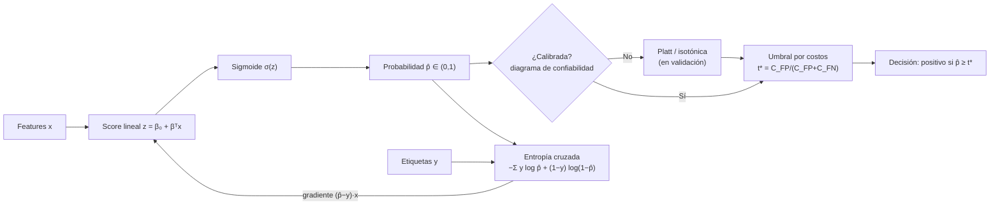

# 039 — Clasificación logística y umbrales

> [← Clase anterior](../../../classes/part-03-classical-machine-learning/038-regresion-lineal-regularizacion-y-diagnostico/README.md) · [Índice de la parte](../README.md) · [Clase siguiente →](../../../classes/part-03-classical-machine-learning/040-arboles-de-decision-y-reglas-interpretables/README.md)

**Parte:** 03 — Machine learning clásico  
**Nivel:** intermedio · **Horas estimadas:** 6  
**Laboratorio:** `ml` · **Estado:** `EXECUTABLE_CORE`

## 🎯 Propósito

Comprender **clasificación logística y umbrales** dentro de la evolución de la inteligencia
artificial, implementar un experimento mínimo verificable y distinguir qué parte
constituye evidencia frente a una afirmación todavía no comprobada.

## 📚 Resultados de aprendizaje

Al finalizar podrás:

1. Explicar clasificación logística y umbrales usando los conceptos `logística`, `probabilidades`, `umbral`, `calibración`.
2. Ejecutar el laboratorio con una semilla explícita y revisar su contrato JSON.
3. Identificar al menos un supuesto, una limitación y un riesgo de aplicación.
4. Comparar el enfoque con la etapa anterior de la ruta de aprendizaje.
5. Producir una evidencia reproducible y una conclusión que no exceda los datos.

## 🧩 Conceptos centrales

`logística`, `probabilidades`, `umbral`, `calibración`

## 🗺️ Ubicación en el mapa de la IA

La regresión logística (Cox, 1958, sobre la función logística de Verhulst del s. XIX) es el
puente entre la regresión lineal de la clase anterior y la clasificación probabilística:
mantiene la interpretabilidad del modelo lineal pero produce probabilidades. Su pérdida
—la entropía cruzada— y su no-linealidad —la sigmoide— son exactamente las que reaparecen
en la neurona de salida de las redes profundas (parte 04). Además introduce la separación
conceptual clave de esta parte: **estimar probabilidad** es un problema estadístico;
**decidir con un umbral** es un problema de costos.

## 📖 Fundamentos

### 🧮 Del score lineal a la probabilidad

La regresión logística modela la probabilidad de la clase positiva pasando un score lineal
`z` por la **sigmoide** σ:

```text
z = β₀ + β₁x₁ + ... + β_d x_d          (score, en ℝ)
p̂ = σ(z) = 1 / (1 + e^(−z))            (probabilidad, en (0,1))
```

Equivalentemente, el modelo es lineal en el **log-odds** (logit):
`log(p/(1−p)) = z`. Cada unidad de aumento en xⱼ multiplica los odds por `e^{βⱼ}` — esta
es la lectura correcta de los coeficientes (odds ratio), no "sube la probabilidad en βⱼ".

### 📉 La pérdida: entropía cruzada (log-loss)

No se ajusta minimizando errores de clasificación (no diferenciable) sino maximizando la
verosimilitud de las etiquetas, que equivale a minimizar la **entropía cruzada binaria**:

```text
L(β) = −(1/n) Σᵢ [ yᵢ log p̂ᵢ + (1−yᵢ) log(1−p̂ᵢ) ]
```

Propiedades: es convexa (óptimo global único, sin mínimos locales), castiga sin cota las
predicciones confiadas y equivocadas (p̂→1 con y=0 cuesta −log(1−p̂)→∞), y su gradiente
tiene la misma forma que en la regresión lineal:

```text
∂L/∂βⱼ = (1/n) Σᵢ (p̂ᵢ − yᵢ) xᵢⱼ       → descenso de gradiente: βⱼ ← βⱼ − η ∂L/∂βⱼ
```

No hay solución cerrada; se optimiza con gradiente o Newton. Con datos linealmente
separables los coeficientes divergen a ∞ (la sigmoide quiere ser un escalón): la
regularización L2 es también una necesidad numérica.

### 🎚️ El umbral es una decisión, no parte del modelo

El modelo entrega p̂; convertirlo en acción exige un umbral t: predecir positivo si p̂ ≥ t.
El t=0.5 por defecto solo es óptimo si los dos errores cuestan lo mismo y las clases están
balanceadas. Con matriz de costos explícita, el umbral óptimo que minimiza el costo
esperado es:

```text
predecir positivo ⇔ p̂ ≥ C_FP / (C_FP + C_FN)
```

donde C_FP es el costo de un falso positivo y C_FN el de un falso negativo. Si un falso
negativo cuesta 9 veces más que un falso positivo, t* = 1/(1+9) = 0.1: se acepta disparar
muchas alarmas para no dejar pasar casos graves. Mover t recorre el compromiso
precision-recall; ninguna elección de t mejora la calidad del score, solo reparte errores.

### 🌡️ Calibración: que 0.7 signifique 70 %

Un clasificador está **calibrado** si entre los casos con p̂ ≈ 0.7 aproximadamente el 70 %
son positivos. La regresión logística bien especificada tiende a estar calibrada (su
pérdida es una *proper scoring rule*); árboles, SVM y boosting suelen no estarlo. Se
diagnostica con el diagrama de confiabilidad (probabilidad predicha vs. frecuencia
observada por bins) y se corrige con **Platt scaling** (una logística sobre los scores) o
**regresión isotónica**, ajustadas en validación. La calibración importa porque el umbral
por costos de arriba solo es válido si p̂ es una probabilidad real.

## 🧮 Ejemplo trabajado

Modelo entrenado: `z = −3 + 1.2·(nº de pagos atrasados)`. Cliente con 3 atrasos:

```text
z = −3 + 1.2·3 = 0.6
p̂ = 1/(1 + e^(−0.6)) = 1/(1 + 0.5488) ≈ 0.649
```

Interpretación del coeficiente: cada atraso multiplica los odds de impago por e^1.2 ≈ 3.32.

Contribución a la pérdida si el cliente finalmente NO impaga (y=0):
`−log(1−0.649) = −log(0.351) ≈ 1.047`. Si hubiera impagado (y=1): `−log(0.649) ≈ 0.432`.

Decisión con costos: aprobar a un moroso (FN) cuesta 500; rechazar a un buen cliente (FP)
cuesta 100. Umbral óptimo `t* = 100/(100+500) = 1/6 ≈ 0.167`. Como p̂ = 0.649 ≥ 0.167, se
rechaza el crédito — con t=0.5 también, pero un cliente con 1 atraso (z=−1.8, p̂≈0.142)
se aprueba con t=0.5 y **también** con t*=0.167 (0.142 < 0.167, por poco): el umbral de
costos deja pasar justo a los casos donde el riesgo esperado compensa.

## 📊 Propiedades y comparación

| Aspecto | Regresión logística | Regresión lineal sobre 0/1 | Árbol de decisión | k-NN |
|---|---|---|---|---|
| Salida | Probabilidad calibrable | Valores fuera de [0,1] | Frecuencias por hoja (mal calibradas) | Frecuencia local |
| Frontera de decisión | Hiperplano | Hiperplano | Cajas alineadas a ejes | Irregular |
| Pérdida | Entropía cruzada (convexa) | Cuadrática (inadecuada) | Impureza voraz | — |
| Interpretación | Odds ratio por feature | Pendiente sin sentido probabilístico | Reglas legibles | Ninguna global |
| Datos separables | Diverge sin L2 | — | Sobreajusta hondo | Depende de k |



## ⚠️ Errores conceptuales frecuentes

1. **"El 0.5 es el umbral natural."** Solo si los costos son simétricos y las clases
   balanceadas; el umbral es una decisión de negocio que se fija con la matriz de costos,
   después de entrenar.
2. **"βⱼ es cuánto sube la probabilidad."** βⱼ actúa sobre el log-odds; el efecto en
   probabilidad depende del punto (máximo en p̂=0.5, casi nulo en los extremos). La lectura
   correcta es multiplicativa sobre los odds: e^{βⱼ}.
3. **"Accuracy alta = buen clasificador de probabilidad."** La accuracy solo ve el lado del
   umbral. Un modelo puede acertar la clase y estar pésimamente calibrado; para scores se
   evalúa log-loss, Brier o el diagrama de confiabilidad (clase 047).
4. **"La logística es solo para fronteras lineales, así que es débil."** Es lineal en las
   features *dadas*: con términos polinómicos o interacciones la frontera en el espacio
   original puede ser curva, manteniendo convexidad e interpretabilidad.
5. **"Si separa perfecto en train, mejor."** Separación perfecta hace diverger los
   coeficientes y produce p̂ ∈ {0,1} sobreconfiadas; señal de que falta regularización o
   sobran features.

## 🚀 Del aprendizaje a la operación

Para operar una logística real faltan: recalibración periódica (la calibración se degrada
con el drift antes que el ranking), umbrales distintos por segmento cuando los costos
difieren, monitoreo de la distribución de scores (un corrimiento del histograma de p̂ es la
primera alarma de drift), análisis de equidad por subgrupo antes de fijar el umbral
(clase 047), y trazabilidad de la versión de modelo + umbral que produjo cada decisión,
porque en dominios regulados hay que poder explicar caso por caso.

## 🧪 Laboratorio

```bash
python lab.py
```

El laboratorio llama a `ai_evolution.labs.run_lab("ml")`. Esta
decisión evita 183 implementaciones divergentes: cada clase tiene un entrypoint
propio, pero los motores didácticos se prueban como una biblioteca común.

### 🔍 Evidencia esperada

- tipo de laboratorio y semilla;
- entradas o decisiones observables;
- resultado estructurado;
- lista `evidence` con hechos que pueden inspeccionarse;
- lista `limitations` que impide presentar la demo como producción.

## 📓 Notebooks

- [📓 `notebook.ipynb`](notebook.ipynb): recorrido guiado con la materia resumida.
- [✍️ `notebook_student.ipynb`](notebook_student.ipynb): ejercicios para resolver.
- [✅ `notebook_solution.ipynb`](notebook_solution.ipynb): solución de referencia explicada.

## 📝 Evaluación

| Criterio | Peso |
|---|---:|
| Comprensión conceptual | 25 % |
| Ejecución reproducible | 25 % |
| Interpretación basada en evidencia | 25 % |
| Riesgos, límites y mejora propuesta | 25 % |

Consulta [assessment.md](assessment.md) para preguntas y criterio de aceptación.

## ⚠️ Errores comunes

| Síntoma | Causa probable | Corrección |
|---|---|---|
| El código corre, pero no hay conclusión | Se confundió ejecución con aprendizaje | Explica qué demuestra y qué no demuestra |
| El resultado cambia sin explicación | No se registró semilla o configuración | Conserva semilla, versión y parámetros |
| Se promete uso real | Se extrapoló desde una demo educativa | Declara entorno, datos, límites y revisión humana |
| Se copia una métrica aislada | No existe baseline ni costo de error | Añade comparación y criterio de decisión |

## ❓ Preguntas frecuentes

**¿Debo usar una API comercial?**  
No. El núcleo funciona localmente. Las extensiones LIVE se documentan por separado.

**¿El laboratorio representa una implementación industrial?**  
No por sí solo. Enseña el contrato y el patrón; producción exige integración,
seguridad, observabilidad, pruebas y operación.

**¿Dónde profundizo?**  
Revisa las especializaciones enlazadas en el README raíz y la ruta siguiente.

## 🔗 Referencias

- [James et al. — *An Introduction to Statistical Learning* (2e), cap. 4 "Classification", PDF oficial](https://www.statlearning.com/) — uso: desarrollo extendido del tema
- [Hastie, Tibshirani, Friedman — *The Elements of Statistical Learning* (2e), §4.4 "Logistic Regression", PDF oficial](https://hastie.su.domains/ElemStatLearn/) — uso: desarrollo extendido del tema
- [Bishop — *Pattern Recognition and Machine Learning* (2006), §4.3 "Probabilistic Discriminative Models", PDF oficial de Microsoft Research](https://www.microsoft.com/en-us/research/publication/pattern-recognition-machine-learning/) — uso: referencia consultada en su fuente original
- [Cox (1958), "The Regression Analysis of Binary Sequences", JRSS B. DOI 10.1111/j.2517-6161.1958.tb00292.x](https://doi.org/10.1111/j.2517-6161.1958.tb00292.x) — uso: fuente primaria del mecanismo estudiado
- [scikit-learn User Guide — Logistic regression](https://scikit-learn.org/stable/modules/linear_model.html#logistic-regression) — uso: referencia consultada en su fuente original
- [scikit-learn User Guide — Probability calibration](https://scikit-learn.org/stable/modules/calibration.html) — uso: referencia consultada en su fuente original

<!-- papers:inicio -->

---

## 📜 Papers que fundamentan esta clase

> Bloque generado por `python scripts/link_papers_to_classes.py`. La fuente es [`papers/catalog/papers.json`](../../../papers/catalog/papers.json).

| Paper | Año | Qué desbloqueó | Miniatura |
|---|---:|---|---|
| [P01 · El perceptrón: un modelo probabilístico de almacenamiento y organización de información en el cerebro](../../../papers/foundational/P01_perceptron/README.md) | 1958 | Primera máquina que aprende sus propios pesos a partir de ejemplos en lugar de ejecutar reglas escritas por una persona. | [notebook](../../../notebooks/papers/P01_perceptron.ipynb) |
| [P75 · Redes de vectores soporte](../../../papers/foundational/P75_svm/README.md) | 1995 | Convierte la elección entre clasificadores que aciertan igual en un criterio con justificación teórica: el margen. | [notebook](../../../notebooks/papers/P75_svm.ipynb) |

Cada ficha explica el problema anterior, la matemática mínima, los límites y los errores de atribución más frecuentes. Para leerlas con método: [cómo leer un paper de IA](../../../papers/guides/COMO_LEER_UN_PAPER_DE_IA.md) · [anexos matemáticos](../../../papers/annexes/README.md).
<!-- papers:fin -->
---

## ⬅️ Clase anterior

[038 — Regresión lineal, regularización y diagnóstico](../../part-03-classical-machine-learning/038-regresion-lineal-regularizacion-y-diagnostico/README.md)

## ➡️ Siguiente clase

[040 — Árboles de decisión y reglas interpretables](../../part-03-classical-machine-learning/040-arboles-de-decision-y-reglas-interpretables/README.md)
