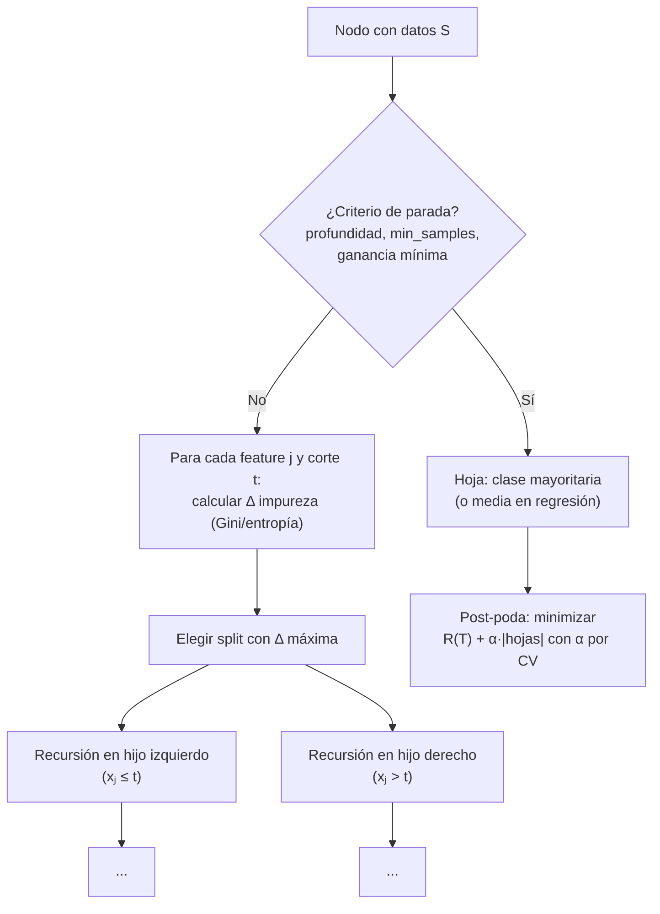

# 040 — Árboles de decisión y reglas interpretables

> [← Clase anterior](../../../classes/part-03-classical-machine-learning/039-clasificacion-logistica-y-umbrales/README.md) · [Índice de la parte](../README.md) · [Clase siguiente →](../../../classes/part-03-classical-machine-learning/041-random-forest-boosting-y-ensembles/README.md)

**Parte:** 03 — Machine learning clásico  
**Nivel:** intermedio · **Horas estimadas:** 6  
**Laboratorio:** `ml` · **Estado:** `EXECUTABLE_CORE`

## 🎯 Propósito

Comprender **árboles de decisión y reglas interpretables** dentro de la evolución de la inteligencia
artificial, implementar un experimento mínimo verificable y distinguir qué parte
constituye evidencia frente a una afirmación todavía no comprobada.

## 📚 Resultados de aprendizaje

Al finalizar podrás:

1. Explicar árboles de decisión y reglas interpretables usando los conceptos `árboles`, `impureza`, `poda`, `reglas`.
2. Ejecutar el laboratorio con una semilla explícita y revisar su contrato JSON.
3. Identificar al menos un supuesto, una limitación y un riesgo de aplicación.
4. Comparar el enfoque con la etapa anterior de la ruta de aprendizaje.
5. Producir una evidencia reproducible y una conclusión que no exceda los datos.

## 🧩 Conceptos centrales

`árboles`, `impureza`, `poda`, `reglas`

## 🗺️ Ubicación en el mapa de la IA

Los árboles de decisión (CART de Breiman et al. 1984; ID3/C4.5 de Quinlan) unen dos
tradiciones del programa: heredan de la IA simbólica (parte 01) la representación por
reglas legibles, pero las **inducen desde datos** en lugar de escribirlas a mano. Son el
modelo no lineal interpretable de referencia y la pieza básica de los ensembles de la
clase siguiente (random forest, boosting), que dominan el ML tabular hasta hoy. Su sesgo
inductivo — particiones alineadas a los ejes — explica tanto su legibilidad como sus
límites.

## 📖 Fundamentos

### 🌳 Qué es un árbol de decisión

Un árbol particiona recursivamente el espacio de features en regiones rectangulares
mediante preguntas binarias del tipo `xⱼ ≤ t`. Cada hoja predice la clase mayoritaria (o
la media, en regresión) de los ejemplos de entrenamiento que caen en ella. Todo camino
raíz→hoja es una regla legible: `SI atrasos ≤ 2 Y antigüedad > 3 ENTONCES aprueba`.

### 🧪 Impureza: qué pregunta elegir

El algoritmo es **voraz**: en cada nodo prueba todos los splits posibles y elige el que
más reduce la impureza de los hijos. Para un nodo con proporciones de clase p₁,…,p_k:

```text
Gini:      G = 1 − Σₖ pₖ²          (0 = puro; máx 0.5 en binario balanceado)
Entropía:  H = −Σₖ pₖ log₂ pₖ      (0 = puro; máx 1 bit en binario balanceado)
```

La ganancia de un split que separa el nodo padre (n ejemplos) en hijos L (n_L) y R (n_R):

```text
Δ = I(padre) − (n_L/n)·I(L) − (n_R/n)·I(R)
```

Gini y entropía eligen casi siempre el mismo split (Gini es más barata de computar; la
entropía penaliza algo más los nodos mixtos). En regresión, la impureza es la varianza
del target en el nodo. El algoritmo se detiene por profundidad máxima, mínimo de ejemplos
por hoja, o ganancia mínima.

### ✂️ Sobreajuste y poda

Un árbol sin restricciones crece hasta hojas puras: memoriza el train (accuracy 1.0) y
generaliza mal — es un modelo de **baja sesgo y alta varianza**: cambiar pocos ejemplos
puede cambiar el split raíz y con él todo el árbol. Dos remedios:

- **Pre-poda (early stopping):** limitar `max_depth`, `min_samples_leaf`,
  `min_impurity_decrease` durante la construcción. Barato, pero puede detenerse antes de
  un split que solo rinde combinado con el siguiente (efecto XOR).
- **Post-poda por costo-complejidad (CART):** crecer el árbol completo y luego minimizar
  `R_α(T) = R(T) + α·|hojas(T)|`, donde R(T) es el error y α ≥ 0 el precio por hoja.
  Al aumentar α se colapsan primero las ramas que menos aportan; α se elige por
  validación cruzada. Es la poda de `ccp_alpha` en scikit-learn.

### 📜 Reglas interpretables y sus condiciones

La interpretabilidad del árbol es real pero condicionada: (a) vale para árboles pequeños
(≤ ~7 niveles; con 50 hojas nadie "lee" el modelo); (b) la importancia de features por
reducción de impureza está sesgada hacia variables con muchos valores posibles y se
reparte arbitrariamente entre features correlacionadas; (c) las reglas son fieles al
modelo, no al fenómeno: describen cómo decide el árbol, no por qué ocurre el resultado.

## 🧮 Ejemplo trabajado

Nodo raíz con 10 solicitudes de crédito: 6 aprobadas (A) y 4 rechazadas (R).

```text
Gini(raíz) = 1 − (0.6² + 0.4²) = 1 − 0.52 = 0.48
```

**Split candidato 1:** `atrasos ≤ 1` → izquierda: 5 ejemplos (5A, 0R); derecha: 5 (1A, 4R).

```text
Gini(izq) = 1 − (1² + 0²) = 0
Gini(der) = 1 − (0.2² + 0.8²) = 1 − 0.68 = 0.32
Δ₁ = 0.48 − (5/10)·0 − (5/10)·0.32 = 0.48 − 0.16 = 0.32
```

**Split candidato 2:** `ingreso ≤ 30k` → izquierda: 4 (2A, 2R); derecha: 6 (4A, 2R).

```text
Gini(izq) = 1 − (0.5² + 0.5²) = 0.5
Gini(der) = 1 − ((4/6)² + (2/6)²) = 1 − (0.444 + 0.111) = 0.444
Δ₂ = 0.48 − 0.4·0.5 − 0.6·0.444 = 0.48 − 0.2 − 0.267 = 0.013
```

Gana `atrasos ≤ 1` (Δ = 0.32 ≫ 0.013). La rama izquierda ya es pura (hoja "aprueba");
la derecha (1A, 4R) puede volver a dividirse o quedar como hoja "rechaza" con confianza
4/5. Regla resultante: `SI atrasos ≤ 1 → aprueba; SI atrasos > 1 → rechaza (80 %)`.

## 📊 Propiedades y comparación

| Aspecto | Árbol CART | Regresión logística | k-NN | Reglas a mano (parte 01) |
|---|---|---|---|---|
| Frontera | Cajas alineadas a ejes | Hiperplano | Irregular local | La que el experto escriba |
| No linealidad / interacciones | Automáticas | Manuales | Implícitas | Manuales |
| Preprocesado | No exige escalar | Exige escalar (con L2) | Exige escalar | — |
| Varianza | Alta (inestable) | Baja | Media | Nula (fijas) |
| Interpretación | Reglas si es pequeño | Odds ratio | Ninguna global | Total |
| Fronteras oblicuas | Escalera de splits | Nativas | Aproximadas | — |



## ⚠️ Errores conceptuales frecuentes

1. **"El árbol encontró el split óptimo global."** El algoritmo es voraz nodo a nodo; el
   árbol globalmente óptimo es NP-completo. Un split localmente mediocre puede habilitar
   splits excelentes después (XOR), y el voraz se lo pierde.
2. **"Accuracy 1.0 en train: el árbol es buenísimo."** Es la firma del sobreajuste: sin
   restricciones el árbol memoriza. La cifra relevante es validación, y la brecha
   train-val mide la varianza del modelo.
3. **"La importancia de features del árbol identifica las causas."** La importancia por
   impureza favorece features de alta cardinalidad y se la reparten al azar las features
   correlacionadas; además describe al modelo, no al fenómeno.
4. **"Los árboles no necesitan nada de preprocesado."** No exigen escalar, pero sí sufren
   con etiquetas ruidosas, clases desbalanceadas (el split mayoritario domina) y
   extrapolación: fuera del rango de train predicen la hoja del borde, constante.
5. **"Poda = perder accuracy."** Pierde accuracy de *train* y suele ganar en validación:
   la poda cambia varianza por sesgo, exactamente el intercambio correcto en un modelo
   inestable.

## 🚀 Del aprendizaje a la operación

Para llevar un árbol a decisiones reales faltan: elegir α (o profundidad) con validación
anidada y verificar la estabilidad del árbol ante re-muestreo (si cada bootstrap da reglas
distintas, no comuniques "las reglas" como conocimiento), auditar las reglas con expertos
del dominio antes de automatizar (una regla legible también puede codificar un sesgo
legible), definir el fallback para valores nulos o fuera de rango en producción, y — si la
prioridad es exactitud sobre legibilidad — pasar al ensemble de la clase 041, aceptando el
costo en interpretabilidad.

## 🧪 Laboratorio

```bash
python lab.py
```

El laboratorio llama a `ai_evolution.labs.run_lab("ml")`. Esta
decisión evita 180 implementaciones divergentes: cada clase tiene un entrypoint
propio, pero los motores didácticos se prueban como una biblioteca común.

### 🔍 Evidencia esperada

- tipo de laboratorio y semilla;
- entradas o decisiones observables;
- resultado estructurado;
- lista `evidence` con hechos que pueden inspeccionarse;
- lista `limitations` que impide presentar la demo como producción.

## 📓 Notebooks

- [📓 `notebook.ipynb`](notebook.ipynb): recorrido guiado con la materia resumida.
- [✍️ `notebook_student.ipynb`](notebook_student.ipynb): ejercicios para resolver.
- [✅ `notebook_solution.ipynb`](notebook_solution.ipynb): solución de referencia explicada.

## 📝 Evaluación

| Criterio | Peso |
|---|---:|
| Comprensión conceptual | 25 % |
| Ejecución reproducible | 25 % |
| Interpretación basada en evidencia | 25 % |
| Riesgos, límites y mejora propuesta | 25 % |

Consulta [assessment.md](assessment.md) para preguntas y criterio de aceptación.

## ⚠️ Errores comunes

| Síntoma | Causa probable | Corrección |
|---|---|---|
| El código corre, pero no hay conclusión | Se confundió ejecución con aprendizaje | Explica qué demuestra y qué no demuestra |
| El resultado cambia sin explicación | No se registró semilla o configuración | Conserva semilla, versión y parámetros |
| Se promete uso real | Se extrapoló desde una demo educativa | Declara entorno, datos, límites y revisión humana |
| Se copia una métrica aislada | No existe baseline ni costo de error | Añade comparación y criterio de decisión |

## ❓ Preguntas frecuentes

**¿Debo usar una API comercial?**  
No. El núcleo funciona localmente. Las extensiones LIVE se documentan por separado.

**¿El laboratorio representa una implementación industrial?**  
No por sí solo. Enseña el contrato y el patrón; producción exige integración,
seguridad, observabilidad, pruebas y operación.

**¿Dónde profundizo?**  
Revisa las especializaciones enlazadas en el README raíz y la ruta siguiente.

## 🔗 Referencias

- [Breiman, Friedman, Olshen, Stone — *Classification and Regression Trees* (1984), el libro de CART. DOI 10.1201/9781315139470](https://doi.org/10.1201/9781315139470)
- [Quinlan (1986), "Induction of Decision Trees", *Machine Learning* 1. DOI 10.1007/BF00116251](https://doi.org/10.1007/BF00116251)
- [Hastie, Tibshirani, Friedman — *The Elements of Statistical Learning* (2e), §9.2 "Tree-Based Methods", PDF oficial](https://hastie.su.domains/ElemStatLearn/)
- [James et al. — *An Introduction to Statistical Learning* (2e), cap. 8 "Tree-Based Methods", PDF oficial](https://www.statlearning.com/)
- [scikit-learn User Guide — Decision Trees (incluye poda por costo-complejidad)](https://scikit-learn.org/stable/modules/tree.html)

---

## ⬅️ Clase anterior

[039 — Clasificación logística y umbrales](../../part-03-classical-machine-learning/039-clasificacion-logistica-y-umbrales/README.md)

## ➡️ Siguiente clase

[041 — Random Forest, boosting y ensembles](../../part-03-classical-machine-learning/041-random-forest-boosting-y-ensembles/README.md)
