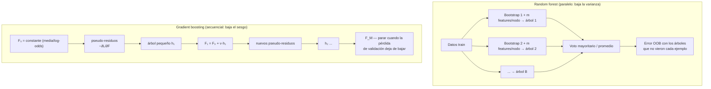

# 041 — Random Forest, boosting y ensembles

> [← Clase anterior](../../../classes/part-03-classical-machine-learning/040-arboles-de-decision-y-reglas-interpretables/README.md) · [Índice de la parte](../README.md) · [Clase siguiente →](../../../classes/part-03-classical-machine-learning/042-ingenieria-y-seleccion-de-caracteristicas/README.md)

**Parte:** 03 — Machine learning clásico  
**Nivel:** intermedio · **Horas estimadas:** 6  
**Laboratorio:** `ml` · **Estado:** `EXECUTABLE_CORE`

## 🎯 Propósito

Comprender **random forest, boosting y ensembles** dentro de la evolución de la inteligencia
artificial, implementar un experimento mínimo verificable y distinguir qué parte
constituye evidencia frente a una afirmación todavía no comprobada.

## 📚 Resultados de aprendizaje

Al finalizar podrás:

1. Explicar random forest, boosting y ensembles usando los conceptos `ensembles`, `bagging`, `boosting`, `diversidad`.
2. Ejecutar el laboratorio con una semilla explícita y revisar su contrato JSON.
3. Identificar al menos un supuesto, una limitación y un riesgo de aplicación.
4. Comparar el enfoque con la etapa anterior de la ruta de aprendizaje.
5. Producir una evidencia reproducible y una conclusión que no exceda los datos.

## 🧩 Conceptos centrales

`ensembles`, `bagging`, `boosting`, `diversidad`

## 🗺️ Ubicación en el mapa de la IA

Los ensembles resuelven la debilidad central del árbol de la clase anterior — su varianza —
combinando muchos modelos imperfectos: bagging y random forest (Breiman, 1996 y 2001) los
promedian en paralelo; boosting (Freund & Schapire 1997; Friedman 2001) los encadena en
secuencia. Sus descendientes de gradiente (XGBoost, LightGBM) siguen siendo el estado del
arte en datos tabulares, compitiendo de igual a igual con las redes profundas de la
parte 04. La idea de que "muchos débiles coordinados superan a uno fuerte" reaparece luego
en mixture-of-experts y en las votaciones de self-consistency de los LLM.

## 📖 Fundamentos

### 🎲 Por qué promediar reduce varianza

Si B estimadores tienen cada uno varianza σ² y correlación media ρ entre sí, la varianza
del promedio es:

```text
Var(promedio) = ρσ² + (1−ρ)σ²/B
```

Con B → ∞ el segundo término desaparece, pero el primero **no**: el techo de mejora lo
pone la correlación entre los modelos. Todo el diseño de un ensemble por promedio consiste
en fabricar modelos individualmente decentes y mutuamente **descorrelacionados**.

### 👜 Bagging y random forest

- **Bagging (bootstrap aggregating):** entrenar B árboles profundos, cada uno sobre una
  muestra bootstrap (n ejemplos con reemplazo; cada muestra deja fuera ≈ 36.8 % de los
  datos, pues (1−1/n)ⁿ → e⁻¹ ≈ 0.368). Predicción: voto mayoritario (clasificación) o
  media (regresión).
- **Random forest = bagging + descorrelación extra:** en cada nodo, el árbol solo puede
  elegir el split entre un subconjunto aleatorio de `m` features (típico: m = √d en
  clasificación, d/3 en regresión). Esto evita que todos los árboles empiecen por la misma
  feature dominante, bajando ρ.
- **Error OOB (out-of-bag):** cada ejemplo se evalúa con los árboles que no lo vieron en
  su bootstrap (~37 % de ellos): una validación "gratis" casi equivalente a
  cross-validation.
- Aumentar B nunca sobreajusta por sí mismo (solo estabiliza el promedio); el costo es
  cómputo y memoria.

### 🚀 Boosting: sumar correctores en secuencia

Boosting construye un modelo aditivo por etapas, donde cada modelo nuevo corrige los
errores del acumulado:

```text
F_M(x) = F₀ + Σ_{m=1..M} ν · h_m(x)     h_m: árbol pequeño (stump o profundidad 2-4)
```

- **AdaBoost (1997):** re-pondera ejemplos; los mal clasificados pesan más en la ronda
  siguiente. El peso de cada árbol es `αₘ = ½·ln((1−errₘ)/errₘ)` y los pesos de los
  ejemplos fallados se multiplican por `e^{αₘ}`. Equivale a minimizar la pérdida
  exponencial por etapas.
- **Gradient boosting (2001):** generaliza a cualquier pérdida diferenciable: en cada
  etapa se ajusta un árbol a los **pseudo-residuos** (gradiente negativo de la pérdida
  respecto de la predicción actual). Con pérdida cuadrática el pseudo-residuo es
  literalmente el residuo `y − F(x)`.
- El *learning rate* ν (0.01-0.3) encoge cada aporte; ν pequeño + más árboles suele
  generalizar mejor. A diferencia del forest, **boosting sí sobreajusta** con M grande:
  M se elige con early stopping en validación.

En términos del compromiso sesgo-varianza: bagging ataca la **varianza** (promedia modelos
de bajo sesgo), boosting ataca el **sesgo** (suma modelos débiles que se especializan en
lo que falta) controlando la varianza con ν, la profundidad del débil y el submuestreo.

## 🧮 Ejemplo trabajado

**Voto de mayoría:** 5 clasificadores independientes, cada uno con accuracy 0.7. El
ensemble por mayoría acierta si aciertan al menos 3:

```text
P(3 de 5) = C(5,3)·0.7³·0.3² = 10·0.343·0.09  = 0.3087
P(4 de 5) = C(5,4)·0.7⁴·0.3¹ =  5·0.2401·0.3  = 0.3602
P(5 de 5) = 0.7⁵                              = 0.1681
P(mayoría acierta) = 0.3087 + 0.3602 + 0.1681 ≈ 0.837
```

Cinco modelos del 70 % → ensemble del 83.7 %, **si los errores son independientes**. Si
los cinco fueran clones (ρ = 1) el ensemble seguiría en 0.7: la diversidad lo es todo.

**Una ronda de AdaBoost:** 10 ejemplos con peso 1/10; el stump h₁ falla en 2 →
err₁ = 0.2 y α₁ = ½·ln(0.8/0.2) = ½·ln 4 ≈ 0.693. Los 2 fallados multiplican su peso por
e^0.693 ≈ 2 (pasan a 0.2) y los 8 acertados por e^−0.693 ≈ 0.5 (pasan a 0.05); la suma es
2·0.2 + 8·0.05 = 0.8 y tras renormalizar cada fallado pesa 0.25 y cada acertado 0.0625.
La ronda 2 queda obligada a ocuparse de los casos difíciles.

## 📊 Propiedades y comparación

| Aspecto | Árbol único | Random forest | AdaBoost | Gradient boosting |
|---|---|---|---|---|
| Ataca principalmente | — | Varianza | Sesgo | Sesgo (pérdida flexible) |
| Entrenamiento | 1 árbol | Paralelo (B árboles) | Secuencial | Secuencial |
| Sobreajuste al crecer B/M | — | No (satura) | Sí (moderado) | Sí (exige early stopping) |
| Ruido de etiqueta | Media | Baja | Alta (re-pondera errores) | Media (según pérdida) |
| Hiperparámetros clave | profundidad, α | B, m features/nodo | M, profundidad del débil | M, ν, profundidad, submuestreo |
| Interpretabilidad | Alta (pequeño) | Baja (importancias) | Baja | Baja |
| Validación interna | — | OOB gratis | No | Early stopping en val |



## ⚠️ Errores conceptuales frecuentes

1. **"Más árboles en el forest terminarán sobreajustando."** No: B solo estabiliza el
   promedio; el error converge a un límite fijado por ρ y la calidad de cada árbol. Lo que
   sí sobreajusta es M en boosting.
2. **"El ensemble siempre supera a sus miembros."** Solo si los miembros son mejores que
   el azar y sus errores están (parcialmente) descorrelacionados. Promediar clones no
   aporta nada; promediar modelos malos promedia basura.
3. **"Random forest y boosting son intercambiables."** Atacan errores opuestos: forest
   promedia modelos de bajo sesgo para bajar varianza; boosting encadena modelos de alto
   sesgo para bajarlo. Con etiquetas ruidosas el forest suele ser más robusto; con señal
   compleja y datos limpios, el boosting suele ganar.
4. **"La importancia de features del forest es fiable."** Hereda los sesgos del árbol
   (cardinalidad, correlación); la importancia por permutación en OOB/validación es
   preferible, y ninguna implica causalidad.
5. **"Las probabilidades del boosting son probabilidades."** Los scores de boosting suelen
   estar descalibrados (demasiado extremos AdaBoost, depende de la pérdida en GB); antes de
   aplicar umbrales por costo hay que calibrar (clase 039 y 047).

## 🚀 Del aprendizaje a la operación

Para operar un ensemble real faltan: búsqueda de hiperparámetros con presupuesto explícito
(ν, M, profundidad interactúan; early stopping en validación separada), calibración de
probabilidades antes de decidir con umbrales, importancia por permutación y ejemplos
contrafactuales para explicar decisiones (obligatorio en dominios regulados), control del
costo de inferencia (500 árboles × profundidad 12 tienen latencia y memoria reales), y
monitoreo de drift: el ensemble extrapola constante fuera del rango visto, igual que sus
árboles.

## 🧪 Laboratorio

```bash
python lab.py
```

El laboratorio llama a `ai_evolution.labs.run_lab("ml")`. Esta
decisión evita 183 implementaciones divergentes: cada clase tiene un entrypoint
propio, pero los motores didácticos se prueban como una biblioteca común.

### 🔍 Evidencia esperada

- tipo de laboratorio y semilla;
- entradas o decisiones observables;
- resultado estructurado;
- lista `evidence` con hechos que pueden inspeccionarse;
- lista `limitations` que impide presentar la demo como producción.

## 📓 Notebooks

- [📓 `notebook.ipynb`](notebook.ipynb): recorrido guiado con la materia resumida.
- [✍️ `notebook_student.ipynb`](notebook_student.ipynb): ejercicios para resolver.
- [✅ `notebook_solution.ipynb`](notebook_solution.ipynb): solución de referencia explicada.

## 📝 Evaluación

| Criterio | Peso |
|---|---:|
| Comprensión conceptual | 25 % |
| Ejecución reproducible | 25 % |
| Interpretación basada en evidencia | 25 % |
| Riesgos, límites y mejora propuesta | 25 % |

Consulta [assessment.md](assessment.md) para preguntas y criterio de aceptación.

## ⚠️ Errores comunes

| Síntoma | Causa probable | Corrección |
|---|---|---|
| El código corre, pero no hay conclusión | Se confundió ejecución con aprendizaje | Explica qué demuestra y qué no demuestra |
| El resultado cambia sin explicación | No se registró semilla o configuración | Conserva semilla, versión y parámetros |
| Se promete uso real | Se extrapoló desde una demo educativa | Declara entorno, datos, límites y revisión humana |
| Se copia una métrica aislada | No existe baseline ni costo de error | Añade comparación y criterio de decisión |

## ❓ Preguntas frecuentes

**¿Debo usar una API comercial?**  
No. El núcleo funciona localmente. Las extensiones LIVE se documentan por separado.

**¿El laboratorio representa una implementación industrial?**  
No por sí solo. Enseña el contrato y el patrón; producción exige integración,
seguridad, observabilidad, pruebas y operación.

**¿Dónde profundizo?**  
Revisa las especializaciones enlazadas en el README raíz y la ruta siguiente.

## 🔗 Referencias

- [Breiman (2001), "Random Forests", *Machine Learning* 45. DOI 10.1023/A:1010933404324](https://doi.org/10.1023/A:1010933404324) — uso: fuente primaria del mecanismo estudiado
- [Breiman (1996), "Bagging Predictors", *Machine Learning* 24. DOI 10.1007/BF00058655](https://doi.org/10.1007/BF00058655) — uso: fuente primaria del mecanismo estudiado
- [Freund & Schapire (1997), "A Decision-Theoretic Generalization of On-Line Learning and an Application to Boosting", JCSS. DOI 10.1006/jcss.1997.1504](https://doi.org/10.1006/jcss.1997.1504) — uso: fuente primaria del mecanismo estudiado
- [Friedman (2001), "Greedy Function Approximation: A Gradient Boosting Machine", *Annals of Statistics* 29(5). DOI 10.1214/aos/1013203451](https://doi.org/10.1214/aos/1013203451) — uso: fuente primaria del mecanismo estudiado
- [Hastie, Tibshirani, Friedman — *The Elements of Statistical Learning* (2e), cap. 10 (boosting) y 15 (random forests), PDF oficial](https://hastie.su.domains/ElemStatLearn/) — uso: desarrollo extendido del tema
- [scikit-learn User Guide — Ensembles: bagging, forests, AdaBoost, gradient boosting](https://scikit-learn.org/stable/modules/ensemble.html) — uso: referencia consultada en su fuente original

<!-- papers:inicio -->

---

## 📜 Papers que fundamentan esta clase

> Bloque generado por `python scripts/link_papers_to_classes.py`. La fuente es [`papers/catalog/papers.json`](../../../papers/catalog/papers.json).

| Paper | Año | Qué desbloqueó | Miniatura |
|---|---:|---|---|
| [P78 · Una generalización decisional del aprendizaje en línea y su aplicación al boosting](../../../papers/foundational/P78_adaboost/README.md) | 1997 | Demuestra que muchos clasificadores apenas mejores que el azar se combinan en uno arbitrariamente bueno, y da el algoritmo que lo hace. | [notebook](../../../notebooks/papers/P78_adaboost.ipynb) |
| [P79 · Bosques aleatorios](../../../papers/foundational/P79_random_forest/README.md) | 2001 | Demuestra que el error de un conjunto depende de la fuerza de sus miembros Y de su correlación, y que empeorarlos a propósito puede mejorarlo. | [notebook](../../../notebooks/papers/P79_random_forest.ipynb) |

Cada ficha explica el problema anterior, la matemática mínima, los límites y los errores de atribución más frecuentes. Para leerlas con método: [cómo leer un paper de IA](../../../papers/guides/COMO_LEER_UN_PAPER_DE_IA.md) · [anexos matemáticos](../../../papers/annexes/README.md).
<!-- papers:fin -->
<!-- bibliografia:inicio -->

---

## 📚 Bibliografía de apoyo

> Bloque generado por `python scripts/link_sources_to_classes.py`. Cada obra lleva su localizador verificado en [`sources/bibliography.json`](../../../sources/bibliography.json).

Los papers dicen **de dónde salió** el mecanismo. Estas obras lo **desarrollan** con el espacio que una clase no tiene: teoría completa, demostraciones y ejercicios.

| Obra | Edición | Localizador | Papel en esta clase |
|---|---|---|---|
| Hastie, Trevor, Tibshirani, Robert y Friedman, Jerome — *The Elements of Statistical Learning* | 2.ª · 2009 | [ISBN 9780387848570](https://openlibrary.org/isbn/9780387848570) · [web de la obra](https://hastie.su.domains/ElemStatLearn/) | citada en las referencias de esta clase · cap. 10 · obra de referencia de la parte 03 |
| James, Gareth et al. — *An Introduction to Statistical Learning* | 2021 | [ISBN 9783031387470](https://openlibrary.org/isbn/9783031387470) · [web de la obra](https://www.statlearning.com/) | obra de referencia de la parte 03 · toda la parte, nivel introductorio |
| Murphy, Kevin P. — *Probabilistic Machine Learning* | 2022 | [ISBN 9780262046824](https://openlibrary.org/isbn/9780262046824) · [web de la obra](https://probml.github.io/pml-book/) | obra de referencia de la parte 03 · fundamentos probabilísticos del aprendizaje |
<!-- bibliografia:fin -->

---

## ⬅️ Clase anterior

[040 — Árboles de decisión y reglas interpretables](../../part-03-classical-machine-learning/040-arboles-de-decision-y-reglas-interpretables/README.md)

## ➡️ Siguiente clase

[042 — Ingeniería y selección de características](../../part-03-classical-machine-learning/042-ingenieria-y-seleccion-de-caracteristicas/README.md)
