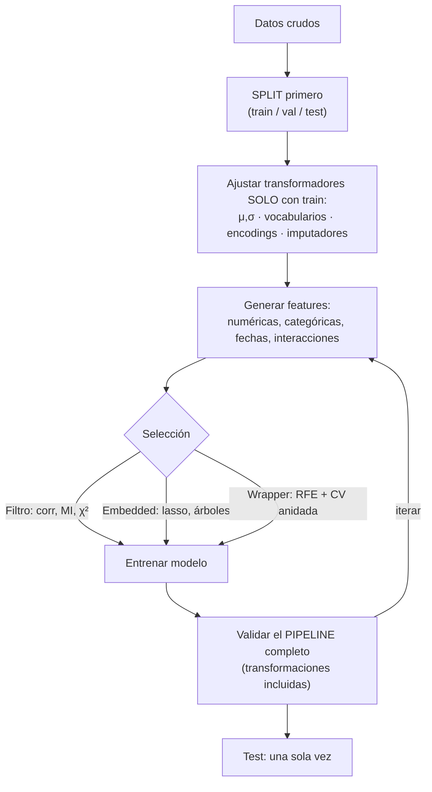

# 042 — Ingeniería y selección de características

> [← Clase anterior](../../../classes/part-03-classical-machine-learning/041-random-forest-boosting-y-ensembles/README.md) · [Índice de la parte](../README.md) · [Clase siguiente →](../../../classes/part-03-classical-machine-learning/043-clustering-y-reduccion-de-dimensionalidad/README.md)

**Parte:** 03 — Machine learning clásico  
**Nivel:** intermedio · **Horas estimadas:** 6  
**Laboratorio:** `ml` · **Estado:** `EXECUTABLE_CORE`

## 🎯 Propósito

Comprender **ingeniería y selección de características** dentro de la evolución de la inteligencia
artificial, implementar un experimento mínimo verificable y distinguir qué parte
constituye evidencia frente a una afirmación todavía no comprobada.

## 📚 Resultados de aprendizaje

Al finalizar podrás:

1. Explicar ingeniería y selección de características usando los conceptos `features`, `encoding`, `selección`, `pipelines`.
2. Ejecutar el laboratorio con una semilla explícita y revisar su contrato JSON.
3. Identificar al menos un supuesto, una limitación y un riesgo de aplicación.
4. Comparar el enfoque con la etapa anterior de la ruta de aprendizaje.
5. Producir una evidencia reproducible y una conclusión que no exceda los datos.

## 🧩 Conceptos centrales

`features`, `encoding`, `selección`, `pipelines`

## 🗺️ Ubicación en el mapa de la IA

En el ML clásico, la representación de los datos importa más que la elección del modelo:
"applied machine learning is basically feature engineering" (Andrew Ng). Esta clase
sistematiza cómo convertir datos crudos en features útiles y cómo elegir cuáles conservar
— con el protocolo anti-fuga de la clase 037 como restricción permanente. Es también el
contraste que da sentido al deep learning (parte 04), cuya promesa central es justamente
**aprender** las representaciones que aquí se construyen a mano.

## 📖 Fundamentos

### 🔢 Transformaciones numéricas

- **Estandarización:** `z = (x − μ)/σ` (media 0, desviación 1). Necesaria para modelos
  basados en distancias o con regularización (k-NN, SVM, ridge/lasso, redes).
- **Min-max:** `x' = (x − min)/(max − min)` a [0,1]; sensible a outliers.
- **Log / Box-Cox:** comprime colas largas (ingresos, conteos); convierte relaciones
  multiplicativas en aditivas.
- **Discretización (binning):** convierte una numérica en categorías (edad → tramos);
  pierde información pero captura no linealidades en modelos lineales.
- Los árboles y ensembles son invariantes a transformaciones monótonas de cada feature:
  escalar no les afecta; el log tampoco (mismo orden ⇒ mismos splits).

### 🏷️ Codificación de categóricas

- **One-hot:** una columna binaria por categoría. Seguro pero explota en cardinalidad alta
  (10 000 códigos postales → 10 000 columnas).
- **Ordinal:** entero por categoría; solo válido si existe orden real (S < M < L). Un
  orden inventado introduce estructura falsa en modelos lineales/distancia.
- **Target encoding:** sustituir la categoría por la media del target en esa categoría.
  Potente en alta cardinalidad y **la fuente de fuga más clásica**: debe calcularse con
  esquema out-of-fold (la media que ve cada fila se calcula sin esa fila) y con suavizado
  hacia la media global para categorías raras:
  `enc(c) = (n_c·ȳ_c + k·ȳ_global)/(n_c + k)`.
- **Hashing:** proyecta categorías a un número fijo de columnas; admite categorías nuevas
  a costa de colisiones.

### 🧩 Interacciones, fechas y nulos

- **Interacciones:** productos o razones de features (`deuda/ingreso`); los modelos
  lineales no las descubren solos.
- **Fechas:** descomponer en día de semana, mes, festivo, tiempo desde el último evento.
  Para variables cíclicas (hora, mes) usar `sin(2πt/T), cos(2πt/T)` para que las 23 h y
  las 0 h queden cerca.
- **Nulos:** imputar (media/mediana ajustada en train, o por modelo) + una columna
  indicadora `was_missing`, porque la ausencia misma suele ser señal. Nunca imputar con
  estadísticas del dataset completo (fuga).

### 🎯 Selección de características

Tres familias, de más barata a más fiel al modelo final:

1. **Filtro:** puntuar cada feature contra el target sin modelo (correlación, información
   mutua, test χ²). Rápido, ignora interacciones y redundancia.
2. **Wrapper:** buscar subconjuntos entrenando el modelo (selección hacia adelante/atrás,
   RFE). Fiel pero caro y propenso a sobreajustar la búsqueda: exige CV anidada.
3. **Embedded:** la selección ocurre dentro del entrenamiento — lasso (coeficientes a 0),
   importancias de árboles con umbral. Buen compromiso costo/calidad.

Regla anti-fuga transversal: **toda** transformación con parámetros aprendidos (μ, σ,
medias de target, vocabularios, features seleccionadas) se ajusta SOLO con train, dentro
del pipeline que se valida — seleccionar features con el dataset completo y "luego hacer
CV" infla la métrica de manera sistemática (el *selection bias* clásico descrito en ESL §7.10.2).

## 🧮 Ejemplo trabajado

Target encoding con suavizado (k = 10) para la feature `ciudad` prediciendo impago
(media global ȳ = 0.10):

| Ciudad | n_c | impagos | ȳ_c | enc = (n·ȳ_c + 10·0.10)/(n+10) |
|---|---|---|---|---|
| A | 90 | 18 | 0.20 | (90·0.20 + 1)/(103) = 0.19 |
| B | 40 | 2 | 0.05 | (40·0.05 + 1)/50 = 0.06 |
| C | 2 | 2 | 1.00 | (2·1.00 + 1)/12 = 0.25 |

Sin suavizado, la ciudad C (2 casos, ambos impagos) quedaría codificada como 1.00 —
memorización pura de dos filas. El suavizado la arrastra hacia la media global: 0.25.
Y aun así, si este encoding se calcula sobre TODO el dataset, cada fila de C "conoce" su
propia etiqueta a través del encoding: en CV se vería un lift ficticio. Con esquema
out-of-fold, las filas de C se codifican usando solo las *otras* filas de C del train.

## 📊 Propiedades y comparación

| Técnica | Cardinalidad alta | ¿Aprende del target? | Riesgo de fuga | Modelos que la exigen |
|---|---|---|---|---|
| One-hot | Mala (explota) | No | Bajo | Lineales, distancia |
| Ordinal | Buena | No | Bajo (pero orden falso) | Solo con orden real |
| Target encoding | Excelente | Sí | **Alto** (out-of-fold obligatorio) | Cualquiera |
| Hashing | Excelente | No | Bajo (colisiones) | Lineales online |
| Filtro (corr/MI) | — | Sí (por feature) | Medio (hacerlo en train) | — |
| Wrapper (RFE) | — | Sí (por subconjunto) | Alto sin CV anidada | — |
| Embedded (lasso) | — | Sí | Bajo dentro del pipeline | — |



## ⚠️ Errores conceptuales frecuentes

1. **"Selecciono features con todo el dataset y después valido el modelo."** El sesgo de
   selección contamina la CV: las features ya vieron el target de las filas de
   validación. La selección va DENTRO del pipeline validado.
2. **"Target encoding = reemplazar por la media y listo."** Sin out-of-fold ni suavizado
   es una copia parcial del target dentro de las features: lift enorme en validación,
   colapso en producción.
3. **"Escalar siempre ayuda."** A los árboles y ensembles les da igual; a los lineales con
   regularización y a los métodos de distancia les resulta imprescindible. Conocer la
   invariancia del modelo evita trabajo y errores.
4. **"Más features = más información = mejor modelo."** Features irrelevantes añaden
   varianza y ruido a los métodos de distancia (maldición de la dimensionalidad) y
   oportunidades de correlación espuria a la selección.
5. **"La correlación baja con el target descarta la feature."** La correlación de Pearson
   solo ve relaciones lineales marginales: una feature puede ser inútil sola y decisiva en
   interacción (XOR), o no lineal (información mutua sí la detectaría).

## 🚀 Del aprendizaje a la operación

En producción las features viven en un *feature store* con definiciones versionadas para
que entrenamiento y serving computen exactamente lo mismo (el *training-serving skew* es
la avería más común); hay que decidir qué hacer con categorías nunca vistas, monitorear la
distribución de cada feature (los nulos que suben del 2 % al 30 % rompen el modelo en
silencio), auditar features que son proxies de atributos protegidos (código postal ≈
raza/ingreso en muchos países, ver clase 047), y presupuestar la latencia de features
calculadas en tiempo real frente a las precalculadas.

## 🧪 Laboratorio

```bash
python lab.py
```

El laboratorio llama a `ai_evolution.labs.run_lab("ml")`. Esta
decisión evita 183 implementaciones divergentes: cada clase tiene un entrypoint
propio, pero los motores didácticos se prueban como una biblioteca común.

### 🔍 Evidencia esperada

- tipo de laboratorio y semilla;
- entradas o decisiones observables;
- resultado estructurado;
- lista `evidence` con hechos que pueden inspeccionarse;
- lista `limitations` que impide presentar la demo como producción.

## 📓 Notebooks

- [📓 `notebook.ipynb`](notebook.ipynb): recorrido guiado con la materia resumida.
- [✍️ `notebook_student.ipynb`](notebook_student.ipynb): ejercicios para resolver.
- [✅ `notebook_solution.ipynb`](notebook_solution.ipynb): solución de referencia explicada.

## 📝 Evaluación

| Criterio | Peso |
|---|---:|
| Comprensión conceptual | 25 % |
| Ejecución reproducible | 25 % |
| Interpretación basada en evidencia | 25 % |
| Riesgos, límites y mejora propuesta | 25 % |

Consulta [assessment.md](assessment.md) para preguntas y criterio de aceptación.

## ⚠️ Errores comunes

| Síntoma | Causa probable | Corrección |
|---|---|---|
| El código corre, pero no hay conclusión | Se confundió ejecución con aprendizaje | Explica qué demuestra y qué no demuestra |
| El resultado cambia sin explicación | No se registró semilla o configuración | Conserva semilla, versión y parámetros |
| Se promete uso real | Se extrapoló desde una demo educativa | Declara entorno, datos, límites y revisión humana |
| Se copia una métrica aislada | No existe baseline ni costo de error | Añade comparación y criterio de decisión |

## ❓ Preguntas frecuentes

**¿Debo usar una API comercial?**  
No. El núcleo funciona localmente. Las extensiones LIVE se documentan por separado.

**¿El laboratorio representa una implementación industrial?**  
No por sí solo. Enseña el contrato y el patrón; producción exige integración,
seguridad, observabilidad, pruebas y operación.

**¿Dónde profundizo?**  
Revisa las especializaciones enlazadas en el README raíz y la ruta siguiente.

## 🔗 Referencias

- [Hastie, Tibshirani, Friedman — *The Elements of Statistical Learning* (2e), §7.10.2 "The Wrong and Right Way to Do Cross-validation", PDF oficial](https://hastie.su.domains/ElemStatLearn/)
- [Guyon & Elisseeff (2003), "An Introduction to Variable and Feature Selection", JMLR 3 (texto completo oficial)](https://www.jmlr.org/papers/v3/guyon03a.html)
- [Micci-Barreca (2001), "A Preprocessing Scheme for High-Cardinality Categorical Attributes", SIGKDD Explorations. DOI 10.1145/507533.507538](https://doi.org/10.1145/507533.507538)
- [scikit-learn User Guide — Preprocessing data](https://scikit-learn.org/stable/modules/preprocessing.html)
- [scikit-learn User Guide — Feature selection](https://scikit-learn.org/stable/modules/feature_selection.html)
- [scikit-learn User Guide — Pipelines and composite estimators](https://scikit-learn.org/stable/modules/compose.html)

---

## ⬅️ Clase anterior

[041 — Random Forest, boosting y ensembles](../../part-03-classical-machine-learning/041-random-forest-boosting-y-ensembles/README.md)

## ➡️ Siguiente clase

[043 — Clustering y reducción de dimensionalidad](../../part-03-classical-machine-learning/043-clustering-y-reduccion-de-dimensionalidad/README.md)
