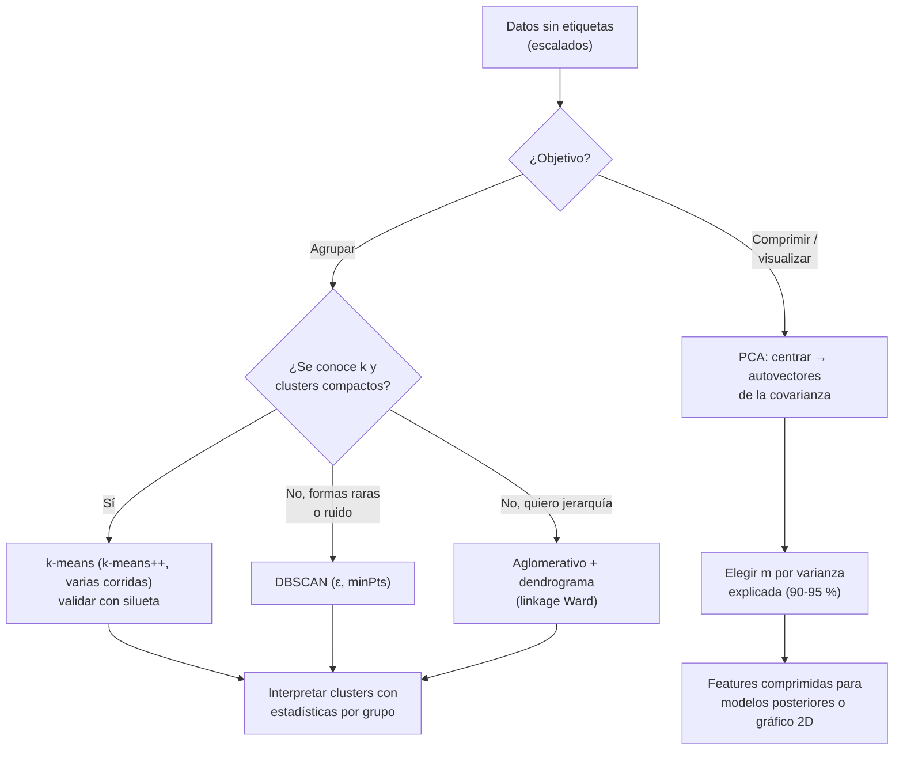

# 043 — Clustering y reducción de dimensionalidad

> [← Clase anterior](../../../classes/part-03-classical-machine-learning/042-ingenieria-y-seleccion-de-caracteristicas/README.md) · [Índice de la parte](../README.md) · [Clase siguiente →](../../../classes/part-03-classical-machine-learning/044-deteccion-de-anomalias/README.md)

**Parte:** 03 — Machine learning clásico  
**Nivel:** intermedio · **Horas estimadas:** 6  
**Laboratorio:** `ml` · **Estado:** `EXECUTABLE_CORE`

## 🎯 Propósito

Comprender **clustering y reducción de dimensionalidad** dentro de la evolución de la inteligencia
artificial, implementar un experimento mínimo verificable y distinguir qué parte
constituye evidencia frente a una afirmación todavía no comprobada.

## 📚 Resultados de aprendizaje

Al finalizar podrás:

1. Explicar clustering y reducción de dimensionalidad usando los conceptos `KMeans`, `DBSCAN`, `PCA`, `embeddings`.
2. Ejecutar el laboratorio con una semilla explícita y revisar su contrato JSON.
3. Identificar al menos un supuesto, una limitación y un riesgo de aplicación.
4. Comparar el enfoque con la etapa anterior de la ruta de aprendizaje.
5. Producir una evidencia reproducible y una conclusión que no exceda los datos.

## 🧩 Conceptos centrales

`KMeans`, `DBSCAN`, `PCA`, `embeddings`

## 🗺️ Ubicación en el mapa de la IA

Esta clase abandona las etiquetas: el aprendizaje **no supervisado** busca estructura en
los datos sin un target que corregir. K-means (Lloyd 1957/1982), el clustering jerárquico
y PCA (Pearson 1901, Hotelling 1933) son las herramientas clásicas de exploración,
compresión y visualización. Sus ideas — centroides, distancias, proyecciones que preservan
varianza — son el vocabulario con el que después se entienden los embeddings (partes 05 y
08): un espacio vectorial donde "cerca" significa "parecido" es exactamente lo que PCA y
k-means asumen y lo que las redes aprenden.

## 📖 Fundamentos

### 🎯 K-means: minimizar inercia

Dado k (número de clusters), k-means busca centroides μ₁..μ_k que minimicen la **inercia**
(suma de cuadrados intra-cluster):

```text
J = Σᵢ ‖xᵢ − μ_{c(i)}‖²    donde c(i) es el cluster asignado a xᵢ
```

Algoritmo de Lloyd:

```text
1. Inicializar k centroides (aleatorio o k-means++)
2. Asignación: cada punto al centroide más cercano
3. Actualización: cada centroide = media de sus puntos
4. Repetir 2-3 hasta que las asignaciones no cambien
```

Cada paso reduce J, así que converge — pero a un **óptimo local** que depende de la
inicialización (por eso se corre varias veces; k-means++ elige semillas separadas y
mejora la esperanza). Supuestos implícitos: clusters convexos, aproximadamente esféricos
y de tamaño similar, en la métrica euclidiana — **escalar features es obligatorio**.
Elegir k: método del codo sobre J (heurístico), coeficiente de **silueta**
`s = (b−a)/max(a,b)` (a = distancia media intra-cluster, b = distancia media al cluster
vecino más próximo; s ∈ [−1,1], más alto mejor), o conocimiento del dominio.

### 🌲 Clustering jerárquico

No exige k de antemano: construye un árbol de fusiones (**dendrograma**). El aglomerativo
parte de n clusters de un punto y fusiona repetidamente los dos más cercanos según el
criterio de enlace (*linkage*):

- **single:** mínima distancia entre puntos — encuentra formas alargadas, sufre
  encadenamiento;
- **complete:** máxima distancia — clusters compactos;
- **average / Ward:** compromisos; Ward fusiona minimizando el aumento de inercia (el más
  usado con euclidiana).

Cortar el dendrograma a una altura da una partición; la altura de cada fusión informa
cuán "natural" es. Costo O(n²)–O(n³): inviable para millones de puntos. Alternativa por
densidad: **DBSCAN** agrupa puntos con ≥ minPts vecinos en radio ε y marca como ruido lo
demás — encuentra formas arbitrarias y outliers, pero sufre con densidades heterogéneas.

### 📉 PCA: proyectar preservando varianza

PCA busca direcciones ortogonales (componentes principales) que capturan la máxima
varianza. Con los datos centrados (media 0), la matriz de covarianza `C = XᵀX/(n−1)` se
descompone en autovectores/autovalores:

```text
C·vⱼ = λⱼ·vⱼ      λ₁ ≥ λ₂ ≥ ... ≥ λ_d ≥ 0
```

- vⱼ = dirección del componente j; λⱼ = varianza capturada por esa dirección.
- Proyección a m dimensiones: `Z = X·V_m` (las primeras m columnas de V).
- **Varianza explicada:** λⱼ/Σλ; se elige m para retener p. ej. el 90-95 %.
- Equivale a la proyección lineal con mínimo error cuadrático de reconstrucción.
- Requiere centrar; escalar si las unidades difieren (si no, la feature de mayor varianza
  numérica domina el primer componente).

PCA es lineal y no supervisado: maximiza varianza, que no tiene por qué coincidir con lo
discriminativo para una tarea posterior. Para visualización no lineal existen t-SNE y UMAP
(preservan vecindades locales, distorsionan distancias globales: sirven para mirar, no
para medir).

## 🧮 Ejemplo trabajado

**K-means a mano** con 6 puntos en 1D: x = [1, 2, 3, 8, 9, 10], k = 2, centroides
iniciales μ₁ = 2, μ₂ = 3 (mala inicialización a propósito).

```text
Iteración 1 — asignación: {1,2 → μ₁}, {3,8,9,10 → μ₂}
             actualización: μ₁ = 1.5, μ₂ = 7.5
Iteración 2 — asignación: |3−1.5|=1.5 < |3−7.5|=4.5 → {1,2,3 → μ₁}, {8,9,10 → μ₂}
             actualización: μ₁ = 2, μ₂ = 9
Iteración 3 — asignaciones no cambian → convergencia
J final = (1+0+1) + (1+0+1) = 4
```

Pese a la mala semilla, aquí converge al óptimo natural. **PCA en 2D:** puntos
(2,1), (4,2), (6,3): perfectamente alineados en la dirección (2,1)/√5. λ₁ captura el
100 % de la varianza; el segundo autovalor es 0. Proyectar a 1D no pierde nada: los datos
eran intrínsecamente unidimensionales.

## 📊 Propiedades y comparación

| Método | k a priori | Forma de clusters | Outliers | Costo | Determinista |
|---|---|---|---|---|---|
| k-means (Lloyd) | Sí | Convexos, esféricos | Los absorbe (distorsionan μ) | O(n·k·iter) | No (semilla) |
| Jerárquico (Ward) | No (dendrograma) | Compactos | Sensible | O(n²)–O(n³) | Sí |
| DBSCAN | No (ε, minPts) | Arbitraria | Los marca como ruido | O(n log n) | Sí |
| PCA | m componentes | — (proyección) | Sensible (varianza) | O(min(n²d, nd²)) | Sí |
| t-SNE/UMAP | — | — (visualización) | — | Alto | No |



## ⚠️ Errores conceptuales frecuentes

1. **"K-means encontró LOS grupos reales."** K-means siempre devuelve k grupos, haya o no
   estructura: partirá en k pedazos hasta un gas uniforme. La existencia de clusters se
   valida (silueta, estabilidad ante re-muestreo), no se asume.
2. **"El codo dice k=4, entonces hay 4 grupos."** La inercia J decrece SIEMPRE con k; el
   "codo" es una heurística visual frecuentemente ambigua. Contrastar con silueta y con
   sentido del dominio.
3. **"PCA elige las features importantes."** PCA no elige features: construye
   combinaciones lineales de todas, ordenadas por varianza — que puede ser ruido de
   medición. Máxima varianza ≠ máxima relevancia para una tarea supervisada.
4. **"Las distancias del mapa t-SNE se pueden medir."** t-SNE/UMAP preservan vecindades
   locales y distorsionan lo global: tamaños y separaciones entre islas del gráfico no
   son evidencia. Para geometría global, PCA.
5. **"No escalé, pero el clustering salió bien."** Sin escalar, la feature de mayor rango
   domina la distancia euclidiana: el resultado es un clustering de esa feature con ruido
   del resto — puede "verse bien" y ser un artefacto de unidades.

## 🚀 Del aprendizaje a la operación

Usar clustering en producción exige: pipeline de escalado idéntico en entrenamiento y
scoring, criterio de asignación para puntos nuevos (¿centroide más cercano? ¿re-clustering
periódico?), validación de estabilidad (correr con re-muestreos y medir si los grupos
persisten — un segmento de clientes que cambia con la semilla no es un segmento),
etiquetado humano de los clusters con estadísticas por grupo antes de tomar decisiones, y
para PCA, guardar media y componentes exactos del ajuste para transformar el tráfico
futuro sin re-ajustar (si no, el espacio cambia bajo el modelo que lo consume).

## 🧪 Laboratorio

```bash
python lab.py
```

El laboratorio llama a `ai_evolution.labs.run_lab("ml")`. Esta
decisión evita 183 implementaciones divergentes: cada clase tiene un entrypoint
propio, pero los motores didácticos se prueban como una biblioteca común.

### 🔍 Evidencia esperada

- tipo de laboratorio y semilla;
- entradas o decisiones observables;
- resultado estructurado;
- lista `evidence` con hechos que pueden inspeccionarse;
- lista `limitations` que impide presentar la demo como producción.

## 📓 Notebooks

- [📓 `notebook.ipynb`](notebook.ipynb): recorrido guiado con la materia resumida.
- [✍️ `notebook_student.ipynb`](notebook_student.ipynb): ejercicios para resolver.
- [✅ `notebook_solution.ipynb`](notebook_solution.ipynb): solución de referencia explicada.

## 📝 Evaluación

| Criterio | Peso |
|---|---:|
| Comprensión conceptual | 25 % |
| Ejecución reproducible | 25 % |
| Interpretación basada en evidencia | 25 % |
| Riesgos, límites y mejora propuesta | 25 % |

Consulta [assessment.md](assessment.md) para preguntas y criterio de aceptación.

## ⚠️ Errores comunes

| Síntoma | Causa probable | Corrección |
|---|---|---|
| El código corre, pero no hay conclusión | Se confundió ejecución con aprendizaje | Explica qué demuestra y qué no demuestra |
| El resultado cambia sin explicación | No se registró semilla o configuración | Conserva semilla, versión y parámetros |
| Se promete uso real | Se extrapoló desde una demo educativa | Declara entorno, datos, límites y revisión humana |
| Se copia una métrica aislada | No existe baseline ni costo de error | Añade comparación y criterio de decisión |

## ❓ Preguntas frecuentes

**¿Debo usar una API comercial?**  
No. El núcleo funciona localmente. Las extensiones LIVE se documentan por separado.

**¿El laboratorio representa una implementación industrial?**  
No por sí solo. Enseña el contrato y el patrón; producción exige integración,
seguridad, observabilidad, pruebas y operación.

**¿Dónde profundizo?**  
Revisa las especializaciones enlazadas en el README raíz y la ruta siguiente.

## 🔗 Referencias

- [Hastie, Tibshirani, Friedman — *The Elements of Statistical Learning* (2e), cap. 14 "Unsupervised Learning", PDF oficial](https://hastie.su.domains/ElemStatLearn/)
- [James et al. — *An Introduction to Statistical Learning* (2e), cap. 12 "Unsupervised Learning", PDF oficial](https://www.statlearning.com/)
- [Lloyd (1982), "Least Squares Quantization in PCM", IEEE Trans. Information Theory. DOI 10.1109/TIT.1982.1056489](https://doi.org/10.1109/TIT.1982.1056489)
- [Arthur & Vassilvitskii (2007), "k-means++: The Advantages of Careful Seeding", SODA (PDF oficial de Stanford)](https://theory.stanford.edu/~sergei/papers/kMeansPP-soda.pdf)
- [scikit-learn User Guide — Clustering](https://scikit-learn.org/stable/modules/clustering.html)
- [scikit-learn User Guide — Decomposing signals: PCA](https://scikit-learn.org/stable/modules/decomposition.html#pca)

---

## ⬅️ Clase anterior

[042 — Ingeniería y selección de características](../../part-03-classical-machine-learning/042-ingenieria-y-seleccion-de-caracteristicas/README.md)

## ➡️ Siguiente clase

[044 — Detección de anomalías](../../part-03-classical-machine-learning/044-deteccion-de-anomalias/README.md)
